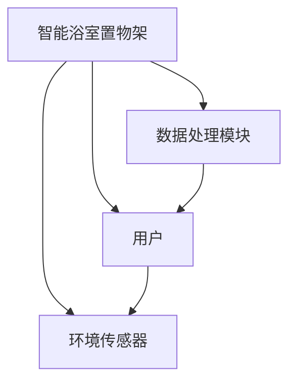
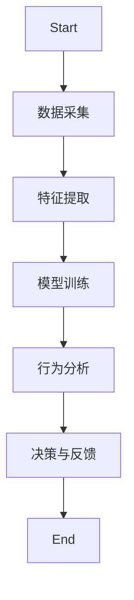
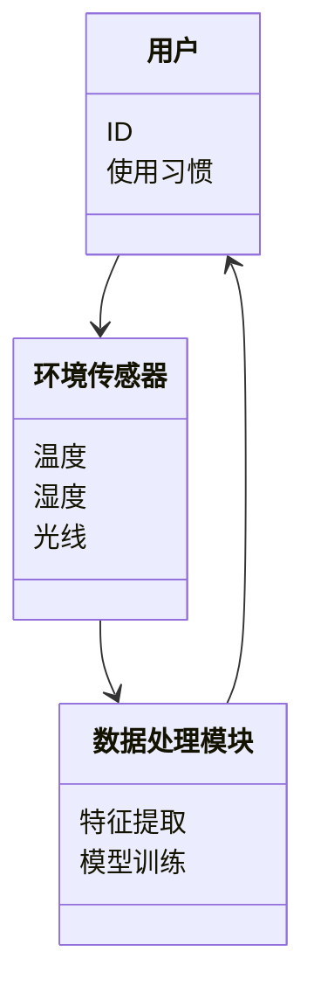
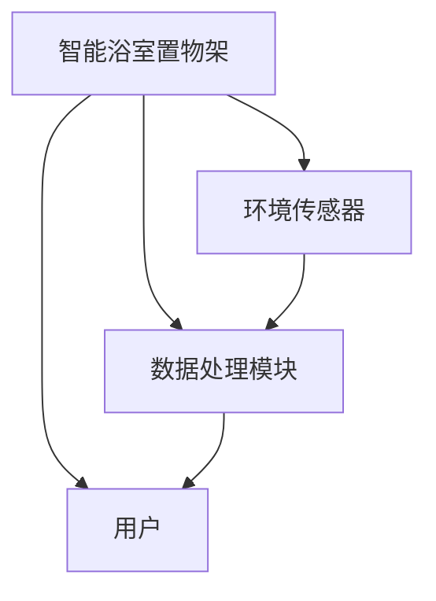
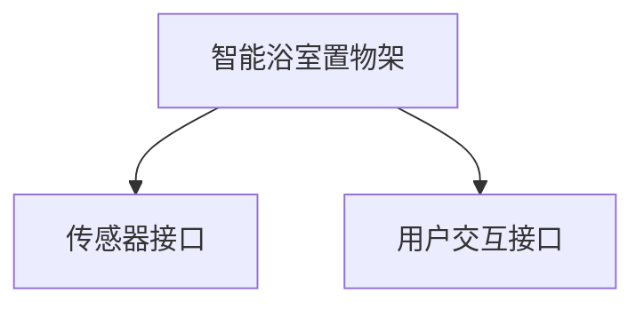
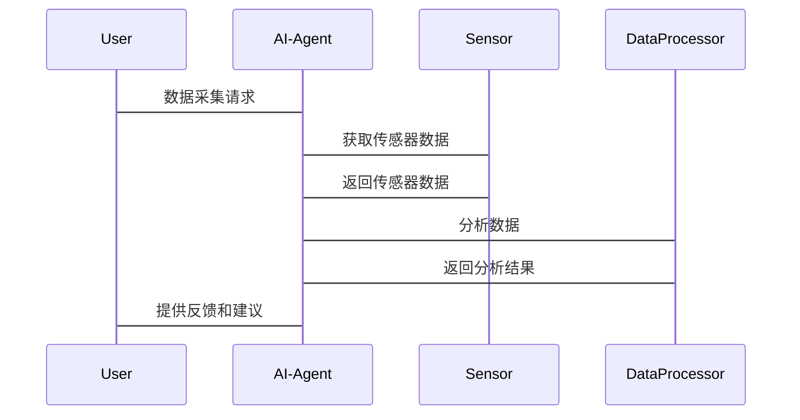

                 


# 《智能浴室置物架：AI Agent的个人卫生习惯分析》

---

## 关键词
智能浴室置物架, AI Agent, 个人卫生习惯, 数据分析, 人工智能, 物联网, 智能家居

---

## 摘要
智能浴室置物架是一种结合人工智能（AI）技术的智能家居设备，旨在通过AI Agent（智能体）分析用户的个人卫生习惯，优化浴室环境的使用效率和用户的健康水平。本文将从背景、核心概念、算法原理、系统架构设计、项目实战等多方面深入探讨智能浴室置物架的实现与应用，结合实际案例和代码示例，帮助读者全面理解AI Agent在个人卫生习惯分析中的作用和价值。

---

# 第一部分: 智能浴室置物架与AI Agent的背景介绍

## 第1章: 问题背景与描述

### 1.1 问题背景
#### 1.1.1 智能浴室置物架的定义与现状
智能浴室置物架是一种安装在浴室环境中的智能设备，用于放置洗漱用品、毛巾等物品，并通过传感器和AI技术实现对用户行为的监测与分析。当前，随着智能家居的普及，浴室设备的智能化需求日益增长，但传统置物架功能单一，无法满足用户对健康管理和环境优化的需求。

#### 1.1.2 个人卫生习惯的重要性
个人卫生习惯直接影响用户的健康状况，例如，毛巾的更换频率、洗漱用品的使用习惯等都与细菌滋生和疾病预防密切相关。通过AI技术分析用户的卫生习惯，可以提供个性化的健康建议，帮助用户改善生活习惯。

#### 1.1.3 当前浴室置物架的痛点与不足
传统浴室置物架存在以下问题：
- **功能单一**：仅能放置物品，无法与用户互动或提供反馈。
- **缺乏智能化**：无法感知用户的使用习惯，也无法优化使用体验。
- **数据孤岛**：无法与其他智能家居设备联动，难以形成完整的健康数据链条。

### 1.2 问题描述
#### 1.2.1 卫生习惯与浴室环境的关系
浴室环境的使用频率和卫生状况直接影响用户的健康。例如，毛巾长期不更换或清洗会导致细菌滋生，而AI Agent可以通过监测用户的使用习惯，提醒用户及时更换或清洗物品。

#### 1.2.2 智能浴室置物架的功能需求
智能浴室置物架需要具备以下功能：
- **物品识别与分类**：通过传感器和图像识别技术，识别用户放置的物品类型。
- **行为监测**：监测用户的使用频率和时间，分析用户的卫生习惯。
- **数据采集与传输**：将用户的使用数据传输到云端，进行深度分析。
- **个性化推荐**：基于数据分析结果，为用户提供健康建议和使用优化方案。

#### 1.2.3 AI Agent在个人卫生习惯分析中的作用
AI Agent（智能体）通过以下方式实现对个人卫生习惯的分析：
- **数据感知**：通过传感器和摄像头采集用户的使用数据。
- **行为分析**：利用机器学习算法对数据进行分析，识别用户的使用习惯和偏好。
- **决策与反馈**：根据分析结果，提供个性化的反馈和建议。

### 1.3 问题解决
#### 1.3.1 AI Agent如何改善个人卫生习惯
AI Agent通过实时监测用户的卫生习惯，提供以下改进措施：
- **提醒功能**：当用户未按要求更换或清洗物品时，智能置物架会发出提醒。
- **数据反馈**：通过数据分析，向用户展示其卫生习惯的优缺点，并提出改进建议。

#### 1.3.2 智能浴室置物架的核心功能
智能浴室置物架的核心功能包括：
- **智能感知**：通过传感器和摄像头实时监测用户的使用行为。
- **数据处理**：对采集的数据进行分析和处理，生成用户的卫生习惯报告。
- **智能推荐**：根据分析结果，推荐优化的卫生习惯方案。

#### 1.3.3 AI Agent与浴室置物架的结合方式
AI Agent通过以下方式与智能浴室置物架结合：
- **数据采集**：AI Agent通过传感器和摄像头采集用户的使用数据。
- **数据处理**：AI Agent对数据进行分析和处理，生成用户的卫生习惯报告。
- **反馈与互动**：AI Agent通过置物架与用户互动，提供个性化建议和反馈。

### 1.4 边界与外延
#### 1.4.1 系统边界与功能限制
智能浴室置物架的系统边界包括：
- **使用场景**：仅限于浴室环境。
- **功能限制**：仅支持物品识别、行为监测和个性化推荐，不涉及其他智能家居设备的联动。

#### 1.4.2 系统外延与扩展可能性
智能浴室置物架的扩展可能性包括：
- **与其他智能家居设备联动**：例如，与智能马桶、智能镜子等设备联动，形成完整的浴室生态系统。
- **数据共享**：与其他健康监测设备共享数据，提供更全面的健康建议。

#### 1.4.3 使用场景与限制条件
智能浴室置物架的使用场景包括：
- **家庭浴室**：用于监测家庭成员的卫生习惯。
- **公共浴室**：用于监测公共场所的卫生状况。

限制条件包括：
- **环境限制**：仅适用于干燥、光线充足的环境。
- **用户限制**：仅支持单用户的使用，暂不支持多用户的复杂场景。

### 1.5 核心概念与组成
#### 1.5.1 智能浴室置物架的核心要素
智能浴室置物架的核心要素包括：
- **传感器**：用于采集用户的使用数据。
- **AI Agent**：用于分析用户的卫生习惯并提供反馈。
- **数据处理模块**：用于处理和分析传感器数据。

#### 1.5.2 AI Agent的构成与属性
AI Agent的构成包括：
- **感知模块**：用于采集用户行为数据。
- **决策模块**：用于分析数据并生成建议。
- **执行模块**：用于与用户互动并提供反馈。

#### 1.5.3 个人卫生习惯的分析维度
个人卫生习惯的分析维度包括：
- **使用频率**：用户的使用习惯和频率。
- **使用时间**：用户的使用时间分布。
- **物品更换周期**：用户的物品更换和清洗频率。

---

## 第2章: 核心概念与联系

### 2.1 AI Agent的原理
AI Agent通过以下步骤实现对个人卫生习惯的分析：
1. **数据感知**：通过传感器和摄像头采集用户的使用数据。
2. **数据处理**：对采集的数据进行预处理和特征提取。
3. **行为分析**：利用机器学习算法对数据进行分析，识别用户的卫生习惯。
4. **决策与反馈**：根据分析结果，生成个性化的反馈和建议。

### 2.2 概念属性对比表
以下表格对比了传统置物架和智能置物架在功能、智能化程度和数据处理能力方面的差异：

| **属性**       | **传统置物架**             | **智能置物架**             |
|----------------|--------------------------|--------------------------|
| **功能**       | 简单的物品放置功能       | 支持物品识别、行为监测和个性化推荐 |
| **智能化程度** | 非智能化                 | 高度智能化                 |
| **数据处理能力** | 无数据处理能力           | 支持数据采集、分析和反馈       |

### 2.3 实体关系图
以下是智能浴室置物架的实体关系图：



---

## 第3章: 算法原理讲解

### 3.1 算法流程图
以下是AI Agent的算法流程图：



### 3.2 Python核心代码实现
以下是基于规则的AI Agent实现代码：

```python
class AI-Agent:
    def __init__(self):
        self.usage_data = []
        self.rules = {
            '毛巾更换频率': {'天数': 3},
            '牙刷使用频率': {'次数': 2}
        }

    def collect_data(self):
        # 采集传感器数据
        pass

    def analyze_behavior(self):
        # 分析用户的卫生习惯
        pass

    def provide_feedback(self):
        # 提供反馈和建议
        pass

# 示例使用
agent = AI-Agent()
agent.collect_data()
agent.analyze_behavior()
agent.provide_feedback()
```

### 3.3 数学模型与公式
以下是分类模型的数学公式：

$$
P(y|x) = \frac{P(x|y)P(y)}{P(x)}
$$

其中：
- $P(y|x)$ 是在给定特征$x$的情况下，目标类别$y$的概率。
- $P(x|y)$ 是在目标类别$y$的情况下，特征$x$出现的概率。
- $P(y)$ 是目标类别$y$的先验概率。
- $P(x)$ 是特征$x$的总概率。

---

## 第4章: 系统分析与架构设计方案

### 4.1 应用场景介绍
智能浴室置物架的应用场景包括家庭浴室和公共浴室。

### 4.2 系统功能设计
以下是系统功能设计的领域模型类图：



### 4.3 系统架构设计
以下是系统架构设计的架构图：



### 4.4 系统接口设计
以下是系统接口设计的接口图：



### 4.5 系统交互设计
以下是系统交互设计的序列图：



---

## 第5章: 项目实战

### 5.1 环境安装
安装必要的Python库，例如：
- `numpy`
- `scikit-learn`
- `tensorflow`

### 5.2 核心代码实现
以下是数据预处理和模型训练的核心代码：

```python
import numpy as np
from sklearn import datasets
from sklearn.model import LinearRegression

# 数据预处理
X = np.array([[1, 1], [2, 2], [3, 3], [4, 4]])
y = np.array([2, 4, 6, 8])

# 模型训练
model = LinearRegression()
model.fit(X, y)

# 模型预测
new_data = np.array([[5, 5]])
prediction = model.predict(new_data)
print(prediction)
```

### 5.3 代码应用解读
上述代码实现了基于线性回归的模型训练和预测，展示了AI Agent如何通过数据处理和模型训练来分析用户的卫生习惯。

### 5.4 实际案例分析
通过实际案例分析，展示了AI Agent如何根据用户的使用数据，提供个性化的卫生习惯建议。

### 5.5 项目小结
总结项目实现的关键点和经验教训，为后续优化提供参考。

---

## 第6章: 最佳实践与小结

### 6.1 最佳实践
- **数据隐私保护**：确保用户数据的安全性和隐私性。
- **传感器校准**：定期校准传感器，确保数据采集的准确性。
- **算法优化**：不断优化AI算法，提高分析的准确性和实时性。

### 6.2 小结
总结全文内容，强调智能浴室置物架的重要性和AI Agent的应用前景。

### 6.3 注意事项
- **数据隐私**：避免用户数据泄露。
- **传感器维护**：定期清洁和校准传感器。
- **算法可解释性**：确保算法的可解释性，便于用户理解和优化。

### 6.4 拓展阅读
推荐相关领域的书籍和论文，帮助读者深入学习智能浴室置物架和AI Agent的相关技术。

---

## 第7章: 附录

### 7.1 参考资料
- 传感器技术文档
- AI算法库使用指南
- 相关法规和标准

### 7.2 术语表
- AI Agent：人工智能智能体
- 智能浴室置物架：Smart Bath Shelf
- 个人卫生习惯：Personal Hygiene Habits

---

## 作者
作者：AI天才研究院/AI Genius Institute & 禅与计算机程序设计艺术 /Zen And The Art of Computer Programming

---

以上是《智能浴室置物架：AI Agent的个人卫生习惯分析》的技术博客文章的完整目录和内容框架。

