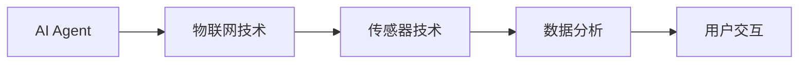
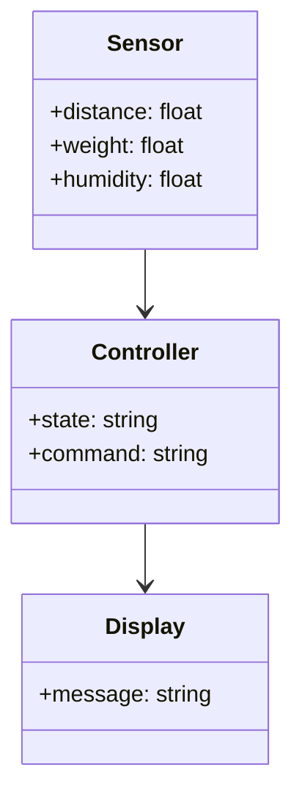
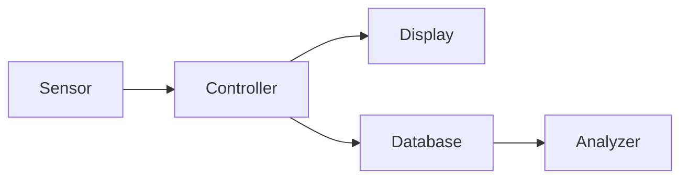
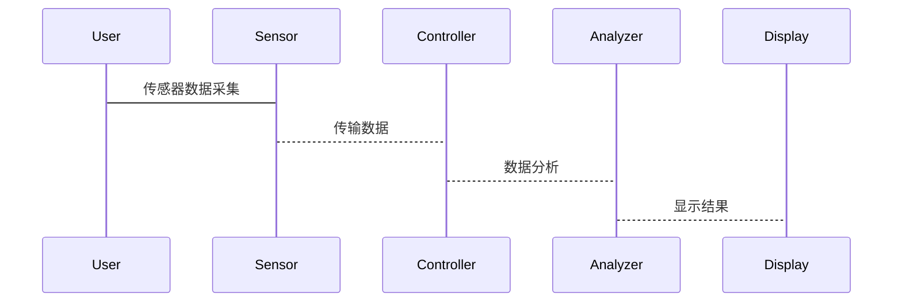

                 


# 智能浴室置物架：AI Agent的个人卫生习惯改善

## 关键词：智能浴室置物架、AI Agent、个人卫生、物联网、传感器技术、算法原理、系统架构

## 摘要：本文探讨了智能浴室置物架如何通过AI Agent技术改善个人卫生习惯。文章从背景分析出发，详细讲解了AI Agent的核心概念与技术，分析了算法原理，设计了系统架构，并通过项目实战展示了如何实现智能化管理。最后，总结了最佳实践，为读者提供了深入的技术见解。

---

# 第1章: 智能浴室置物架的背景与问题分析

## 1.1 问题背景

### 1.1.1 个人卫生习惯的重要性
个人卫生习惯是健康生活的重要组成部分。浴室作为日常使用频率较高的空间，其环境整洁程度直接影响到个人健康和生活品质。

### 1.1.2 现有浴室置物架的痛点
传统浴室置物架存在以下问题：
1. 空间利用效率低：物品摆放杂乱，空间浪费严重。
2. 卫生用品管理混乱：难以追踪物品使用情况，容易遗忘或过期。
3. 缺乏智能化管理：无法实时监控卫生用品的使用状态，无法提供使用建议。

### 1.1.3 智能化改善的必要性
通过引入AI Agent技术，浴室置物架可以实现智能化管理，优化卫生用品的使用，提升个人卫生习惯。

## 1.2 问题描述

### 1.2.1 浴室空间利用效率低下
传统置物架设计不合理，导致空间浪费，无法充分利用浴室面积。

### 1.2.2 卫生用品管理混乱
用户难以及时了解卫生用品的使用情况，容易导致过期或浪费。

### 1.2.3 个人卫生习惯的缺乏监督
缺乏有效的监督和提醒机制，用户难以持续保持良好的卫生习惯。

## 1.3 问题解决思路

### 1.3.1 引入AI Agent的解决方案
通过AI Agent实时监测用户的卫生习惯，提供智能化的管理建议。

### 1.3.2 智能化管理的优势
智能化管理可以实现卫生用品的自动提醒、使用记录追踪和空间优化。

### 1.3.3 用户体验的提升
通过智能化管理，用户可以更便捷地管理卫生用品，提升生活品质。

## 1.4 边界与外延

### 1.4.1 系统功能边界
智能浴室置物架的功能包括卫生用品管理、空间优化和使用习惯分析。

### 1.4.2 外延功能的扩展
未来可以扩展至健康数据监测、环境优化等功能。

### 1.4.3 系统与用户交互的边界
系统通过传感器和用户交互界面与用户进行实时互动，提供个性化服务。

## 1.5 概念结构与核心要素

### 1.5.1 核心概念的组成
智能浴室置物架的核心概念包括AI Agent、物联网、传感器技术和数据分析。

### 1.5.2 核心要素的对比分析
| 核心要素 | 特性 | 描述 |
|----------|------|------|
| AI Agent | 智能性 | 能够自主决策和学习 |
| 物联网技术 | 连通性 | 实现设备间的实时通信 |
| 传感器技术 | 数据采集 | 获取环境和使用数据 |
| 数据分析 | 可视化 | 提供数据支持决策 |

### 1.5.3 概念结构的图示化展示


---

# 第2章: AI Agent的核心概念与技术

## 2.1 AI Agent的基本原理

### 2.1.1 AI Agent的定义与特点
AI Agent是一种智能体，能够感知环境并自主决策，实现特定目标。

### 2.1.2 AI Agent的核心算法
AI Agent的核心算法包括感知算法、决策算法和执行算法。

### 2.1.3 AI Agent与传统算法的对比
| 特性 | AI Agent | 传统算法 |
|------|----------|----------|
| 决策 | 自主 | 预设 |

## 2.2 物联网技术的应用

### 2.2.1 物联网的基本概念
物联网通过传感器和通信技术，实现设备间的实时连接和数据交换。

### 2.2.2 物联网在浴室置物架中的应用
物联网技术用于实时监测置物架的状态，如物品使用情况和环境数据。

### 2.2.3 物联网技术的实现细节
1. 数据采集：通过传感器获取环境数据。
2. 数据传输：通过无线通信技术将数据传输到云端。
3. 数据处理：在云端进行数据分析和处理。

## 2.3 传感器与数据采集

### 2.3.1 常用传感器类型
1. 距离传感器：监测物品摆放距离。
2. 重量传感器：监测物品重量变化。
3. 温湿度传感器：监测环境温湿度。

### 2.3.2 数据采集的实现
```python
import sensor

def get_sensor_data():
    distance = sensor.get_distance()
    weight = sensor.get_weight()
    humidity = sensor.get_humidity()
    return distance, weight, humidity
```

### 2.3.3 数据预处理与分析
通过数据预处理，去除噪声，提取有效数据，为后续分析提供支持。

---

# 第3章: AI Agent的算法原理与实现

## 3.1 算法原理概述

### 3.1.1 算法的基本思路
通过传感器数据和用户行为数据，AI Agent学习用户的使用习惯，优化卫生用品的使用和管理。

### 3.1.2 算法的核心步骤
1. 数据采集：获取环境和使用数据。
2. 数据分析：分析数据，识别规律。
3. 决策：根据分析结果，生成管理建议。

## 3.2 算法实现的数学模型

### 3.2.1 数学模型的建立
$$f(x) = \sum_{i=1}^{n} x_i$$

### 3.2.2 算法的数学公式
$$f(x) = w_1x_1 + w_2x_2 + \dots + w_nx_n$$

### 3.2.3 数学模型的优化
通过机器学习算法，不断优化模型参数，提升预测准确性。

## 3.3 算法实现的代码示例

### 3.3.1 数据处理代码
```python
import numpy as np

def process_data(data):
    # 数据预处理
    processed_data = np.array(data).reshape(-1, 1)
    return processed_data
```

### 3.3.2 训练模型代码
```python
from sklearn import linear_model

def train_model(data, target):
    # 训练线性回归模型
    model = linear_model.LinearRegression()
    model.fit(data, target)
    return model
```

## 3.4 算法的优化与改进

### 3.4.1 参数调整
通过调整模型参数，优化算法性能。

### 3.4.2 算法优化
采用更先进的机器学习算法，提升预测准确率。

### 3.4.3 性能优化
通过并行计算和分布式处理，提升算法运行效率。

---

# 第4章: 智能浴室置物架的系统分析与架构设计

## 4.1 项目介绍

### 4.1.1 项目背景
本项目旨在通过智能化管理，优化浴室置物架的使用，提升个人卫生习惯。

## 4.2 系统功能设计

### 4.2.1 领域模型类图


### 4.2.2 系统架构图


## 4.3 系统接口设计

### 4.3.1 接口定义
1. 传感器接口：提供数据采集功能。
2. 控制器接口：提供设备控制功能。
3. 显示器接口：提供信息显示功能。

## 4.4 系统交互流程

### 4.4.1 交互流程图


---

# 第5章: 项目实战

## 5.1 环境安装

### 5.1.1 环境配置
安装Python、传感器库和物联网开发工具。

## 5.2 系统核心实现

### 5.2.1 核心代码实现
```python
import sensor

def main():
    while True:
        data = sensor.read_data()
        process_data(data)
        display_result(data)

if __name__ == "__main__":
    main()
```

## 5.3 代码应用解读与分析

### 5.3.1 代码功能解读
1. 读取传感器数据。
2. 数据预处理。
3. 显示处理结果。

## 5.4 实际案例分析

### 5.4.1 案例描述
通过实际案例，展示系统的应用效果和优势。

## 5.5 项目小结

### 5.5.1 实战经验总结
总结项目实施过程中的经验教训，为后续项目提供参考。

---

# 第6章: 最佳实践与总结

## 6.1 最佳实践 tips

### 6.1.1 系统优化建议
1. 定期更新传感器校准。
2. 提供用户友好的交互界面。
3. 加强数据安全保护。

## 6.2 小结

### 6.2.1 项目总结
智能浴室置物架通过AI Agent技术，实现了智能化管理，提升了个人卫生习惯。

## 6.3 注意事项

### 6.3.1 使用建议
1. 定期检查系统运行状态。
2. 及时更新系统软件。

## 6.4 拓展阅读

### 6.4.1 推荐阅读
推荐相关领域的书籍和论文，供读者深入学习。

---

# 附录: 参考文献与资源

## 附录A: 参考文献

1. 书籍：《人工智能导论》
2. 论文：《基于AI的智能设备管理研究》

## 附录B: 开源资源

1. GitHub项目：智能浴室置物架开源代码
2. 技术博客：AI Agent在智能家居中的应用

---

# 作者：AI天才研究院/AI Genius Institute & 禅与计算机程序设计艺术 /Zen And The Art of Computer Programming

