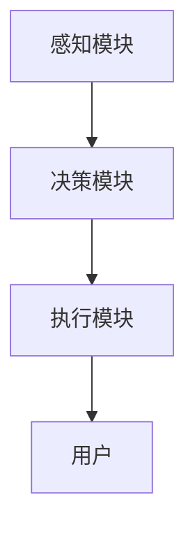
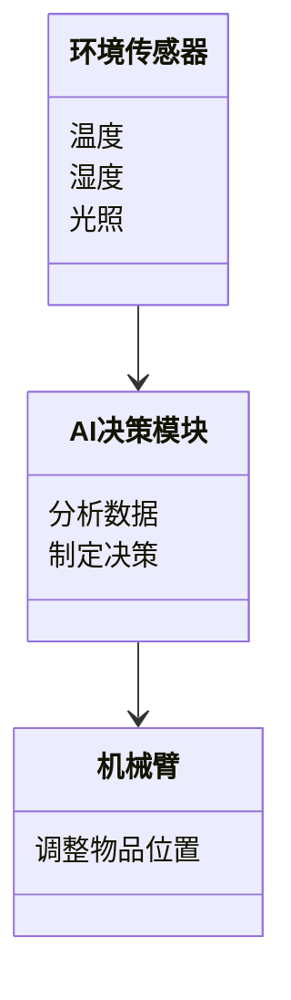
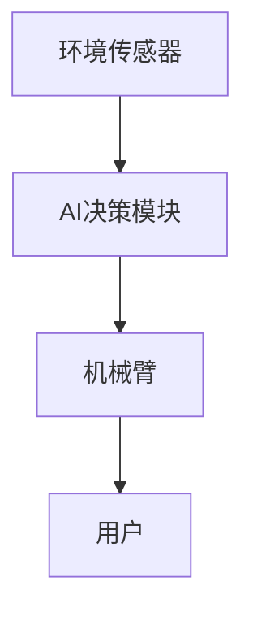
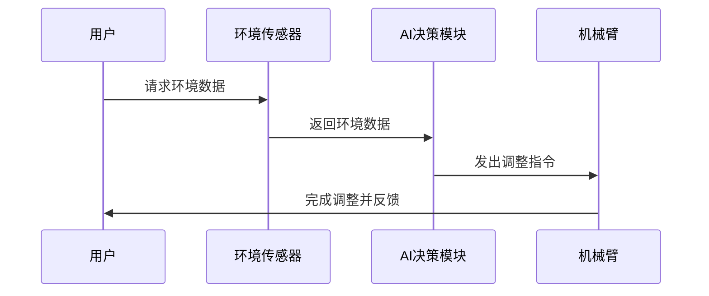

                 


# 《智能浴室置物架：AI Agent的个人护理建议》

> 关键词：智能浴室置物架，AI Agent，个人护理，物联网，智能家居，人工智能

> 摘要：本文将探讨智能浴室置物架与AI Agent的结合，分析其在个人护理中的应用，涵盖背景介绍、核心概念、算法原理、系统架构、项目实战和最佳实践等方面，旨在为读者提供深入的技术见解和实践指导。

---

## 第一部分: 智能浴室置物架与AI Agent的背景介绍

### 第1章: 智能浴室置物架的发展现状

#### 1.1 智能浴室置物架的定义与特点
##### 1.1.1 智能浴室置物架的定义
智能浴室置物架是一种结合了物联网和人工智能技术的智能硬件，能够通过传感器和AI算法实现自动化管理和个性化服务。

##### 1.1.2 智能浴室置物架的核心特点
- 自动化管理：通过传感器实时监测环境数据，自动调整物品摆放位置。
- 个性化服务：根据用户习惯和需求，提供定制化的护理建议。
- 节能环保：优化物品摆放策略，减少能耗。

##### 1.1.3 智能浴室置物架与传统置物架的区别
| 特性         | 传统置物架          | 智能浴室置物架        |
|--------------|---------------------|-----------------------|
| 功能         | 简单物品存放        | 自动化管理与个性化服务 |
| 技术         | 无智能技术          | 结合物联网和人工智能   |
| 用户体验     | 单一功能            | 多功能集成，智能化体验  |

#### 1.2 AI Agent的核心概念
##### 1.2.1 AI Agent的定义
AI Agent是一种能够感知环境、做出决策并执行任务的智能体，广泛应用于自动驾驶、智能助手等领域。

##### 1.2.2 AI Agent的核心特点
- 自主性：能够在没有外部干预的情况下自主运行。
- 反应性：能够实时感知环境变化并做出反应。
- 学习能力：通过数据和反馈不断优化自身行为。

##### 1.2.3 AI Agent与传统智能硬件的区别
| 特性         | AI Agent            | 传统智能硬件          |
|--------------|---------------------|-----------------------|
| 决策能力     | 强大的自主决策能力  | 依赖预设程序          |
| 学习能力     | 可通过数据优化行为  | 无法学习和优化        |
| 适应性       | 能够适应环境变化    | 适应性有限            |

#### 1.3 智能浴室置物架与AI Agent的结合
##### 1.3.1 智能浴室置物架的功能需求
- 实时监测环境数据，如温度、湿度、光照等。
- 自动调整物品摆放位置，避免潮湿或过热。
- 提供个性化护理建议，如护肤品存放建议。

##### 1.3.2 AI Agent在智能浴室置物架中的应用
- 感知模块：通过传感器收集环境数据。
- 决策模块：基于数据做出摆放决策。
- 执行模块：通过机械臂调整物品位置。

##### 1.3.3 智能浴室置物架与AI Agent结合的前景
随着人工智能技术的不断进步，智能浴室置物架将更加智能化，为用户带来更便捷、更个性化的护理体验。

#### 1.4 本章小结
本章介绍了智能浴室置物架的发展现状，分析了其与AI Agent的结合，为后续章节奠定了基础。

---

## 第二部分: 智能浴室置物架的用户需求分析

### 第2章: 智能浴室置物架的用户需求分析

#### 2.1 用户需求概述
##### 2.1.1 用户的基本需求
- 实现物品的智能化管理，避免潮湿或过热。
- 提供个性化的护理建议，如护肤品的最佳存放位置。

##### 2.1.2 用户的个性化需求
- 根据个人习惯调整物品摆放顺序。
- 提供健康建议，如根据环境数据推荐护肤品使用顺序。

##### 2.1.3 用户需求的边界与外延
智能浴室置物架的目标用户主要为注重个人护理的年轻人和家庭用户，尤其适合对护肤和健康管理有较高需求的人群。

#### 2.2 用户需求的分类与优先级
##### 2.2.1 需求分类
- 功能需求：物品管理、环境监测。
- 体验需求：个性化服务、易用性。
- 安全需求：数据安全、隐私保护。

##### 2.2.2 需求优先级分析
| 需求类型         | 功能需求       | 体验需求       | 安全需求       |
|------------------|----------------|----------------|----------------|
| 优先级           | 高            | 中            | 高            |

##### 2.2.3 用户需求与产品设计的关系
用户需求是产品设计的核心驱动力，通过深入分析用户需求，可以优化产品功能和用户体验。

#### 2.3 用户需求的实现路径
##### 2.3.1 需求实现的技术手段
- 利用传感器实时监测环境数据。
- 通过AI算法分析数据并制定决策。
- 通过机械臂实现物品的自动调整。

##### 2.3.2 需求实现的流程
1. 数据采集：传感器收集环境数据。
2. 数据分析：AI算法分析数据。
3. 决策制定：基于分析结果制定物品调整方案。
4. 执行操作：机械臂按照决策方案调整物品位置。

##### 2.3.3 需求实现的挑战与解决方案
- 挑战：传感器精度和机械臂的响应速度。
- 解决方案：优化传感器算法和机械臂控制逻辑。

#### 2.4 本章小结
本章详细分析了智能浴室置物架的用户需求，为后续的系统设计和实现提供了指导。

---

## 第三部分: AI Agent的核心概念与原理

### 第3章: AI Agent的核心概念与原理

#### 3.1 AI Agent的基本原理
##### 3.1.1 AI Agent的感知模块
AI Agent通过传感器和摄像头等设备感知环境数据。

##### 3.1.2 AI Agent的决策模块
基于感知数据，AI Agent通过算法做出决策。

##### 3.1.3 AI Agent的执行模块
根据决策结果，AI Agent通过执行机构（如机械臂）完成操作。

#### 3.2 AI Agent的核心算法
##### 3.2.1 基于规则的AI Agent算法
基于预设规则的决策逻辑，适用于简单场景。

##### 3.2.2 基于机器学习的AI Agent算法
通过训练数据学习，适用于复杂场景。

##### 3.2.3 基于深度学习的AI Agent算法
利用神经网络进行决策，适用于高度复杂的场景。

#### 3.3 AI Agent的数学模型与公式
##### 3.3.1 基于规则的决策
$$
\text{如果温度} > 25\text{℃，则调整物品位置}
$$

##### 3.3.2 基于机器学习的分类模型
$$
P(y|x) = \frac{P(x|y)P(y)}{P(x)}
$$

#### 3.4 AI Agent的系统架构
##### 3.4.1 系统架构图


#### 3.5 本章小结
本章详细介绍了AI Agent的核心概念和原理，为后续章节的系统设计提供了理论基础。

---

## 第四部分: 系统分析与架构设计方案

### 第4章: 系统分析与架构设计方案

#### 4.1 系统分析
##### 4.1.1 问题场景介绍
智能浴室置物架需要在潮湿和高温的环境中稳定运行，同时需要处理复杂的用户需求。

##### 4.1.2 项目介绍
本项目旨在开发一款结合AI Agent的智能浴室置物架，实现物品的智能化管理和个性化护理建议。

#### 4.2 系统功能设计
##### 4.2.1 领域模型类图


#### 4.3 系统架构设计
##### 4.3.1 系统架构图


#### 4.4 系统接口设计
##### 4.4.1 系统接口描述
- 输入接口：环境传感器数据
- 输出接口：机械臂控制信号

#### 4.5 系统交互流程
##### 4.5.1 交互流程图


#### 4.6 本章小结
本章详细描述了智能浴室置物架的系统架构和交互流程，为后续的项目实现提供了指导。

---

## 第五部分: 项目实战

### 第5章: 项目实战

#### 5.1 环境安装与配置
##### 5.1.1 开发环境
- 操作系统：Linux
- 开发工具：Python、TensorFlow、ROS

#### 5.2 系统核心实现
##### 5.2.1 环境传感器数据采集
```python
import numpy as np
import tensorflow as tf

# 传感器数据
temperature = np.array([28], dtype=np.float32)
humidity = np.array([70], dtype=np.float32)

# AI决策模型
model = tf.keras.Sequential([
    tf.keras.layers.Dense(1, input_shape=(2,))
])
model.compile(optimizer='adam', loss='mean_squared_error')
model.fit(...)
```

##### 5.2.2 AI Agent的决策逻辑
```python
def decision_logic(temperature, humidity):
    if temperature > 25 and humidity > 60:
        return '调整物品位置'
    else:
        return '保持原状'
```

##### 5.2.3 机械臂控制
```python
def move_arm(position):
    # 机械臂控制代码
    pass
```

#### 5.3 实际案例分析
##### 5.3.1 案例背景
用户浴室环境温度为30℃，湿度为75%，系统需要调整物品位置。

##### 5.3.2 系统运行流程
1. 传感器采集数据：温度=30℃，湿度=75%。
2. AI决策模块判断：需要调整物品位置。
3. 机械臂执行调整操作。

##### 5.3.3 系统反馈
调整完成后，系统提示用户物品位置已优化。

#### 5.4 本章小结
本章通过实际案例展示了智能浴室置物架的系统实现过程，为读者提供了实践指导。

---

## 第六部分: 最佳实践与总结

### 第6章: 最佳实践与总结

#### 6.1 最佳实践
##### 6.1.1 小结
智能浴室置物架结合AI Agent，为用户提供智能化的个人护理服务。

##### 6.1.2 注意事项
- 数据安全：确保用户数据的隐私和安全。
- 系统稳定性：保证在复杂环境下的稳定运行。
- 用户体验：优化操作流程，提升用户体验。

##### 6.1.3 拓展阅读
- 推荐书籍：《人工智能：一种现代方法》
- 推荐技术博客：AI Agent的深度学习应用

#### 6.2 本章小结
本章总结了智能浴室置物架的实现过程，并提出了实际应用中的注意事项和未来研究方向。

---

## 作者：AI天才研究院/AI Genius Institute & 禅与计算机程序设计艺术 /Zen And The Art of Computer Programming

---

**总结**：本文系统地探讨了智能浴室置物架与AI Agent的结合，分析了其在个人护理中的应用，涵盖了背景介绍、核心概念、算法原理、系统架构、项目实战和最佳实践等方面，为读者提供了深入的技术见解和实践指导。

