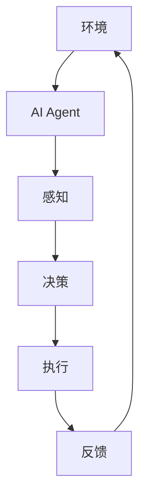
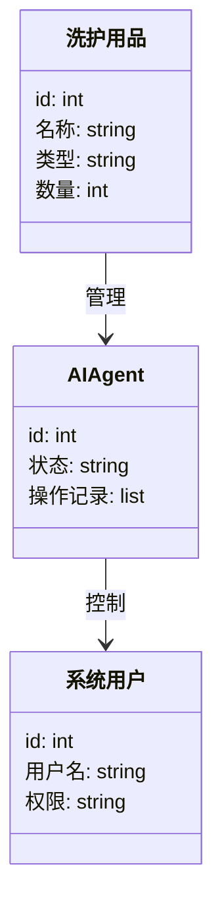
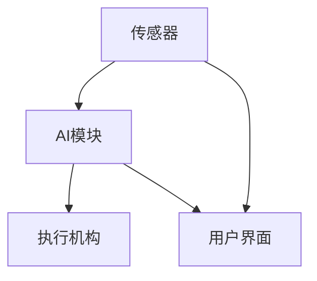
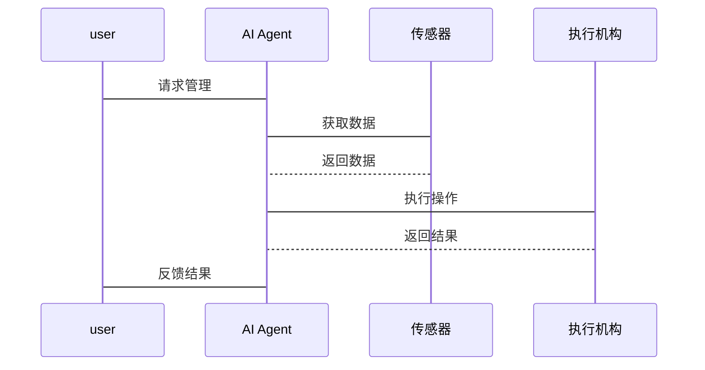

                 


# 智能浴室置物架：AI Agent的洗护用品管理

## 关键词：
- AI Agent
- 智能浴室置物架
- 洗护用品管理
- 多模态感知
- 强化学习
- 智能家居

## 摘要：
智能浴室置物架通过AI Agent实现洗护用品的智能化管理，解决传统浴室置物架在空间利用、管理不便等问题。本文详细介绍了AI Agent的核心概念、算法原理、系统架构设计以及实际项目实施，提供了一套完整的解决方案，帮助读者理解如何将AI技术应用于智能家居领域。

---

## 第一部分：智能浴室置物架的背景与需求

### 第1章：智能浴室置物架的背景介绍

#### 1.1 问题背景
##### 1.1.1 智能浴室置物架的现状
- 当前浴室置物架的功能局限性：空间利用率低、管理不便。
- 用户需求：智能化、个性化、便捷性。

##### 1.1.2 洗护用品管理的痛点与挑战
- 物品存放混乱：找不到所需物品，使用不便。
- 空间浪费：传统置物架无法灵活调整，空间利用率低。
- 维护困难：手动记录和管理，容易出错。

##### 1.1.3 AI Agent在智能浴室置物架中的作用
- AI Agent通过感知、推理和执行，实现智能管理。
- 解决传统管理中的痛点，提升用户体验。

#### 1.2 问题描述
##### 1.2.1 洗护用品管理的核心问题
- 物品识别与分类。
- 存储空间优化。
- 自动化管理。

##### 1.2.2 智能化管理的需求分析
- 用户需求：便捷性、智能化、个性化。
- 技术需求：多模态感知、智能决策。

##### 1.2.3 AI Agent的功能与目标
- 功能：物品识别、库存管理、智能推荐。
- 目标：提升用户体验，优化资源利用率。

#### 1.3 问题解决
##### 1.3.1 AI Agent的核心解决方案
- 多模态感知：结合视觉、触觉、重量感知等技术。
- 智能决策：基于历史数据和用户习惯，优化存储策略。
- 自动执行：通过机械臂或传感器实现自动调整。

##### 1.3.2 智能浴室置物架的实现路径
- 系统设计：硬件与软件结合。
- 技术实现：AI算法与物联网技术融合。

##### 1.3.3 用户需求与技术实现的平衡
- 用户体验：简洁易用。
- 技术可行性：确保算法高效、硬件可靠。

#### 1.4 边界与外延
##### 1.4.1 系统边界与功能范围
- 系统边界：仅管理洗护用品。
- 功能范围：物品识别、存储优化、智能推荐。

##### 1.4.2 与其他智能家居设备的联动
- 与智能门锁、空调等设备联动，提升智能家居的整体性。
- 数据共享：与其他设备共享用户数据，提供更智能化的服务。

##### 1.4.3 未来扩展的可能性
- 新功能：健康监测、环境监测。
- 新技术：更先进的AI算法、物联网技术。

#### 1.5 概念结构与核心要素
##### 1.5.1 系统架构的核心要素
- 硬件部分：传感器、机械臂、显示屏。
- 软件部分：AI算法、数据库、用户界面。

##### 1.5.2 AI Agent的组成部分
- 感知模块：视觉、触觉、重量感知。
- 决策模块：基于规则的推理和强化学习。
- 执行模块：机械臂、传感器。

##### 1.5.3 洗护用品管理的流程与逻辑
- 物品识别：通过视觉识别物品类型和数量。
- 存储优化：基于AI算法，优化存储位置。
- 自动调整：根据使用频率自动调整存储顺序。

---

## 第二章：AI Agent的核心概念与联系

### 第2章：AI Agent的核心概念与联系

#### 2.1 核心概念原理
##### 2.1.1 AI Agent的基本原理
- AI Agent通过感知环境、推理决策、执行动作来实现目标。
- 在智能浴室置物架中，AI Agent负责物品识别、库存管理和智能推荐。

##### 2.1.2 智能浴室置物架中的AI Agent功能
- 多模态感知：通过视觉、触觉、重量感知等技术识别物品。
- 智能决策：基于历史数据和用户习惯，优化存储策略。
- 自动执行：通过机械臂或传感器调整存储位置。

##### 2.1.3 多模态感知与决策机制
- 视觉感知：摄像头识别物品类型和数量。
- 触觉感知：触觉传感器感知物品材质。
- 重量感知：重量传感器监测物品重量变化。

#### 2.2 核心概念对比表
| 对比维度 | 传统管理 | AI Agent管理 |
|----------|----------|--------------|
| 管理方式 | 手动记录 | 自动识别与管理 |
| 决策依据 | 用户记忆 | 历史数据与AI推理 |
| 精准度   | 易出错 | 高精准度 |

#### 2.3 ER实体关系图
```mermaid
erd
    entity 洗护用品 {
        id
        名称
        类型
        数量
    }
    entity AI Agent {
        id
        状态
        操作记录
    }
    entity 系统用户 {
        id
        用户名
        权限
    }
    洗护用品 --> AI Agent: 管理
    AI Agent --> 系统用户: 控制
```

---

## 第三章：AI Agent的算法原理与实现

### 第3章：AI Agent的算法原理与实现

#### 3.1 算法原理
##### 3.1.1 基于规则的推理算法
- 规则定义：根据物品类型、数量、使用频率制定存储规则。
- 示例规则：常用物品优先存储，大件物品放在下方。

##### 3.1.2 基于强化学习的决策算法
- 状态定义：当前存储状态、用户需求。
- 动作定义：调整存储位置、推荐使用物品。
- 奖励机制：根据用户满意度和存储效率给予奖励。

#### 3.2 算法实现
##### 3.2.1 强化学习算法实现
```python
import numpy as np
import gym

class AI-Agent:
    def __init__(self, state_space, action_space):
        self.state_space = state_space
        self.action_space = action_space
        self.q_table = np.zeros((state_space, action_space))

    def take_action(self, state):
        if np.random.random() < 0.9:
            action = np.argmax(self.q_table[state])
        else:
            action = np.random.randint(self.action_space)
        return action

    def update_q_table(self, state, action, reward, next_state):
        self.q_table[state, action] = self.q_table[state, action] * 0.9 + reward * 0.1
```

##### 3.2.2 算法流程图


---

## 第四章：系统分析与架构设计

### 第4章：系统分析与架构设计

#### 4.1 问题场景介绍
##### 4.1.1 项目背景
- 项目目标：设计一个智能浴室置物架，实现洗护用品的智能化管理。
- 项目需求：物品识别、库存管理、智能推荐。

#### 4.2 系统功能设计
##### 4.2.1 领域模型类图


#### 4.3 系统架构设计
##### 4.3.1 系统架构图


#### 4.4 系统接口设计
##### 4.4.1 接口描述
- 输入接口：传感器数据、用户指令。
- 输出接口：执行指令、用户反馈。

#### 4.5 系统交互流程图


---

## 第五章：项目实战

### 第5章：项目实战

#### 5.1 环境搭建
##### 5.1.1 硬件安装
- 传感器：摄像头、重量传感器。
- 执行机构：机械臂、显示屏。

#### 5.2 系统核心实现
##### 5.2.1 AI Agent实现
```python
def recognize_item():
    # 通过摄像头识别物品
    pass

def update_inventory(item, quantity):
    # 更新库存数量
    pass
```

#### 5.3 功能测试
##### 5.3.1 测试用例
- 测试物品识别。
- 测试库存更新。
- 测试智能推荐。

#### 5.4 案例分析
##### 5.4.1 典型案例
- 用户A：常用洗发水，系统自动调整存储位置。
- 用户B：偶尔使用沐浴露，系统优先推荐常用物品。

---

## 第六章：最佳实践与小结

### 第6章：最佳实践与小结

#### 6.1 最佳实践
##### 6.1.1 数据隐私保护
- 加密存储用户数据。
- 限制数据访问权限。

##### 6.1.2 系统维护
- 定期更新AI模型。
- 检查硬件设备状态。

#### 6.2 项目小结
- 项目成果：实现了智能浴室置物架的洗护用品管理。
- 经验总结：AI技术与物联网技术的结合是关键。

#### 6.3 注意事项
- 硬件可靠性：确保传感器和执行机构的稳定性。
- 用户体验：保持界面简洁，操作便捷。

#### 6.4 拓展阅读
- 推荐书籍：《人工智能：一种现代的方法》。
- 推荐技术文档：智能家居系统设计指南。

---

## 作者信息

作者：AI天才研究院/AI Genius Institute & 禅与计算机程序设计艺术 /Zen And The Art of Computer Programming

---

通过以上结构，文章详细介绍了智能浴室置物架的设计背景、核心概念、算法实现、系统架构以及项目实战，为读者提供了一套完整的解决方案。

