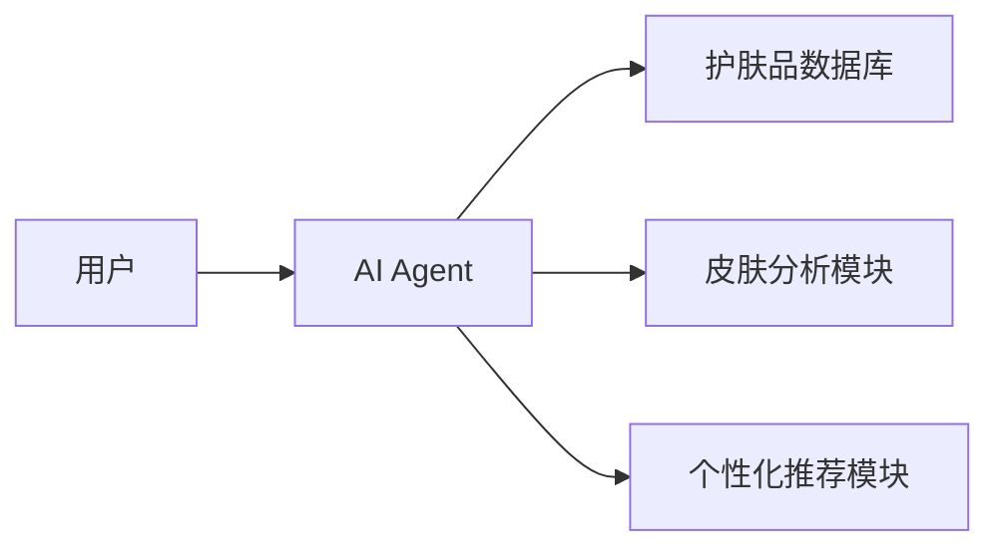

                 

# 智能浴室镜柜：AI Agent的护肤品使用建议

## 关键词：智能浴室镜柜、AI Agent、护肤品推荐、机器学习、个性化护肤

## 摘要：  
本文探讨了智能浴室镜柜与AI Agent结合的创新应用，详细分析了AI Agent如何通过机器学习和自然语言处理技术，为用户提供个性化的护肤品使用建议。文章从背景介绍、核心概念、算法原理、系统架构到项目实战，全面解析了智能浴室镜柜在现代护肤中的潜在价值和实现路径。

---

# 第一部分: 智能浴室镜柜与AI Agent的背景介绍

## 第1章: 背景与问题背景

### 1.1 智能浴室镜柜的发展背景
#### 1.1.1 智能家居的发展趋势
智能家居是科技发展的必然产物，从智能音箱到智能灯泡，智能家居设备已逐渐成为现代生活的标配。浴室作为家庭中重要的功能区域，也开始智能化转型。智能浴室镜柜不仅是存储空间，更是集成多种智能功能的平台。

#### 1.1.2 智能浴室镜柜的市场需求
现代用户对护肤品的选择越来越注重个性化和科学性。传统护肤方法依赖用户的经验或导购推荐，存在效率低、精准度差的问题。智能浴室镜柜通过AI技术，能够实时分析用户的皮肤状况，提供科学的护肤建议，满足了市场对智能化护肤解决方案的需求。

#### 1.1.3 AI技术在智能家居中的应用
AI技术正在渗透到智能家居的各个角落，从语音交互到自动化控制，AI为用户提供了更便捷的生活方式。智能浴室镜柜通过AI技术，可以实现用户行为分析、个性化推荐等功能，成为智能家居生态中的重要组成部分。

### 1.2 护肤品使用建议的痛点
#### 1.2.1 传统护肤品选择的局限性
传统护肤方法依赖用户的主观感受和导购推荐，存在以下问题：
- 信息不透明：用户难以获取科学的护肤知识。
- 精准度低：不同用户的皮肤状况差异大，通用建议难以满足个性化需求。
- 时间成本高：用户需要花费大量时间研究产品和方法。

#### 1.2.2 用户护肤需求的多样性
每个人的皮肤状况不同，受遗传、环境、生活方式等多种因素影响。用户需要个性化的护肤方案，而传统方法难以满足这种需求。

#### 1.2.3 AI在护肤建议中的潜在价值
AI技术能够通过数据分析和机器学习，帮助用户找到最适合的护肤方案。AI Agent可以实时分析用户的皮肤状况，结合环境数据（如温度、湿度）和生活习惯，提供科学的护肤建议。

### 1.3 AI Agent的核心概念
#### 1.3.1 AI Agent的基本定义
AI Agent是一种能够感知环境并采取行动以实现目标的智能实体。在智能浴室镜柜中，AI Agent负责接收用户的输入、分析数据并提供相应的建议。

#### 1.3.2 AI Agent的核心功能
- 数据采集：通过传感器和摄像头采集用户的皮肤数据。
- 数据分析：利用机器学习算法分析皮肤状况，识别潜在问题。
- 个性化推荐：根据分析结果推荐合适的护肤品和护肤步骤。

#### 1.3.3 AI Agent与传统智能设备的区别
AI Agent不仅能够执行简单的控制任务，还能通过学习和推理提供智能化的服务。它能够理解用户的意图，并根据实时数据做出决策。

### 1.4 问题描述与解决方案
#### 1.4.1 智能浴室镜柜的核心问题
- 如何准确分析用户的皮肤状况？
- 如何提供个性化的护肤建议？
- 如何保证数据的隐私和安全？

#### 1.4.2 AI Agent在护肤品建议中的应用
AI Agent通过机器学习和自然语言处理技术，能够实时分析用户的皮肤数据，并结合外部环境和生活习惯，提供科学的护肤建议。

#### 1.4.3 解决方案的可行性分析
- 技术可行性：AI技术已经成熟，能够支持智能浴室镜柜的功能需求。
- 市场可行性：用户对智能化护肤解决方案的需求日益增长。
- 经济可行性：随着技术的普及，AI Agent的成本逐渐降低，具备市场竞争力。

### 1.5 本章小结
本章介绍了智能浴室镜柜的发展背景和AI Agent的核心概念，分析了传统护肤品选择的痛点，并提出了AI Agent在护肤建议中的潜在价值。通过AI Agent，智能浴室镜柜能够为用户提供个性化的护肤方案，满足现代用户对智能化生活的追求。

---

## 第2章: AI Agent的核心原理

### 2.1 AI Agent的基本原理
#### 2.1.1 AI Agent的定义与特点
AI Agent是一种能够感知环境、理解用户需求并采取行动的智能实体。它具有以下特点：
- 智能性：能够通过学习和推理提供智能化服务。
- 交互性：能够与用户进行自然的对话和交互。
- 自适应性：能够根据环境变化调整自身行为。

#### 2.1.2 AI Agent的核心算法
AI Agent的核心算法包括：
- 机器学习算法：用于分析用户数据并生成推荐。
- 自然语言处理算法：用于理解用户的输入并生成自然的回复。
- 数据分析算法：用于优化推荐算法和提高准确性。

#### 2.1.3 AI Agent的输入输出模型
AI Agent的输入输出模型可以表示为：
$$
\text{输出} = f(\text{输入})
$$
其中，$f$ 是AI Agent的核心算法，输入包括用户的皮肤数据、环境数据和用户的历史行为数据。

### 2.2 AI Agent与智能浴室镜柜的结合
#### 2.2.1 智能浴室镜柜的功能需求
智能浴室镜柜需要具备以下功能：
- 数据采集：通过摄像头和传感器采集用户的皮肤数据。
- 数据分析：分析皮肤状况并识别潜在问题。
- 个性化推荐：根据分析结果推荐合适的护肤品。

#### 2.2.2 AI Agent在镜柜中的具体应用
AI Agent在智能浴室镜柜中的具体应用包括：
- 实时分析用户的皮肤状况。
- 提供个性化的护肤建议。
- 根据用户反馈优化推荐算法。

#### 2.2.3 AI Agent与镜柜硬件的交互方式
AI Agent通过以下方式与镜柜硬件交互：
- 接收用户的输入数据。
- 发送控制指令。
- 提供实时反馈。

### 2.3 AI Agent的核心算法
#### 2.3.1 机器学习算法在AI Agent中的应用
机器学习算法在AI Agent中的应用包括：
- 分类算法：用于识别用户的皮肤问题类型。
- 回归算法：用于预测护肤品的效果。
- 聚类算法：用于分析用户的护肤习惯。

#### 2.3.2 自然语言处理在护肤建议中的作用
自然语言处理在护肤建议中的作用包括：
- 理解用户的输入。
- 生成自然的回复。
- 提供个性化的建议。

#### 2.3.3 数据分析与个性化推荐
数据分析与个性化推荐是AI Agent的核心功能之一。通过分析用户的皮肤数据和历史行为数据，AI Agent能够生成个性化的护肤方案。

### 2.4 AI Agent的实体关系图

---

## 第3章: AI Agent的数学模型与算法原理

### 3.1 AI Agent的数学

---

**作者：AI天才研究院/AI Genius Institute & 禅与计算机程序设计艺术 /Zen And The Art of Computer Programming**

