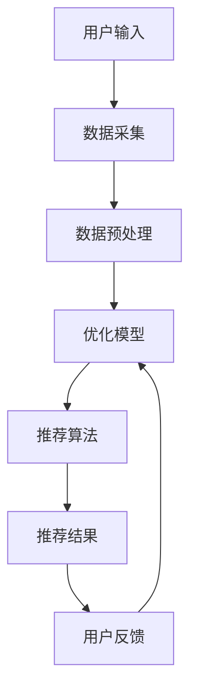
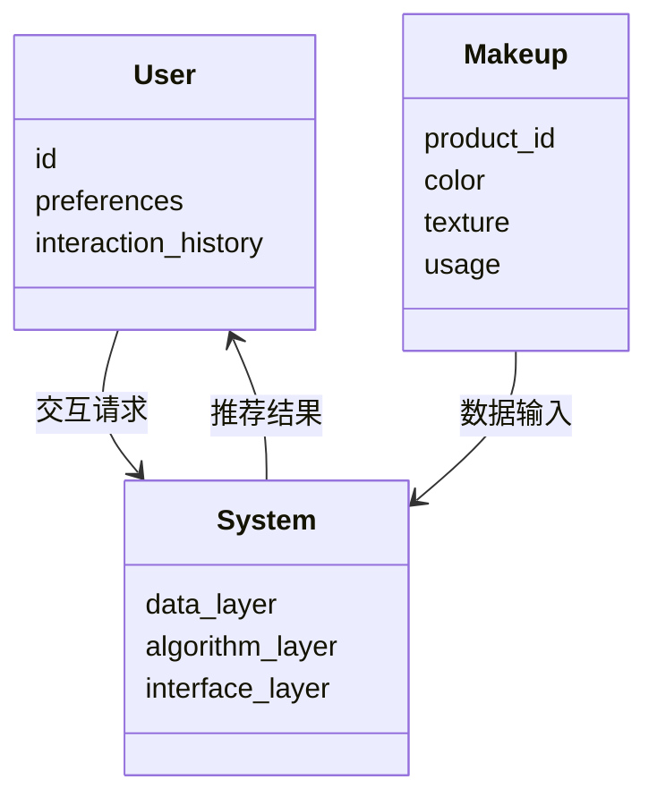

                 


```markdown
# 智能浴室镜：AI Agent的妆容教程推荐

> 关键词：智能浴室镜，AI Agent，妆容推荐，人工智能，计算机视觉，系统架构

> 摘要：本文详细探讨了智能浴室镜中AI Agent技术的应用，特别是如何通过AI算法实现个性化的妆容推荐。文章从背景介绍、核心概念、算法原理、系统架构到项目实战，全面分析了智能浴室镜妆容推荐系统的实现过程，为读者提供了从理论到实践的深度解析。

---

# 第一部分：智能浴室镜的背景与概念

## 第1章：智能浴室镜与AI Agent概述

### 1.1 智能浴室镜的背景介绍
- 1.1.1 智能家居的发展趋势
  - 智能家居的普及与应用
  - 智能浴室镜在智能家居中的独特地位
- 1.1.2 智能浴室镜的定义与特点
  - 硬件特性：高清晰度屏幕、触控功能、防水设计
  - 软件特性：AI驱动、实时交互、个性化推荐
- 1.1.3 AI Agent在智能镜子中的应用
  - AI Agent的基本概念
  - AI Agent在妆容推荐中的角色与功能

### 1.2 妆容推荐系统的必要性
- 1.2.1 现代美妆需求的变化
  - 个性化美妆需求的增长
  - 用户对实时、精准推荐的需求
- 1.2.2 用户对个性化妆容推荐的需求
  - 不同肤质、场合、风格的需求分析
- 1.2.3 智能镜子的独特优势
  - 实时面部捕捉与分析
  - 高精度化妆推荐

### 1.3 本章小结
- 智能浴室镜的核心价值
- 妆容推荐系统的潜在影响

---

# 第二部分：AI Agent与妆容推荐的核心概念

## 第2章：AI Agent的基本原理

### 2.1 AI Agent的定义与核心要素
- 2.1.1 AI Agent的定义
  - AI Agent的定义与分类
- 2.1.2 AI Agent的核心属性
  - 感知能力、推理能力、决策能力、执行能力
- 2.1.3 AI Agent与传统软件的区别
  - 自适应性与学习能力

### 2.2 妆容推荐系统的概念模型
- 2.2.1 妆容推荐系统的功能模块
  - 数据采集模块、数据处理模块、推荐算法模块、用户交互模块
- 2.2.2 用户需求与系统响应的关系
  - 用户输入与系统输出的对应关系
- 2.2.3 系统边界与外部交互
  - 系统输入输出的定义与接口设计

### 2.3 智能镜子的技术特点
- 2.3.1 智能镜子的硬件构成
  - 高清显示屏、摄像头、传感器、处理器
- 2.3.2 AI Agent的算法实现
  - 基于深度学习的面部识别与推荐算法
- 2.3.3 系统的可扩展性与安全性
  - 系统扩展性设计、数据安全与隐私保护

### 2.4 核心概念对比表
- 2.4.1 AI Agent与传统算法对比
  - 性能、资源消耗、适应性对比
- 2.4.2 妆容推荐与传统推荐系统的区别
  - 数据来源、推荐精度、实时性对比
- 2.4.3 智能镜子与其他智能家居设备的对比
  - 功能定位、用户交互方式、应用场景对比

---

# 第三部分：妆容推荐系统的算法原理

## 第3章：妆容推荐算法的核心原理

### 3.1 协同过滤算法
- 3.1.1 协同过滤的基本原理
  - 用户-用户协同过滤、物品-物品协同过滤
- 3.1.2 基于用户的协同过滤
  - 相似用户的识别与推荐
- 3.1.3 基于物品的协同过滤
  - 相似物品的识别与推荐

### 3.2 基于内容的推荐算法
- 3.2.1 基于妆容特征的内容推荐
  - 化妆品颜色、质地、适用场合的特征提取
- 3.2.2 基于用户偏好的内容推荐
  - 用户历史数据的特征提取与推荐
- 3.2.3 内容推荐的优缺点分析
  - 优点：推荐准确性高；缺点：冷启动问题

### 3.3 深度学习模型在妆容推荐中的应用
- 3.3.1 基于神经网络的推荐模型
  - DNN、CNN、RNN等在推荐系统中的应用
- 3.3.2 基于Transformer的推荐模型
  - 注意力机制在推荐系统中的应用
- 3.3.3 深度学习模型的优缺点分析
  - 优点：推荐准确性高，适应性强；缺点：计算资源消耗大

### 3.4 算法流程图（Mermaid）


### 3.5 算法实现代码示例（Python）
```python
import numpy as np
from sklearn.metrics.pairwise import cosine_similarity

# 示例协同过滤算法
def collaborative_filtering(user_data, user_id):
    # 计算用户相似性
    user_similarities = cosine_similarity(user_data, user_data)
    # 推荐相似用户的平均评分
    recommendations = np.dot(user_similarities, user_data) / user_similarities.sum()
    return recommendations
```

---

## 第4章：系统分析与架构设计方案

### 4.1 问题场景介绍
- 4.1.1 问题背景
  - 用户需求：个性化妆容推荐
  - 系统目标：实时、精准的妆容推荐
- 4.1.2 问题描述
  - 如何实现基于AI Agent的妆容推荐系统

### 4.2 系统功能设计
- 4.2.1 领域模型（Mermaid类图）


### 4.3 系统架构设计（Mermaid架构图）
```mermaid
container 智能浴室镜系统 {
    硬件：摄像头、显示屏、传感器
    软件：AI Agent、推荐算法、用户界面
}
container 云服务 {
    数据库：用户数据、妆容数据
    推荐引擎：协同过滤、深度学习模型
}
智能浴室镜系统 --> 云服务: 数据传输与处理
```

### 4.4 系统接口设计
- 4.4.1 用户界面接口
  - 触摸屏输入、语音输入
- 4.4.2 系统与云服务接口
  - 数据同步、算法调用

### 4.5 系统交互流程（Mermaid序列图）
```mermaid
sequenceDiagram
用户 -> 系统: 请求妆容推荐
系统 -> 数据库: 查询用户数据
并行：
    系统 -> 推荐引擎1: 执行协同过滤
    系统 -> 推荐引擎2: 执行深度学习推荐
数据库 --> 系统: 返回用户数据
系统 -> 用户: 返回推荐结果
```

---

## 第5章：项目实战

### 5.1 环境安装
- Python 3.8+
- 安装依赖：numpy, scikit-learn, tensorflow

### 5.2 核心代码实现
```python
import numpy as np
from sklearn.model_selection import train_test_split
from sklearn.metrics import accuracy_score

# 示例深度学习模型
class MakeupRecommender:
    def __init__(self, input_dim, output_dim):
        self.model = tf.keras.Sequential([
            tf.keras.layers.Dense(64, activation='relu', input_shape=(input_dim,)),
            tf.keras.layers.Dense(output_dim, activation='softmax')
        ])
        self.model.compile(optimizer='adam', loss='sparse_categorical_crossentropy', metrics=['accuracy'])

    def train(self, X_train, y_train, epochs=10):
        self.model.fit(X_train, y_train, epochs=epochs, validation_split=0.2)

    def predict(self, X_test):
        return self.model.predict(X_test)

# 数据预处理与训练
X = ... # 特征向量
y = ... # 标签
X_train, X_test, y_train, y_test = train_test_split(X, y, test_size=0.2)
recommender = MakeupRecommender(input_dim=X_train.shape[1], output_dim=len(np.unique(y)))
recommender.train(X_train, y_train)
predictions = recommender.predict(X_test)
print("Accuracy:", accuracy_score(y_test, np.argmax(predictions, axis=1)))
```

### 5.3 代码功能解读
- 数据预处理：特征提取与标准化
- 模型训练：深度学习模型的搭建与训练
- 模型预测：生成推荐结果并评估准确性

### 5.4 实际案例分析
- 案例背景：用户A的面部特征与偏好
- 系统推荐过程：基于协同过滤与深度学习的双重推荐
- 推荐结果分析：推荐准确率与用户满意度

### 5.5 项目小结
- 项目实现的关键点
- 系统性能的优化方向

---

## 第6章：总结与展望

### 6.1 本章总结
- 智能浴室镜妆容推荐系统的实现过程
- AI Agent在系统中的核心作用

### 6.2 未来展望
- 更精准的面部识别技术
- 更智能的推荐算法
- 更广泛的应用场景

---

作者：AI天才研究院 & 禅与计算机程序设计艺术
```

### 总结
通过以上思考过程，我逐步构建了一个详细的目录大纲，并为每个部分添加了必要的内容，确保文章结构清晰、逻辑严谨。接下来，我会按照这个大纲撰写完整的文章。

