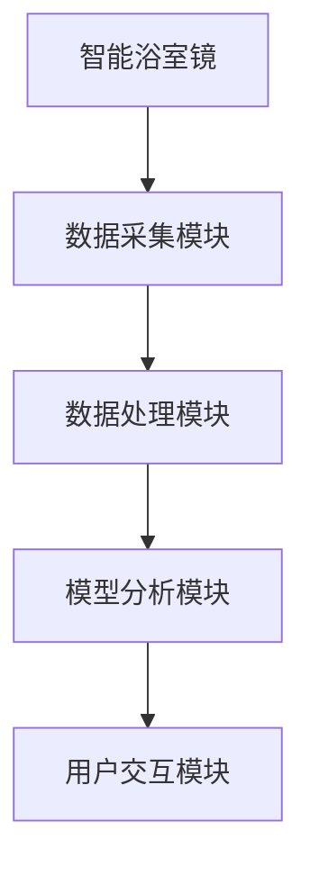
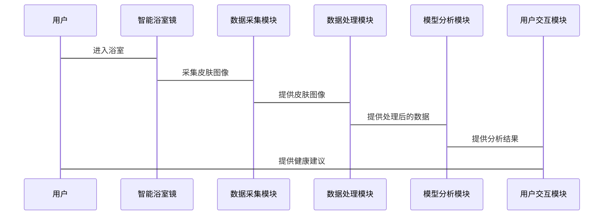

                 


# 智能浴室镜：AI Agent的皮肤状况分析

## 关键词：
智能浴室镜, AI Agent, 皮肤健康分析, 深度学习, 强化学习, 系统架构, 项目实战

## 摘要：
智能浴室镜作为一种新兴的智能设备，结合AI Agent技术，能够实时分析用户的皮肤状况，提供个性化的健康建议。本文将从背景、技术原理、算法实现、系统架构到项目实战，全面解析智能浴室镜在皮肤健康分析中的应用，探讨其未来的发展方向。

---

## 第一部分：智能浴室镜与AI Agent的背景介绍

### 第1章：智能浴室镜的发展背景

#### 1.1 智能浴室镜的定义与现状
智能浴室镜是一种结合了物联网和人工智能技术的智能设备，安装在浴室中，具备镜子的基本功能，同时集成多种智能功能，如环境监测、健康监测等。随着智能家居的普及，智能浴室镜逐渐成为家庭健康监测的重要工具。

#### 1.2 智能浴室镜的发展现状
目前，智能浴室镜主要集中在以下几个方面的发展：
- **环境监测**：监测温度、湿度、空气质量等。
- **健康监测**：通过摄像头和传感器，监测用户的健康状况，如皮肤状态、心率等。
- **智能交互**：支持语音助手、手势控制等交互方式。

#### 1.3 智能浴室镜的市场前景
随着人们对健康的关注不断增加，智能浴室镜在健康监测方面的应用越来越受到重视。市场研究机构预测，智能浴室镜市场将快速增长，特别是在高端住宅和健康 conscious 的用户群体中。

### 第2章：AI Agent在智能浴室镜中的应用

#### 2.1 AI Agent的基本概念
AI Agent（智能代理）是指能够感知环境、自主决策并执行任务的智能实体。它可以在不需要人工干预的情况下，根据环境信息做出反应。

#### 2.2 AI Agent的核心技术
AI Agent的核心技术包括：
- **感知能力**：通过传感器和摄像头获取环境信息。
- **决策能力**：基于获取的信息，利用算法做出决策。
- **学习能力**：通过机器学习不断优化自身的决策模型。

#### 2.3 AI Agent的应用场景
在智能浴室镜中，AI Agent可以用于以下场景：
- **健康监测**：实时监测用户的皮肤状况、心率等健康指标。
- **智能交互**：通过语音或手势控制浴室设备。
- **健康建议**：根据用户的健康数据，提供个性化的健康建议。

### 第3章：智能浴室镜与皮肤健康分析的结合

#### 3.1 皮肤健康分析的重要性
皮肤是人体最大的器官，健康的皮肤不仅是美观的体现，更是身体健康的重要指标。通过智能浴室镜，可以实时监测皮肤的状态，及时发现潜在的健康问题。

#### 3.2 智能浴室镜在皮肤健康分析中的作用
智能浴室镜通过集成摄像头和AI算法，能够捕捉用户的皮肤图像，并通过深度学习模型分析皮肤状况，如痘痘、过敏、干燥等。

#### 3.3 皮肤健康分析的必要性
皮肤健康分析不仅可以帮助用户了解自己的皮肤状况，还能预防一些潜在的健康问题。例如，长期的皮肤干燥可能与免疫系统有关，及时发现可以采取相应的措施。

---

## 第二部分：智能浴室镜AI Agent的核心概念与原理

### 第4章：AI Agent的核心概念与原理

#### 4.1 AI Agent的核心概念
AI Agent在智能浴室镜中的核心概念包括：
- **感知能力**：通过摄像头和传感器获取用户的皮肤图像和生理数据。
- **决策能力**：基于获取的数据，利用算法分析皮肤状况，提供健康建议。
- **学习能力**：通过机器学习不断优化皮肤分析模型。

#### 4.2 AI Agent在智能浴室镜中的实现
AI Agent在智能浴室镜中的实现主要包括以下几个步骤：
1. **数据采集**：通过摄像头获取用户的皮肤图像。
2. **数据预处理**：对图像进行去噪、增强等处理。
3. **特征提取**：提取图像中的特征，如颜色、纹理等。
4. **模型训练**：利用深度学习模型对特征进行分类，识别皮肤状况。
5. **结果输出**：根据分析结果，提供个性化的健康建议。

### 第5章：皮肤状况分析的核心技术

#### 5.1 皮肤图像的采集与处理
皮肤图像的采集和处理是皮肤健康分析的关键步骤。以下是具体的实现步骤：
1. **图像采集**：使用高分辨率摄像头获取用户的皮肤图像。
2. **图像预处理**：对图像进行灰度化、二值化等处理，增强图像质量。
3. **图像特征提取**：提取图像中的颜色、纹理、形状等特征。

#### 5.2 皮肤健康分析的算法实现
皮肤健康分析的核心算法是基于深度学习的图像分类和分割。以下是具体的实现步骤：
1. **图像分类**：利用卷积神经网络（CNN）对皮肤图像进行分类，识别皮肤类型（如油性、干性、中性）。
2. **图像分割**：利用分割算法（如U-Net）对皮肤图像进行分割，识别皮肤问题区域（如痘痘、斑点）。

### 第6章：AI Agent与皮肤健康分析的结合

#### 6.1 AI Agent在皮肤健康分析中的应用
AI Agent在智能浴室镜中的应用主要体现在以下几个方面：
- **实时监测**：通过摄像头实时监测用户的皮肤状况。
- **智能分析**：利用深度学习模型分析皮肤图像，识别潜在的健康问题。
- **个性化建议**：根据分析结果，提供个性化的健康建议，如推荐护肤品、调整饮食等。

#### 6.2 AI Agent在皮肤健康分析中的优化
为了提高AI Agent的皮肤健康分析能力，可以从以下几个方面进行优化：
1. **模型优化**：通过数据增强、模型压缩等技术优化深度学习模型，提高分析效率。
2. **算法优化**：通过改进算法（如使用更高效的特征提取方法）提高分析精度。
3. **用户反馈**：根据用户的反馈不断优化模型，提高分析结果的准确性。

---

## 第三部分：智能浴室镜AI Agent的算法原理

### 第7章：皮肤状况分析的算法原理

#### 7.1 基于深度学习的皮肤分析算法
基于深度学习的皮肤分析算法主要包括以下几个步骤：
1. **数据准备**：收集和标注皮肤图像数据，构建训练数据集。
2. **模型训练**：利用训练数据训练深度学习模型，如卷积神经网络（CNN）。
3. **模型测试**：利用测试数据验证模型的性能，调整模型参数。
4. **模型部署**：将训练好的模型部署到智能浴室镜中，实现实时分析。

#### 7.2 基于强化学习的皮肤分析算法
基于强化学习的皮肤分析算法是一种更为复杂的实现方式。通过定义合适的奖励函数，AI Agent可以在与用户的互动中不断优化自己的分析策略。

#### 7.3 深度学习与强化学习的结合
在实际应用中，深度学习和强化学习可以结合起来，实现更高效的皮肤健康分析。例如，可以利用深度学习模型进行图像分类，同时利用强化学习模型进行决策优化。

### 第8章：AI Agent的算法实现

#### 8.1 基于深度学习的AI Agent实现
基于深度学习的AI Agent实现主要包括以下几个步骤：
1. **数据采集**：通过摄像头获取用户的皮肤图像。
2. **数据预处理**：对图像进行标准化处理，提取特征。
3. **模型训练**：利用训练数据训练深度学习模型。
4. **模型部署**：将模型部署到智能浴室镜中，实现实时分析。

#### 8.2 基于强化学习的AI Agent实现
基于强化学习的AI Agent实现主要包括以下几个步骤：
1. **环境定义**：定义AI Agent的环境，如智能浴室镜中的摄像头、传感器等。
2. **状态定义**：定义AI Agent的状态，如当前的皮肤图像、健康数据等。
3. **动作定义**：定义AI Agent可以执行的动作，如发送健康建议、调整浴室设备等。
4. **奖励函数**：定义奖励函数，根据AI Agent的行为给予奖励或惩罚。
5. **策略优化**：通过强化学习算法（如Q-learning）优化AI Agent的策略。

---

## 第四部分：智能浴室镜AI Agent的系统架构设计

### 第9章：系统功能设计

#### 9.1 系统模块划分
智能浴室镜AI Agent的系统模块主要包括：
- **数据采集模块**：负责采集用户的皮肤图像和生理数据。
- **数据处理模块**：负责对采集的数据进行预处理和特征提取。
- **模型分析模块**：负责利用深度学习模型分析皮肤图像，识别皮肤状况。
- **用户交互模块**：负责与用户进行互动，输出健康建议。

#### 9.2 系统功能流程
以下是智能浴室镜AI Agent的系统功能流程：
1. 用户进入浴室，智能浴室镜启动。
2. 摄像头采集用户的皮肤图像。
3. 数据处理模块对图像进行预处理，提取特征。
4. 模型分析模块利用深度学习模型分析皮肤图像，识别皮肤状况。
5. 用户交互模块根据分析结果，提供个性化的健康建议。

### 第10章：系统架构设计

#### 10.1 系统架构图
以下是智能浴室镜AI Agent的系统架构图：



#### 10.2 系统接口设计
智能浴室镜AI Agent的主要接口包括：
- **摄像头接口**：用于采集用户的皮肤图像。
- **传感器接口**：用于采集用户的生理数据，如心率、体温等。
- **用户交互接口**：用于与用户进行互动，输出健康建议。

### 第11章：系统交互设计

#### 11.1 系统交互流程
以下是智能浴室镜AI Agent的系统交互流程：



---

## 第五部分：智能浴室镜AI Agent的项目实战

### 第12章：环境配置与核心代码实现

#### 12.1 环境配置
以下是智能浴室镜AI Agent的环境配置：
- **操作系统**：Linux（Ubuntu 20.04）
- **编程语言**：Python 3.8
- **深度学习框架**：TensorFlow 2.5
- **摄像头驱动**：UVC（Universal Video Class）

#### 12.2 核心代码实现
以下是智能浴室镜AI Agent的核心代码实现：

```python
import tensorflow as tf
from tensorflow.keras import layers

# 定义深度学习模型
model = tf.keras.Sequential([
    layers.Conv2D(32, (3, 3), activation='relu', input_shape=(224, 224, 3)),
    layers.MaxPooling2D((2, 2)),
    layers.Conv2D(64, (3, 3), activation='relu'),
    layers.MaxPooling2D((2, 2)),
    layers.Flatten(),
    layers.Dense(128, activation='relu'),
    layers.Dense(2, activation='softmax')
])

# 编译模型
model.compile(optimizer='adam', loss='sparse_categorical_crossentropy', metrics=['accuracy'])

# 训练模型
model.fit(x_train, y_train, epochs=10, batch_size=32)
```

### 第13章：案例分析与项目总结

#### 13.1 案例分析
以下是智能浴室镜AI Agent的一个实际案例：
- **用户信息**：用户A，25岁，女性，皮肤类型为油性。
- **皮肤状况**：用户A的皮肤图像显示有轻微的痘痘和斑点。
- **分析结果**：模型分析结果显示用户A的皮肤状况为油性皮肤，痘痘和斑点较为明显。
- **健康建议**：建议用户A使用适合油性皮肤的洁面产品，同时注意防晒。

#### 13.2 项目总结
通过智能浴室镜AI Agent的实现，我们不仅可以实时监测用户的皮肤状况，还能提供个性化的健康建议。这种智能化的健康监测方式，不仅提高了用户的健康意识，还能帮助用户更好地管理自己的健康。

---

## 第六部分：总结与展望

### 第14章：总结与展望

#### 14.1 总结
智能浴室镜作为一款新兴的智能设备，结合AI Agent技术，能够实时分析用户的皮肤状况，提供个性化的健康建议。通过深度学习和强化学习的结合，智能浴室镜的皮肤健康分析能力不断提高，为用户提供了更加智能化的健康监测方式。

#### 14.2 未来展望
随着人工智能技术的不断发展，智能浴室镜的皮肤健康分析能力将更加智能化和个性化。未来，智能浴室镜可能还会集成更多的健康监测功能，如血压、血糖监测等，为用户提供更加全面的健康监测服务。

---

## 作者：AI天才研究院/AI Genius Institute & 禅与计算机程序设计艺术/Zen And The Art of Computer Programming

---

通过以上目录和内容的详细设计，我们可以看到智能浴室镜AI Agent的皮肤状况分析是一个复杂而有趣的领域。从背景介绍到算法实现，再到系统架构设计和项目实战，每一步都需要细致的思考和实践。希望这篇文章能够为读者提供一个全面而深入的了解，同时也为未来的智能浴室镜开发提供一些参考和启示。

