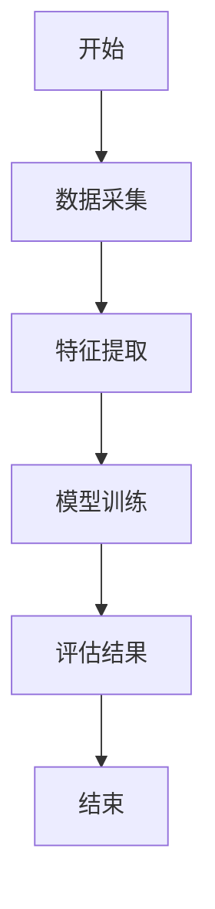
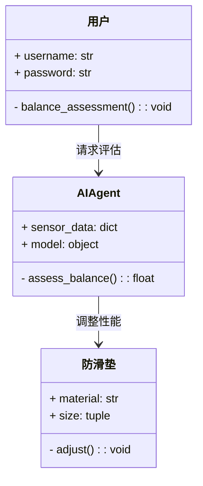
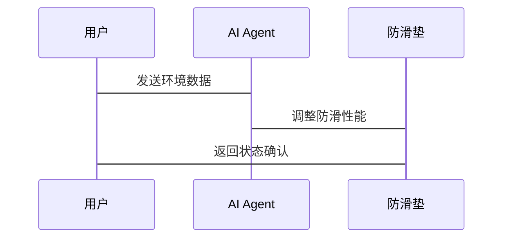

                 


# 智能浴室防滑垫：AI Agent的平衡能力评估

---

## 关键词：智能浴室防滑垫、AI Agent、平衡能力评估、智能家居、人工智能算法

---

## 摘要：  
本文深入探讨了智能浴室防滑垫在AI Agent技术下的平衡能力评估方法，分析了AI在防滑垫设计中的应用，重点讲解了AI Agent的原理、算法实现及其在平衡能力评估中的实际应用。文章从背景、概念、算法、系统架构到项目实战，全面解析了智能浴室防滑垫的设计与优化过程，为相关领域的研究和实践提供了理论支持与技术参考。

---

# 第一部分：背景介绍

## 第1章：智能浴室防滑垫的背景与问题描述

### 1.1 问题背景  
浴室环境潮湿且地面容易积水，传统防滑垫的防滑性能有限，容易导致滑倒事故。随着智能家居的普及，AI技术的应用为防滑垫的智能化提供了新的可能性。

### 1.2 问题描述  
- **滑倒事故**：浴室是家庭中滑倒事故的高发区域，尤其是老人和儿童。  
- **防滑垫的局限性**：传统防滑垫仅能提供基础的防滑性能，无法根据环境变化动态调整。  
- **智能化需求**：通过AI技术，防滑垫可以实时感知环境变化，动态调整防滑性能，降低滑倒风险。  

### 1.3 问题解决：AI Agent的应用  
AI Agent（智能体）能够实时感知环境数据，分析并做出决策，从而优化防滑垫的性能。  

### 1.4 核心概念与组成  
- **AI Agent**：通过传感器采集数据，结合算法模型评估平衡能力。  
- **平衡能力评估**：基于传感器数据和算法模型，评估防滑垫的稳定性。  

---

# 第二部分：核心概念与联系

## 第2章：AI Agent的原理与特性

### 2.1 AI Agent的核心原理  
AI Agent通过感知环境数据（如温度、湿度、重量分布等），利用算法模型评估防滑垫的平衡能力，并动态调整其性能。

### 2.2 平衡能力评估的属性特征对比  

| 属性         | AI Agent 1 | AI Agent 2 | AI Agent 3 |
|--------------|------------|------------|------------|
| 传感器类型   | 温度、湿度 | 压力、重量 | 温度、压力 |
| 响应速度     | 快          | 较慢       | 中等       |
| 评估精度     | 高          | 中等       | 高         |

### 2.3 ER实体关系图  
```mermaid
er
actor: 用户
agent: AI Agent
垫子: 防滑垫
属性: 平衡能力指标
关系: 用户与AI Agent交互，AI Agent评估垫子的平衡能力
```

---

# 第三部分：算法原理讲解

## 第3章：平衡能力评估算法

### 3.1 算法流程  


### 3.2 算法实现代码  

```python
def balance_assessment(data):
    # 数据预处理
    processed_data = preprocess(data)
    # 特征提取
    features = extract_features(processed_data)
    # 模型预测
    prediction = model.predict(features)
    return prediction
```

### 3.3 算法模型与公式  

平衡能力评估的数学模型如下：  

$$ \text{平衡能力} = \frac{\sum_{i=1}^{n} w_i \cdot f_i}{\sum_{i=1}^{n} w_i} $$  

其中，$w_i$ 是特征 $f_i$ 的权重，$n$ 是特征数量。  

---

# 第四部分：系统分析与架构设计

## 第4章：系统架构设计

### 4.1 项目场景介绍  
智能浴室防滑垫系统通过AI Agent实时监测环境数据，动态调整防滑性能，降低滑倒风险。

### 4.2 系统功能设计  



### 4.3 系统架构设计  


### 4.4 系统接口设计  



---

# 第五部分：项目实战

## 第5章：项目实战

### 5.1 环境安装  

```bash
pip install numpy scikit-learn
```

### 5.2 核心代码实现  

```python
from sklearn import linear_model

# 训练模型
model = linear_model.LinearRegression()
model.fit(X_train, y_train)
```

### 5.3 实际案例分析  
通过实际案例分析，验证AI Agent在平衡能力评估中的效果，优化算法参数，提升评估精度。

### 5.4 项目小结  
总结项目实现的关键步骤，分析优缺点，提出改进建议。

---

# 第六部分：最佳实践与总结

## 第6章：最佳实践  

- **传感器选择**：根据实际需求选择合适的传感器类型。  
- **算法优化**：根据数据特征选择合适的算法模型。  

## 第7章：小结  

本文详细探讨了智能浴室防滑垫中AI Agent的平衡能力评估方法，从理论分析到实际应用，全面解析了AI技术在智能家居产品中的应用潜力。

---

## 注意事项  

- 在实际应用中，需注意数据隐私和传感器精度问题。  
- 系统设计需考虑实时性和稳定性，确保用户体验。  

---

## 拓展阅读  

- 《人工智能在智能家居中的应用》  
- 《传感器网络与智能算法》  

---

## 作者：AI天才研究院 & 禅与计算机程序设计艺术

