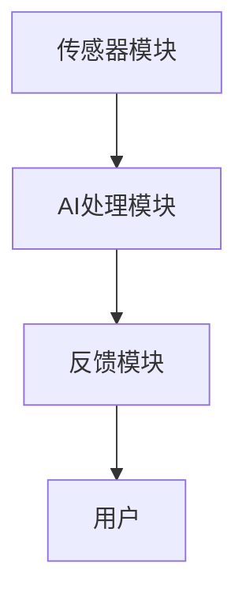

                 


# 智能浴室防滑垫：AI Agent的老人关怀系统

> 关键词：智能浴室防滑垫，AI Agent，老年人安全，物联网，人工智能

> 摘要：本文介绍了一种结合AI Agent技术的智能浴室防滑垫系统，旨在通过传感器和智能算法实时监测浴室环境，预防老年人滑倒事故。文章详细分析了系统的背景、核心概念、算法原理、系统架构，并通过项目实战展示了系统的实现过程，最后总结了最佳实践和未来发展方向。

---

## 第1章: 智能浴室防滑垫的背景介绍

### 1.1 智能浴室防滑垫的现状

#### 1.1.1 老年人浴室安全问题的现状

老年人浴室滑倒事故频发，主要原因是浴室地面湿滑、老年人平衡能力下降以及浴室环境的安全隐患。数据显示，65岁以上的老年人中有超过三分之一的人因浴室滑倒而受伤，其中一些情况甚至导致严重后果，如骨折或死亡。

#### 1.1.2 智能防滑垫的发展趋势

随着物联网和人工智能技术的快速发展，智能防滑垫逐渐成为老年人浴室安全的重要保障工具。市场上的智能防滑垫通常具备防水、防滑、抗菌等功能，并通过传感器实时监测环境变化。

#### 1.1.3 AI Agent在智能设备中的应用前景

AI Agent（智能代理）是一种能够感知环境、自主决策并执行任务的智能系统。在智能防滑垫中，AI Agent可以通过分析传感器数据，实时判断浴室环境的安全性，并通过反馈机制提醒用户或采取预防措施。

### 1.2 老年人浴室安全问题的背景

#### 1.2.1 老年人浴室滑倒事故的高发性

老年人由于身体机能衰退，容易在浴室中因地面湿滑而摔倒。浴室环境的湿滑、不平整的地面对老年人来说是巨大的安全隐患。

#### 1.2.2 老年人浴室环境的安全隐患

浴室空间通常较为狭小，且地面容易积水，这些都增加了老年人滑倒的风险。此外，浴室中使用的毛巾、肥皂等物品也可能导致地面滑倒。

#### 1.2.3 老年人对浴室安全的需求

老年人及其家人对浴室安全的需求日益增长，他们需要一种既能保障安全又不影响日常生活的产品。智能浴室防滑垫正是为满足这一需求而设计的。

### 1.3 智能浴室防滑垫的目标与意义

#### 1.3.1 目标人群的确定

智能浴室防滑垫的主要目标人群是老年人及其家人。产品设计需要充分考虑老年人的身体状况和使用习惯。

#### 1.3.2 智能防滑垫的核心功能

智能防滑垫需要具备以下核心功能：实时监测浴室环境、检测潜在危险、发出预警信号、提供实时反馈。

#### 1.3.3 AI Agent在老人关怀中的作用

AI Agent可以通过分析传感器数据，实时判断浴室环境的安全性，并根据判断结果采取相应的措施，如发出警报或调整防滑垫的阻力。

---

## 第2章: AI Agent的核心概念与工作原理

### 2.1 AI Agent的基本概念

#### 2.1.1 AI Agent的定义

AI Agent是一种能够感知环境、自主决策并执行任务的智能系统。它可以在没有人工干预的情况下，根据输入的信息做出相应的反应。

#### 2.1.2 AI Agent的核心属性

AI Agent具有以下核心属性：
- **自主性**：能够在没有外部干预的情况下自主运行。
- **反应性**：能够实时感知环境变化并做出反应。
- **目标导向性**：具有明确的目标，并能够为实现目标而采取行动。
- **学习能力**：能够通过经验不断优化自身的算法和决策逻辑。

#### 2.1.3 AI Agent与传统软件的区别

与传统软件相比，AI Agent具有更强的自主性和适应性，能够根据环境变化动态调整自身的行为。

### 2.2 智能浴室防滑垫中的AI Agent设计

#### 2.2.1 AI Agent的功能模块

智能浴室防滑垫中的AI Agent主要包含以下功能模块：
- **数据采集模块**：接收传感器的数据，如温度、湿度、体重分布等。
- **数据处理模块**：对采集到的数据进行分析和处理，判断浴室环境的安全性。
- **决策模块**：根据处理后的数据，做出是否需要发出警报或调整防滑垫的决策。

#### 2.2.2 AI Agent的输入输出接口

AI Agent的输入接口包括传感器数据和用户输入，输出接口包括警报信号和防滑垫的阻力调整。

#### 2.2.3 AI Agent的决策逻辑

AI Agent的决策逻辑基于传感器数据和预设的安全阈值。当检测到潜在危险时，AI Agent会触发警报或调整防滑垫的阻力。

### 2.3 AI Agent与防滑垫的结合

#### 2.3.1 防滑垫的传感器技术

防滑垫内置多种传感器，包括压力传感器、温度传感器和湿度传感器，能够实时监测浴室环境的变化。

#### 2.3.2 AI Agent对传感器数据的处理

AI Agent对传感器数据进行分析，判断浴室环境的安全性。例如，当检测到地面湿滑时，AI Agent会发出警报。

#### 2.3.3 AI Agent的反馈机制

当检测到潜在危险时，AI Agent会通过反馈机制调整防滑垫的阻力或发出警报信号，提醒用户注意安全。

---

## 第3章: 智能浴室防滑垫的系统架构设计

### 3.1 系统组成模块

#### 3.1.1 传感器模块

传感器模块负责采集浴室环境的数据，如温度、湿度和体重分布。

#### 3.1.2 AI处理模块

AI处理模块对传感器数据进行分析和处理，判断浴室环境的安全性。

#### 3.1.3 反馈模块

反馈模块根据AI处理模块的决策，调整防滑垫的阻力或发出警报信号。

### 3.2 系统功能设计

#### 3.2.1 滑倒风险评估

AI Agent通过分析传感器数据，评估浴室环境的滑倒风险。

#### 3.2.2 用户行为分析

AI Agent可以分析用户的使用习惯，优化防滑垫的调整策略。

#### 3.2.3 安全提醒功能

当检测到潜在危险时，AI Agent会通过反馈模块发出警报信号，提醒用户注意安全。

### 3.3 系统架构图



---

## 第4章: AI Agent的算法原理与数学模型

### 4.1 滑倒风险评估模型

#### 4.1.1 模型输入变量

滑倒风险评估模型的输入变量包括温度、湿度、体重分布和时间等。

#### 4.1.2 模型输出结果

模型输出结果为滑倒风险等级，分为低、中、高三个级别。

#### 4.1.3 滑倒风险评估公式

滑倒风险评估公式如下：

$$
\text{风险等级} = \begin{cases}
\text{低} & \text{if } \text{湿度} < 30\% \text{且 } \text{体重分布} < 1.2 \\
\text{中} & \text{if } 30\% \leq \text{湿度} \leq 60\% \text{且 } 1.2 \leq \text{体重分布} < 2.0 \\
\text{高} & \text{otherwise}
\end{cases}
$$

---

## 第5章: 项目实战

### 5.1 环境安装

#### 5.1.1 Python安装

安装Python和必要的库，如numpy、scikit-learn和tensorflow。

#### 5.1.2 传感器安装

安装必要的传感器，并连接到AI Agent系统。

### 5.2 系统核心实现源代码

```python
import numpy as np
from sklearn.tree import DecisionTreeClassifier

# 数据预处理
data = np.array([...])  # 传感器数据
labels = np.array([...])  # 风险等级标签

# 训练模型
model = DecisionTreeClassifier()
model.fit(data, labels)

# 预测风险等级
predicted_labels = model.predict(new_data)
```

### 5.3 代码应用解读与分析

解释代码的功能和实现细节，展示AI Agent如何通过传感器数据进行风险评估。

### 5.4 实际案例分析

分析实际案例，展示系统在不同环境下的表现和效果。

### 5.5 项目小结

总结项目的实现过程，指出可能的优化方向和未来的研究方向。

---

## 第6章: 最佳实践

### 6.1 小结

总结智能浴室防滑垫的优势和局限性，强调AI Agent在老人关怀中的重要性。

### 6.2 注意事项

提醒用户在使用系统时需要注意的事项，如传感器的维护和数据隐私保护。

### 6.3 拓展阅读

推荐一些相关的技术资料和论文，供读者进一步学习和研究。

---

## 作者

作者：AI天才研究院/AI Genius Institute & 禅与计算机程序设计艺术 /Zen And The Art of Computer Programming

---

通过以上内容，我们详细介绍了智能浴室防滑垫的设计背景、核心概念、算法原理和系统架构，并通过项目实战展示了系统的实现过程。希望这篇文章能为相关领域的研究和开发提供有价值的参考。

