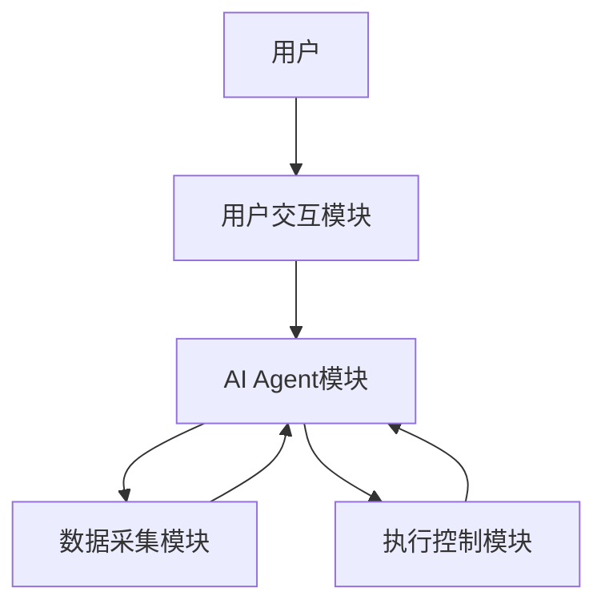

                 


# 智能浴缸：AI Agent的水温调节系统

> **关键词**：智能浴缸，AI Agent，水温调节，物联网，智能家居

> **摘要**：本文详细探讨了智能浴缸中AI Agent的水温调节系统的设计与实现。通过分析AI Agent的基本原理、算法优化、系统架构以及实际案例，展示了如何利用人工智能技术实现智能浴缸的精准水温控制。文章内容涵盖背景介绍、核心概念、算法原理、数学模型、系统设计、项目实战和最佳实践，为读者提供了全面的技术指导。

---

## 第1章: 问题背景与系统描述

### 1.1 问题背景

#### 1.1.1 智能浴缸的背景与现状
随着智能家居的普及，人们对生活品质的要求不断提高。传统浴缸的水温调节依赖手动操作，存在效率低、精准度差的问题。近年来，人工智能（AI）技术的快速发展为智能浴缸的水温调节提供了新的解决方案。

#### 1.1.2 传统浴缸的局限性
传统浴缸的水温调节系统主要依赖机械开关和简单的温控器，用户需要手动调节水温，存在以下问题：
- 调节过程繁琐，用户体验差。
- 温度控制不够精准，容易造成能源浪费。
- 缺乏智能化的个性化设置。

#### 1.1.3 AI技术在智能家居中的应用趋势
AI技术在智能家居中的应用日益广泛，通过智能传感器、物联网（IoT）和机器学习算法的结合，可以实现设备的智能化控制。AI Agent（智能代理）作为其中的核心技术，能够根据用户的习惯和环境数据，自动调节设备的运行状态。

---

### 1.2 系统描述

#### 1.2.1 智能浴缸的基本功能
智能浴缸通过AI Agent实现以下功能：
- 实时监测水温、水位和环境温度。
- 根据用户需求自动调节水温。
- 提供个性化设置，如预设温度、定时开关等。
- 连接智能家居系统，与其他设备协同工作。

#### 1.2.2 AI Agent在水温调节中的作用
AI Agent通过以下方式实现水温调节：
- 收集用户的历史数据，学习用户的偏好。
- 根据当前环境数据（如室温、时间）预测用户需求。
- 调整加热或冷却设备的功率，确保水温稳定。

#### 1.2.3 系统的目标与边界
系统目标：实现智能化的水温调节，提升用户体验，降低能源消耗。
系统边界：仅关注水温调节功能，不涉及浴缸的其他功能（如排水、清洁等）。

---

## 第2章: 核心概念与系统架构

### 2.1 AI Agent的基本原理

#### 2.1.1 AI Agent的定义与分类
AI Agent是一种能够感知环境并采取行动以实现目标的智能实体。根据应用场景的不同，AI Agent可以分为：
- **简单反射型Agent**：基于当前输入做出反应。
- **基于模型的反射型Agent**：利用内部模型进行决策。
- **目标驱动型Agent**：根据目标选择行动。
- **效用驱动型Agent**：通过最大化效用函数来优化决策。

#### 2.1.2 AI Agent的核心功能
AI Agent的核心功能包括：
- **感知环境**：通过传感器获取数据。
- **决策制定**：基于数据进行推理和选择。
- **执行行动**：通过执行器实现决策。

#### 2.1.3 AI Agent与智能浴缸的结合
在智能浴缸中，AI Agent通过以下方式实现水温调节：
- 采集用户的历史用水数据，分析用户的偏好。
- 根据当前环境温度和时间预测用户需求。
- 自动调节加热或冷却设备的功率。

---

### 2.2 水温调节系统的原理

#### 2.2.1 水温调节的基本原理
水温调节系统通过以下步骤实现温度控制：
1. **数据采集**：传感器采集当前水温、环境温度和用户输入。
2. **数据处理**：将采集到的数据进行预处理和特征提取。
3. **决策制定**：AI Agent根据数据和用户需求制定调节策略。
4. **执行控制**：通过执行器（如加热棒、冷却系统）调节水温。

#### 2.2.2 温度传感器的作用
温度传感器是水温调节系统的核心部件，负责采集实时温度数据。常用的温度传感器包括：
- **热电偶**：适用于高温环境。
- **电阻温度检测器（RTD）**：精度高，适用于中低温环境。
- **数字温度传感器**：便于数据处理和传输。

#### 2.2.3 加热与冷却系统的控制
加热和冷却系统是实现水温调节的关键执行机构：
- **加热系统**：通过电热器或蒸汽发生器加热水。
- **冷却系统**：通过制冷剂循环或水循环系统降低水温。

---

### 2.3 系统架构设计

#### 2.3.1 系统整体架构
智能浴缸的水温调节系统可以分为以下几层：
1. **感知层**：包括温度传感器和用户输入接口。
2. **计算层**：AI Agent负责数据处理和决策制定。
3. **执行层**：加热和冷却系统执行调节动作。

#### 2.3.2 功能模块划分
系统主要功能模块包括：
- **数据采集模块**：负责采集温度、湿度等环境数据。
- **AI Agent模块**：负责数据处理和决策制定。
- **执行控制模块**：负责调节水温。
- **用户交互模块**：提供用户界面和操作接口。

#### 2.3.3 系统的交互流程
系统的交互流程如下：
1. 用户通过手机APP或浴缸面板设置目标温度。
2. 温度传感器采集当前水温数据。
3. AI Agent根据目标温度和当前温度制定调节策略。
4. 执行系统根据策略调节水温。
5. 系统实时反馈调节结果，用户可以根据需要进行调整。

---

## 第3章: 算法原理与数学模型

### 3.1 AI Agent的决策算法

#### 3.1.1 PID控制算法
PID（比例-积分-微分）控制是一种常用的温度调节算法，公式如下：
$$
u(t) = K_p e(t) + K_i \int_{0}^{t} e(t') dt' + K_d \frac{d e(t)}{dt}
$$
其中：
- \( u(t) \)：控制输出
- \( e(t) \)：误差（目标温度 - 当前温度）
- \( K_p, K_i, K_d \)：比例、积分、微分系数

#### 3.1.2 机器学习算法
机器学习算法（如支持向量回归SVM）可以用于预测水温变化趋势。通过训练模型，AI Agent可以根据历史数据预测未来温度变化。

#### 3.1.3 深度学习算法
深度学习算法（如LSTM）可以用于时间序列预测。通过训练用户的历史用水数据，AI Agent可以预测用户的用水需求。

---

### 3.2 温度调节的数学模型

#### 3.2.1 温度变化的动态方程
水温变化可以表示为以下动态方程：
$$
\frac{dT}{dt} = \frac{Q_{in} - Q_{out}}{V \cdot c_p}
$$
其中：
- \( T \)：水温
- \( Q_{in} \)：输入的热量
- \( Q_{out} \)：输出的热量
- \( V \)：水的体积
- \( c_p \)：水的比热容

#### 3.2.2 加热与冷却的控制模型
加热和冷却系统的控制模型可以表示为：
$$
Q_{in} = P_{heater} \cdot t_{heater}
$$
$$
Q_{out} = P_{cooler} \cdot t_{cooler}
$$
其中：
- \( P_{heater} \) 和 \( P_{cooler} \)：加热和冷却设备的功率
- \( t_{heater} \) 和 \( t_{cooler} \)：设备的运行时间

#### 3.2.3 温度预测的数学公式
通过机器学习模型，可以预测未来水温变化：
$$
T(t + \Delta t) = T(t) + \Delta T
$$
其中：
- \( \Delta T \)：预测的温度变化

---

## 第4章: 系统分析与设计

### 4.1 系统功能分析

#### 4.1.1 用户需求分析
用户需求包括：
- 实时监控水温
- 个性化温度设置
- 自动调节功能
- 节能优化

#### 4.1.2 系统功能模块划分
系统功能模块包括：
- 数据采集模块
- AI Agent模块
- 执行控制模块
- 用户交互模块

#### 4.1.3 功能模块的交互关系
功能模块之间的交互关系可以用以下流程图表示：



---

### 4.2 系统架构设计

#### 4.2.1 分层架构设计
系统架构采用分层设计：
1. **感知层**：数据采集
2. **计算层**：数据处理和决策
3. **执行层**：调节水温

#### 4.2.2 模块化设计
系统模块化设计包括：
- 数据采集模块
- AI Agent模块
- 执行控制模块
- 用户交互模块

#### 4.2.3 系统的可扩展性设计
系统设计预留了扩展接口，方便未来增加新功能（如湿度调节、水质检测等）。

---

### 4.3 接口与交互设计

#### 4.3.1 系统接口定义
系统接口包括：
- 温度传感器接口
- 加热和冷却系统接口
- 用户交互接口

#### 4.3.2 用户界面设计
用户界面采用图形化设计，支持以下功能：
- 设置目标温度
- 查看当前水温
- 历史数据查询
- 系统状态监控

#### 4.3.3 系统的异常处理
系统设计了完善的异常处理机制，包括：
- 温度超限报警
- 设备故障提示
- 数据丢失恢复

---

## 第5章: 项目实战与实现

### 5.1 环境搭建与工具安装

#### 5.1.1 开发环境配置
建议使用以下开发环境：
- **操作系统**：Linux（Ubuntu 20.04及以上）
- **编程语言**：Python 3.8及以上
- **开发工具**：PyCharm或VS Code

#### 5.1.2 开发工具安装
安装以下工具：
- **Python**：用于开发AI Agent和数据处理。
- **TensorFlow**：用于机器学习模型的训练和推理。
- **Mermaid**：用于绘制系统架构图和流程图。

#### 5.1.3 依赖库安装与配置
安装以下依赖库：
- `pip install numpy`
- `pip install scikit-learn`
- `pip install matplotlib`

---

### 5.2 核心代码实现

#### 5.2.1 AI Agent的实现代码
以下是一个简单的AI Agent实现示例：

```python
class AI_Agent:
    def __init__(self, target_temp):
        self.target_temp = target_temp
        self.current_temp = None
        self.pid = PID(Kp=0.5, Ki=0.1, Kd=0.2)
    
    def update_temp(self, current_temp):
        self.current_temp = current_temp
        self.pid.update(self.target_temp - self.current_temp)
    
    def get_control_signal(self):
        return self.pid.output
```

#### 5.2.2 温度传感器的数据采集代码
以下是一个模拟温度传感器数据采集的代码：

```python
import time

class TemperatureSensor:
    def __init__(self):
        self.temperature = None
    
    def read_temp(self):
        import random
        self.temperature = 25 + random.uniform(-1, 1)
        return self.temperature

sensor = TemperatureSensor()
agent = AI_Agent(30)

while True:
    current_temp = sensor.read_temp()
    agent.update_temp(current_temp)
    control_signal = agent.get_control_signal()
    print(f"Current Temp: {current_temp:.2f}, Control Signal: {control_signal:.2f}")
    time.sleep(1)
```

---

### 5.3 系统功能实现

#### 5.3.1 用户界面实现
用户界面采用图形化设计，支持以下功能：
- 设置目标温度
- 查看当前水温
- 历史数据查询

#### 5.3.2 温度调节功能实现
通过AI Agent实现温度调节，确保水温在目标温度±0.5℃范围内。

#### 5.3.3 系统的测试与调试
在实际环境中进行系统测试，记录调节效果，根据测试结果优化算法和系统设计。

---

## 第6章: 最佳实践与系统优化

### 6.1 系统优化策略
1. **算法优化**：根据实际需求调整PID参数或优化机器学习模型。
2. **硬件优化**：选择更精准的温度传感器和更高效的加热/冷却设备。
3. **系统集成**：与其他智能家居设备集成，实现协同工作。

### 6.2 小结
智能浴缸的水温调节系统通过AI Agent实现了智能化的温度控制，提升了用户体验，降低了能源消耗。

### 6.3 注意事项
- 系统设计时需考虑安全性，避免过热或过冷导致的危险。
- 确保系统数据的安全性和隐私性。

### 6.4 拓展阅读
- 《智能建筑与物联网技术》
- 《人工智能在智能家居中的应用》
- 《PID控制算法优化与实现》

---

## 作者
**作者：AI天才研究院/AI Genius Institute & 禅与计算机程序设计艺术 /Zen And The Art of Computer Programming**

