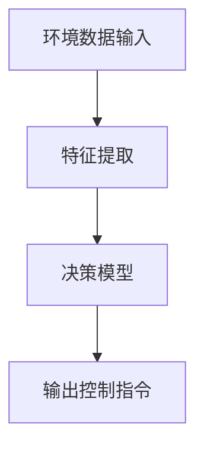
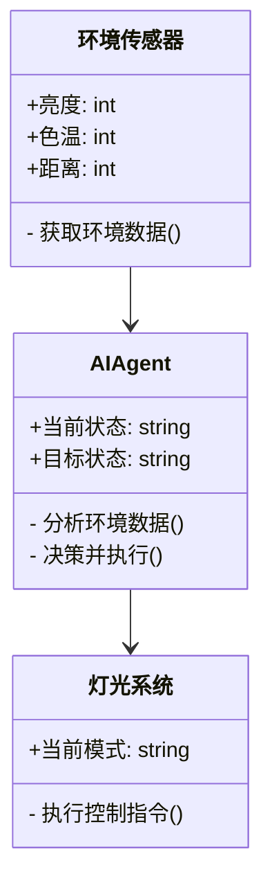
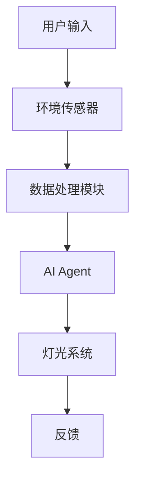

                 


# 智能灯光控制：AI Agent的情境感知系统

> 关键词：AI Agent，情境感知，智能灯光，物联网，智能家居

> 摘要：本文将详细介绍AI Agent在智能灯光控制中的应用，重点分析情境感知系统的核心原理、算法设计以及实际应用。通过结合传感器数据、数学模型和物联网技术，探索如何利用AI Agent实现更智能、更高效的灯光控制。

---

## 目录

### 第一部分: 智能灯光控制的背景与概念

#### 第1章: 智能灯光控制的背景介绍

##### 1.1 智能灯光控制的背景
- 1.1.1 灯光控制的历史演变
  - 从手动开关到自动化控制的演变
  - 智能家居的发展趋势
- 1.1.2 问题背景与挑战
  - 现有灯光控制系统的主要问题
  - 情境感知的需求
- 1.1.3 AI Agent在智能控制中的作用

##### 1.2 问题背景与问题描述
- 现有灯光控制系统的局限性
  - 无法适应动态环境
  - 缺乏智能化决策能力
- 情境感知的需求与挑战
  - 环境数据的多样性和复杂性
  - 实时性与准确性的平衡
- AI Agent在智能灯光控制中的应用前景
  - 提高用户体验
  - 优化能源效率

#### 第2章: AI Agent与情境感知系统的核心概念

##### 2.1 AI Agent的基本原理
- 2.1.1 AI Agent的定义与分类
  - 简单反射型Agent
  - 基于模型的反射型Agent
  - 目标驱动型Agent
  - 情境驱动型Agent
- 2.1.2 情境感知的核心要素
  - 环境数据采集
  - 数据分析与理解
  - 决策与反馈
- 2.1.3 AI Agent与情境感知的关系
  - AI Agent是情境感知的核心执行者
  - 情境感知为AI Agent提供决策依据

##### 2.2 情境感知系统的实体关系图
- 系统实体关系图


##### 2.3 系统的核心要素对比
| 核心要素 | 描述 | 属性 |
|----------|------|------|
| 环境传感器 | 感知环境数据 | 灵敏度、响应时间 |
| AI Agent | 处理数据并决策 | 学习能力、决策算法 |
| 灯光系统 | 执行控制 | 执行速度、能耗 |

### 第二部分: 算法原理与数学模型

#### 第3章: AI Agent的算法原理

##### 3.1 算法原理与流程图
- 算法流程图


##### 3.2 数学模型与公式
- 情境感知模型
$$ P(\text{状态}| \text{输入}) = \frac{P(\text{输入}| \text{状态})P(\text{状态})}{P(\text{输入})} $$
- 决策模型
$$ \text{输出} = \argmax_{\text{动作}} Q(\text{状态}, \text{动作}) $$

##### 3.3 代码实现示例
- 环境数据处理代码
```python
import numpy as np
from sklearn import preprocessing

# 示例环境数据
data = np.array([[25, 180],  # 亮度, 色温
                 [50, 255],
                 [70, 120]])

# 标准化处理
normalized_data = preprocessing.normalize(data)
print(normalized_data)
```

### 第三部分: 系统分析与架构设计

#### 第4章: 智能灯光控制系统架构

##### 4.1 系统架构设计
- 系统架构图


##### 4.2 功能设计
- 领域模型


##### 4.3 接口设计与交互流程
- 交互流程图


### 第四部分: 项目实战与案例分析

#### 第5章: 项目实战

##### 5.1 环境安装与配置
- 硬件设备安装
  - 环境传感器（如温湿度传感器、光照传感器）
  - 灯光系统（如智能灯泡、LED灯带）
- 软件环境配置
  - Python开发环境
  - 物联网平台（如MQTT协议）

##### 5.2 系统核心代码实现
- AI Agent算法实现
```python
class AIAgent:
    def __init__(self):
        self.current_state = "待机"
        self.target_state = "待机"

    def analyze_data(self, data):
        # 示例分析逻辑
        if data['亮度'] > 50 and data['色温'] < 300:
            self.target_state = "明亮模式"
        elif data['亮度'] < 30 and data['色温'] < 200:
            self.target_state = "柔和模式"

    def decide_action(self):
        if self.target_state == "明亮模式":
            return "提高亮度"
        elif self.target_state == "柔和模式":
            return "降低亮度"
        else:
            return "保持不变"
```

##### 5.3 案例分析与效果评估
- 实际案例分析
  - 场景1：用户进入房间时自动开启柔和灯光
  - 场景2：检测到高亮度时自动调节为明亮模式
- 效果评估
  - 用户满意度
  - 系统能耗分析
  - 系统响应时间

### 第五部分: 总结与展望

#### 第6章: 总结与展望

##### 6.1 小结
- AI Agent在智能灯光控制中的优势
  - 高效的环境感知能力
  - 自适应的决策能力
  - 实时的反馈机制

##### 6.2 注意事项与最佳实践
- 数据采集的准确性
- 算法的可扩展性
- 系统的安全性

##### 6.3 未来研究方向
- 更复杂的环境感知模型
- 更高效的决策算法
- 多设备协同优化

---

## 作者

作者：AI天才研究院/AI Genius Institute & 禅与计算机程序设计艺术 /Zen And The Art of Computer Programming

