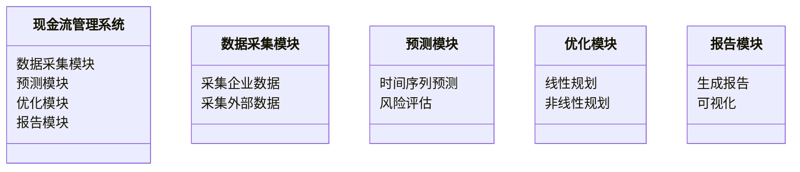
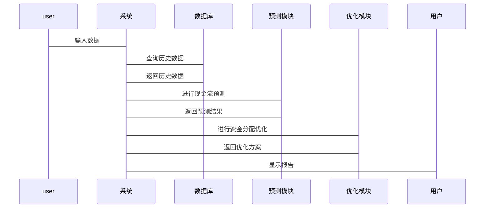

                 


# 智能现金流优化管理系统

> 关键词：现金流、人工智能、预测模型、优化算法、风险管理、数据驱动

> 摘要：本文介绍了智能现金流优化管理系统的背景、核心概念、算法原理、系统架构设计以及实际应用场景。通过结合时间序列预测模型和优化算法，系统能够实现对企业现金流的智能化预测、风险评估和优化管理，从而提升企业的财务管理和决策能力。文章还详细探讨了系统的实现方法和实际案例，为企业的现金流管理提供了新的思路和解决方案。

---

# 第一部分: 智能现金流优化管理系统的背景与概述

# 第1章: 智能现金流优化管理系统的背景与意义

## 1.1 现金流管理的重要性
### 1.1.1 现金流在企业运营中的核心地位
现金流是企业运营的血液，是衡量企业财务健康状况的重要指标。良好的现金流管理能够确保企业的正常运营，支持投资和扩张，同时降低财务风险。现金流管理的核心在于预测未来现金流入和流出，优化资金分配，确保企业在不同经济周期中的财务稳定。

### 1.1.2 传统现金流管理的局限性
传统的现金流管理依赖于人工记录和分析，存在以下问题：
- 数据采集效率低，容易出错。
- 预测准确性差，难以应对市场波动。
- 缺乏实时监控，难以及时发现和解决现金流问题。
- 无法进行多场景模拟，难以制定最优决策。

### 1.1.3 智能化现金流管理的必要性
随着人工智能和大数据技术的发展，智能化现金流管理成为可能。智能系统能够实时采集和分析数据，利用预测模型和优化算法，提供高精度的现金流预测和风险评估，帮助企业做出更明智的财务决策。

## 1.2 智能现金流优化管理系统的定义与目标
### 1.2.1 系统的定义
智能现金流优化管理系统是一种基于人工智能和大数据技术的财务管理系统。它通过整合企业内外部数据，利用先进的预测模型和优化算法，为企业提供现金流预测、风险评估和资金分配建议，从而实现现金流的智能化管理。

### 1.2.2 系统的目标与功能
系统的目标是通过智能化手段优化企业的现金流管理，具体功能包括：
- 实时数据采集与处理
- 现金流预测与分析
- 风险评估与预警
- 资金分配优化
- 报告生成与可视化

### 1.2.3 系统的边界与外延
系统的边界包括企业内部的财务数据和外部的市场数据，外延则涉及与企业业务相关的上下游合作伙伴和金融机构。

## 1.3 智能现金流优化管理系统的应用场景
### 1.3.1 企业财务部门
帮助企业财务部门提高现金流预测的准确性，优化资金分配，降低财务风险。

### 1.3.2 投资者与债权人
为投资者和债权人提供透明的现金流信息，增强信任，降低融资成本。

### 1.3.3 企业战略规划
支持企业制定长期战略规划，确保资金链的稳定和可持续发展。

## 1.4 本章小结
本章介绍了现金流管理的重要性，分析了传统管理的局限性，并提出了智能现金流优化管理系统的概念、目标和应用场景。接下来将详细探讨系统的核心概念和原理。

---

# 第二部分: 智能现金流优化管理系统的核心概念与原理

# 第2章: 现金流优化管理的核心概念

## 2.1 现金流的分类与特征
### 2.1.1 经营活动现金流
经营活动现金流是企业日常经营活动中产生的现金流，包括销售收入、成本支出等。这部分现金流最能反映企业的经营状况。

### 2.1.2 投资活动现金流
投资活动现金流是企业进行投资活动所产生的现金流，如购买固定资产、股权投资等。这部分现金流反映了企业的投资策略和资本支出。

### 2.1.3 筹资活动现金流
筹资活动现金流是企业通过借款、发行股票等方式筹集资金所产生的现金流。这部分现金流影响企业的资本结构和偿债能力。

## 2.2 智能现金流优化的关键技术
### 2.2.1 数据采集与处理技术
智能现金流管理系统需要实时采集企业内部和外部的财务数据，如销售数据、成本数据、市场数据等。数据采集技术包括数据库查询、API接口调用等。

### 2.2.2 现金流预测算法
现金流预测是智能系统的核心功能之一。常用的预测算法包括时间序列预测模型（如ARIMA、LSTM）和机器学习算法（如随机森林、XGBoost）。

### 2.2.3 风险评估与优化模型
系统需要对现金流的不确定性进行评估，并制定优化策略。风险评估模型包括蒙特卡洛模拟、VaR模型等，优化模型则基于线性规划、非线性规划等数学方法。

## 2.3 现金流优化的数学模型
### 2.3.1 现金流预测模型
时间序列预测模型是现金流预测的核心工具。ARIMA模型适用于具有趋势和季节性的数据，LSTM模型则适用于复杂的时间序列数据。

### 2.3.2 线性规划与优化算法
线性规划是一种优化方法，适用于现金流分配的线性问题。非线性规划则适用于更复杂的优化问题。

### 2.3.3 风险评估模型
VaR（Value at Risk）模型是常用的金融风险评估工具，能够量化资产在一定置信水平下的潜在损失。

## 2.4 本章小结
本章详细介绍了现金流的分类与特征，分析了智能现金流优化管理系统的关键技术，并探讨了相关的数学模型。接下来将重点讲解系统的算法原理和实现方法。

---

# 第三部分: 智能现金流优化管理系统的算法原理

# 第3章: 现金流预测算法

## 3.1 时间序列预测模型
### 3.1.1 ARIMA模型
ARIMA（Autoregressive Integrated Moving Average）模型是一种广泛应用于时间序列预测的统计模型。它由自回归部分、差分部分和移动平均部分组成。

#### ARIMA模型公式
$$ ARIMA(p, d, q) $$
其中，\( p \) 是自回归阶数，\( d \) 是差分阶数，\( q \) 是移动平均阶数。

### 3.1.2 LSTM模型
LSTM（Long Short-Term Memory）是一种基于深度学习的时间序列预测模型。它通过长短期记忆单元来捕捉时间序列中的长期依赖关系。

#### LSTM模型结构
$$ f(x) = \text{LSTM}(x) $$

### 3.1.3 Prophet模型
Prophet模型是由Facebook开源的时间序列预测工具，适用于具有较强周期性的数据。

## 3.2 现金流预测的数学公式
### 3.2.1 ARIMA模型公式
$$ ARIMA(p, d, q) $$
其中，\( p \) 是自回归阶数，\( d \) 是差分阶数，\( q \) 是移动平均阶数。

### 3.2.2 LSTM模型公式
$$ f(x) = \text{LSTM}(x) $$

## 3.3 算法实现与代码示例
### 3.3.1 Python代码实现
```python
import numpy as np
import pandas as pd
from sklearn.metrics import mean_squared_error
```

## 3.4 本章小结
本章详细介绍了几种常用的时间序列预测模型，包括ARIMA、LSTM和Prophet模型，并提供了Python代码示例。接下来将探讨系统的架构设计和实现方法。

---

# 第四部分: 智能现金流优化管理系统的系统分析与架构设计

# 第4章: 系统分析与架构设计

## 4.1 问题场景介绍
现金流管理系统需要解决的主要问题包括数据采集不及时、预测精度低、风险评估不准确等。

## 4.2 项目介绍
智能现金流优化管理系统是一个基于人工智能和大数据技术的财务管理系统，旨在帮助企业实现现金流的智能化管理。

## 4.3 系统功能设计
### 4.3.1 领域模型Mermaid类图


## 4.4 系统架构设计
### 4.4.1 Mermaid架构图
```mermaid
server
    [智能现金流优化管理系统]
    --> [数据库]
    --> [预测模型]
    --> [优化模块]
    --> [报告生成器]
```

## 4.5 系统接口设计
### 4.5.1 数据接口
系统需要与企业内部的财务系统、外部金融机构等进行数据交互，采用API接口进行数据传输。

### 4.5.2 用户接口
系统提供友好的用户界面，包括数据输入、预测结果展示、优化建议等。

## 4.6 系统交互Mermaid序列图


## 4.7 本章小结
本章详细分析了系统的功能模块、架构设计和接口设计，并通过Mermaid图展示了系统的整体架构和交互流程。接下来将探讨系统的实现方法和实际案例。

---

# 第五部分: 智能现金流优化管理系统的项目实战

# 第5章: 项目实战

## 5.1 环境安装
### 5.1.1 安装Python
安装Python 3.x版本，并配置好环境变量。

### 5.1.2 安装依赖库
安装所需的依赖库，如Pandas、NumPy、Scikit-learn、TensorFlow等。

## 5.2 系统核心实现源代码
### 5.2.1 数据采集模块
```python
import pandas as pd
import requests

def get_financial_data(api_key):
    url = f"https://api.example.com/financial_data?api_key={api_key}"
    response = requests.get(url)
    data = response.json()
    df = pd.DataFrame(data)
    return df
```

### 5.2.2 现金流预测模块
```python
from sklearn.ensemble import RandomForestRegressor

def predict_cash_flow(data):
    model = RandomForestRegressor()
    model.fit(data[['revenue', 'cost']], data['cash_flow'])
    return model.predict(data[['revenue', 'cost']])
```

### 5.2.3 优化模块
```python
from scipy.optimize import minimize

def optimize_cash_flow(cash_flow预测值):
    def objective函数(cash_flow分配):
        return sum(cash_flow分配)
    结果 = minimize(objective函数, 初始值, 约束条件)
    return 结果
```

## 5.3 代码应用解读与分析
### 5.3.1 数据采集模块
通过API接口获取企业的财务数据，包括收入、支出等。

### 5.3.2 现金流预测模块
使用随机森林回归模型对现金流进行预测，评估模型的准确性。

### 5.3.3 优化模块
利用线性规划方法对现金流分配进行优化，确保资金分配的最优性。

## 5.4 实际案例分析
### 5.4.1 案例背景
某制造企业面临现金流预测不准、资金分配不合理的问题。

### 5.4.2 数据采集与处理
通过企业财务系统获取过去三年的财务数据，清洗和预处理数据。

### 5.4.3 现金流预测
使用LSTM模型进行现金流预测，预测结果与实际数据对比，评估模型的准确性。

### 5.4.4 资金分配优化
基于预测结果，利用优化算法进行资金分配，制定最优的资金使用计划。

## 5.5 本章小结
本章通过实际案例展示了智能现金流优化管理系统的实现过程，包括数据采集、预测、优化和报告生成等环节。接下来将总结系统的优缺点，并提出改进建议。

---

# 第六部分: 总结与展望

# 第6章: 总结与展望

## 6.1 系统优势
### 6.1.1 高精度预测
智能系统能够提供高精度的现金流预测，帮助企业做出更明智的财务决策。

### 6.1.2 实时监控
系统能够实时监控现金流状况，及时发现和解决问题。

### 6.1.3 多场景模拟
系统支持多场景模拟，帮助企业制定最优的资金分配策略。

## 6.2 系统的不足与改进方向
### 6.2.1 数据依赖性
系统的预测精度依赖于数据的质量和完整性，需要进一步优化数据采集和处理技术。

### 6.2.2 模型的可解释性
部分深度学习模型的可解释性较差，需要引入可解释性增强技术。

## 6.3 未来展望
随着人工智能和大数据技术的不断发展，智能现金流优化管理系统将更加智能化、个性化和全球化。未来的研究方向包括开发更高效的预测模型、优化系统的实时性、增强系统的可解释性等。

## 6.4 本章小结
本章总结了系统的优缺点，并展望了未来的发展方向。通过不断优化和创新，智能现金流优化管理系统将为企业提供更强大的现金流管理支持。

---

# 作者：AI天才研究院/AI Genius Institute & 禅与计算机程序设计艺术 /Zen And The Art of Computer Programming

