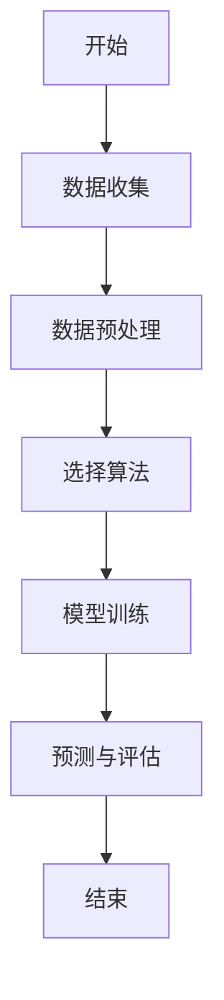
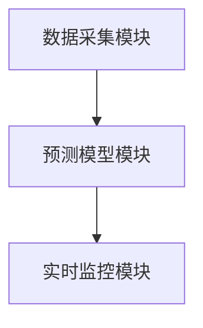

                 


# 智能现金流管理系统

## 关键词：智能现金流管理, AI技术, 大数据, 现金流预测, 系统架构

## 摘要：智能现金流管理系统是一种利用人工智能和大数据技术优化现金流管理的创新系统。本文将从现金流管理的基本概念、智能化管理的必要性、智能系统的算法原理、系统架构设计以及实际项目实现等方面进行详细阐述，帮助读者全面理解智能现金流管理的核心思想和实际应用。

---

# 第1章: 智能现金流管理的背景与意义

## 1.1 现金流管理的重要性

### 1.1.1 现金流管理的基本概念

现金流管理是企业财务管理的核心内容之一，涉及企业现金流入和流出的预测、监控和优化。有效的现金流管理能够确保企业的资金流动性，降低财务风险，支持企业的正常运营和发展。

$$ 现金流的公式表示为：CF = \text{现金流入} - \text{现金流出} $$

### 1.1.2 现金流管理在企业中的作用

现金流管理在企业中的作用包括：

1. **支持日常运营**：确保企业有足够的资金支付日常开支。
2. **优化资金配置**：合理分配资金，提高资金使用效率。
3. **降低财务风险**：通过预测和监控现金流，提前识别潜在的财务问题。
4. **支持战略决策**：为企业投资、融资等重大决策提供数据支持。

### 1.1.3 智能化管理的必要性

随着企业规模的扩大和市场环境的复杂化，传统的现金流管理方法逐渐暴露出以下问题：

1. **数据量大**：现代企业面临海量数据，人工处理效率低。
2. **预测精度低**：传统方法依赖经验判断，预测不够准确。
3. **实时性不足**：无法实现对现金流的实时监控和快速响应。

智能化管理通过引入人工智能和大数据技术，能够显著提升现金流管理的效率和准确性。

---

## 1.2 传统现金流管理的局限性

### 1.2.1 传统现金流管理的流程

传统现金流管理的流程通常包括以下几个步骤：

1. 数据收集：通过财务报表、银行对账单等获取现金流数据。
2. 数据整理：对数据进行分类和汇总。
3. 预测分析：基于历史数据进行简单预测。
4. 监控与调整：定期检查现金流状况并进行调整。

### 1.2.2 传统方法的不足

传统方法的不足主要体现在以下几个方面：

1. **数据处理效率低**：人工处理数据耗时且容易出错。
2. **预测精度有限**：基于简单的历史数据分析，预测结果不够准确。
3. **缺乏实时性**：无法实时监控现金流变化，难以及时应对突发事件。

### 1.2.3 数据量与复杂性带来的挑战

随着企业规模的扩大和业务的复杂化，现金流管理面临以下挑战：

1. **数据量大**：企业每天产生的现金流数据可能以GB级计。
2. **数据维度多**：需要考虑时间、金额、来源等多个维度。
3. **数据质量参差不齐**：数据可能存在缺失、错误等问题。

---

## 1.3 智能现金流管理的变革

### 1.3.1 AI与大数据技术的引入

人工智能和大数据技术的引入，为现金流管理带来了新的可能性。通过机器学习算法，系统能够从海量数据中提取有价值的信息，实现精准的预测和优化。

### 1.3.2 智能化管理的优势

智能化管理的优势包括：

1. **高效性**：通过自动化处理，显著提高数据处理效率。
2. **准确性**：基于机器学习算法，预测结果更加精准。
3. **实时性**：能够实时监控现金流变化，及时应对突发事件。

### 1.3.3 行业应用的前景

智能化现金流管理的应用前景广阔，能够帮助企业在以下方面实现优化：

1. **投资决策**：通过现金流预测，帮助企业做出更科学的投资决策。
2. **风险控制**：提前识别潜在的财务风险，降低企业的财务风险。
3. **资金配置**：优化资金配置，提高资金使用效率。

---

## 1.4 本章小结

本章从现金流管理的基本概念、传统方法的局限性以及智能化管理的必要性等方面进行了详细阐述，为后续章节的讨论奠定了基础。

---

# 第2章: 智能现金流管理的核心概念

## 2.1 现金流管理的基本要素

### 2.1.1 现金流的来源与类型

现金流的来源包括营业收入、投资活动和筹资活动。常见的现金流类型包括：

1. **经营活动现金流**：来自企业日常经营的现金流入和流出。
2. **投资活动现金流**：来自投资活动的现金流入和流出。
3. **筹资活动现金流**：来自筹资活动的现金流入和流出。

### 2.1.2 现金流的时间价值

现金流的时间价值是指资金随着时间的推移而产生的价值变化。可以通过现值和终值公式进行计算：

$$ PV = \frac{FV}{(1 + r)^n} $$

其中，PV为现值，FV为终值，r为折现率，n为时间期限。

### 2.1.3 现金流的预测与控制

现金流的预测与控制是现金流管理的核心内容，主要包括以下步骤：

1. **数据收集与整理**：收集历史现金流数据，并进行清洗和整理。
2. **模型建立**：选择合适的预测模型，如ARIMA、LSTM等。
3. **预测与分析**：基于模型进行预测，并对预测结果进行分析。
4. **监控与调整**：实时监控现金流变化，根据实际情况进行调整。

---

## 2.2 智能管理的核心原理

### 2.2.1 数据驱动的决策

智能现金流管理通过数据驱动的决策，能够实现更精准的预测和优化。数据驱动的决策主要包括以下几个步骤：

1. **数据收集**：通过各种渠道收集现金流数据。
2. **数据处理**：对数据进行清洗、转换和整合。
3. **数据分析**：通过机器学习算法对数据进行分析，提取有价值的信息。
4. **决策支持**：基于分析结果，提供决策支持。

### 2.2.2 AI算法的预测能力

人工智能算法在现金流预测中的应用非常广泛，主要包括以下几种算法：

1. **ARIMA模型**：一种时间序列分析模型，适用于具有趋势和季节性的数据。
2. **LSTM网络**：一种循环神经网络，适用于时间序列预测，能够捕捉长期依赖关系。
3. **随机森林**：一种基于决策树的集成算法，适用于非线性数据。

---

## 2.3 核心概念对比分析

### 2.3.1 传统方法与智能方法的对比

以下是对传统方法与智能方法的对比分析：

| 对比维度         | 传统方法                          | 智能方法                          |
|------------------|-----------------------------------|-----------------------------------|
| 数据处理效率     | 低                                | 高                                |
| 预测精度         | 低                                | 高                                |
| 实时性           | 低                                | 高                                |
| 适应性           | 差                                | 好                                |

### 2.3.2 数据量与预测精度的关系

数据量与预测精度的关系可以通过以下表格进行分析：

| 数据量   | 预测精度   |
|----------|------------|
| 小       | 低          |
| 中       | 中          |
| 大       | 高          |

### 2.3.3 系统响应速度的优化

系统响应速度的优化可以通过以下步骤实现：

1. **优化算法**：选择高效的算法，减少计算时间。
2. **优化数据结构**：使用高效的数据结构，提高数据处理速度。
3. **优化系统架构**：采用分布式架构，提高系统的响应速度。

---

## 2.4 本章小结

本章从现金流管理的基本要素、智能管理的核心原理以及核心概念的对比分析等方面进行了详细阐述，帮助读者更好地理解智能现金流管理的核心思想。

---

# 第3章: 智能现金流管理的算法原理

## 3.1 现金流预测模型

### 3.1.1 时间序列分析

时间序列分析是一种基于历史数据预测未来趋势的方法。常用的模型包括ARIMA和LSTM。

### 3.1.2 线性回归模型

线性回归模型是一种简单的预测模型，适用于线性关系的数据。

### 3.1.3 长短期记忆网络（LSTM）

LSTM是一种循环神经网络，适用于时间序列预测，能够捕捉长期依赖关系。

---

## 3.2 现金流预测的数学模型

### 3.2.1 时间序列模型的公式

ARIMA模型的公式为：

$$ ARIMA(p, d, q) $$

其中，p为自回归阶数，d为差分阶数，q为移动平均阶数。

### 3.2.2 LSTM网络结构

LSTM网络的结构包括输入门、遗忘门和输出门。

---

## 3.3 算法实现的流程图

以下是一个简单的现金流预测算法实现流程图：



---

## 3.4 本章小结

本章从现金流预测模型、数学模型以及算法实现的流程图等方面进行了详细阐述，帮助读者更好地理解智能现金流管理的算法原理。

---

# 第4章: 系统架构与设计

## 4.1 系统整体架构

智能现金流管理系统的整体架构包括以下几个部分：

1. **数据采集模块**：负责采集现金流数据。
2. **预测模型模块**：负责基于历史数据进行预测。
3. **实时监控模块**：负责实时监控现金流变化。

---

## 4.2 功能模块设计

### 4.2.1 数据采集模块

数据采集模块的主要功能包括：

1. **数据接口**：与企业财务系统对接，获取现金流数据。
2. **数据清洗**：对数据进行清洗和预处理。

### 4.2.2 预测模型模块

预测模型模块的主要功能包括：

1. **模型训练**：基于历史数据训练预测模型。
2. **预测与评估**：基于训练好的模型进行预测，并对预测结果进行评估。

### 4.2.3 实时监控模块

实时监控模块的主要功能包括：

1. **实时监控**：实时监控现金流变化，及时发现异常情况。
2. **预警机制**：当现金流出现异常时，触发预警机制。

---

## 4.3 系统架构图

以下是一个简单的系统架构图：



---

## 4.4 本章小结

本章从系统整体架构、功能模块设计以及系统架构图等方面进行了详细阐述，帮助读者更好地理解智能现金流管理的系统架构设计。

---

# 第5章: 项目实战与实现

## 5.1 环境搭建与数据准备

### 5.1.1 环境搭建

以下是环境搭建的步骤：

1. **安装Python**：安装Python 3.8及以上版本。
2. **安装依赖库**：安装numpy、pandas、scikit-learn等依赖库。
3. **安装Jupyter Notebook**：用于数据可视化和模型训练。

### 5.1.2 数据准备

数据准备的步骤包括：

1. **数据收集**：从企业财务系统中获取现金流数据。
2. **数据清洗**：对数据进行清洗和预处理。
3. **数据分割**：将数据分割为训练集和测试集。

---

## 5.2 系统核心实现

### 5.2.1 数据预处理

以下是数据预处理的代码示例：

```python
import pandas as pd
import numpy as np

# 读取数据
data = pd.read_csv('cash_flow.csv')

# 数据清洗
data.dropna(inplace=True)
data = data[~data['date'].isnull()]
data = data[~data['amount'].isnull()]

# 数据分割
train_data = data.iloc[:700]
test_data = data.iloc[700:]
```

### 5.2.2 模型训练

以下是模型训练的代码示例：

```python
from sklearn.

