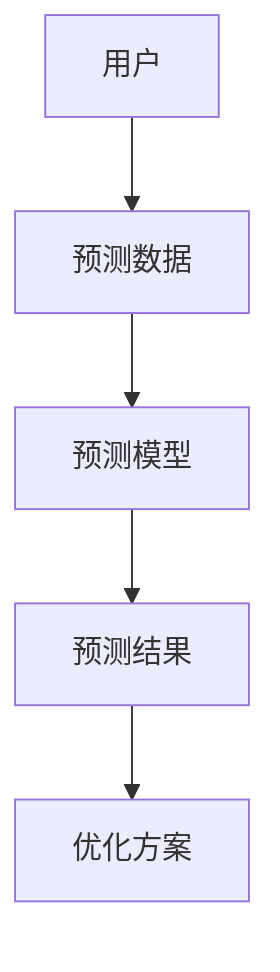
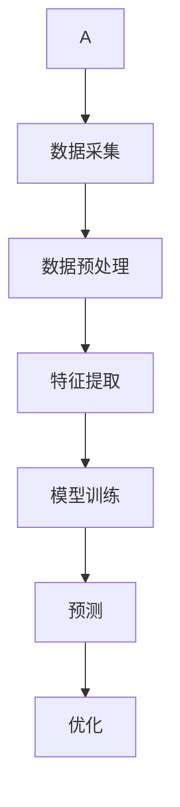
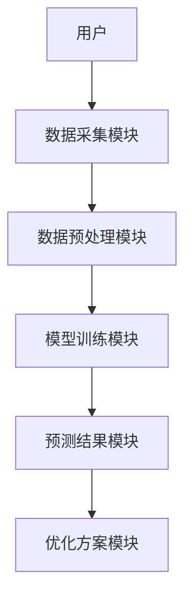

                 


# 智能现金流预测与优化管理平台

## 关键词：现金流预测，智能预测，机器学习，时间序列分析，现金流优化，企业财务管理

## 摘要：  
本文详细介绍智能现金流预测与优化管理平台的构建与应用。通过分析传统现金流预测方法的局限性，提出基于机器学习和时间序列分析的智能预测模型，并结合实际应用场景，展示如何通过系统架构设计和优化策略实现高效、准确的现金流预测与管理。文章从背景、原理、算法、系统架构到项目实战，全面阐述智能现金流预测的核心技术与实现路径。

---

## 第一章：智能现金流预测的背景与意义

### 1.1 现金流预测的传统方法与局限性
传统现金流预测主要依赖于财务人员的经验和简单的统计方法，例如线性回归和简单的趋势分析。这种方法存在以下问题：
- 数据采集和处理效率低，难以应对海量数据。
- 预测精度有限，无法捕捉复杂市场环境中的波动性。
- 缺乏实时性和动态调整能力，难以应对快速变化的市场条件。

### 1.2 智能现金流预测的提出与必要性
随着人工智能和大数据技术的发展，智能现金流预测逐渐成为可能。智能预测通过机器学习算法，能够更好地捕捉数据中的复杂模式，提供更精准的预测结果。智能预测的必要性体现在以下几个方面：
- 提高预测精度，降低企业财务风险。
- 实现预测结果的动态优化，适应市场变化。
- 提升财务管理效率，为企业决策提供数据支持。

### 1.3 智能现金流预测管理平台的定义与目标
智能现金流预测管理平台是以人工智能技术为核心的预测系统，旨在通过数据采集、分析和建模，实现对现金流的智能预测和优化管理。其目标包括：
- 提供高精度的现金流预测结果。
- 自动生成优化方案，帮助企业合理分配资金。
- 提供风险预警机制，降低财务风险。

---

## 第二章：智能现金流预测的核心概念与联系

### 2.1 现金流预测的核心要素与属性
现金流预测的核心要素包括：
- **现金流来源**：销售收入、投资收益等。
- **时间维度**：按日、周、月、季度或年度进行预测。
- **预测模型**：基于时间序列分析或机器学习算法。

| 核心要素 | 属性特征 | 示例 |
|----------|-----------|------|
| 现金流来源 | 可预测性 | 销售收入 |
| 时间维度 | 精度要求 | 月度预测 |
| 预测模型 | 方法复杂度 | LSTM网络 |

### 2.2 智能预测的原理与技术框架
智能预测的原理基于机器学习和时间序列分析。技术框架包括数据预处理、特征提取、模型训练、预测和优化。

### 2.3 实体关系图与流程图
以下是现金流预测的核心实体关系图：



流程图如下：



---

## 第三章：智能现金流预测的技术基础

### 3.1 数据采集与预处理
数据采集是智能预测的第一步，包括从企业财务系统、市场数据源等渠道获取数据。预处理步骤包括数据清洗、特征工程和数据标准化。

### 3.2 数据分析与可视化
通过数据可视化工具（如Matplotlib、Tableau）分析现金流的波动性、周期性等特征，为模型选择提供依据。

### 3.3 数据分析与可视化代码示例
```python
import matplotlib.pyplot as plt
import pandas as pd

# 假设df为现金流数据
df['现金流'].plot(kind='line', figsize=(10,6))
plt.title('现金流时间序列')
plt.xlabel('时间')
plt.ylabel('现金流')
plt.show()
```

---

## 第四章：智能现金流预测算法实现

### 4.1 时间序列分析
时间序列分析是现金流预测的重要方法，常用的模型包括ARIMA和Prophet。

#### ARIMA模型
ARIMA（自回归积分滑动平均模型）的数学公式为：
$$ ARIMA(p, d, q) $$
其中，p为自回归阶数，d为差分阶数，q为移动平均阶数。

#### Prophet模型
Prophet模型的数学公式为：
$$ y(t) = y_{\text{trend}}(t) + y_{\text{seasonal}}(t) + \epsilon_t $$

### 4.2 机器学习模型
机器学习模型包括随机森林、XGBoost和LSTM网络。以下为LSTM模型的代码示例：

```python
from tensorflow.keras.layers import LSTM, Dense
from tensorflow.keras.models import Sequential

model = Sequential()
model.add(LSTM(64, input_shape=(timesteps, features)))
model.add(Dense(1))
model.compile(optimizer='adam', loss='mse')
```

---

## 第五章：智能现金流预测系统架构设计

### 5.1 系统功能模块
系统功能模块包括数据采集、数据预处理、模型训练、预测结果展示和优化方案生成。

### 5.2 系统架构图


---

## 第六章：智能现金流预测的项目实战

### 6.1 项目环境搭建
需要安装以下库：
- Python
- TensorFlow
- Pandas
- Matplotlib
- Scikit-learn

### 6.2 数据准备与模型实现
以下为数据准备和模型实现的代码示例：

```python
import pandas as pd
from sklearn.model_selection import train_test_split
from sklearn.ensemble import RandomForestRegressor
import joblib

# 数据准备
df = pd.read_csv('cash_flow.csv')
X = df.drop('cash_flow', axis=1)
y = df['cash_flow']

# 数据分割
X_train, X_test, y_train, y_test = train_test_split(X, y, test_size=0.2)

# 模型训练
model = RandomForestRegressor()
model.fit(X_train, y_train)

# 模型保存
joblib.dump(model, 'cash_flow_model.pkl')
```

### 6.3 模型优化与部署
通过交叉验证和超参数调优优化模型性能，并将其部署到生产环境中。

---

## 第七章：智能现金流预测的总结与展望

### 7.1 项目总结
智能现金流预测管理平台通过机器学习和时间序列分析，显著提高了预测精度和效率，为企业财务管理提供了有力支持。

### 7.2 行业趋势与未来研究方向
未来的研究方向包括更复杂的模型（如Transformer）、多模态数据融合和实时预测技术。

### 7.3 最佳实践 tips
- 数据质量是预测精度的基础，需重视数据清洗和特征工程。
- 模型部署后需定期更新，以适应数据分布的变化。

### 7.4 作者寄语
智能现金流预测是企业数字化转型的重要一步，未来将有更广阔的应用场景。

---

## 作者：AI天才研究院 & 禅与计算机程序设计艺术

