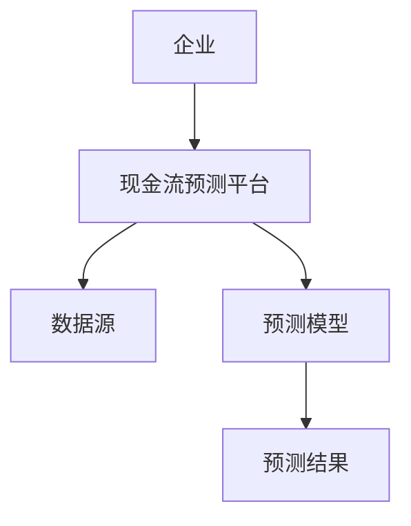
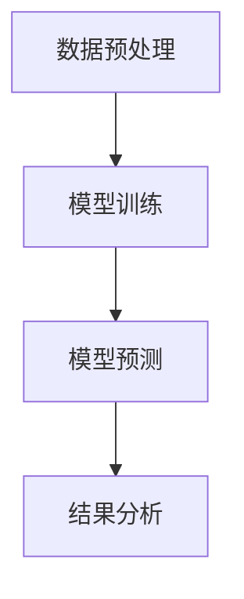

                 


# 智能现金流预测与管理平台

## 关键词：
智能现金流预测，人工智能，大数据分析，时间序列预测，机器学习，财务管理系统

## 摘要：
智能现金流预测与管理平台是一种结合人工智能和大数据分析技术的财务管理系统，旨在通过智能算法和预测模型，帮助企业实现现金流的精准预测和高效管理。本文将从现金流预测的核心算法、系统架构设计、项目实战等方面详细阐述智能现金流预测与管理平台的实现过程，为读者提供全面的技术解析。

---

# 第1章 智能现金流预测与管理平台概述

## 1.1 现金流预测与管理的重要性

### 1.1.1 现金流预测的核心意义
现金流是企业财务健康的重要指标，直接关系到企业的生存与发展。现金流预测可以帮助企业提前规划资金使用，优化资源配置，降低财务风险。传统的现金流预测方法依赖人工经验，效率低且精度有限，难以应对复杂多变的市场环境。

### 1.1.2 传统现金流管理的局限性
传统现金流管理主要依赖财务人员的经验和历史数据，存在以下问题：
- 数据采集繁琐，人工处理效率低；
- 预测模型简单，难以捕捉复杂的时间序列特征；
- 缺乏实时性，无法快速响应市场变化。

### 1.1.3 智能化现金流管理的必要性
随着人工智能和大数据技术的快速发展，智能化现金流预测与管理成为可能。通过机器学习算法和大数据分析，企业可以实现高精度、实时化的现金流预测，提升财务管理水平。

## 1.2 智能现金流预测与管理平台的定义

### 1.2.1 平台的核心功能
智能现金流预测与管理平台的核心功能包括：
- 数据采集与预处理；
- 现金流预测模型训练；
- 预测结果展示与分析；
- 预测结果的应用与优化。

### 1.2.2 平台的技术实现特点
- 结合时间序列分析和机器学习算法；
- 支持多数据源的集成与分析；
- 提供实时预测和可视化展示。

### 1.2.3 平台的用户群体与应用场景
平台主要面向企业财务部门、金融机构等，适用于以下场景：
- 企业现金流规划与预算管理；
- 金融投资决策支持；
- 供应链金融风险评估。

## 1.3 智能现金流预测与管理平台的背景

### 1.3.1 企业财务管理的数字化转型
随着企业数字化转型的推进，传统的财务管理方式逐渐被智能化工具取代，现金流预测成为企业数字化转型的重要组成部分。

### 1.3.2 AI与大数据技术的快速发展
人工智能和大数据技术的成熟为企业提供了强大的技术支撑，使得智能现金流预测成为可能。

### 1.3.3 现金流预测的行业需求
在金融、制造、零售等行业，现金流预测需求旺盛，企业希望通过智能化手段提升财务管理水平。

## 1.4 平台的边界与外延

### 1.4.1 现金流预测的边界条件
现金流预测的边界条件包括数据的完整性、模型的适用性、预测的时窗长度等。

### 1.4.2 平台功能的扩展性
平台功能可以扩展至预算管理、资金调拨、风险预警等领域。

### 1.4.3 与其他财务系统的集成
平台需要与企业的ERP系统、财务管理系统等进行集成，实现数据共享和业务协同。

## 1.5 核心概念与联系

### 1.5.1 现金流预测的数学模型
现金流预测的数学模型包括时间序列模型和机器学习模型。

### 1.5.2 数据流与预测结果的关系
数据流是预测结果的基础，预测结果是数据流的延伸和优化。

### 1.5.3 平台的实体关系图


## 1.6 本章小结
本章介绍了智能现金流预测与管理平台的重要性和背景，阐述了平台的核心功能和技术特点，明确了平台的应用场景和边界条件。

---

# 第2章 现金流预测的核心算法与模型

## 2.1 现金流预测的数学模型

### 2.1.1 时间序列分析模型
时间序列分析模型是现金流预测的重要工具，包括ARIMA、GARCH等模型。

### 2.1.2 线性回归模型
线性回归模型适用于简单的现金流预测场景，但难以捕捉复杂的时间序列特征。

### 2.1.3 非线性模型的应用
非线性模型（如LSTM）在捕捉时间序列的非线性特征方面表现优异。

## 2.2 常见的现金流预测算法

### 2.2.1 ARIMA模型
ARIMA模型是一种常用的时间序列预测方法，适用于具有趋势和季节性特征的数据。

### 2.2.2 LSTM模型
LSTM模型是一种基于循环神经网络的时间序列预测方法，适用于复杂的时间序列数据。

### 2.2.3 时间序列树模型
时间序列树模型是一种基于决策树的预测方法，适用于分类和预测的结合场景。

## 2.3 算法原理与流程图

### 2.3.1 ARIMA算法流程


### 2.3.2 LSTM算法流程


## 2.4 算法实现的Python代码

### 2.4.1 ARIMA模型代码
```python
from statsmodels.tsa.arima.model import ARIMA
import pandas as pd

data = pd.read_csv('cash_flow.csv')
model = ARIMA(data, order=(5, 1, 0))
model_fit = model.fit()
```

### 2.4.2 LSTM模型代码
```python
import tensorflow as tf
from tensorflow.keras import layers

model = tf.keras.Sequential()
model.add(layers.LSTM(50, input_shape=(timesteps, features)))
model.add(layers.Dense(1))
model.compile(optimizer='adam', loss='mean_squared_error')
model.fit(X_train, y_train, epochs=100, batch_size=32)
```

## 2.5 数学公式与模型解析

### 2.5.1 ARIMA模型公式
$$ARIMA(p, d, q)$$
其中，p为自回归阶数，d为差分阶数，q为移动平均阶数。

### 2.5.2 LSTM模型公式
$$
f(t) = \sigma(W_f \cdot [h(t-1), x(t)] + b_f)
$$
其中，$W_f$为权重矩阵，$b_f$为偏置项，$h(t-1)$为前一时刻的隐藏状态，$x(t)$为当前输入。

## 2.6 本章小结
本章详细介绍了现金流预测的核心算法，包括ARIMA和LSTM模型的原理、流程和实现代码。

---

# 第3章 系统架构设计

## 3.1 问题场景介绍
现金流预测与管理平台需要处理多源异构数据，支持实时预测和结果展示。

## 3.2 系统功能设计

### 3.2.1 数据采集模块
负责采集企业内部和外部的现金流相关数据，包括销售数据、支出数据、市场数据等。

### 3.2.2 数据预处理模块
对采集的数据进行清洗、特征提取和数据增强。

### 3.2.3 模型训练模块
基于预处理后的数据，训练现金流预测模型。

### 3.2.4 预测结果展示模块
将预测结果以可视化的方式展示给用户，并支持结果导出和分析。

## 3.3 系统架构设计

### 3.3.1 系统架构图


### 3.3.2 系统接口设计
- 数据采集模块接口：负责接收外部数据源的数据。
- 模型训练模块接口：负责接收预处理后的数据，返回训练好的模型。
- 预测结果展示模块接口：负责接收模型预测结果，展示给用户。

## 3.4 系统交互流程

### 3.4.1 数据采集流程
用户上传数据，数据采集模块进行数据清洗和特征提取。

### 3.4.2 模型训练流程
数据预处理模块将数据传递给模型训练模块，训练好的模型用于预测。

### 3.4.3 预测结果展示流程
模型训练模块将预测结果传递给展示模块，用户查看并分析结果。

## 3.5 本章小结
本章详细描述了智能现金流预测与管理平台的系统架构设计，包括模块功能、系统架构图和交互流程。

---

# 第4章 项目实战

## 4.1 环境安装与配置

### 4.1.1 安装Python环境
使用Anaconda安装Python 3.8及以上版本。

### 4.1.2 安装依赖库
安装numpy、pandas、statsmodels、tensorflow等依赖库。

## 4.2 系统核心实现源代码

### 4.2.1 数据采集模块代码
```python
import pandas as pd

def load_data(file_path):
    data = pd.read_csv(file_path)
    return data
```

### 4.2.2 数据预处理模块代码
```python
from sklearn.preprocessing import MinMaxScaler

def preprocess_data(data, train_split=0.8):
    train_size = int(len(data) * train_split)
    train_data = data[:train_size]
    test_data = data[train_size:]
    scaler = MinMaxScaler()
    train_scaled = scaler.fit_transform(train_data)
    test_scaled = scaler.transform(test_data)
    return train_scaled, test_scaled
```

### 4.2.3 模型训练模块代码
```python
from tensorflow.keras import models
import numpy as np

def train_model(train_scaled, timesteps=30, features=1):
    model = models.Sequential()
    model.add(layers.LSTM(50, input_shape=(timesteps, features)))
    model.add(layers.Dense(1))
    model.compile(optimizer='adam', loss='mean_squared_error')
    model.fit(train_scaled, epochs=100, batch_size=32)
    return model
```

### 4.2.4 预测结果展示模块代码
```python
import matplotlib.pyplot as plt

def plot_results(test_data, predicted_data, scaler):
    plt.figure(figsize=(12, 6))
    plt.plot(test_data, label='Actual Data')
    plt.plot(predicted_data, label='Predicted Data')
    plt.legend()
    plt.show()
```

## 4.3 项目实战案例分析

### 4.3.1 案例背景
以某电商企业的现金流数据为例，帮助企业实现现金流的精准预测。

### 4.3.2 数据准备与处理
加载数据并进行预处理，包括数据清洗和归一化处理。

### 4.3.3 模型训练与预测
使用LSTM模型进行训练，生成预测结果。

### 4.3.4 结果分析与优化
对比实际数据和预测数据，评估模型性能并进行优化。

## 4.4 本章小结
本章通过一个具体的案例，详细展示了智能现金流预测与管理平台的实现过程，包括环境配置、代码实现和结果分析。

---

# 第5章 总结与展望

## 5.1 系统总结
智能现金流预测与管理平台通过结合人工智能和大数据技术，实现了现金流的精准预测和高效管理。

## 5.2 未来展望
未来，平台可以在以下方面进行优化和扩展：
- 引入更多数据源，提升预测精度；
- 优化模型结构，提高预测效率；
- 实现预测结果的动态调整和实时反馈。

## 5.3 最佳实践 Tips
- 数据预处理是预测成功的关键；
- 模型选择应根据数据特征和业务需求进行；
- 结果分析需要结合业务背景，避免过度依赖技术手段。

## 5.4 本章小结
本章总结了智能现金流预测与管理平台的实现成果，并展望了未来的发展方向。

---

# 作者：AI天才研究院 & 禅与计算机程序设计艺术

