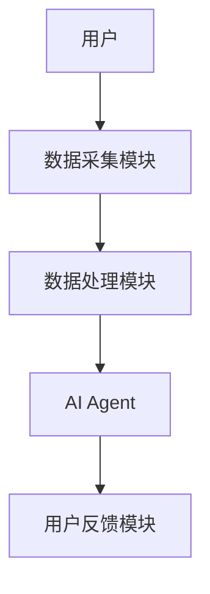

                 


# 智能瑜伽垫：AI Agent的冥想进度追踪系统

> **关键词**：AI Agent，智能瑜伽垫，冥想进度，传感器技术，数据处理算法，深度学习

> **摘要**：  
> 本文深入探讨了智能瑜伽垫的设计与实现，结合AI Agent技术，通过传感器和数据处理算法，实时追踪用户的冥想进度。文章从背景介绍、核心概念、算法原理到系统架构、项目实战，全面解析智能瑜伽垫的技术细节，并展望其未来的应用潜力。

---

# 第一部分: 智能瑜伽垫的背景与核心概念

## 第1章: 智能瑜伽垫的背景介绍

### 1.1 问题背景  
现代生活节奏快，压力大，冥想成为许多人追求身心健康的重要方式。然而，传统的冥想练习缺乏科学的追踪手段，用户难以直观了解自己的进步。智能瑜伽垫通过整合AI技术，实时捕捉用户的生理数据，提供个性化的反馈，从而优化冥想体验。

### 1.2 问题描述  
传统瑜伽垫无法提供实时反馈，用户无法准确掌握自己的冥想状态。此外，缺乏系统化的数据追踪，用户难以持续改进练习效果。

### 1.3 问题解决  
智能瑜伽垫通过内置传感器和AI Agent，实时采集用户的生理数据，分析冥想状态，提供个性化建议，帮助用户提升练习效果。

### 1.4 边界与外延  
智能瑜伽垫专注于冥想进度追踪，不涉及其他健康数据（如心率监测）。外延包括与其他健康设备的集成，如智能手表或健康App。

### 1.5 核心概念与核心要素  
- **AI Agent**：用于数据处理和状态分析的智能代理。
- **传感器技术**：采集用户的生理数据。
- **数据处理算法**：分析数据，判断冥想状态。

---

## 第2章: AI Agent的基本原理

### 2.1 AI Agent的定义与特点  
- **定义**：AI Agent是能够感知环境、自主决策的智能系统。
- **特点**：实时性、个性化、自适应。

### 2.2 AI Agent的核心原理  
- **传感器数据采集**：通过压力传感器、加速度计等设备，实时采集用户的生理数据。
- **数据特征提取**：提取心率、呼吸频率等特征，用于状态分析。
- **模型训练与推理**：利用深度学习模型，分析数据并推断冥想状态。

### 2.3 AI Agent与智能瑜伽垫的关系  
AI Agent是智能瑜伽垫的核心，通过处理传感器数据，提供实时反馈和建议，帮助用户优化冥想练习。

---

# 第二部分: AI Agent与智能瑜伽垫的核心概念

## 第3章: 传感器技术与数据采集

### 3.1 传感器的类型与功能  
- **压力传感器**：检测用户的体重分布，分析坐姿是否正确。
- **加速度计**：监测用户的动作频率，判断是否保持正确的冥想姿势。
- **心率监测器**：实时监测心率变化，评估压力水平。

### 3.2 数据采集流程  
1. 传感器采集数据（如压力、动作频率、心率）。
2. 数据预处理（去噪、归一化）。
3. 特征提取（心率变异性、呼吸频率）。

---

## 第4章: 数据处理算法

### 4.1 数据处理算法的核心原理  
- **信号处理**：使用FFT（快速傅里叶变换）分析呼吸和心率信号。
- **特征提取**：提取心率变异性、呼吸频率等特征。
- **模式识别**：利用机器学习模型（如SVM、神经网络）分类冥想状态。

### 4.2 算法实现代码  
```python
import numpy as np
from sklearn.svm import SVC

# 示例数据：呼吸频率和心率变异性
X = np.array([[0.8, 0.5], [1.2, 1.0], [0.6, 0.7]])
y = np.array([0, 1, 0])  # 0: 放松状态，1: 紧张状态

# 训练SVM模型
model = SVC()
model.fit(X, y)

# 预测新数据
new_data = np.array([[1.0, 0.8]])
print("预测状态：", model.predict(new_data))
```

### 4.3 算法的数学模型  
- **SVM模型**：  
  $$ \text{目标函数} = \sum_{i=1}^{n} \alpha_i y_i \cdot \text{max}(0, 1 - y_i (w \cdot x_i + b)) $$
- **神经网络模型**：  
  $$ \text{输出} = \sigma(w_1 x_1 + w_2 x_2 + b) $$  
  其中，$\sigma$ 是sigmoid函数。

---

# 第三部分: 系统架构与实现

## 第5章: 系统架构设计

### 5.1 问题场景介绍  
用户在冥想时，智能瑜伽垫通过传感器采集数据，AI Agent分析数据，实时反馈冥想状态。

### 5.2 系统功能设计  
- 数据采集模块：采集用户生理数据。
- 数据处理模块：分析数据，判断冥想状态。
- 用户反馈模块：以图形或语音形式反馈结果。

### 5.3 系统架构图（Mermaid）  


---

## 第6章: 项目实战

### 6.1 环境安装  
- Python 3.8+
- 传感器库（如`gpiozero`）
- 机器学习库（如`scikit-learn`、`TensorFlow`）

### 6.2 系统核心实现  
```python
import numpy as np
from sklearn.ensemble import RandomForestClassifier

# 示例数据
X = np.array([[0.8, 0.5], [1.2, 1.0], [0.6, 0.7]])
y = np.array([0, 1, 0])

# 训练随机森林模型
model = RandomForestClassifier()
model.fit(X, y)

# 预测新数据
new_data = np.array([[1.0, 0.8]])
print("预测状态：", model.predict(new_data))
```

### 6.3 应用案例分析  
通过实际案例分析，展示智能瑜伽垫如何帮助用户提升冥想效果。例如，用户A通过智能瑜伽垫反馈，调整呼吸频率，达到深度冥想状态。

---

## 第7章: 最佳实践与总结

### 7.1 小结  
智能瑜伽垫结合AI技术，为用户提供科学的冥想进度追踪，帮助用户优化练习效果。

### 7.2 注意事项  
- 数据隐私保护
- 硬件传感器的精度
- 用户体验优化

### 7.3 拓展阅读  
建议读者进一步了解AI在健康领域的应用，如智能手表、健康监测设备等。

---

# 作者  
**作者：AI天才研究院 & 禅与计算机程序设计艺术**

---

通过以上目录和内容，您可以撰写一篇详细的、结构清晰的技术博客文章，深入探讨智能瑜伽垫的设计与实现。

