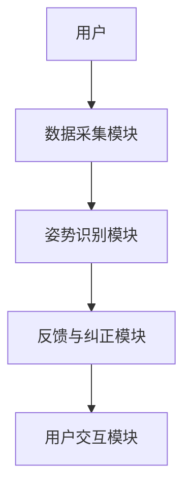

                 


# 智能瑜伽垫：AI Agent的姿势纠正系统

> **关键词**: AI Agent, 姿势纠正, 智能瑜伽垫, 深度学习, 计算机视觉, 健身科技

> **摘要**: 本文探讨了智能瑜伽垫作为一种结合AI技术的健身工具，通过姿势纠正系统帮助用户提升瑜伽练习效果。文章详细分析了AI Agent在姿势纠正中的应用，姿势识别算法的实现，系统架构设计，并通过实际案例展示了项目的实现与优化过程。

---

# 第一部分: 智能瑜伽垫的背景与概念

## 第1章: 瑜伽与智能健身的现状

### 1.1 瑜伽的起源与发展

瑜伽起源于古印度，距今已有超过5000年的历史。它最初是一种精神修炼方式，后来逐渐演变为一种结合身体、呼吸和冥想的练习。现代瑜伽注重身体的柔韧性、力量和平衡，已成为全球广泛流行的健身方式。

随着人们对健康生活的追求，瑜伽练习的普及率不断提高。然而，许多人由于缺乏专业指导，容易出现姿势不标准、动作不到位等问题，导致练习效果不佳甚至受伤。

### 1.2 智能瑜伽垫的出现与技术背景

近年来，人工智能技术的快速发展为健身设备的智能化提供了技术支持。智能瑜伽垫作为一种创新的健身工具，利用传感器、计算机视觉和深度学习等技术，能够实时监测用户的瑜伽姿势，并提供个性化的反馈与指导。

与传统瑜伽垫相比，智能瑜伽垫的优势在于其智能化的姿势纠正功能。它通过AI技术帮助用户克服练习中的常见问题，提高练习效率和安全性。

### 1.3 AI Agent在姿势纠正中的应用

AI Agent（智能代理）是一种能够感知环境、自主决策并执行任务的智能系统。在智能瑜伽垫中，AI Agent负责分析用户的姿势数据，识别错误动作，并提供纠正建议。其核心功能包括：

1. **数据采集**：通过传感器或摄像头采集用户的姿势数据。
2. **姿势识别**：利用深度学习算法识别用户的瑜伽动作。
3. **反馈与纠正**：根据识别结果提供实时反馈，并指导用户调整动作。

---

## 第2章: 智能瑜伽垫的用户需求分析

### 2.1 用户需求的多样性

智能瑜伽垫的目标用户主要包括以下几类：

1. **初学者**：缺乏专业指导，容易出现姿势错误。
2. **进阶练习者**：希望进一步提升练习效果。
3. **健身爱好者**：希望通过瑜伽达到塑形或放松的目的。

不同用户的需求差异较大，因此智能瑜伽垫需要具备灵活性和可定制性，以满足不同用户的需求。

### 2.2 市场分析与产品定位

当前市场中，智能健身设备的竞争日益激烈。智能瑜伽垫作为一种新兴产品，需要在功能、价格、用户体验等方面找到合适的定位。通过市场分析，我们可以发现：

1. **市场需求**：用户对智能化、个性化的健身工具需求旺盛。
2. **竞争分析**：市场上已有类似产品，但功能相对单一，缺乏深度的AI交互。
3. **产品定位**：定位为一款结合AI技术的高端智能健身垫，主打专业性和用户体验。

---

# 第二部分: 智能瑜伽垫的核心技术与算法

## 第3章: 姿势识别算法的原理与实现

### 3.1 姿势识别的核心算法

姿势识别是智能瑜伽垫的核心技术之一。基于深度学习的姿势识别算法通过训练大量标注数据，能够准确识别用户的瑜伽动作。以下是常见的姿势识别算法：

1. **基于深度学习的姿势识别**：
   - 使用卷积神经网络（CNN）提取图像特征。
   - 通过回归或分类模型预测用户的姿势。

2. **基于传统计算机视觉的姿势识别**：
   - 使用特征提取方法（如SIFT、HOG）提取关键点。
   - 通过几何变换和模板匹配实现姿势识别。

### 3.2 姿势识别的实现步骤

以下是姿势识别算法的实现步骤：

1. **数据采集与预处理**：
   - 采集用户瑜伽动作的图像数据。
   - 对图像进行标准化处理，确保数据一致性。

2. **特征提取与模型训练**：
   - 使用CNN提取图像特征。
   - 通过训练数据优化模型参数。

3. **模型优化与部署**：
   - 对模型进行调优，提高识别准确率。
   - 部署到智能瑜伽垫中，实现实时姿势识别。

---

## 第4章: AI Agent的实现与反馈机制

### 4.1 AI Agent的实现原理

AI Agent通过感知环境、分析数据并做出决策，帮助用户纠正瑜伽姿势。其实现原理如下：

1. **数据采集**：
   - 通过传感器或摄像头采集用户的姿势数据。
   - 数据包括用户的姿态、动作幅度等。

2. **数据分析**：
   - 使用AI算法分析数据，识别用户的姿势问题。
   - 提供实时反馈，指导用户调整动作。

### 4.2 反馈机制的设计与优化

反馈机制是AI Agent的重要组成部分，其设计直接影响用户体验。以下是反馈机制的设计要点：

1. **实时反馈**：
   - 通过震动或语音提示用户姿势是否正确。
   - 提供纠正建议，帮助用户调整动作。

2. **个性化反馈**：
   - 根据用户的练习习惯和身体状况，提供个性化的反馈。
   - 优化用户体验，提高练习效果。

---

# 第三部分: 智能瑜伽垫的系统架构与实现

## 第5章: 系统架构设计

### 5.1 系统功能设计

智能瑜伽垫的系统功能设计包括以下模块：

1. **数据采集模块**：
   - 通过传感器或摄像头采集用户姿势数据。
   - 数据包括用户的姿态、动作幅度等。

2. **姿势识别模块**：
   - 使用AI算法识别用户的瑜伽动作。
   - 提供实时反馈，指导用户调整动作。

3. **用户交互模块**：
   - 提供用户友好的交互界面。
   - 通过震动或语音提示用户姿势是否正确。

### 5.2 系统架构图

以下是系统的架构图：



---

## 第6章: 项目实战与优化

### 6.1 环境安装与配置

以下是项目实战的环境安装步骤：

1. **安装Python**：
   - 安装Python 3.8或更高版本。
   - 安装必要的库：`numpy`, `tensorflow`, `cv2`.

2. **安装硬件驱动**：
   - 安装摄像头或传感器的驱动程序。
   - 确保硬件能够正常工作。

### 6.2 核心代码实现

以下是姿势识别模块的核心代码：

```python
import cv2
import numpy as np
import tensorflow as tf

# 加载预训练模型
model = tf.keras.models.load_model('pose_model.h5')

# 摄像头采集图像
cap = cv2.VideoCapture(0)
while cap.isOpened():
    ret, frame = cap.read()
    if not ret:
        break
    # 预处理图像
    frame = cv2.resize(frame, (224, 224))
    frame = frame / 255.0
    frame = np.expand_dims(frame, axis=0)
    # 预测姿势
    prediction = model.predict(frame)
    # 提供反馈
    if prediction[0][0] > 0.5:
        print("姿势正确")
    else:
        print("姿势不正确，请调整")
cap.release()
cv2.destroyAllWindows()
```

### 6.3 案例分析与优化

以下是实际案例分析：

1. **案例分析**：
   - 用户在练习“树式”（Vrksana）时，姿势不正确。
   - 系统通过姿势识别模块识别出用户的姿势问题。
   - 提供实时反馈，指导用户调整动作。

2. **优化建议**：
   - 提高模型的识别准确率。
   - 优化反馈机制，提供更具体的纠正建议。

---

# 第四部分: 总结与展望

## 第7章: 总结与小结

智能瑜伽垫作为一种结合AI技术的健身工具，通过姿势纠正系统帮助用户提升瑜伽练习效果。本文详细分析了AI Agent在姿势纠正中的应用，姿势识别算法的实现，系统架构设计，并通过实际案例展示了项目的实现与优化过程。

---

## 第8章: 最佳实践与注意事项

1. **最佳实践**：
   - 定期更新模型，提高识别准确率。
   - 提供个性化的反馈，优化用户体验。

2. **注意事项**：
   - 注意数据隐私与安全。
   - 确保硬件设备的稳定性与可靠性。

---

## 第9章: 拓展阅读与深入学习

1. **拓展阅读**：
   - 推荐阅读《深度学习实战》。
   - 参考相关论文：《基于深度学习的姿势识别研究》。

2. **深入学习**：
   - 学习更多的深度学习算法。
   - 探索AI Agent在其他领域的应用。

---

# 作者

作者：AI天才研究院/AI Genius Institute & 禅与计算机程序设计艺术 /Zen And The Art of Computer Programming

