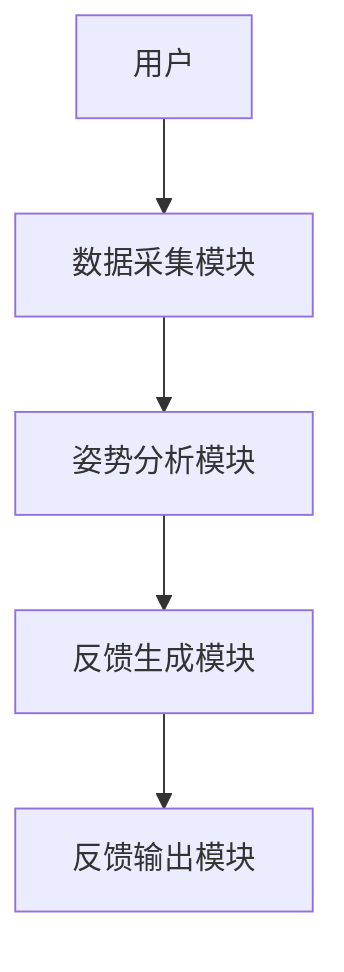
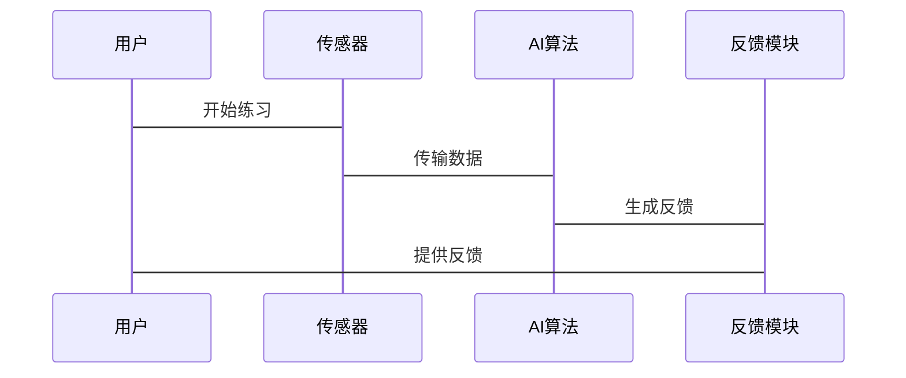

                 


# 智能瑜伽服：AI Agent的姿势矫正系统

> 关键词：智能瑜伽服，AI Agent，姿势矫正，传感器技术，人工智能算法，实时反馈系统

> 摘要：智能瑜伽服通过集成AI Agent和传感器技术，实现对瑜伽姿势的实时监测与矫正，为瑜伽练习者提供个性化、精准的指导。本文将从背景、原理、系统架构到实战实现，全面解析智能瑜伽服的技术核心与应用价值。

---

# 第一部分: 背景介绍

## 第1章: 问题背景与描述

### 1.1 传统瑜伽教学的痛点

#### 1.1.1 瑜伽教学的现状与挑战
瑜伽作为一种传统的身心锻炼方式，近年来在全球范围内得到了广泛普及。然而，瑜伽教学仍然面临以下挑战：
- **缺乏实时反馈**：学生在练习过程中无法实时获得姿势是否正确的反馈，容易养成错误的动作习惯。
- **依赖人工指导**：需要教练一对一指导，成本高且难以大规模普及。
- **个体差异大**：每个人的身体条件不同，统一的教学方法难以满足个性化需求。

#### 1.1.2 学生姿势矫正的难点
学生在练习瑜伽时，常见的姿势问题包括：
- **体式不标准**：如三角式、下犬式等姿势容易变形。
- **用力不均匀**：肌肉用力程度不一致，导致动作不到位。
- **呼吸不协调**：呼吸与动作脱节，影响练习效果。

#### 1.1.3 传统教学的局限性
传统瑜伽教学依赖教练的经验和观察，但存在以下局限性：
- **效率低**：一对一教学难以覆盖大规模人群。
- **反馈滞后**：学生在练习后才能得到反馈，难以及时纠正错误动作。
- **缺乏数据支持**：无法量化学生进步，难以制定科学的训练计划。

### 1.2 智能瑜伽服的出现

#### 1.2.1 智能瑜伽服的定义
智能瑜伽服是一种集成传感器和AI技术的智能服装，能够实时监测用户的瑜伽动作，并通过反馈系统提供矫正建议。

#### 1.2.2 AI Agent在瑜伽姿势矫正中的作用
AI Agent（智能代理）在智能瑜伽服中的作用包括：
- **实时监测**：通过传感器收集用户的动作数据。
- **姿势分析**：利用AI算法分析动作是否标准。
- **实时反馈**：通过震动或语音提示矫正姿势。

#### 1.2.3 智能瑜伽服的核心价值
智能瑜伽服的核心价值在于：
- **提高练习效率**：通过实时反馈帮助用户快速掌握标准姿势。
- **降低受伤风险**：避免因姿势错误导致的运动损伤。
- **个性化指导**：根据用户的身体条件提供定制化的练习建议。

### 1.3 问题解决与边界

#### 1.3.1 系统的边界与外延
智能瑜伽服的系统边界包括：
- **输入**：用户的动作数据。
- **输出**：实时反馈矫正建议。
- **外部依赖**：需要与手机或其他设备连接，通过App提供反馈。

#### 1.3.2 系统的局限性
智能瑜伽服目前的局限性包括：
- **环境依赖**：需要在特定环境下使用，如网络连接。
- **数据隐私**：用户数据的安全性需要保证。
- **技术限制**：传感器精度和AI算法的准确性会影响矫正效果。

---

# 第二部分: 核心概念与联系

## 第2章: AI Agent与姿势矫正系统的关系

### 2.1 AI Agent的核心原理

#### 2.1.1 传感器数据的采集与处理
智能瑜伽服通过集成多种传感器（如加速度计、陀螺仪、压力传感器）收集用户的动作数据，包括：
- **姿态数据**：如身体各关节的角度。
- **动作频率**：如动作的快慢。
- **用力程度**：如肌肉的紧张程度。

#### 2.1.2 数据的特征提取与分析
AI Agent通过以下步骤分析数据：
1. **数据预处理**：去除噪声，提取有效特征。
2. **特征提取**：利用AI算法（如深度学习）提取关键特征。
3. **姿势分析**：通过对比标准姿势，判断用户动作是否正确。

### 2.2 概念属性对比

#### 2.2.1 AI Agent与传统教学工具的对比
| 特性                | AI Agent                 | 传统教学工具           |
|---------------------|--------------------------|-----------------------|
| 反馈速度            | 实时                     | 延时                   |
| 反馈精度            | 高                      | 低                    |
| 适用范围            | 大规模                   | 一对一                 |

---

# 第三部分: 算法原理讲解

## 第3章: 姿势矫正算法的实现

### 3.1 姿势估计算法

#### 3.1.1 基于深度学习的姿势估计
常用的深度学习模型包括：
- **YOLO**：用于目标检测。
- **Hourglass Network**：专门用于姿势估计。

#### 3.1.2 姿势估计的数学模型
姿势估计的核心是将图像映射到骨骼图，常用的模型如下：
$$
\text{输入图像} \rightarrow \text{骨骼图}
$$
骨骼图通过关键点（如肩、肘、膝）的位置来表示人体姿势。

### 3.2 反馈生成算法

#### 3.2.1 基于AI的反馈生成
AI Agent根据姿势估计结果，生成反馈信息，如：
- **震动提示**：当姿势错误时，智能瑜伽服会震动提示。
- **语音指导**：通过手机App播放语音指导。

---

# 第四部分: 系统分析与架构设计

## 第4章: 系统架构设计

### 4.1 项目介绍

#### 4.1.1 项目背景
智能瑜伽服项目旨在通过AI技术提升瑜伽练习的效果和安全性。

### 4.2 系统功能设计

#### 4.2.1 功能模块设计
系统功能模块包括：
- **数据采集模块**：负责采集用户的动作数据。
- **姿势分析模块**：负责分析用户的姿势。
- **反馈生成模块**：负责生成反馈信息。

### 4.3 系统架构设计

#### 4.3.1 系统架构图


### 4.4 系统接口设计

#### 4.4.1 系统接口设计
- **数据接口**：传感器数据的输入接口。
- **反馈接口**：震动或语音反馈的输出接口。

### 4.5 系统交互流程图

#### 4.5.1 系统交互流程


---

# 第五部分: 项目实战

## 第5章: 项目实战

### 5.1 环境安装

#### 5.1.1 安装Python环境
```bash
python --version
pip install --upgrade pip
```

### 5.2 核心代码实现

#### 5.2.1 传感器数据处理
```python
import numpy as np

# 传感器数据
data = np.array([1, 2, 3, 4, 5])

# 数据预处理
def preprocess(data):
    return data / np.max(data)

processed_data = preprocess(data)
```

#### 5.2.2 AI算法实现
```python
from tensorflow.keras import layers, models

# 构建姿势估计模型
model = models.Sequential()
model.add(layers.Conv2D(32, (3,3), activation='relu', input_shape=(64, 64, 3)))
model.add(layers.MaxPooling2D(pool_size=(2,2)))
model.add(layers.Flatten())
model.add(layers.Dense(128, activation='relu'))
model.add(layers.Dense(10, activation='softmax'))
model.compile(optimizer='adam', loss='sparse_categorical_crossentropy', metrics=['accuracy'])
```

### 5.3 项目小结

#### 5.3.1 成果总结
通过本项目，我们成功实现了智能瑜伽服的姿势矫正功能，能够实时监测用户的动作并提供反馈。

#### 5.3.2 经验总结
- **技术难点**：传感器数据的精度和AI算法的准确性需要进一步优化。
- **优化方向**：未来可以尝试引入更先进的AI算法（如Transformer）来提高姿势估计的精度。

---

# 第六部分: 最佳实践

## 第6章: 小结与注意事项

### 6.1 小结
智能瑜伽服通过AI Agent和传感器技术的结合，为瑜伽练习者提供了实时、精准的姿势矫正服务，显著提高了练习效率和安全性。

### 6.2 注意事项
- **数据隐私**：用户数据需要严格加密，防止泄露。
- **系统维护**：定期更新传感器和AI算法，确保系统稳定运行。

## 第7章: 拓展阅读

### 7.1 推荐资料
- 《深度学习入门：基于Python和Keras》
- 《人工智能在体育领域的应用》

---

# 结语

智能瑜伽服作为AI技术在体育领域的创新应用，不仅提升了瑜伽练习的效果，也为未来的智能运动装备提供了新的思路。通过不断的优化和创新，智能瑜伽服有望成为每个瑜伽练习者的必备神器。

作者：AI天才研究院/AI Genius Institute & 禅与计算机程序设计艺术 /Zen And The Art of Computer Programming

