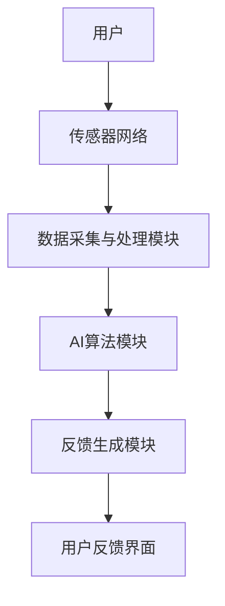
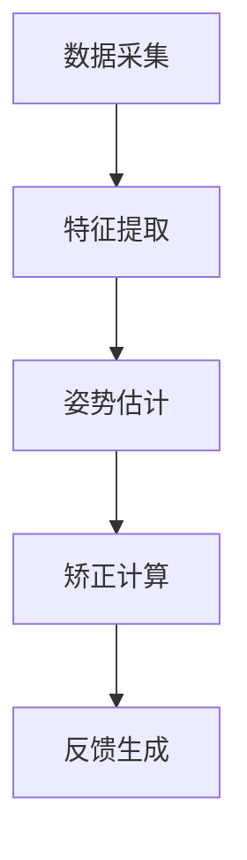
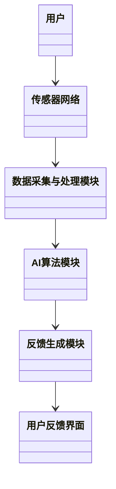
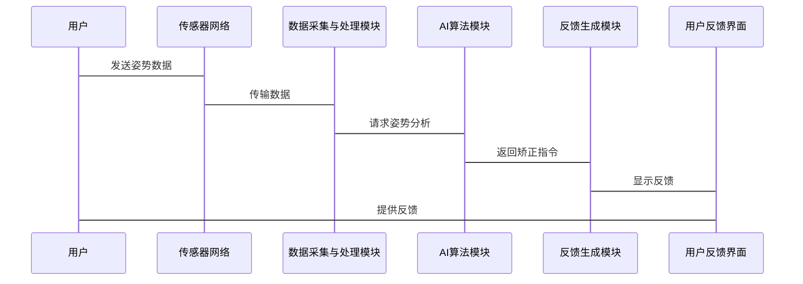

                 


# 智能瑜伽服：AI Agent的实时姿势纠正系统

## 关键词：智能瑜伽服，AI Agent，姿势纠正，实时反馈，深度学习，传感器网络

## 摘要：智能瑜伽服是一种结合AI技术的运动服装，通过实时姿势纠正系统帮助用户优化瑜伽练习。本文从背景、核心概念、算法原理、系统架构、项目实战到最佳实践，全面解析智能瑜伽服的技术实现与应用价值。

---

## 第一部分: 智能瑜伽服的背景与核心概念

### 第1章: 问题背景与需求分析

#### 1.1 瑜伽教学的现状与痛点

##### 1.1.1 传统瑜伽教学的局限性
传统瑜伽教学依赖教练的现场指导，但时间和空间限制使得个性化指导难以普及。此外，学员自我练习时缺乏实时反馈，容易养成错误姿势，影响健康。

##### 1.1.2 用户在瑜伽练习中的常见问题
- 姿势不标准，导致运动损伤。
- 自我练习时缺乏专业指导，难以持续进步。
- 现有辅助工具（如镜面、视频）无法提供实时反馈。

##### 1.1.3 现有瑜伽辅助工具的不足
传统工具如镜子、视频教程无法实时反馈姿势问题，且缺乏个性化的指导。

#### 1.2 AI技术在运动健康领域的应用前景

##### 1.2.1 AI在运动姿势矫正中的潜力
AI可以通过深度学习算法实时分析人体姿势，提供即时反馈，帮助用户纠正动作。

##### 1.2.2 实时反馈技术的优势
实时反馈技术能够即时纠正错误姿势，提高练习效果，降低受伤风险。

##### 1.2.3 智能瑜伽服的市场价值与用户需求
智能瑜伽服结合了时尚与科技，满足用户对健康和个性化的追求，具有广阔的市场前景。

### 第2章: 智能瑜伽服的核心概念与系统架构

#### 2.1 AI Agent在智能瑜伽服中的角色

##### 2.1.1 AI Agent的定义与功能
AI Agent是一种智能代理，负责数据采集、分析和反馈生成，帮助用户纠正姿势。

##### 2.1.2 AI Agent在姿势纠正中的作用
AI Agent通过传感器数据，实时分析用户姿势，提供个性化反馈。

##### 2.1.3 AI Agent与传统传感器的区别
AI Agent不仅采集数据，还能分析数据，提供智能反馈，而传统传感器仅能采集数据。

#### 2.2 实时姿势纠正系统的组成

##### 2.2.1 传感器网络的设计
传感器网络包括姿态传感器、动作捕捉设备，用于实时采集用户姿势数据。

##### 2.2.2 数据采集与处理模块
数据采集与处理模块负责接收传感器数据，进行初步处理和特征提取。

##### 2.2.3 AI算法的核心模块
AI算法模块负责姿势识别、矫正计算和反馈生成。

##### 2.2.4 用户反馈与交互界面
用户反馈界面通过震动、语音或视觉提示，将反馈信息传递给用户。

#### 2.3 系统架构的实体关系图



---

## 第二部分: AI Agent的算法原理与实现

### 第3章: AI Agent的算法原理

#### 3.1 姿势识别的核心算法

##### 3.1.1 基于深度学习的姿势识别
深度学习模型（如卷积神经网络）用于分析用户姿势，识别关键骨骼点。

##### 3.1.2 姿势估计的数学模型
姿势估计通过数学模型将传感器数据转换为人体姿态信息。

##### 3.1.3 姿势矫正算法的优化策略
优化算法通过不断迭代，提高姿势矫正的准确性和效率。

#### 3.2 姿势矫正算法的实现流程



#### 3.3 算法的数学模型与公式

##### 3.3.1 姿势估计的数学模型
$$ \text{目标函数} = \sum_{i=1}^{n} (y_i - f(x_i))^2 $$

##### 3.3.2 姿势矫正的优化公式
$$ \text{优化目标} = \min_{\theta} \sum_{i=1}^{m} (g_i - \theta h_i)^2 $$

### 第4章: 系统分析与架构设计

#### 4.1 系统功能设计

##### 4.1.1 领域模型类图


##### 4.1.2 系统架构图


#### 4.2 接口设计与交互流程

##### 4.2.1 系统交互序列图


---

## 第三部分: 项目实战与最佳实践

### 第5章: 项目实战

#### 5.1 环境安装与配置

##### 5.1.1 开发环境
- 操作系统：Linux/Windows/MacOS
- 开发工具：Python、TensorFlow、Keras
- 传感器：加速度计、陀螺仪
- 数据库：MySQL、MongoDB

##### 5.1.2 依赖库安装
```bash
pip install tensorflow numpy scikit-learn matplotlib
```

#### 5.2 核心代码实现

##### 5.2.1 传感器数据采集模块
```python
import numpy as np
import tensorflow as tf

# 示例传感器数据
sensors_data = np.random.randn(10, 3)  # 假设3个传感器的数据
```

##### 5.2.2 姿势估计模型
```python
model = tf.keras.Sequential([
    tf.keras.layers.Dense(64, activation='relu'),
    tf.keras.layers.Dense(24, activation='sigmoid')
])
model.compile(optimizer='adam', loss='binary_crossentropy')
```

##### 5.2.3 姿势矫正算法
```python
def correct_pose(predicted_pose):
    target_pose = np.array([0.5, 0.5, 0.5])
    delta = target_pose - predicted_pose
    return delta * 0.1  # 缩放因子
```

#### 5.3 代码应用与案例分析

##### 5.3.1 实际案例分析
假设用户瑜伽动作中，左肩倾斜，AI算法通过传感器数据检测到偏差，并通过震动反馈提醒用户调整姿势。

##### 5.3.2 代码解读与分析
上述代码中，传感器数据被输入到深度学习模型中，模型输出预测的姿势，并通过矫正算法计算出纠正方向和力度。

#### 5.4 项目小结
智能瑜伽服的开发需要传感器、AI算法和反馈机制的协同工作，通过实时反馈帮助用户优化瑜伽姿势。

---

## 第四部分: 最佳实践与总结

### 第6章: 最佳实践

#### 6.1 小结与总结
智能瑜伽服通过AI Agent实时纠正用户姿势，结合传感器网络和深度学习算法，提供高效的瑜伽指导。

#### 6.2 注意事项
- 确保传感器数据的准确性和实时性。
- 保护用户隐私，避免数据泄露。
- 定期更新算法模型，提高矫正效果。

#### 6.3 拓展阅读
建议读者深入学习深度学习、传感器网络和实时反馈系统相关知识，探索更多AI在运动健康中的应用。

---

## 作者：AI天才研究院/AI Genius Institute & 禅与计算机程序设计艺术 /Zen And The Art of Computer Programming

---

以上是《智能瑜伽服：AI Agent的实时姿势纠正系统》的技术博客全文。

