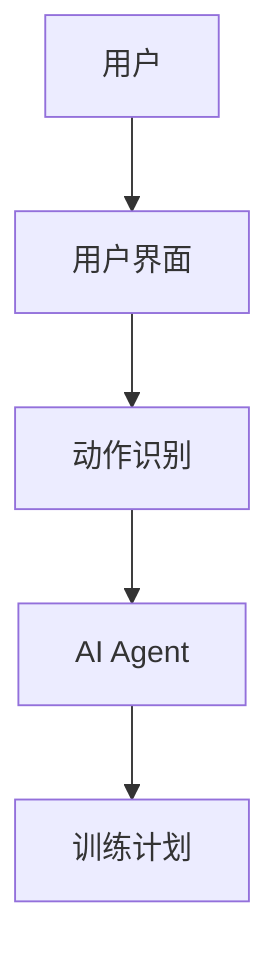

                 


# 智能瑜伽球：AI Agent的核心训练指导系统

> 关键词：智能瑜伽球，AI Agent，人工智能，瑜伽训练，系统架构

> 摘要：本文探讨智能瑜伽球作为AI Agent在瑜伽训练中的应用，分析其核心算法、系统架构和实现方法，提供从理论到实践的全面解析。

---

## 第1章 智能瑜伽球的背景介绍

### 1.1 问题背景与描述

#### 1.1.1 瑜伽训练的现状与挑战

现代人生活节奏快，压力大，瑜伽作为一种身心锻炼方式，越来越受欢迎。然而，传统瑜伽教学依赖人工指导，存在时间和空间限制。用户需要随时随地进行个性化训练，但缺乏专业教练指导。

#### 1.1.2 传统瑜伽指导的局限性

传统瑜伽教学依赖人工教练，成本高、时间受限。用户无法随时获得专业指导，且个性化需求难以满足。此外，传统教学难以实时反馈动作是否标准，影响训练效果。

#### 1.1.3 智能化瑜伽指导的需求

随着AI技术的发展，智能化瑜伽指导系统成为趋势。用户需要一个可以实时反馈、个性化定制的智能助手，帮助他们高效、安全地完成瑜伽训练。

### 1.2 问题解决与边界

#### 1.2.1 智能瑜伽球的解决方案

通过AI Agent实现智能化瑜伽指导，实时分析用户动作，提供个性化训练计划，帮助用户提高训练效果，避免受伤。

#### 1.2.2 系统的边界与外延

智能瑜伽球系统专注于瑜伽训练指导，边界包括动作识别、个性化计划和实时反馈。外延则不包括其他运动类型或医疗建议。

#### 1.2.3 核心要素与组成结构

智能瑜伽球系统包括AI Agent、动作识别模块、个性化训练计划生成模块和用户交互界面。

---

## 第2章 AI Agent的核心概念与联系

### 2.1 核心概念原理

#### 2.1.1 AI Agent的基本定义

AI Agent是一种智能主体，能够感知环境、做出决策并执行动作。在智能瑜伽球中，AI Agent负责分析用户动作、提供反馈和调整训练计划。

#### 2.1.2 智能瑜伽球中的AI Agent角色

AI Agent在智能瑜伽球中扮演教练角色，实时分析用户动作，提供个性化指导，确保用户正确执行瑜伽动作。

### 2.2 核心概念属性对比

| 核心概念 | 描述 |
|----------|------|
| 感知能力 | 通过摄像头和传感器感知用户动作 |
| 决策能力 | 基于感知数据做出训练调整 |
| 执行能力 | 通过交互界面反馈指导 |

### 2.3 ER实体关系图

```mermaid
er
actor: 用户
agent: AI瑜伽指导系统
goal: 瑜伽训练目标
action: 动作指导
feedback: 用户反馈
```

---

## 第3章 AI Agent的算法原理

### 3.1 算法概述

#### 3.1.1 基于强化学习的训练方法

AI Agent通过强化学习优化训练策略，用户每次动作反馈作为奖励信号，帮助系统调整动作建议。

#### 3.1.2 监督学习的应用

监督学习用于训练AI Agent的动作识别模型，基于大量标注数据，学习用户动作的正确性。

### 3.2 数学模型与公式

#### 3.2.1 强化学习的数学模型

状态空间和动作空间定义如下：

$$ S = \{s_1, s_2, ..., s_n\} $$
$$ A = \{a_1, a_2, ..., a_m\} $$

奖励函数：

$$ R(s, a) = \text{奖励值} $$

策略函数：

$$ \pi(a|s) = P(a|s) $$

#### 3.2.2 动作选择的概率分布

策略函数输出动作概率分布：

$$ P(a|s) = \text{softmax}(\theta \cdot s) $$

### 3.3 算法实现

#### 3.3.1 Python代码实现

```python
import numpy as np

def reward_function(state, action):
    # 简单示例：基于动作正确性返回奖励
    if action == 'correct':
        return 1.0
    else:
        return -0.5

# 示例策略函数
def policy(state, theta):
    scores = theta.dot(state)
    action_probs = np.exp(scores) / np.exp(scores).sum()
    return np.argmax(action_probs)
```

---

## 第4章 系统分析与架构设计

### 4.1 功能设计

#### 4.1.1 用户交互界面

用户通过手机或平板与系统互动，输入训练需求并接收指导。

#### 4.1.2 动作识别模块

使用计算机视觉技术，识别用户的瑜伽动作，判断是否标准。

#### 4.1.3 个性化训练计划

基于用户数据和反馈，系统生成个性化训练方案。

### 4.2 系统架构设计



---

## 第5章 项目实战

### 5.1 环境安装与配置

安装必要的库：

```bash
pip install numpy matplotlib tensorflow
```

### 5.2 系统核心实现

#### 5.2.1 动作识别模块

使用OpenCV进行图像处理，识别人体关键点。

#### 5.2.2 AI Agent实现

编写策略函数和奖励函数。

### 5.3 案例分析

通过实际案例，展示系统如何调整训练计划。

---

## 第6章 最佳实践与总结

### 6.1 小结

智能瑜伽球通过AI Agent实现智能化指导，显著提升用户体验和训练效果。

### 6.2 注意事项

确保数据安全和用户隐私，避免过度依赖AI。

### 6.3 拓展阅读

推荐阅读AI在健身领域的其他应用，如智能跑步机和健康监测设备。

---

## 作者：AI天才研究院

---

通过以上思考，我们逐步构建了《智能瑜伽球：AI Agent的核心训练指导系统》的技术博客文章，从背景、概念、算法、系统架构到项目实战，提供了全面的解析。

