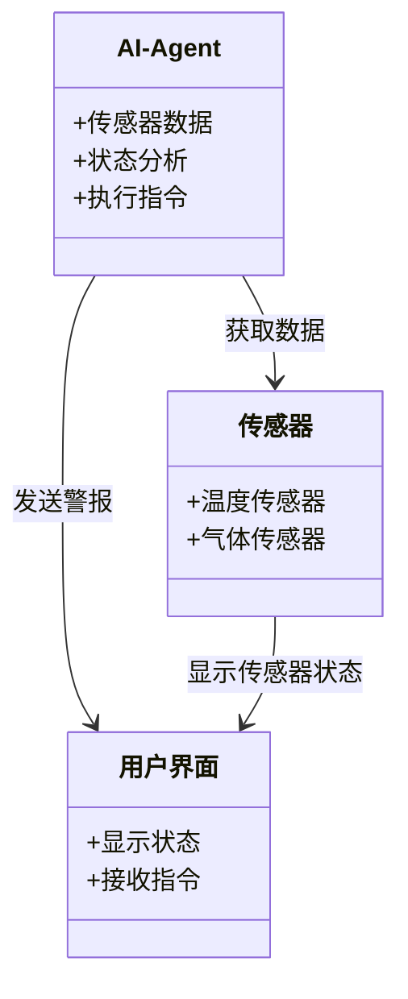

                 


# 智能瓦斯炉：AI Agent的烹饪安全监控系统

> **关键词**：AI Agent, 智能瓦斯炉, 烹饪安全, 智能家居, 安全监控, 人工智能, 物联网

> **摘要**：本文探讨了智能瓦斯炉在烹饪安全监控中的应用，通过AI Agent技术实现对烹饪过程的智能化监控，预防潜在的安全隐患。文章详细介绍了AI Agent的核心原理、算法实现、系统架构设计，以及实际项目中的应用，为读者提供全面的技术解析。

---

## 正文

### 第1章: 背景与核心概念

#### 1.1 问题背景

- **1.1.1 烹饪安全的重要性**  
  烹饪是日常生活的重要部分，但传统瓦斯炉存在安全隐患，如漏气、火焰意外熄灭等，可能导致火灾或中毒事故。

- **1.1.2 瓦斯炉的传统使用方式及其安全隐患**  
  传统瓦斯炉依赖手动操作，用户可能因疏忽忘记关闭阀门或未能及时发现异常情况。

- **1.1.3 AI技术在家居安全中的应用潜力**  
  AI技术能够实时监控环境数据，快速响应异常情况，为家居安全提供智能化解决方案。

#### 1.2 问题描述

- **1.2.1 瓦斯炉使用中的主要安全风险**  
  包括气体泄漏、火焰异常、温度过高等问题。

- **1.2.2 现有安全监控系统的局限性**  
  传统监控系统依赖被动报警，响应速度慢，且缺乏智能化分析能力。

- **1.2.3 引入AI Agent的必要性与可行性**  
  AI Agent能够实时分析环境数据，主动预防潜在危险，提升安全性。

#### 1.3 问题解决

- **1.3.1 AI Agent在烹饪安全监控中的角色**  
  AI Agent作为智能瓦斯炉的“大脑”，实时监测环境数据，分析潜在风险，并采取相应措施。

- **1.3.2 智能瓦斯炉的设计目标与功能定位**  
  设计目标是实现烹饪过程的智能化监控，功能定位为家庭烹饪安全的智能化解决方案。

- **1.3.3 系统实现的技术路线与关键问题**  
  技术路线包括传感器数据采集、AI算法分析、系统反馈与执行。

#### 1.4 边界与外延

- **1.4.1 系统边界与功能范围**  
  系统仅监控瓦斯炉的使用状态，不涉及其他厨房设备。

- **1.4.2 与相关系统的区别与联系**  
  与其他智能家居系统（如智能门锁、空调）的区别在于专注于烹饪安全。

- **1.4.3 系统扩展的可能性与限制**  
  可扩展至其他厨房设备，但需考虑系统兼容性和数据处理能力。

---

### 第2章: AI Agent与智能瓦斯炉的核心原理

#### 2.1 AI Agent的基本原理

- **2.1.1 AI Agent的定义与分类**  
  AI Agent是一种能够感知环境、自主决策并执行任务的智能实体，可分为简单反射型、基于模型的反射型、目标驱动型和效用驱动型。

- **2.1.2 AI Agent的核心功能与技术实现**  
  核心功能包括感知、推理、决策和执行，技术实现涉及机器学习、自然语言处理和计算机视觉。

- **2.1.3 AI Agent在智能瓦斯炉中的具体应用**  
  实时监测瓦斯炉的温度、气体浓度等参数，分析潜在危险并发出警报或采取措施。

#### 2.2 智能瓦斯炉的技术特征

- **2.2.1 感知层**  
  传感器负责采集环境数据，如温度、气体浓度、火焰状态等。

- **2.2.2 决策层**  
  AI Agent基于传感器数据，分析烹饪过程中的异常情况，决定是否需要采取行动。

- **2.2.3 执行层**  
  根据决策结果，系统执行相应操作，如关闭瓦斯阀、发出警报等。

---

### 第3章: 算法原理讲解

#### 3.1 算法概述

- **3.1.1 算法目标**  
  实时监测瓦斯炉的使用状态，识别异常情况并发出警报。

- **3.1.2 算法输入**  
  传感器数据，包括温度、气体浓度、火焰状态等。

- **3.1.3 算法输出**  
  异常情况警报、安全状态确认。

#### 3.2 算法流程

- **3.2.1 数据采集**  
  传感器采集环境数据并传输至AI Agent。

- **3.2.2 数据预处理**  
  对数据进行标准化处理，去除噪声。

- **3.2.3 数据分析**  
  使用机器学习算法（如支持向量机、随机森林）进行分类，识别异常情况。

- **3.2.4 系统反馈**  
  根据分析结果，发出警报或执行安全操作。

#### 3.3 算法实现

```python
import numpy as np
from sklearn.svm import SVC

# 示例数据
X = np.array([[25, 0.01], [30, 0.02], [28, 0.015], [35, 0.03]])
y = np.array([0, 0, 0, 1])  # 0表示正常，1表示异常

# 训练模型
model = SVC()
model.fit(X, y)

# 预测新数据
new_data = np.array([[30, 0.01]])
prediction = model.predict(new_data)
print("预测结果:", prediction)
```

---

### 第4章: 系统分析与架构设计

#### 4.1 问题场景介绍

- **4.1.1 场景描述**  
  家庭厨房中，用户使用瓦斯炉烹饪，可能存在气体泄漏、火焰异常等问题。

- **4.1.2 相关角色**  
  用户、AI Agent、传感器、报警系统。

#### 4.2 领域模型设计

- **4.2.1 类图展示**  
  使用Mermaid绘制类图，展示AI Agent、传感器、用户界面等模块之间的关系。



#### 4.3 系统架构设计

- **4.3.1 架构图展示**  
  使用Mermaid绘制系统架构图，展示各模块之间的交互。


---

### 第5章: 项目实战

#### 5.1 环境安装

- **5.1.1 安装Python环境**  
  使用Anaconda或虚拟环境安装Python 3.8及以上版本。

- **5.1.2 安装依赖库**  
  安装numpy、scikit-learn、mermaid等库。

#### 5.2 核心代码实现

- **5.2.1 传感器数据采集**  
  使用Raspberry Pi和传感器模块采集数据。

- **5.2.2 AI Agent实现**  
  使用Python编写AI Agent代码，实现数据处理和异常检测。

#### 5.3 代码解读与分析

- **5.3.1 数据预处理**  
  对传感器数据进行标准化处理。

- **5.3.2 异常检测**  
  使用机器学习算法训练模型，识别异常情况。

#### 5.4 实际案例分析

- **5.4.1 案例描述**  
  用户在烹饪过程中忘记关闭瓦斯炉，系统检测到气体浓度异常，发出警报并关闭阀门。

- **5.4.2 分析与总结**  
  说明系统在实际应用中的有效性。

---

### 第6章: 最佳实践、小结与注意事项

#### 6.1 最佳实践

- **6.1.1 数据隐私保护**  
  确保传感器数据的安全性，避免用户隐私泄露。

- **6.1.2 系统稳定性优化**  
  定期更新传感器和AI模型，确保系统运行稳定。

#### 6.2 小结

- 总结智能瓦斯炉的优势，强调AI Agent在烹饪安全中的重要性。

#### 6.3 注意事项

- 提醒读者在部署系统时需要注意的问题，如传感器校准、网络连接稳定性等。

#### 6.4 拓展阅读

- 推荐相关书籍和资源，供读者深入学习。

---

**作者：AI天才研究院 & 禅与计算机程序设计艺术**

