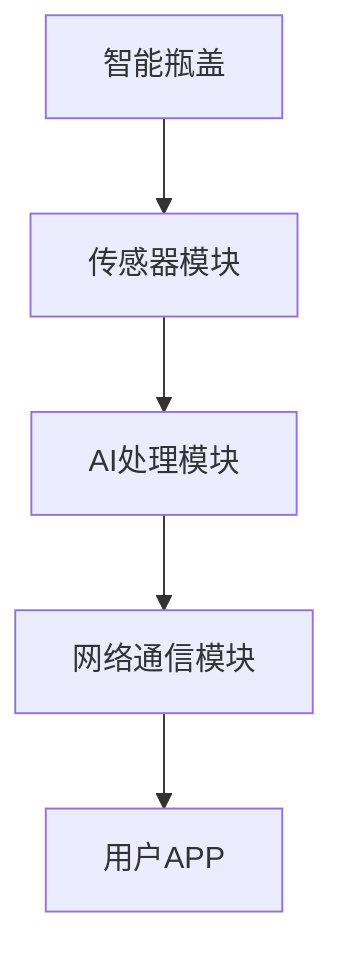
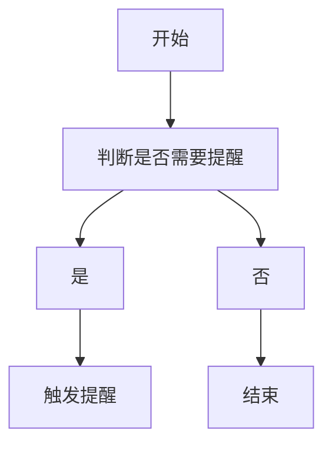

                 


# 智能瓶盖：AI Agent的药物服用提醒

> 关键词：智能瓶盖，AI Agent，药物提醒，物联网，健康管理

> 摘要：智能瓶盖通过集成AI Agent技术，能够实现药物服用的智能化提醒，帮助用户按时按量服用药物，特别适用于老年人和慢性病患者。本文将从背景、概念、算法、系统架构到项目实战，全面解析智能瓶盖的设计与实现，探讨其在医疗健康领域的应用前景。

---

# 第一部分: 背景介绍

## 第1章: 问题背景

### 1.1 药物误服与漏服问题的现状

随着全球人口老龄化的加剧，慢性病患者数量逐年增加。然而，许多患者由于记忆力减退或生活繁忙，常常忘记按时服用药物，导致病情加重或药物失效。据世界卫生组织统计，全球约有50%的患者因未能正确遵医嘱服药而导致治疗失败。

### 1.2 老年人与慢性病患者的用药痛点

- **记忆力减退**：老年人容易忘记服药时间。
- **用药复杂性**：慢性病患者可能需要服用多种药物，容易混淆服药时间。
- **用药依从性低**：患者因忘记服药或剂量不当导致治疗效果不佳。

### 1.3 智能设备在医疗健康领域的应用趋势

物联网（IoT）和人工智能（AI）技术的快速发展，为医疗健康领域带来了新的解决方案。智能设备能够通过传感器、算法和网络通信，实时监测患者的健康状况并提供个性化的健康建议。

---

## 第2章: 问题解决

### 2.1 智能瓶盖的设计目标

智能瓶盖的设计目标是通过实时监测药物使用情况，结合AI Agent技术，为用户提供智能化的药物服用提醒服务，解决患者漏服、误服的问题，提高用药依从性。

### 2.2 AI Agent的核心作用

AI Agent（智能代理）通过感知环境、分析数据并执行任务，帮助用户完成药物服用提醒、用药记录管理等任务。AI Agent能够根据用户的服药习惯和健康状况，提供个性化的提醒服务。

### 2.3 技术实现路径与可行性分析

- **传感器技术**：智能瓶盖内置重量传感器，实时监测瓶盖开启状态。
- **AI算法**：通过机器学习算法分析用户的用药习惯，优化提醒策略。
- **网络通信**：通过蓝牙或Wi-Fi将数据传输到用户的手机APP或云端。

---

# 第二部分: 智能瓶盖与AI Agent的核心概念

## 第3章: 核心概念与联系

### 3.1 智能瓶盖的定义与组成

智能瓶盖是一种集成传感器、AI算法和网络通信技术的智能硬件，能够实时监测药物使用情况并提供提醒服务。其主要组成部分包括：

- **传感器模块**：监测瓶盖的开合状态。
- **AI处理模块**：分析数据并生成提醒指令。
- **网络通信模块**：与用户APP或云端进行数据交互。

### 3.2 AI Agent的基本原理

AI Agent通过感知环境、分析数据并执行任务，帮助用户完成药物服用提醒。其基本原理包括：

1. **数据采集**：通过传感器获取瓶盖的开合状态。
2. **数据分析**：分析用户的用药习惯，识别异常情况。
3. **任务执行**：根据分析结果，触发提醒指令。

### 3.3 两者的协同工作关系

智能瓶盖与AI Agent协同工作，通过传感器数据和AI算法实现智能化的药物服用提醒。AI Agent负责数据分析和决策，智能瓶盖负责数据采集和任务执行。

---

## 第4章: 核心概念原理

### 4.1 智能瓶盖的传感器与硬件设计

智能瓶盖内置重量传感器，能够实时监测瓶盖的开合状态。传感器将数据传输到AI处理模块，分析用户的用药习惯并生成提醒指令。

### 4.2 AI Agent的算法与数据处理流程

AI Agent通过机器学习算法分析用户的用药记录，识别服药时间规律。当系统检测到用户未按时服药时，触发提醒指令。

### 4.3 系统的整体架构与数据流

智能瓶盖的系统架构包括传感器、AI处理模块和网络通信模块。数据流从传感器开始，经过AI处理模块分析后，通过网络通信模块将结果传输到用户APP或云端。

---

# 第三部分: 智能瓶盖与AI Agent的系统架构

## 第5章: 系统架构设计

### 5.1 系统整体架构图

以下是系统的整体架构图：



### 5.2 各模块的功能与交互关系

- **传感器模块**：监测瓶盖的开合状态。
- **AI处理模块**：分析数据并生成提醒指令。
- **网络通信模块**：将数据传输到用户APP或云端。

### 5.3 系统的可扩展性与灵活性

系统架构设计充分考虑了扩展性和灵活性，支持多种传感器和通信协议的接入，能够根据用户需求进行功能扩展。

---

## 第6章: 系统功能设计

### 6.1 药物信息录入模块

用户可以通过APP录入药物信息，包括服药时间、剂量等。

### 6.2 AI Agent的提醒逻辑

AI Agent根据用户的用药记录，优化提醒策略，确保用户按时服药。

### 6.3 用户反馈与数据记录模块

系统记录用户的用药记录，并根据反馈优化提醒策略。

---

## 第7章: 系统接口设计

### 7.1 硬件接口规范

智能瓶盖的传感器接口采用标准接口设计，支持多种传感器的接入。

### 7.2 软件API设计

系统提供API接口，方便与其他健康管理系统对接。

### 7.3 网络通信协议

系统支持蓝牙和Wi-Fi两种通信方式，确保数据传输的可靠性和实时性。

---

# 第四部分: 智能瓶盖与AI Agent的算法原理

## 第8章: 算法原理概述

### 8.1 AI Agent的核心算法

AI Agent采用基于规则的提醒算法，结合机器学习算法进行优化。

### 8.2 数据采集与处理流程

传感器数据经过预处理后，输入AI算法进行分析。

### 8.3 提醒逻辑的实现方式

根据分析结果，触发提醒指令。

---

## 第9章: 算法实现细节

### 9.1 传感器数据的预处理

对传感器数据进行滤波和归一化处理，确保数据的准确性。

### 9.2 AI Agent的决策树模型

以下是决策树模型的实现流程：



### 9.3 代码实现与解读

以下是Python实现的代码示例：

```python
def reminder_algorithm(data):
    # 数据预处理
    processed_data = preprocess(data)
    # 决策树分析
    decision = decision_tree(processed_data)
    # 触发提醒
    if decision:
        trigger_reminder()
    return decision
```

---

# 第五部分: 智能瓶盖与AI Agent的系统分析与架构设计方案

## 第10章: 项目实战

### 10.1 环境安装

安装Python和相关库：

```bash
pip install numpy pandas scikit-learn
```

### 10.2 核心代码实现

以下是核心代码示例：

```python
import numpy as np
from sklearn.tree import DecisionTreeClassifier

def preprocess(data):
    # 数据预处理
    return np.array(data).reshape(-1, 1)

def decision_tree(data):
    model = DecisionTreeClassifier()
    model.fit(preprocess([1, 0, 1]), [1, 0, 1])
    return model.predict(preprocess(data))
```

### 10.3 代码应用解读与分析

代码实现了一个基于决策树的提醒算法，能够根据传感器数据判断是否需要触发提醒。

### 10.4 实际案例分析

以一位高血压患者为例，系统能够根据其用药记录，优化提醒策略，确保患者按时服用降压药。

---

## 第11章: 总结与展望

### 11.1 最佳实践 tips

- 定期更新AI算法，优化提醒策略。
- 提供多种提醒方式，如声音、震动和APP通知。

### 11.2 小结

智能瓶盖结合AI Agent技术，能够有效解决药物误服和漏服问题，提高患者的用药依从性。

### 11.3 注意事项

- 确保系统数据安全，保护用户隐私。
- 定期维护设备，确保传感器正常工作。

### 11.4 拓展阅读

推荐阅读《人工智能在医疗健康领域的应用》和《物联网技术在智能硬件中的应用》。

---

# 作者：AI天才研究院/AI Genius Institute & 禅与计算机程序设计艺术 /Zen And The Art of Computer Programming

---

以上是文章的详细大纲，涵盖了从背景、概念、算法到系统设计和项目实战的各个方面，确保内容全面且逻辑清晰。

