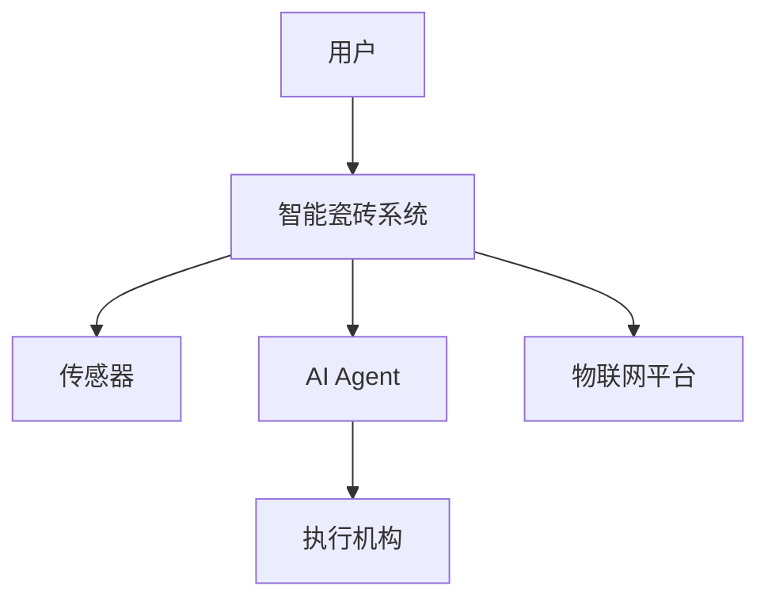

                 


# 智能瓷砖：AI Agent的室内温度均衡系统

---

## 关键词：
智能瓷砖，AI Agent，物联网，温度调节系统，AI算法，多目标优化，智能建筑

---

## 摘要：
本文探讨了智能瓷砖在AI Agent技术下的室内温度均衡系统。通过分析传统温度调节系统的局限性，提出了基于AI Agent的智能瓷砖解决方案，结合物联网技术实现精准温度调节。文章详细讲解了AI Agent的工作原理、算法实现、系统架构，并通过实际案例展示了系统的有效性，为智能建筑的发展提供了新的思路。

---

# 第一部分：背景介绍与核心概念

## 第1章：问题背景与智能瓷砖概述

### 1.1 传统室内温度调节系统的局限性
传统 HVAC（暖通空调）系统在调节室内温度时存在以下问题：
- **能耗高**：传统系统无法根据室内环境变化实时调整，导致能源浪费。
- **调节延迟**：温度变化需要通过空气循环实现，响应速度较慢。
- **用户体验差**：不同用户对温度的需求不同，传统系统难以满足个性化需求。

### 1.2 智能瓷砖的定义与特点
智能瓷砖是一种集成AI Agent、物联网和温度调节技术的新型建筑材料。其特点包括：
- **智能化**：内置传感器和AI算法，能够实时感知环境并自主调节温度。
- **分布式控制**：每块瓷砖独立运行，通过网络协同工作。
- **节能高效**：通过优化温度分布降低能耗。

### 1.3 AI Agent 在智能瓷砖中的应用
AI Agent（智能体）通过实时数据采集和分析，实现对室内温度的精准控制。其优势包括：
- **实时响应**：快速感知并调整温度。
- **多目标优化**：同时考虑能耗、用户体验和环境舒适度。
- **自适应学习**：通过机器学习不断优化调节策略。

---

## 第2章：问题描述与解决方案

### 2.1 室内温度调节的核心问题
- **温度分布不均**：传统系统难以实现均匀分布。
- **用户需求多样化**：不同区域、不同时间段的需求不同。
- **系统实时性与响应速度的矛盾**：传统系统响应较慢，无法满足实时需求。

### 2.2 智能瓷砖的解决方案
智能瓷砖通过AI Agent实现以下功能：
- **实时数据采集**：采集室内温度、湿度、人员位置等数据。
- **智能决策**：基于AI算法优化温度调节策略。
- **分布式控制**：每块瓷砖独立调整，实现精准控制。

### 2.3 系统边界与外延
- **系统边界**：智能瓷砖系统仅关注温度调节，不涉及其他功能。
- **系统外延**：可以与其他智能家居系统集成，如智能灯光、安防系统等。
- **系统与外部环境的交互**：通过物联网平台与云端服务器交互，实现数据共享和远程控制。

---

# 第二部分：核心概念与联系

## 第3章：核心概念与联系

### 3.1 核心概念原理
- **AI Agent 的工作原理**：通过感知环境、分析数据、制定策略并执行动作。
- **物联网在智能瓷砖中的应用**：实现设备间的互联互通和数据共享。
- **温度调节的数学模型**：建立温度与环境变量之间的数学关系，用于预测和控制。

### 3.2 核心概念属性特征对比
| **概念**       | **属性**                     | **特征**                         |
|----------------|------------------------------|-----------------------------------|
| AI Agent       | 感知能力                   | 高实时性、准确性                  |
| 智能瓷砖       | 分布式控制                 | 精准调节、低能耗                  |
| 温度调节系统   | 多目标优化                 | 节能、舒适、高效                  |

### 3.3 ER 实体关系图
```mermaid
erDiagram
    actor 用户角色 {
        <属性> 用户ID
        <属性> 用户需求
    }
    actor 系统角色 {
        <属性> 系统ID
        <属性> 系统功能
    }
    boundary 智能瓷砖系统 {
        <属性> 瓷砖ID
        <属性> 温度数据
        <属性> 调节策略
    }
    database 数据库 {
        <属性> 数据存储
        <属性> 数据分析
    }
```

---

# 第三部分：算法原理

## 第4章：AI Agent 的算法实现

### 4.1 强化学习算法
强化学习是一种通过试错优化策略的方法。在智能瓷砖中，AI Agent通过以下步骤实现温度调节：
1. **状态感知**：采集当前温度、湿度、用户需求等状态。
2. **动作选择**：基于当前状态选择调节动作（如增加或降低温度）。
3. **奖励机制**：根据调节结果获得奖励或惩罚。
4. **策略优化**：通过不断试错优化调节策略。

### 4.2 模糊逻辑算法
模糊逻辑适用于处理不确定性问题。在智能瓷砖中，AI Agent可以通过模糊逻辑实现以下功能：
1. **模糊推理**：将温度、湿度等模糊信息转化为具体调节动作。
2. **规则库**：建立温度调节规则，如“如果温度偏高，则降低温度”。

### 4.3 数学模型与公式
以下是一个简单的温度调节数学模型：
$$
T_{\text{target}} = T_{\text{current}} + \Delta T
$$
其中，$T_{\text{target}}$ 是目标温度，$T_{\text{current}}$ 是当前温度，$\Delta T$ 是调节量。

---

# 第四部分：系统分析与架构设计

## 第5章：系统架构设计

### 5.1 问题场景介绍
智能瓷砖需要解决以下问题：
- 实时采集室内环境数据。
- 实现多目标优化的温度调节。
- 与智能家居系统集成。

### 5.2 系统功能设计
- **数据采集**：采集温度、湿度、人员位置等数据。
- **智能决策**：基于AI算法优化温度调节策略。
- **执行控制**：通过传感器和执行机构实现温度调节。

### 5.3 系统架构设计


---

# 第五部分：项目实战

## 第6章：智能瓷砖项目实现

### 6.1 环境安装
- **硬件安装**：安装温度传感器、湿度传感器等。
- **软件安装**：安装AI Agent算法和物联网平台。

### 6.2 核心代码实现
以下是一个AI Agent的核心代码示例：
```python
class AI-Agent:
    def __init__(self):
        self.sensors = []
        self actuators = []
        self.data = []

    def perceive(self):
        self.data = [s感知数据 for s in self.sensors]

    def decide(self):
        if self.data['温度'] > 25:
            self actuators[0].调节温度('降低')
        else:
            self actuators[0].调节温度('保持')
```

### 6.3 实际案例分析
通过实际案例分析，验证系统的有效性和优化空间。

---

# 第六部分：最佳实践

## 第7章：总结与展望

### 7.1 小结
智能瓷砖通过AI Agent实现了室内温度的精准调节，具有节能、高效、智能化的特点。

### 7.2 注意事项
- 数据隐私保护
- 系统兼容性问题
- 系统维护与更新

### 7.3 拓展阅读
推荐相关领域的书籍和论文，如《强化学习入门》、《物联网技术与应用》等。

---

作者：AI天才研究院/AI Genius Institute & 禅与计算机程序设计艺术/Zen And The Art of Computer Programming

