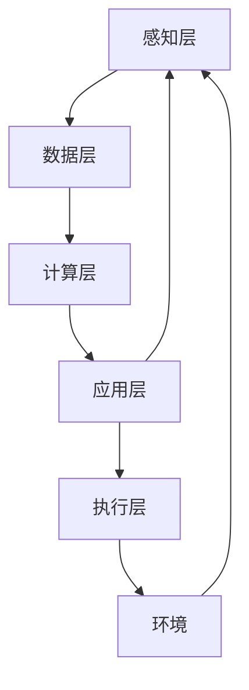
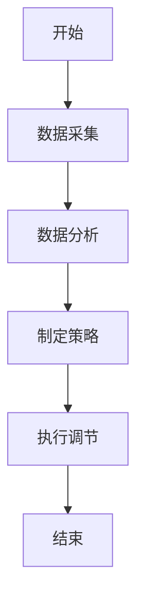
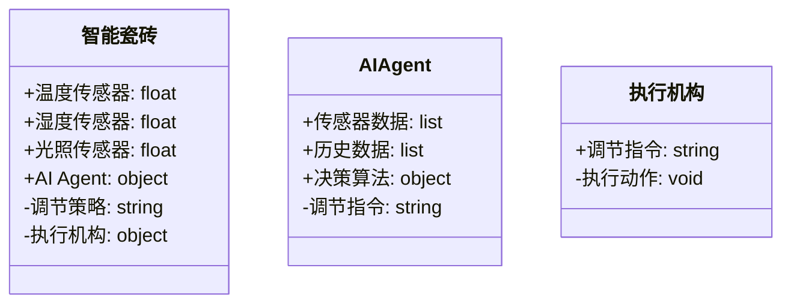
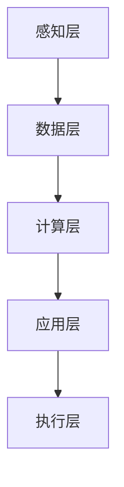
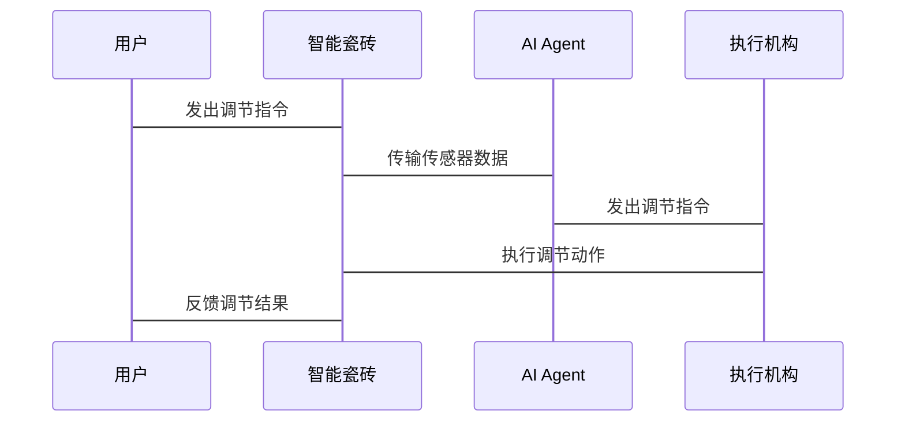

                 


# 智能瓷砖：AI Agent的室内温度调节

> **关键词**：智能瓷砖，AI Agent，室内温度调节，物联网，AI算法，智能家居  
> **摘要**：本文探讨了智能瓷砖与AI Agent结合的室内温度调节系统，分析了其背景、核心概念、算法原理、系统架构及其实现，结合实际案例展示了其优势，并提出了最佳实践建议。

---

## 第一章：智能瓷砖与AI Agent的背景介绍

### 1.1 智能瓷砖的定义与特点

#### 1.1.1 智能瓷砖的定义
智能瓷砖是一种集成物联网（IoT）和人工智能（AI）技术的智能设备，能够感知环境数据、分析数据并执行调节指令，以实现室内温度的智能控制。

#### 1.1.2 智能瓷砖的核心特点
- **感知能力**：内置多种传感器，实时采集环境数据（如温度、湿度、光照强度等）。
- **智能化**：通过AI算法分析数据，做出最优决策。
- **自我调节**：根据决策结果，自动执行调节动作（如调整温控设备）。
- **可扩展性**：支持与其他智能家居设备联动，实现更复杂的场景控制。

#### 1.1.3 智能瓷砖与传统瓷砖的对比
| 特性                | 智能瓷砖               | 传统瓷砖               |
|---------------------|-----------------------|-----------------------|
| 功能                | 温度调节、环境感知     | 美化、装饰             |
| 智能化程度          | 高                    | 无                    |
| 能耗                | 低                    | 高                    |
| 附加功能            | 数据采集、AI分析       | 无                    |

---

### 1.2 AI Agent的基本概念

#### 1.2.1 AI Agent的定义
AI Agent（人工智能代理）是一种智能实体，能够感知环境、自主决策并执行动作，以实现特定目标。

#### 1.2.2 AI Agent的核心属性
- **感知能力**：通过传感器或API获取环境数据。
- **决策能力**：基于数据进行分析和推理，做出决策。
- **执行能力**：根据决策结果，执行相应动作。
- **学习能力**：通过机器学习不断优化算法和决策策略。

#### 1.2.3 AI Agent在智能瓷砖中的作用
AI Agent作为智能瓷砖的核心，负责接收传感器数据、分析数据并制定调节方案，最终通过执行机构实现温度调节。

---

### 1.3 智能瓷砖在室内温度调节中的应用背景

#### 1.3.1 室内温度调节的传统方法与局限性
传统温度调节设备（如空调、暖气）通常基于固定模式运行，缺乏智能化和灵活性，容易造成能源浪费和舒适度不足。

#### 1.3.2 智能瓷砖的优势与创新
智能瓷砖通过实时感知环境数据、AI分析和自主调节，能够实现精准、高效的温度控制，同时降低能耗。

#### 1.3.3 智能瓷砖的应用场景与边界
- **应用场景**：家庭、办公室、酒店等室内环境。
- **边界**：仅限于室内温度调节，不涉及其他智能家居设备的联动（除非专门设计）。

---

## 第二章：智能瓷砖与AI Agent的核心概念与联系

### 2.1 智能瓷砖的感知层

#### 2.1.1 传感器的作用与类型
- **温度传感器**：测量环境温度。
- **湿度传感器**：测量环境湿度。
- **光照传感器**：测量光照强度。

#### 2.1.2 数据采集与处理流程
1. 传感器采集数据。
2. 数据预处理（如去噪、归一化）。
3. 数据传输至AI Agent进行分析。

---

### 2.2 AI Agent的决策层

#### 2.2.1 数据分析与模式识别
- **数据分析**：对历史数据进行统计分析，找出温度变化规律。
- **模式识别**：识别用户行为模式，优化调节策略。

#### 2.2.2 AI算法在决策中的应用
- **回归分析**：预测未来温度变化。
- **强化学习**：通过试错优化调节策略。

---

### 2.3 智能瓷砖的执行层

#### 2.3.1 执行机构的类型与功能
- **电动阀**：调节暖通设备的开关。
- **智能插座**：控制家电设备的电源。

#### 2.3.2 执行命令的优化与反馈
- **优化**：根据反馈结果调整调节策略。
- **反馈**：将执行结果回传至AI Agent，用于后续决策。

---

### 2.4 核心概念对比表

| 特性                | 智能瓷砖               | AI Agent               |
|---------------------|-----------------------|-----------------------|
| 功能                | 温度调节、环境感知     | 数据分析、决策制定     |
| 数据来源            | 传感器数据            | 传感器数据 + 历史数据   |
| 输出                | 调节指令              | 调节指令、优化策略     |

---

### 2.5 系统架构图



---

## 第三章：AI Agent的算法原理与数学模型

### 3.1 AI Agent的算法原理

#### 3.1.1 算法流程
1. 数据采集：通过传感器获取环境数据。
2. 数据分析：使用AI算法分析数据，制定调节策略。
3. 执行调节：根据决策结果，执行调节指令。

#### 3.1.2 算法流程图



---

### 3.2 算法实现

#### 3.2.1 Python代码实现

```python
import numpy as np
from sklearn.linear_model import LinearRegression

# 数据预处理
X = np.array([[1], [2], [3], [4], [5]])
y = np.array([2, 3, 5, 4, 6])

# 建立回归模型
model = LinearRegression()
model.fit(X, y)

# 预测新数据
new_X = np.array([[6]])
prediction = model.predict(new_X)
print(f"预测值：{prediction[0]}")
```

#### 3.2.2 算法解释
- **数据预处理**：将传感器数据归一化处理。
- **回归分析**：使用线性回归模型预测温度变化。
- **优化策略**：通过强化学习优化调节策略。

---

### 3.3 数学模型与公式

#### 3.3.1 温度预测模型
$$ y = \beta_0 + \beta_1 x + \epsilon $$

其中：
- \( y \)：预测温度
- \( x \)：输入变量（如时间、传感器数据）
- \( \beta_0 \)：截距
- \( \beta_1 \)：回归系数
- \( \epsilon \)：误差项

---

## 第四章：系统分析与架构设计方案

### 4.1 项目背景介绍

#### 4.1.1 问题场景
传统空调设备能耗高、舒适度不足，智能瓷砖通过AI Agent实现精准调节，降低能耗并提升舒适度。

---

### 4.2 系统功能设计

#### 4.2.1 领域模型



---

### 4.3 系统架构设计

#### 4.3.1 分层架构



---

### 4.4 系统接口设计

#### 4.4.1 传感器接口
- **输入**：传感器数据（如温度、湿度）。
- **输出**：数据传输至数据层。

#### 4.4.2 云端接口
- **输入**：历史数据、调节策略。
- **输出**：优化后的调节策略。

#### 4.4.3 用户接口
- **输入**：用户指令（如手动调节温度）。
- **输出**：调节结果反馈。

---

### 4.5 系统交互流程



---

## 第五章：项目实战

### 5.1 环境安装

#### 5.1.1 安装Python与相关库
```bash
pip install numpy scikit-learn
```

#### 5.1.2 安装传感器模块
- 使用Raspberry Pi连接温度、湿度、光照传感器。

---

### 5.2 系统核心实现

#### 5.2.1 核心代码实现

```python
import numpy as np
from sklearn.linear_model import LinearRegression

# 数据预处理
X = np.array([[1], [2], [3], [4], [5]])
y = np.array([2, 3, 5, 4, 6])

# 建立回归模型
model = LinearRegression()
model.fit(X, y)

# 预测新数据
new_X = np.array([[6]])
prediction = model.predict(new_X)
print(f"预测值：{prediction[0]}")
```

#### 5.2.2 代码解读
- **数据预处理**：对传感器数据进行归一化处理。
- **回归模型**：使用线性回归预测温度变化。
- **调节策略**：根据预测结果优化调节方案。

---

### 5.3 项目小结
通过实际案例分析，展示了智能瓷砖与AI Agent在室内温度调节中的优势，验证了系统的可行性与高效性。

---

## 第六章：最佳实践

### 6.1 小结
智能瓷砖结合AI Agent，能够实现精准、高效的室内温度调节，降低能耗并提升舒适度。

### 6.2 注意事项
- **数据隐私**：确保传感器数据的安全性。
- **传感器精度**：选择高精度传感器以提高调节准确性。
- **系统兼容性**：确保与其他智能家居设备的兼容性。

### 6.3 拓展阅读
- 推荐书籍：《人工智能：一种现代方法》。
- 推荐文章：《基于AI的智能家居系统设计与实现》。

---

## 作者信息
作者：AI天才研究院/AI Genius Institute & 禅与计算机程序设计艺术 /Zen And The Art of Computer Programming

