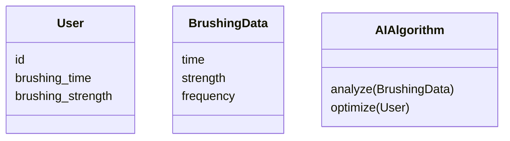
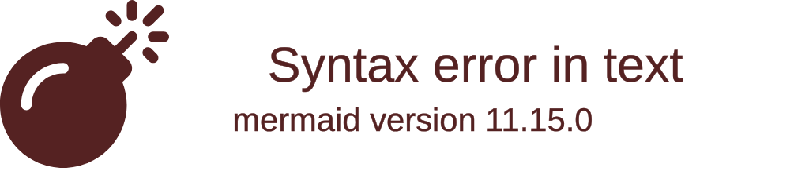
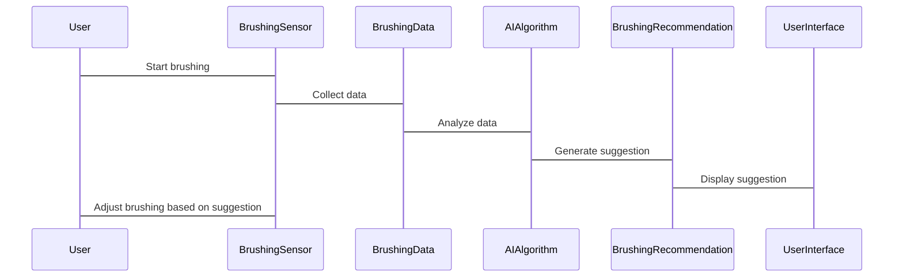

                 


# 智能电动牙刷：AI Agent的个性化刷牙指导

## 关键词
智能电动牙刷, AI Agent, 个性化刷牙, 人工智能, 个性化指导, 系统架构

## 摘要
智能电动牙刷通过集成AI Agent技术，能够提供个性化的刷牙指导，帮助用户实现更高效的口腔清洁。本文将从背景、概念、算法、系统架构等多个维度，深入探讨AI Agent在智能电动牙刷中的应用，分析其工作原理、系统设计以及实际案例，为读者提供全面的技术解读。

---

# 第1章: 智能电动牙刷的背景与概念

## 1.1 传统牙刷的局限性
### 1.1.1 传统牙刷的功能与不足
- 传统牙刷仅提供基础的清洁功能，缺乏智能化和个性化。
- 用户难以获得科学的刷牙指导，可能导致清洁不足或过度清洁。

### 1.1.2 电动牙刷的出现与改进
- 电动牙刷通过电机驱动刷头，提供更高效的清洁效果。
- 高端电动牙刷开始引入传感器，能够检测刷牙时间、力度等参数。

### 1.1.3 智能化趋势的推动因素
- 用户对个性化健康指导的需求增加。
- 科技的进步推动了AI技术在消费电子中的应用。

## 1.2 AI Agent在智能牙刷中的应用
### 1.2.1 AI Agent的基本概念
- AI Agent是一种智能代理系统，能够感知环境、执行任务并优化行为。
- 在智能牙刷中，AI Agent负责采集数据、分析用户习惯并提供个性化建议。

### 1.2.2 AI Agent在智能牙刷中的作用
- 数据采集：通过传感器获取用户的刷牙时间、力度、频率等数据。
- 数据分析：利用AI算法分析用户的刷牙习惯，识别潜在问题。
- 个性化推荐：基于分析结果，提供个性化的刷牙建议，如延长刷牙时间、调整力度等。

### 1.2.3 智能电动牙刷的市场现状
- 市场上已有多种支持AI功能的智能牙刷产品。
- 用户对智能化、个性化的健康工具需求日益增长。

---

# 第2章: 智能电动牙刷的核心概念与背景

## 2.1 个性化刷牙指导的必要性
### 2.1.1 不同人群的刷牙需求差异
- 牙齿健康状况不同，需定制化清洁方案。
- 特殊人群（如儿童、牙周炎患者）有特定的刷牙需求。

### 2.1.2 牙齿健康与刷牙习惯的关系
- 刷牙时间、力度、频率直接影响口腔健康。
- 科学的刷牙指导能够有效预防口腔疾病。

### 2.1.3 个性化刷牙指导的意义
- 提高刷牙效率，减少无效清洁。
- 保护牙齿健康，预防牙龈出血等问题。

## 2.2 AI Agent在个性化指导中的作用
### 2.2.1 AI Agent的核心功能
- 数据采集与处理：通过传感器获取用户的刷牙数据。
- 行为分析：利用AI算法分析用户的刷牙习惯。
- 个性化推荐：基于分析结果，生成个性化的刷牙建议。

### 2.2.2 数据采集与分析
- 刷牙时间：建议每次刷牙2-3分钟。
- 刷牙力度：过大的力度可能损伤牙龈，过小的力度清洁效果差。
- 刷牙频率：一般建议每天两次，早晚各一次。

### 2.2.3 个性化推荐的实现方式
- 根据用户的刷牙数据，优化刷牙时间和力度。
- 提供可视化反馈，帮助用户改善刷牙习惯。

## 2.3 智能电动牙刷的边界与外延
### 2.3.1 功能边界
- 仅限于刷牙指导，不涉及其他口腔健康问题。
- 通过AI Agent实现个性化推荐，不涉及医疗诊断。

### 2.3.2 与其他智能设备的协同
- 可与手机App同步数据，提供更全面的健康建议。
- 与其他智能家居设备联动，提升用户体验。

### 2.3.3 未来的扩展方向
- 集成更多传感器，获取更详细的口腔数据。
- 提供更精准的个性化建议，如根据牙膏类型调整清洁策略。

---

# 第3章: 智能电动牙刷的核心要素与系统架构

## 3.1 核心要素分析
### 3.1.1 用户数据采集模块
- 传感器：检测刷牙时间、力度、频率等数据。
- 数据存储：将采集的数据上传至云端或本地设备。

### 3.1.2 AI算法处理模块
- 数据分析：利用AI算法分析用户的刷牙习惯。
- 行为优化：基于分析结果，优化用户的刷牙策略。

### 3.1.3 个性化指导输出模块
- 可视化反馈：通过LED屏幕或手机App显示个性化建议。
- 声音提示：通过语音指导用户调整刷牙姿势和力度。

## 3.2 系统架构设计
### 3.2.1 分层架构
- 数据采集层：传感器采集数据。
- 数据处理层：AI算法分析数据。
- 用户交互层：输出个性化建议。

### 3.2.2 模块化设计
- 传感器模块：负责数据采集。
- AI处理模块：负责数据分析和优化。
- 用户交互模块：负责反馈个性化建议。

### 3.2.3 系统交互流程
1. 用户开始刷牙。
2. 传感器采集刷牙数据。
3. AI算法分析数据并生成优化建议。
4. 用户根据建议调整刷牙方式。
5. 系统记录改进后的数据，优化个性化建议。

---

# 第4章: AI Agent的核心原理与算法

## 4.1 AI Agent的基本原理
### 4.1.1 状态感知
- 通过传感器感知用户的刷牙状态，如时间、力度等。

### 4.1.2 行为决策
- 利用AI算法分析数据，生成优化建议。

### 4.1.3 反馈优化
- 根据用户的反馈调整算法，提升建议的准确性。

## 4.2 基于强化学习的AI算法
### 4.2.1 强化学习的基本概念
- 强化学习是一种机器学习方法，通过试错优化行为。
- 在智能牙刷中，强化学习用于优化用户的刷牙习惯。

### 4.2.2 强化学习的训练过程
1. 状态识别：感知用户的刷牙状态。
2. 动作选择：基于当前状态，选择最优的刷牙方式。
3. 奖励机制：根据效果反馈调整算法。

### 4.2.3 强化学习的数学模型
$$ Q(s, a) = Q(s, a) + \alpha \cdot (r + \gamma \cdot \max Q(s', a') - Q(s, a)) $$
其中：
- \( Q(s, a) \)：状态 \( s \) 下动作 \( a \) 的价值。
- \( \alpha \)：学习率。
- \( r \)：奖励值。
- \( \gamma \)：折扣因子。

### 4.2.4 强化学习的代码实现
```python
class DQNAgent:
    def __init__(self, state_space, action_space):
        self.state_space = state_space
        self.action_space = action_space
        self.gamma = 0.9
        self.epsilon = 0.1
        self.q_table = np.zeros((state_space, action_space))

    def take_action(self, state):
        if np.random.random() < self.epsilon:
            return np.random.randint(self.action_space)
        else:
            return np.argmax(self.q_table[state])

    def update_q_table(self, state, action, reward, next_state):
        self.q_table[state][action] += self.gamma * (reward + max(self.q_table[next_state]))
```

---

# 第5章: 系统分析与架构设计方案

## 5.1 问题场景介绍
### 5.1.1 用户刷牙习惯分析
- 数据采集：刷牙时间、力度、频率等。
- 数据分析：识别刷牙习惯中的问题，如时间不足、力度过大。

## 5.2 系统功能设计
### 5.2.1 领域模型


### 5.2.2 系统架构设计


### 5.2.3 系统接口设计
- 用户接口：显示个性化建议。
- 数据接口：与传感器和云端数据存储交互。

### 5.2.4 系统交互流程


---

# 第6章: 项目实战

## 6.1 环境安装
### 6.1.1 安装Python和相关库
- 安装Python 3.8及以上版本。
- 使用pip安装numpy、tensorflow等库。

## 6.2 系统核心实现
### 6.2.1 核心代码实现
```python
import numpy as np
import tensorflow as tf

class BrushingAI:
    def __init__(self):
        self.model = self.build_model()

    def build_model(self):
        model = tf.keras.Sequential([
            tf.keras.layers.Dense(64, activation='relu'),
            tf.keras.layers.Dense(1, activation='sigmoid')
        ])
        model.compile(optimizer='adam', loss='binary_crossentropy')
        return model

    def train(self, X, y):
        self.model.fit(X, y, epochs=10, batch_size=32)
```

### 6.2.2 代码解读与分析
- 模型构建：使用Dense层构建神经网络。
- 训练过程：利用训练数据优化模型参数。

## 6.3 案例分析与详细讲解
### 6.3.1 实际案例分析
- 用户A：刷牙时间不足，AI建议延长刷牙时间。
- 用户B：刷牙力度过大，AI建议调整力度。

### 6.3.2 详细讲解
- 数据采集：通过传感器获取刷牙数据。
- 数据分析：利用AI算法分析数据。
- 个性化推荐：根据分析结果生成建议。

## 6.4 项目小结
- 通过实战案例，验证了AI算法在智能牙刷中的有效性。
- 提供了实现个性化刷牙指导的技术方案。

---

# 第7章: 最佳实践与注意事项

## 7.1 最佳实践
### 7.1.1 数据隐私保护
- 确保用户的刷牙数据安全，防止数据泄露。

### 7.1.2 系统维护
- 定期更新AI算法，提升个性化建议的准确性。

## 7.2 小结
- AI Agent在智能电动牙刷中的应用前景广阔。
- 个性化刷牙指导能够显著提升用户的口腔健康。

## 7.3 注意事项
- 避免过度依赖AI建议，用户仍需掌握基本的刷牙技巧。
- 定期更换牙刷头，确保清洁效果。

## 7.4 拓展阅读
- 推荐阅读相关领域的技术文献，深入理解AI在健康领域的应用。

---

# 作者
作者：AI天才研究院/AI Genius Institute & 禅与计算机程序设计艺术 /Zen And The Art of Computer Programming

