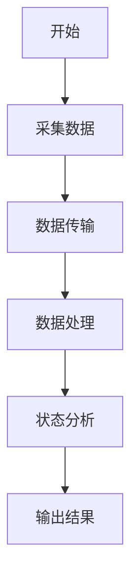
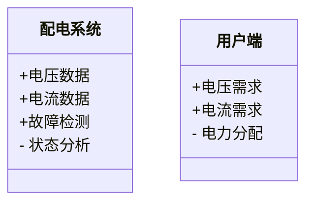
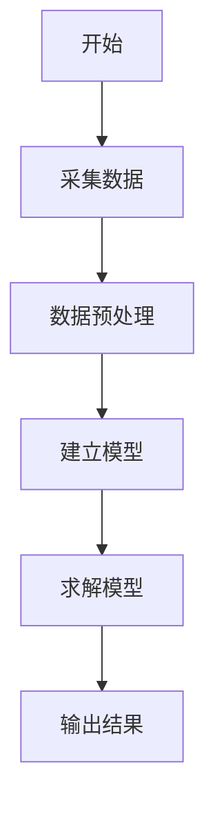
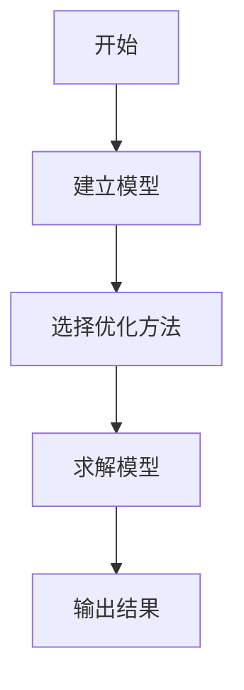
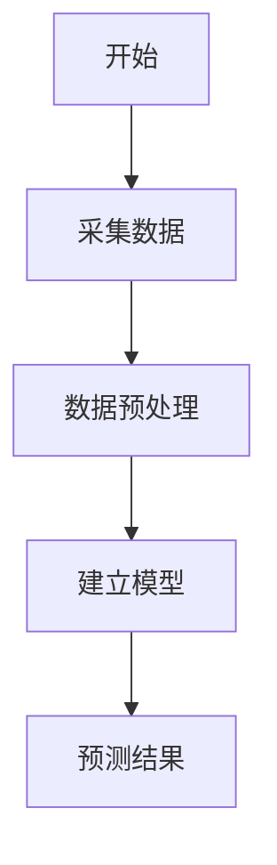
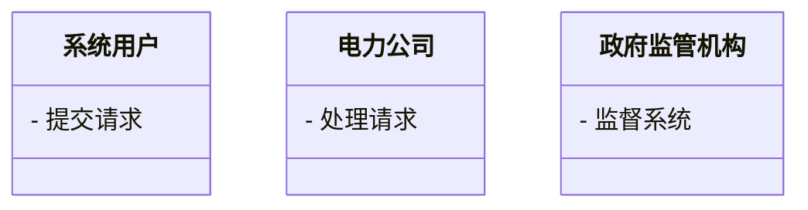
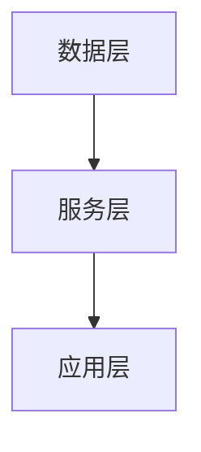
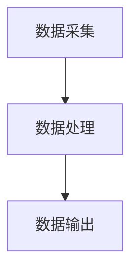
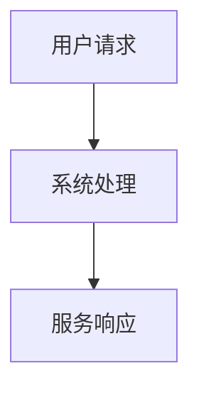

                 


# 智能电网技术在能源转型中的作用与投资

> **关键词**：智能电网技术、能源转型、投资分析、系统架构、算法原理

> **摘要**：智能电网技术作为能源转型的核心技术，正在全球范围内得到广泛应用。本文将详细探讨智能电网技术的定义、核心概念、算法原理、系统架构、项目实战以及投资分析。通过分析智能电网技术在能源转型中的作用，本文为投资者提供了科学的投资策略和建议，帮助他们在智能电网领域做出明智的决策。

---

## 第1章: 智能电网技术的背景与定义

### 1.1 智能电网的定义与核心概念

智能电网是一种利用现代信息技术和通信技术，对电力系统进行智能化管理的新型电力系统。它通过实时监测、分析和优化电力的生产、传输和消费，提高了电力系统的效率、可靠性和可持续性。

#### 核心概念对比表

| **概念**       | **传统电网**             | **智能电网**             |
|----------------|--------------------------|--------------------------|
| **数据采集**   | 间断性采集               | 实时采集                 |
| **传输效率**   | 较低，损耗较大           | 高，损耗小               |
| **管理方式**   | 人工管理为主             | 智能化自动管理           |
| **可再生能源** | 少或无                   | 支持多种可再生能源接入   |

#### 实体关系图

```mermaid
er
actor 系统用户
actor 电力公司
actor 政府监管机构
database 电力数据
database 用户数据
database 调度数据
```

### 1.2 能源转型的背景与趋势

能源转型是指从以化石能源为主转向以可再生能源为主的能源结构。随着全球气候变化问题的加剧，能源转型已成为全球关注的焦点。智能电网技术作为能源转型的重要支撑，能够有效整合可再生能源，优化能源结构，减少碳排放。

### 1.3 智能电网技术的发展历程

传统电网依赖人工管理，存在效率低、能耗高等问题。随着信息技术的发展，智能电网技术逐渐成熟，实现了电力系统的智能化管理。目前，智能电网技术已经在多个国家得到广泛应用。

### 1.4 智能电网技术的投资与经济效益

智能电网技术的投资主要集中在硬件设备、软件开发和系统集成等方面。尽管初期投资较大，但智能电网能够显著降低运营成本、提高能源利用效率，具有较高的经济效益。

---

## 第2章: 智能电网技术的核心概念与原理

### 2.1 智能输电技术

智能输电技术通过实时监测输电线路的状态，优化输电路径，减少能量损耗。其核心是状态监测和优化算法。

#### 状态监测流程图



### 2.2 智能配电技术

智能配电技术通过智能化管理配电网络，提高配电效率和可靠性。其核心是配电网络的智能化管理。

#### 配电网络类图



### 2.3 智能用电技术

智能用电技术通过用户端的智能设备，实现电力的智能化使用和管理。其核心是用户端的智能用电管理。

### 2.4 智能电网的通信技术

智能电网的通信技术通过高速、可靠的通信网络，实现电力系统的实时数据传输和信息共享。其核心是通信技术的应用。

---

## 第3章: 智能电网技术的算法原理与数学模型

### 3.1 智能电网中的状态估计算法

状态估计算法通过数学模型和优化算法，对电力系统的状态进行估计和分析。

#### 状态估计算法流程图



#### 数学模型

$$
\text{状态估计} = \arg \min_{x} \| A x - b \|^2
$$

### 3.2 智能电网中的优化算法

优化算法通过数学优化方法，对电力系统的运行进行优化和调整。

#### 优化算法流程图



#### 数学模型

$$
\text{优化解} = \arg \min_{x} f(x) \quad \text{subject to} \quad g(x) \leq 0
$$`

### 3.3 智能电网中的预测算法

预测算法通过数学预测方法，对电力系统的未来状态进行预测和分析。

#### 预测算法流程图



#### 数学模型

$$
\hat{y} = \theta x + \beta
$$

---

## 第4章: 智能电网系统的架构设计与分析

### 4.1 智能电网系统的功能设计

智能电网系统的功能设计包括数据采集、数据处理、状态分析和结果输出。

#### 功能模块类图



### 4.2 智能电网系统的架构设计

智能电网系统的架构设计包括数据层、服务层和应用层。

#### 系统架构图



### 4.3 智能电网系统的接口设计

智能电网系统的接口设计包括数据接口、服务接口和用户接口。

#### 接口设计流程图



### 4.4 智能电网系统的交互设计

智能电网系统的交互设计包括用户交互、系统交互和服务交互。

#### 交互设计流程图



---

## 第5章: 智能电网技术的项目实战

### 5.1 环境安装与配置

安装Python、Jupyter Notebook和相关库（如NumPy、Pandas、Matplotlib）。

### 5.2 系统核心实现

实现智能电网系统的数据采集、数据处理和状态分析功能。

#### 核心代码

```python
import numpy as np
import pandas as pd
import matplotlib.pyplot as plt

# 数据采集
data = pd.read_csv('grid_data.csv')
# 数据处理
processed_data = data.dropna()
# 状态分析
def estimate_state(data):
    return np.mean(data)
result = estimate_state(processed_data)
# 结果输出
print(result)
```

### 5.3 实际案例分析

以某地区智能电网项目为例，分析系统的实际运行效果和经济效益。

### 5.4 项目小结

通过项目实战，验证了智能电网技术的有效性和可行性。

---

## 第6章: 智能电网技术的投资分析

### 6.1 投资机会与风险

智能电网技术的投资机会主要集中在可再生能源、智能设备和通信技术领域。风险包括技术风险、市场风险和政策风险。

### 6.2 投资策略与建议

建议投资者关注技术创新、市场需求和政策支持，制定合理的投资策略。

### 6.3 投资回报与风险控制

智能电网技术的投资回报较高，但需要有效控制风险。

---

## 第7章: 总结与展望

### 7.1 全文总结

智能电网技术在能源转型中具有重要作用，能够有效整合可再生能源，优化能源结构，减少碳排放。

### 7.2 投资建议

建议投资者关注智能电网技术的发展，制定科学的投资策略，抓住能源转型的机遇。

### 7.3 未来展望

未来，智能电网技术将更加智能化、网络化和绿色化，推动能源系统向可持续方向发展。

---

## 作者

**作者：AI天才研究院/AI Genius Institute & 禅与计算机程序设计艺术/Zen And The Art of Computer Programming**

---

以上是《智能电网技术在能源转型中的作用与投资》的完整目录和文章内容。如果需要进一步扩展或补充，请随时告知！

