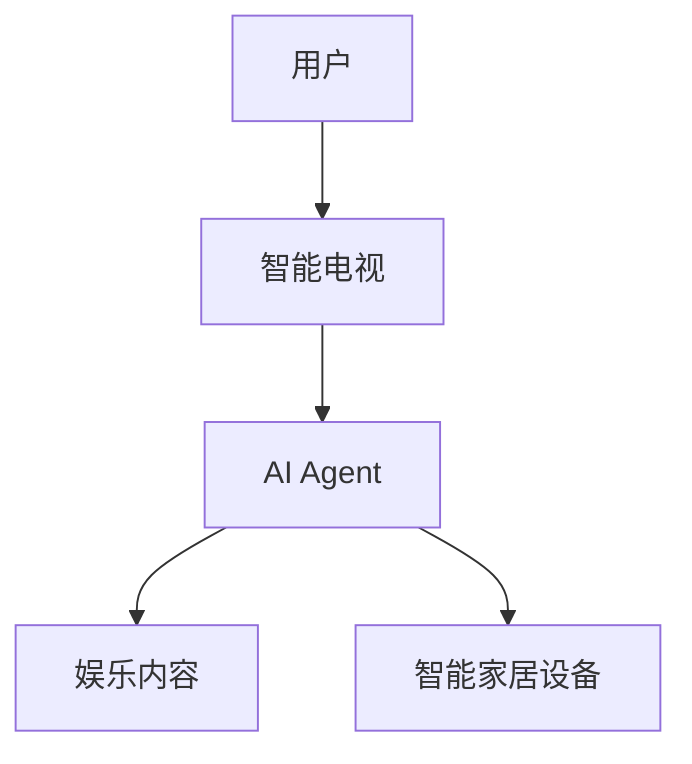
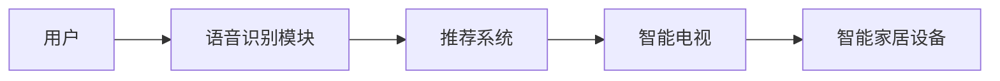

                 


# 智能电视：AI Agent的家庭娱乐管家系统

> 关键词：智能电视，AI Agent，家庭娱乐，人工智能，物联网

> 摘要：智能电视作为现代家庭娱乐的核心设备，正在通过AI Agent技术实现更智能化、个性化的服务。本文将详细探讨智能电视AI Agent的家庭娱乐管家系统的背景、核心概念、算法原理、系统架构、项目实战以及未来发展趋势。

---

## 第1章: 智能电视的发展与AI Agent的引入

### 1.1 智能电视的定义与发展历程

智能电视是一种结合了传统电视功能与智能设备特性的新型电视，它不仅能够接收传统电视信号，还具备联网功能，能够运行各种应用程序，提供丰富的互联网内容。智能电视的发展经历了以下几个阶段：

1. **传统电视阶段**：功能单一，仅能接收电视台信号。
2. **数字电视阶段**：引入数字信号，提升了画质和音质。
3. **智能电视阶段**：加入操作系统，支持应用程序下载和网络连接，具备智能功能。

智能电视的核心特点包括：联网功能、应用程序支持、智能语音控制、个性化推荐等。

### 1.2 AI Agent的基本概念与特点

AI Agent（人工智能代理）是一种能够感知环境、自主决策并执行任务的智能体。其特点包括：

1. **自主性**：能够在没有人工干预的情况下自主运行。
2. **反应性**：能够实时感知环境并做出反应。
3. **学习能力**：能够通过数据学习和优化自身行为。
4. **交互性**：能够与用户或其他系统进行交互。

### 1.3 智能电视与AI Agent的结合

智能电视通过引入AI Agent技术，能够实现更智能化的家庭娱乐管理。AI Agent在智能电视中的应用场景包括：

1. **语音控制**：用户可以通过语音指令控制电视，如播放、暂停、调节音量等。
2. **个性化推荐**：AI Agent能够根据用户的观看习惯推荐相关内容。
3. **智能家居控制**：通过与智能家居设备的连接，AI Agent可以实现电视与其他设备的联动，如灯光、空调等。

通过AI Agent，智能电视能够提供更便捷、更个性化的家庭娱乐体验。

---

## 第2章: 智能电视AI Agent的核心概念与联系

### 2.1 核心概念原理

AI Agent在智能电视中的工作原理可以分为三个主要环节：

1. **感知层**：通过传感器或用户输入获取环境信息。
2. **决策层**：基于感知信息进行分析和决策。
3. **执行层**：根据决策结果执行相应操作。

### 2.2 核心概念属性特征对比

下表展示了AI Agent在智能电视中的核心概念属性特征对比：

| 属性 | 感知层 | 决策层 | 执行层 |
|------|--------|--------|--------|
| 功能 | 获取环境信息 | 分析信息并做出决策 | 执行决策 |
| 输入 | 用户指令、环境数据 | 分析结果 | 无 |
| 输出 | 无 | 决策结果 | 用户反馈、环境变化 |

### 2.3 ER实体关系图架构

以下是智能电视AI Agent系统的ER实体关系图：



---

## 第3章: 智能电视AI Agent的算法原理

### 3.1 自然语言处理算法

自然语言处理（NLP）是AI Agent实现语音识别和理解的核心技术。常用的NLP算法包括：

1. **分词**：将用户输入的语音分割成词语。
2. **句法分析**：分析句子的语法结构。
3. **语义理解**：理解用户意图并生成相应的响应。

#### 示例代码

```python
import nltk

text = "我想看电影"
words = nltk.word_tokenize(text)
print(words)
```

#### 输出结果
```
['我想', '看电影']
```

### 3.2 语音识别算法

语音识别算法通过将语音信号转换为文本，实现用户的语音输入。常用的语音识别算法包括：

1. **基于模板匹配的语音识别**：通过预定义模板匹配输入语音。
2. **基于隐马尔可夫模型的语音识别**：利用隐马尔可夫模型进行语音识别。

#### 示例代码

```python
import speech_recognition as sr

r = sr.Recognizer()
with sr.AudioFile("input.wav") as source:
    audio = r.listen(source)
    text = r.recognize_google(audio)
    print(text)
```

### 3.3 推荐算法

推荐算法通过分析用户的行为和偏好，推荐相关内容。常用的推荐算法包括：

1. **基于协同过滤的推荐**：通过用户相似性推荐内容。
2. **基于内容的推荐**：通过内容特征推荐相关项。

#### 示例代码

```python
import pandas as pd
from sklearn.metrics.pairwise import cosine_similarity

# 假设我们有一个电影数据集，其中包含电影的特征向量
movies = pd.DataFrame({
    'movie_id': [1, 2, 3],
    'features': [[0.2, 0.5], [0.7, 0.1], [0.4, 0.3]]
})

# 计算相似性
similarity_matrix = cosine_similarity(movies['features'])
print(similarity_matrix)
```

---

## 第4章: 智能电视AI Agent的系统架构

### 4.1 系统功能设计

智能电视AI Agent系统的功能模块包括：

1. **用户界面**：提供语音和图形交互界面。
2. **语音识别模块**：实现语音输入的识别和转换。
3. **推荐系统**：基于用户行为推荐相关内容。
4. **智能家居控制**：实现与其他智能家居设备的联动。

### 4.2 系统架构设计

以下是智能电视AI Agent系统的架构图：



---

## 第5章: 智能电视AI Agent的项目实战

### 5.1 环境安装

在开始开发智能电视AI Agent之前，需要安装以下环境和工具：

1. **Python编程语言**
2. **TensorFlow或Keras深度学习框架**
3. **SpeechRecognition库**
4. **智能家居API**

### 5.2 核心实现

以下是智能电视AI Agent的核心实现代码：

```python
import speech_recognition as sr
from sklearn.neighbors import NearestNeighbors

# 初始化语音识别器
r = sr.Recognizer()

# 识别语音输入
with sr.AudioFile("input.wav") as source:
    audio = r.listen(source)
    text = r.recognize_google(audio)
    print("识别结果:", text)

# 推荐系统实现
movies = {
    'movie_id': [1, 2, 3],
    'features': [[0.2, 0.5], [0.7, 0.1], [0.4, 0.3]]
}

# 计算相似性
model = NearestNeighbors(n_neighbors=2)
model.fit(movies['features'])
distances, indices = model.kneighbors([text_features])
print("推荐电影:", movies['movie_id'][indices[0][0]])
```

### 5.3 案例分析

通过上述代码，我们可以实现智能电视AI Agent的语音识别和推荐功能。用户可以通过语音指令控制电视，并根据观看历史推荐相关内容。

---

## 第6章: 智能电视AI Agent的最佳实践

### 6.1 注意事项

1. **数据隐私**：确保用户数据的安全性和隐私性。
2. **算法优化**：不断优化推荐算法，提高推荐准确率。
3. **用户体验**：关注用户体验，提供更便捷的交互方式。

### 6.2 小结

智能电视AI Agent通过结合人工智能和物联网技术，为家庭娱乐带来了更智能化的体验。通过本文的介绍，读者可以深入了解智能电视AI Agent的核心概念、算法原理和系统架构，并通过实际案例掌握其开发和应用。

### 6.3 扩展阅读

1. **《深度学习》—— Ian Goodfellow**
2. **《人工智能: 一种现代的方法》—— Stuart Russell, Peter Norvig**
3. **《自然语言处理实战》—— Harald Shutto**

---

## 作者：AI天才研究院 & 禅与计算机程序设计艺术

---

通过以上内容，您可以开始撰写一篇详细的、符合要求的智能电视AI Agent的技术博客文章。希望本文的内容能够为您提供清晰的思路和参考。

