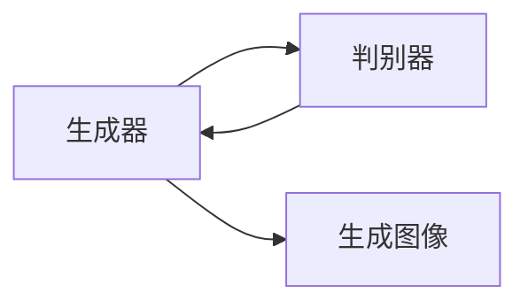
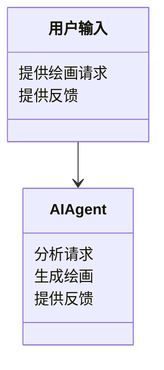
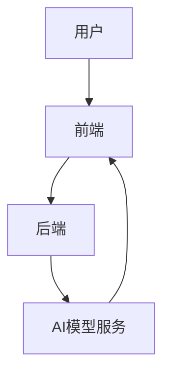

                 


# 智能画架：AI Agent的绘画技巧指导

**关键词**：AI Agent，绘画技巧，生成对抗网络，扩散模型，图像生成

**摘要**：  
本文旨在探讨AI Agent在绘画技巧指导中的应用，通过分析AI Agent的核心原理、算法模型、系统架构以及实际案例，深入解读如何利用AI技术提升绘画创作的效率与质量。文章从背景介绍、核心概念、算法原理、系统设计、项目实战到最佳实践，全面解析AI Agent在绘画领域的潜力与挑战。

---

## 第一部分：AI Agent与绘画的背景介绍

### 第1章：AI Agent的基本概念

#### 1.1 什么是AI Agent？
AI Agent（人工智能代理）是指能够感知环境、执行任务并做出决策的智能实体。在绘画领域，AI Agent可以作为辅助工具，帮助艺术家优化创作流程、探索新风格或修复图像。

#### 1.2 AI Agent的核心功能
1. **图像生成**：通过算法生成绘画草图或完整作品。
2. **风格迁移**：将一种绘画风格应用到另一种图像上。
3. **实时反馈**：分析用户绘画并提供实时建议。
4. **数据增强**：基于历史数据生成多样化的绘画素材。

#### 1.3 AI Agent在绘画中的应用
AI Agent可以通过以下方式提升绘画技巧：
- **辅助创作**：帮助艺术家快速生成灵感草图。
- **风格优化**：调整画作的色彩、笔触和构图。
- **个性化推荐**：根据用户的风格偏好推荐绘画技巧。

---

### 第2章：绘画技巧与AI的结合

#### 2.1 绘画技巧的基本概念
绘画技巧包括构图、色彩搭配、笔触运用等方面，是艺术家创作的核心能力。AI Agent可以通过分析海量绘画作品，提取这些技巧的规律。

#### 2.2 AI如何辅助绘画技巧的提升
1. **实时分析**：AI Agent可以实时分析用户绘画，指出构图中的问题。
2. **风格迁移**：通过迁移学习，将大师的风格应用到用户的绘画中。
3. **数据增强**：生成多样化的绘画素材，帮助用户练习不同技巧。

#### 2.3 AI在绘画技巧中的应用领域
- **艺术教育**：为初学者提供实时指导。
- **创作辅助**：帮助专业艺术家探索新风格。
- **艺术修复**：修复老旧或损坏的画作。

---

## 第二部分：AI Agent绘画的核心概念与联系

### 第3章：AI Agent绘画的核心原理

#### 3.1 基于生成对抗网络的绘画生成
生成对抗网络（GAN）由生成器和判别器组成，通过对抗训练生成逼真的绘画作品。生成器负责生成图像，判别器负责判断图像的真实性。

#### 3.2 基于扩散模型的绘画生成
扩散模型（Diffusion Model）通过逐步添加噪声并逐步去除噪声来生成图像，具有生成质量高、稳定性好的特点。

#### 3.3 基于强化学习的绘画优化
强化学习（Reinforcement Learning）通过奖励机制，优化绘画的质量和风格。

### 第4章：不同AI绘画模型的对比分析

#### 4.1 GAN模型与Diffusion模型的对比
| 特性               | GAN模型               | Diffusion模型            |
|--------------------|----------------------|--------------------------|
| 生成速度           | 快                   | 较慢                     |
| 图像质量           | 较低                 | 较高                     |
| 训练复杂度         | 较高                 | 较低                     |
| 应用场景           | 图像生成、风格迁移    | 图像生成、修复            |

#### 4.2 其他AI绘画模型的优缺点
- **优点**：生成速度快、资源消耗低。
- **缺点**：生成图像的质量有限。

---

## 第三部分：AI Agent绘画的算法原理

### 第4章：生成对抗网络（GAN）原理

#### 4.1 GAN的基本结构
GAN由生成器和判别器组成，生成器通过对抗判别器的反馈不断优化生成的图像。

#### 4.2 GAN的损失函数
生成器的损失函数：$$ L_G = \log(D(G(z))) $$
判别器的损失函数：$$ L_D = \log(D(x)) + \log(1 - D(G(z))) $$】

#### 4.3 GAN的实现流程


### 第5章：扩散模型（Diffusion Model）原理

#### 5.1 扩散模型的基本结构
扩散模型通过正向过程添加噪声，反向过程逐步去除噪声。

#### 5.2 扩散模型的正向过程
$$ x_t = \sqrt{1-\beta_t}x_{t-1} + \sqrt{\beta_t}\epsilon $$

#### 5.3 扩散模型的反向过程
$$ x_{t-1} = \frac{x_t - \epsilon\sqrt{\beta_t}}{\sqrt{1-\beta_t}} $$

---

## 第四部分：AI Agent绘画的系统分析与架构设计

### 第6章：系统功能设计

#### 6.1 领域模型


#### 6.2 系统架构设计


### 第7章：接口设计与交互流程

#### 7.1 接口设计
1. **用户输入接口**：接收用户的绘画请求。
2. **AI模型接口**：调用AI模型生成绘画。
3. **反馈接口**：返回生成的绘画和优化建议。

#### 7.2 交互流程
1. 用户提交绘画请求。
2. AI Agent分析请求并生成绘画。
3. AI Agent返回绘画并提供优化建议。

---

## 第五部分：项目实战

### 第8章：AI绘画系统的实现

#### 8.1 环境安装
安装必要的库：
```bash
pip install torch torchvision transformers matplotlib
```

#### 8.2 核心实现
```python
import torch
from torch import nn
from torchvision.transforms import ToTensor

# 定义生成器
class Generator(nn.Module):
    def __init__(self):
        super(Generator, self).__init__()
        self.fc = nn.Linear(100, 256)
        self.up = nn.Upsample(scale_factor=2, mode='bilinear')
        self.conv = nn.Conv2d(3, 3, kernel_size=3, padding=1)
    
    def forward(self, x):
        x = torch.relu(self.fc(x))
        x = self.up(x)
        x = torch.relu(self.conv(x))
        return x

# 定义判别器
class Discriminator(nn.Module):
    def __init__(self):
        super(Discriminator, self).__init__()
        self.conv = nn.Conv2d(3, 64, kernel_size=3, padding=1)
        self.fc = nn.Linear(64*64*64, 1)
    
    def forward(self, x):
        x = torch.relu(self.conv(x))
        x = torch.sigmoid(self.fc(x))
        return x
```

#### 8.3 代码应用解读
生成器和判别器通过对抗训练生成绘画，生成器不断优化以欺骗判别器。

### 第9章：实际案例分析

#### 9.1 案例分析
使用生成器生成绘画草图，用户根据反馈优化绘画。

#### 9.2 案例总结
通过AI Agent的反馈，用户能够快速优化绘画质量。

---

## 第六部分：最佳实践与总结

### 第10章：最佳实践

#### 10.1 使用AI Agent的注意事项
- 确保数据隐私。
- 定期更新模型。

#### 10.2 提升绘画技巧的技巧
- 结合AI Agent与传统绘画技巧。
- 多尝试不同的风格。

### 第11章：小结

通过本文的分析与实践，读者可以深入了解AI Agent在绘画技巧指导中的潜力。未来，随着技术的不断发展，AI Agent将在绘画领域发挥更大的作用。

---

**作者：AI天才研究院/AI Genius Institute & 禅与计算机程序设计艺术 /Zen And The Art of Computer Programming**

