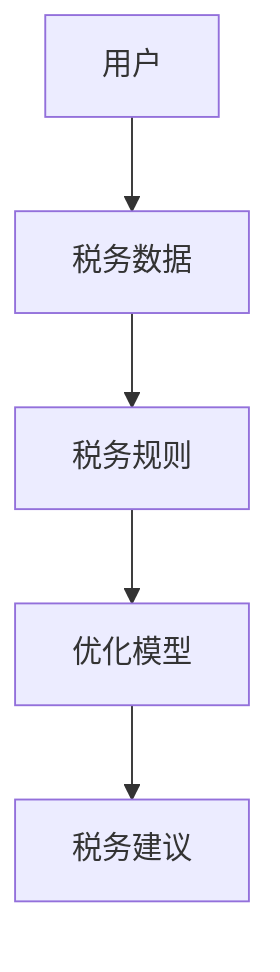
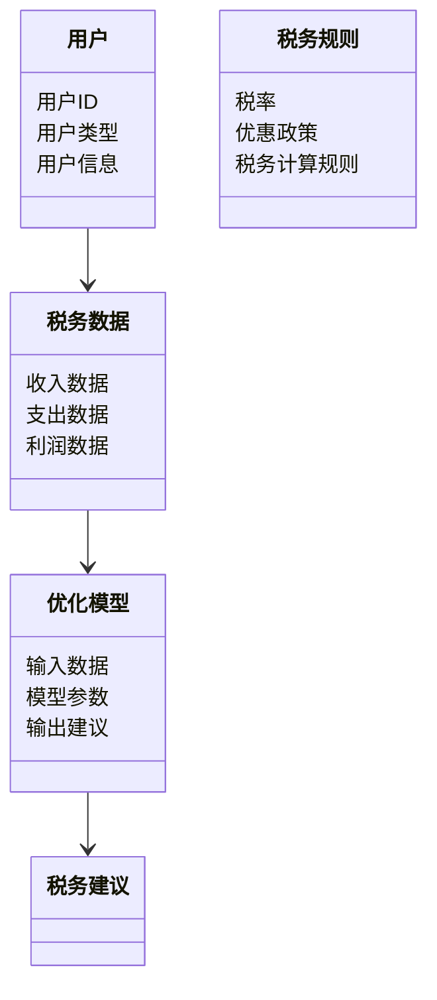
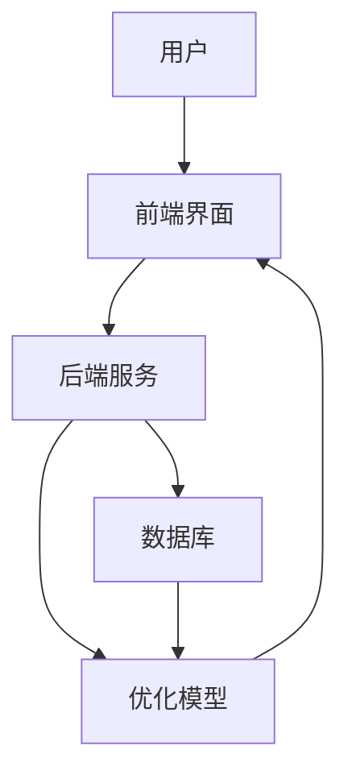
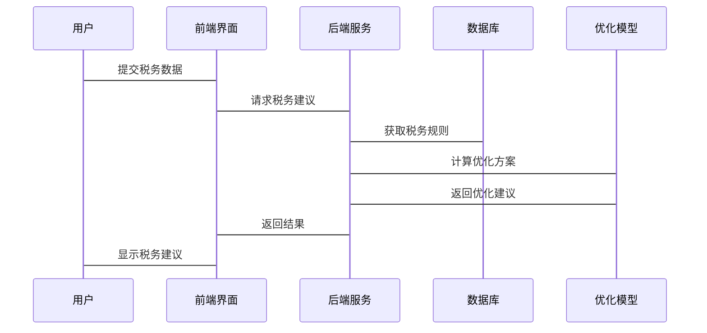

                 


```markdown
# 智能税务规划与建议

> 关键词：智能税务规划、人工智能、数据驱动、优化算法、系统架构、税务合规

> 摘要：智能税务规划与建议是通过人工智能技术优化税务策略，提高税务合规性和效率。本文从背景介绍、核心概念、算法原理、系统架构、项目实战和最佳实践等方面详细阐述智能税务规划的实现与应用。

---

# 第一部分: 智能税务规划与建议的背景与概念

# 第1章: 智能税务规划与建议的背景介绍

## 1.1 智能税务规划的背景与问题背景
### 1.1.1 传统税务规划的局限性
传统税务规划依赖人工分析，存在效率低、误差大、难以覆盖复杂场景等问题。

### 1.1.2 数据驱动与智能化的需求
随着大数据和人工智能技术的发展，智能化税务规划成为必然趋势。

### 1.1.3 税务合规性与优化的平衡
税务规划需要在合规性与优化目标之间找到平衡点，避免因追求优化而违反税法规定。

## 1.2 智能税务规划的核心概念
### 1.2.1 税务规划的基本概念
税务规划是指通过合法手段优化税务负担，实现企业和个人税务成本最小化。

### 1.2.2 智能化税务规划的定义
智能化税务规划是利用人工智能技术，基于大数据分析和预测模型，为用户提供建议和优化方案的过程。

### 1.2.3 智能税务规划的目标与边界
目标：最大化税务合规性与优化效果；边界：遵守税法规定，避免税务风险。

## 1.3 智能税务规划的核心要素
### 1.3.1 数据来源与处理
数据来源包括企业财务数据、税务政策数据、市场数据等，需进行清洗、预处理和特征提取。

### 1.3.2 税务规则与政策
包括税法规定、优惠政策、税率变化等，是智能税务规划的基础。

### 1.3.3 优化算法与模型
基于机器学习、深度学习等算法，构建预测和优化模型。

## 1.4 智能税务规划的行业现状
### 1.4.1 全球税务智能化趋势
各国纷纷引入智能化税务管理，提升税务效率和合规性。

### 1.4.2 国内税务智能化的发展阶段
从基础自动化向智能化、个性化迈进。

### 1.4.3 企业与个人用户的智能化需求
企业希望降低税务成本，个人用户追求税务合规与优化的平衡。

## 1.5 本章小结
智能税务规划通过人工智能技术，帮助用户在合规的前提下优化税务负担，是当前税务管理的重要发展方向。

---

# 第二部分: 智能税务规划的核心概念与技术基础

# 第2章: 智能税务规划的核心概念与联系

## 2.1 智能税务规划的核心概念
### 2.1.1 数据驱动的税务分析
通过大数据分析，提取有价值的信息，支持税务决策。

### 2.1.2 智能优化算法
利用机器学习、深度学习等算法，构建优化模型。

### 2.1.3 税务规则引擎
根据税法规定，动态调整税务规划策略。

## 2.2 核心概念的对比分析
### 2.2.1 数据来源对比
| 数据来源 | 描述 | 优缺点 |
|----------|------|--------|
| 企业财务数据 | 包括收入、支出、利润等 | 准确性高，但数据量大，处理复杂 |
| 税务政策数据 | 包括税率、优惠政策等 | 信息量小，但对规划影响大 |
| 市场数据 | 包括行业趋势、经济指标等 | 可辅助预测，但不确定性高 |

### 2.2.2 分析方法对比
| 分析方法 | 描述 | 适用场景 |
|----------|------|----------|
| 监督学习 | 基于标注数据训练模型 | 税务预测、分类问题 |
| 无监督学习 | 从无标签数据中发现规律 | 数据聚类、异常检测 |
| 强化学习 | 通过策略优化实现目标 | 税务策略优化、动态调整 |

### 2.2.3 优化模型对比
| 优化模型 | 描述 | 适用场景 |
|----------|------|----------|
| 线性回归 | 预测连续型变量 | 税务预测、成本估算 |
| 支持向量机 | 分类与回归 | 税务分类、风险评估 |
| 随机森林 | 集成学习模型 | 高维数据处理、特征重要性分析 |

## 2.3 实体关系图（ER图）


## 2.4 本章小结
智能税务规划的核心在于数据驱动的分析和智能优化算法的应用，通过多种技术手段的结合，实现高效的税务规划。

---

# 第三部分: 智能税务规划的算法原理

# 第3章: 智能税务规划的算法原理

## 3.1 机器学习在税务规划中的应用
### 3.1.1 监督学习模型
用于税务预测、分类等问题。

### 3.1.2 无监督学习模型
用于数据聚类、异常检测等。

### 3.1.3 强化学习模型
用于动态策略优化。

## 3.2 常见算法的实现与对比
### 3.2.1 线性回归模型
用于预测连续型变量，如税务负担。

### 3.2.2 支持向量机（SVM）
用于分类与回归，如税务风险评估。

### 3.2.3 随机森林与梯度提升树
用于高维数据处理和特征重要性分析。

## 3.3 算法实现的数学模型
### 3.3.1 线性回归模型
$$ y = \beta_0 + \beta_1 x_1 + \beta_2 x_2 + \cdots + \beta_n x_n $$

### 3.3.2 支持向量机（SVM）
$$ \text{最大化} \quad \frac{1}{2}||\mathbf{w}||^2 $$
$$ \text{约束} \quad y_i (\mathbf{w} \cdot \mathbf{x}_i + b) \geq 1, \forall i $$

### 3.3.3 随机森林
通过集成学习，构建多棵决策树，提高模型鲁棒性。

## 3.4 算法实现的代码示例
```python
import pandas as pd
from sklearn.ensemble import RandomForestRegressor

# 数据加载与预处理
data = pd.read_csv('tax_data.csv')
X = data.drop('target', axis=1)
y = data['target']

# 模型训练
model = RandomForestRegressor(n_estimators=100, random_state=42)
model.fit(X, y)

# 模型预测
predictions = model.predict(X)
```

## 3.5 本章小结
通过机器学习算法的实现，智能税务规划能够有效地预测和优化税务负担，提升税务管理效率。

---

# 第四部分: 智能税务规划的系统架构设计

# 第4章: 智能税务规划的系统架构设计

## 4.1 系统功能设计
### 4.1.1 领域模型设计


### 4.1.2 系统架构设计


## 4.2 接口设计与交互流程
### 4.2.1 系统接口设计
| 接口名称 | 接口描述 | 请求方式 | 请求参数 | 返回值 |
|----------|----------|----------|----------|--------|
| 获取税务建议 | 提供税务规划建议 | POST | 用户ID, 数据 | 税务建议 |

### 4.2.2 交互流程


## 4.3 本章小结
通过系统架构设计，智能税务规划能够高效地处理大量数据，提供实时的税务建议，满足用户需求。

---

# 第五部分: 智能税务规划的项目实战

# 第5章: 智能税务规划的项目实战

## 5.1 环境安装与配置
### 5.1.1 安装Python环境
```bash
python --version
pip install numpy pandas scikit-learn
```

## 5.2 数据收集与预处理
### 5.2.1 数据来源
从企业财务系统、税务数据库等获取数据。

### 5.2.2 数据清洗
处理缺失值、异常值，进行特征工程。

## 5.3 模型训练与优化
### 5.3.1 模型选择
选择合适的机器学习模型，进行训练和调优。

### 5.3.2 模型评估
通过交叉验证、准确率、召回率等指标评估模型性能。

## 5.4 税务建议的生成与展示
### 5.4.1 建议生成
基于模型输出，生成税务优化建议。

### 5.4.2 展示界面
通过可视化界面展示建议，方便用户理解和实施。

## 5.5 项目总结
### 5.5.1 项目成果
成功实现智能税务规划系统，提供高效、准确的税务建议。

### 5.5.2 项目经验
数据质量对模型性能影响重大，需重视数据预处理和特征工程。

## 5.6 本章小结
通过项目实战，验证了智能税务规划系统的可行性和有效性。

---

# 第六部分: 智能税务规划的最佳实践与总结

# 第6章: 智能税务规划的最佳实践

## 6.1 实际应用中的注意事项
### 6.1.1 数据隐私与安全
确保税务数据的安全性，避免信息泄露。

### 6.1.2 税务政策的变化
及时更新税务规则，适应政策变化。

### 6.1.3 模型的可解释性
确保模型结果可解释，便于用户理解和信任。

## 6.2 案例分析
### 6.2.1 企业税务优化案例
通过智能税务规划，某企业成功降低税务负担。

### 6.2.2 个人税务规划案例
帮助高收入个人实现税务合规与优化。

## 6.3 未来发展趋势
### 6.3.1 技术进步
人工智能、大数据技术的进一步发展。

### 6.3.2 行业需求
企业与个人对智能化税务服务的需求不断增加。

## 6.4 本章小结
智能税务规划是未来税务管理的重要方向，需结合技术与业务需求，不断提升系统性能和用户体验。

---

# 第七部分: 总结

# 第7章: 总结

## 7.1 核心内容回顾
智能税务规划通过人工智能技术，实现高效、准确的税务管理。

## 7.2 未来展望
随着技术的不断进步，智能税务规划将在更多领域发挥重要作用。

## 7.3 致谢
感谢读者的支持与关注。

---

# 作者：AI天才研究院 & 禅与计算机程序设计艺术

---

**注意：** 以上内容为目录大纲，实际写作时需要根据每个章节的具体内容进行详细展开，确保每部分内容丰富、逻辑清晰，同时结合实际案例和代码示例，使读者能够深入理解智能税务规划的核心思想和实现方法。
```

