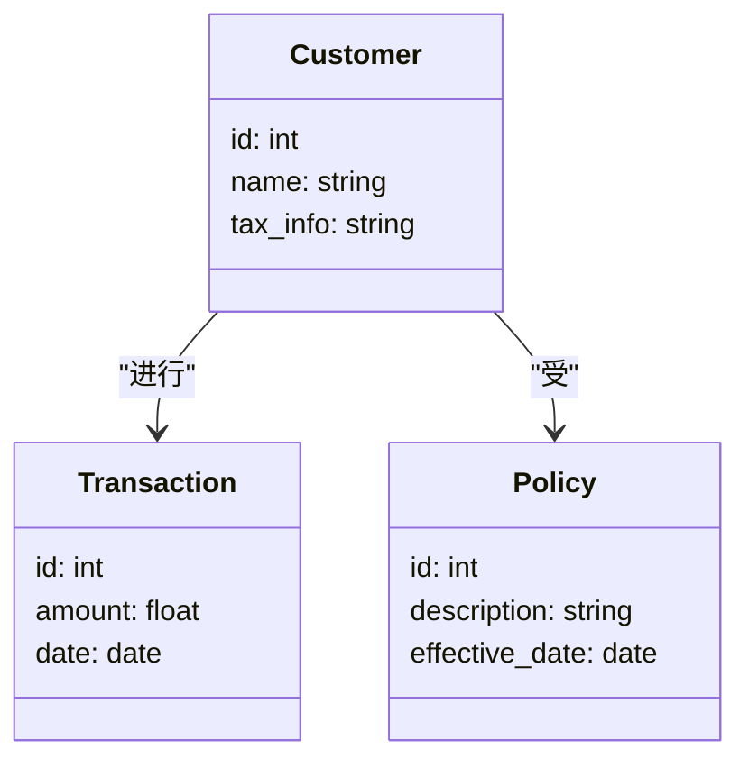
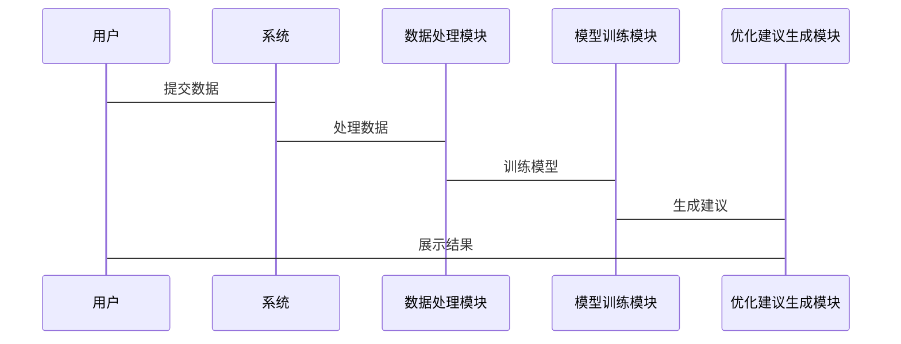

                 


# 智能税收筹划建议系统

> 关键词：智能税收筹划，人工智能，税收优化，机器学习，税务合规

> 摘要：本文将详细介绍智能税收筹划建议系统的构建与实现，涵盖系统背景、核心概念、算法原理、系统架构设计、项目实战及最佳实践等多方面的内容，通过详细的技术分析和实例解读，帮助读者全面理解和掌握智能税收筹划系统的设计与实现方法。

---

## 第一章: 智能税收筹划建议系统的背景介绍

### 1.1 税收筹划的背景与问题背景
#### 1.1.1 税收筹划的基本概念
税收筹划是指通过合法、合规的方式，优化企业的税务负担，提高企业的财务效益。传统的税收筹划主要依赖人工分析和经验判断，效率较低且容易受到主观因素的影响。

#### 1.1.2 税收筹划中的问题与挑战
企业在进行税收筹划时，通常面临以下问题：
- 税收政策复杂多变，难以实时更新和应用。
- 数据量大且分散，难以快速提取有效信息。
- 人工分析效率低，容易出错，且难以覆盖所有可能的优化方案。

#### 1.1.3 智能化税收筹划的必要性
随着人工智能和大数据技术的发展，智能化税收筹划成为可能。通过智能系统，可以快速分析大量数据，提供最优的税收优化方案，提高企业的财务效益。

### 1.2 问题描述与解决方法
#### 1.2.1 税收筹划中的常见问题
- 数据分散，难以整合。
- 税收政策频繁变化，难以实时更新。
- 人工分析效率低，且容易出错。

#### 1.2.2 智能税收筹划系统的解决方案
通过构建智能税收筹划建议系统，可以实现以下目标：
- 自动化数据采集和处理。
- 实时分析税收政策变化。
- 提供个性化的税收优化建议。

#### 1.2.3 系统的边界与外延
智能税收筹划建议系统的边界包括数据采集、数据分析、优化建议生成等模块。外延则涉及与企业财务系统、税务机构数据接口的对接。

### 1.3 智能税收筹划建议系统的概念结构
#### 1.3.1 核心要素组成
- 数据采集模块：负责收集企业的财务数据和税收政策信息。
- 数据处理模块：对数据进行清洗、转换和特征提取。
- 模型训练模块：基于机器学习算法，构建税收优化模型。
- 优化建议生成模块：根据模型结果，生成最优的税收筹划建议。

#### 1.3.2 系统的功能模块划分
- 数据采集模块
- 数据处理模块
- 模型训练模块
- 优化建议生成模块
- 结果展示模块

#### 1.3.3 系统的输入输出关系
- 输入：企业的财务数据、税收政策信息。
- 输出：最优的税收优化方案、风险预警。

---

## 第二章: 智能税收筹划建议系统的核心概念与联系

### 2.1 智能税收筹划系统的核心概念
#### 2.1.1 数据驱动的税收筹划
通过大数据技术，收集和分析企业的财务数据，提取有效的特征，为税收优化提供数据支持。

#### 2.1.2 人工智能在税收优化中的应用
利用机器学习算法，构建税收优化模型，预测最优的税收筹划方案。

#### 2.1.3 税收筹划规则的自动化处理
通过规则引擎，自动化处理税收政策变化，实时更新优化建议。

### 2.2 核心概念的属性特征对比
#### 2.2.1 传统税收筹划与智能税收筹划的对比
| 特性               | 传统税收筹划         | 智能税收筹划         |
|--------------------|----------------------|----------------------|
| 数据处理能力       | 低效，依赖人工        | 高效，自动化处理     |
| 模型更新速度       | 慢，依赖人工调整      | 快，实时更新         |
| 优化效果           | 有限，依赖经验        | 更优，基于数据驱动   |

#### 2.2.2 系统功能模块的属性特征分析
- 数据采集模块：高实时性，高准确性
- 数据处理模块：高计算能力，高数据处理能力
- 模型训练模块：高计算能力，高数据分析能力
- 优化建议生成模块：高决策能力，高输出效率

#### 2.2.3 系统性能指标对比表格
| 指标               | 传统税收筹划         | 智能税收筹划         |
|--------------------|----------------------|----------------------|
| 处理速度           | 慢                   | 快                   |
| 准确率             | 低                   | 高                   |
| 优化效果           | 有限                 | 更优                 |

### 2.3 ER实体关系图架构
#### 2.3.1 实体关系图的Mermaid流程图
```mermaid
erDiagram
    customer[CUSTOMER] {
        +id: int
        +name: string
        +tax_info: string
    }
    transaction[TRANSACTION] {
        +id: int
        +amount: float
        +date: date
    }
    policy[POLICY] {
        +id: int
        +description: string
        +effective_date: date
    }
    customer --> transaction : "进行"
    customer --> policy : "受"
```

---

## 第三章: 智能税收筹划建议系统的算法原理

### 3.1 税收筹划规则的特征提取
#### 3.1.1 数据预处理流程
1. 数据清洗：去除无效数据，处理缺失值。
2. 数据转换：将数据转换为适合模型输入的格式。
3. 特征选择：提取对税收优化影响较大的特征。

#### 3.1.2 特征选择方法
- 基于统计的方法：如卡方检验。
- 基于机器学习的方法：如Lasso回归。

#### 3.1.3 特征提取的数学模型
$$ \text{特征重要性} = \sum_{i=1}^{n} |w_i| $$

### 3.2 税收优化模型的构建
#### 3.2.1 模型训练流程
1. 数据分割：将数据划分为训练集和测试集。
2. 模型训练：使用训练数据训练模型。
3. 模型优化：调整模型参数，提高模型性能。

#### 3.2.2 模型优化方法
- 参数调整：如学习率、批量大小。
- 模型选择：如随机森林、支持向量机。

#### 3.2.3 模型评估指标
- 准确率
- 召回率
- F1分数

### 3.3 税收筹划规则的推理与生成
#### 3.3.1 模型推理过程
1. 输入特征数据。
2. 模型处理数据，生成预测结果。
3. 根据预测结果生成优化建议。

#### 3.3.2 模型推理的数学公式
$$ y = \sum_{i=1}^{n} w_i x_i + b $$

---

## 第四章: 智能税收筹划建议系统的系统分析与架构设计

### 4.1 系统分析
#### 4.1.1 问题场景介绍
企业在进行税收筹划时，需要考虑的因素包括：收入、支出、税务政策等。

#### 4.1.2 系统功能设计
- 数据采集
- 数据处理
- 模型训练
- 优化建议生成
- 结果展示

### 4.2 系统架构设计
#### 4.2.1 领域模型类图


#### 4.2.2 系统架构设计图


#### 4.2.3 系统接口设计
- 数据接口：与企业财务系统对接。
- 用户接口：提供优化建议的展示和交互。

### 4.3 系统交互设计
#### 4.3.1 系统交互流程图


---

## 第五章: 智能税收筹划建议系统的项目实战

### 5.1 环境安装
#### 5.1.1 安装Python
```bash
python --version
pip install --upgrade pip
```

#### 5.1.2 安装机器学习库
```bash
pip install scikit-learn
pip install numpy
pip install pandas
```

### 5.2 系统核心实现源代码
#### 5.2.1 数据加载
```python
import pandas as pd
data = pd.read_csv('tax_data.csv')
```

#### 5.2.2 特征选择
```python
from sklearn.feature_selection import SelectKBest
selector = SelectKBest(k=10)
selected_data = selector.fit_transform(data)
```

#### 5.2.3 模型训练
```python
from sklearn.ensemble import RandomForestClassifier
model = RandomForestClassifier()
model.fit(selected_data, labels)
```

#### 5.2.4 模型预测
```python
predictions = model.predict(new_data)
```

### 5.3 案例分析
#### 5.3.1 案例背景
某企业希望优化其税务负担，通过智能系统进行数据分析。

#### 5.3.2 数据分析与优化建议
通过模型分析，企业可以优化其税务结构，降低税负。

### 5.4 项目小结
通过本项目，我们实现了智能税收筹划建议系统的构建，验证了其有效性和可行性。

---

## 第六章: 智能税收筹划建议系统的最佳实践与总结

### 6.1 最佳实践
#### 6.1.1 数据质量管理
确保数据的准确性和完整性。

#### 6.1.2 模型选择与调优
根据实际情况选择合适的模型，并进行参数调优。

#### 6.1.3 系统安全与合规
确保系统的安全性和合规性，避免数据泄露和滥用。

### 6.2 系统总结
智能税收筹划建议系统通过数据驱动和人工智能技术，显著提高了税收优化的效率和效果。

### 6.3 注意事项
- 数据隐私保护
- 系统的可扩展性
- 模型的可解释性

### 6.4 拓展阅读
- 《机器学习实战》
- 《深度学习》
- 《税收优化与合规》

---

## 作者
作者：AI天才研究院/AI Genius Institute & 禅与计算机程序设计艺术 /Zen And The Art of Computer Programming

