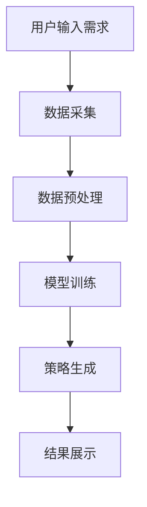
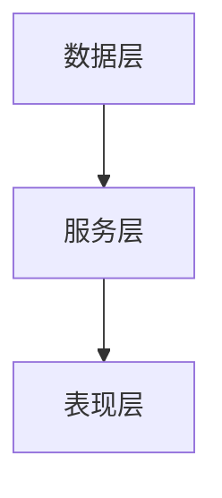
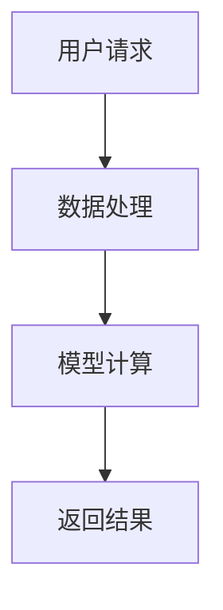

                 


# 智能税收筹划策略推荐系统

> 关键词：智能税收筹划、推荐系统、人工智能、机器学习、大数据分析

> 摘要：本文详细介绍了智能税收筹划策略推荐系统的构建与实现，涵盖其背景、核心概念、算法原理、系统设计、项目实战及总结。通过结合机器学习与大数据分析技术，提出了一种高效的智能税收筹划策略推荐方法，为企事业单位和个人提供精准的税务优化方案。

---

## 第1章 智能税收筹划概述

### 1.1 税收筹划的基本概念

#### 1.1.1 税收筹划的定义与特点
税收筹划是指在遵守税收法律法规的前提下，通过合法手段优化纳税方案，降低税负，提高资金使用效率的活动。其特点包括合法性、规划性、风险可控性和收益性。税收筹划不仅帮助企业优化税务负担，还能提升企业的财务健康度和竞争力。

#### 1.1.2 税收筹划的法律与伦理边界
税收筹划必须在法律框架内进行，避免通过偷税漏税等非法手段降低税负。同时，税收筹划需遵循伦理道德，确保纳税行为的透明性和合规性。企业应建立健全的税务管理制度，确保税收筹划活动在法律和道德的边界内进行。

#### 1.1.3 税收筹划与企业财务管理的关系
税收筹划是企业财务管理的重要组成部分，贯穿于企业的日常经营活动中。通过合理的税收筹划，企业可以降低税负，优化资本结构，提升整体盈利能力。同时，税收筹划也是企业风险管理的重要手段，有助于企业在复杂多变的税收政策环境中稳健发展。

### 1.2 智能税收筹划的背景与意义

#### 1.2.1 传统税收筹划的局限性
传统税收筹划主要依赖人工分析，效率低下，难以应对复杂多变的税收政策和市场环境。此外，传统方法难以处理海量数据，且容易受到主观因素的影响，导致筹划结果的不准确性和片面性。

#### 1.2.2 智能化技术在税收筹划中的应用前景
随着人工智能、大数据分析和机器学习技术的快速发展，智能税收筹划逐渐成为可能。通过智能化技术，可以实时分析海量数据，快速生成最优税收筹划方案，显著提高筹划效率和精准度。

#### 1.2.3 智能税收筹划对企业和个人的价值
智能税收筹划能够帮助企业和个人实现税务优化，降低税负，提高资金使用效率。同时，智能系统能够及时捕捉税收政策的变化，提供前瞻性的筹划建议，帮助用户在复杂的税收环境中保持竞争优势。

---

## 第2章 智能税收筹划策略推荐系统的概念

### 2.1 智能税收筹划的核心要素

#### 2.1.1 数据来源与处理
智能税收筹划系统需要整合多源异构数据，包括企业的财务数据、税务政策数据、市场环境数据等。通过对这些数据进行清洗、转换和特征提取，为后续的模型训练提供高质量的数据支持。

#### 2.1.2 税收政策与法规数据库
系统需要构建一个全面的税收政策与法规数据库，涵盖最新的税收政策、法律法规和相关解读。通过实时更新和维护，确保数据库的准确性和权威性。

#### 2.1.3 用户需求分析与建模
基于用户的行为数据和偏好分析，构建用户画像和需求模型。通过数据挖掘技术，识别用户的潜在需求，为个性化税收筹划方案的制定提供依据。

### 2.2 智能税收筹划策略推荐系统的架构

#### 2.2.1 系统的整体架构设计
智能税收筹划策略推荐系统的整体架构包括数据采集层、模型训练层、策略生成层和结果展示层。各层之间通过数据接口进行交互，确保系统的高效运行。

#### 2.2.2 系统的核心功能模块
系统的核心功能模块包括数据采集与预处理、税收政策分析、用户需求分析、模型训练、策略生成和结果展示。每个模块都承担着特定的功能，协同完成税收筹划方案的推荐。

#### 2.2.3 系统的输入输出流程
系统的输入包括企业的财务数据、税务政策数据和用户需求数据。经过数据处理和模型训练后，系统输出个性化的税收筹划方案，帮助用户实现税务优化。

---

## 第3章 智能税收筹划的核心概念与联系

### 3.1 智能税收筹划的理论基础

#### 3.1.1 数据挖掘与机器学习在税收筹划中的应用
数据挖掘技术可以帮助发现数据中的潜在规律，而机器学习算法则能够基于历史数据预测未来的税收趋势。这些技术的应用使得智能税收筹划更加精准和高效。

#### 3.1.2 税收政策分析与优化的数学模型
通过建立数学模型，可以量化税收政策的影响，优化企业的税务结构。例如，线性规划模型可以用于企业所得税的最优分配。

#### 3.1.3 税收风险评估与控制的原理
基于统计学和概率论的税收风险评估模型，可以帮助企业在不确定的税收环境中识别和控制风险，确保税务合规性和稳健性。

### 3.2 智能税收筹划系统的核心要素

#### 3.2.1 数据采集与预处理
数据采集是智能税收筹划系统的第一步，需要从多种渠道获取相关数据，并进行清洗和转换，确保数据的准确性和一致性。

#### 3.2.2 税收政策规则库的构建
税收政策规则库的构建需要结合法律法规和税收政策的变化，通过规则提取和验证，建立一个动态更新的规则库。

#### 3.2.3 用户需求分析与建模
通过分析用户的历史行为数据和偏好，构建用户画像和需求模型，为个性化税收筹划方案的制定提供依据。

### 3.3 系统的实体关系与流程图

#### 3.3.1 实体关系图（ER图）
```mermaid
erDiagram
    user {
        ++ 用户ID : integer
        ++ 用户类型 : string
        ++ 用户需求 : string
    }
    tax_policy {
        ++ 政策ID : integer
        ++ 政策内容 : string
        ++ 生效日期 : date
    }
    data_source {
        ++ 数据ID : integer
        ++ 数据类型 : string
        ++ 数据内容 : string
    }
    rule_library {
        ++ 规则ID : integer
        ++ 规则内容 : string
        ++ 规则来源 : string
    }
    user -> data_source : 提供
    data_source -> rule_library : 更新
    tax_policy -> rule_library : 应用
```

#### 3.3.2 系统流程图


---

## 第4章 税收筹划策略推荐算法

### 4.1 基于协同过滤的推荐算法

#### 4.1.1 协同过滤的基本原理
协同过滤是一种基于用户行为相似性的推荐算法。通过分析用户的历史行为数据，找到与目标用户行为相似的其他用户，推荐他们喜欢的税收策略。

#### 4.1.2 用户-物品协同过滤的实现
用户-物品协同过滤通过计算用户与物品之间的相似度，找到与目标用户相似的用户群体，推荐他们购买或关注的物品。

#### 4.1.3 基于模型的协同过滤方法
基于模型的协同过滤方法通过构建用户-物品的潜在因子矩阵，分解用户和物品的特征，从而推荐相似的税收策略。

### 4.2 基于内容的推荐算法

#### 4.2.1 基于税收政策内容的特征提取
通过文本挖掘技术，提取税收政策内容的关键词和主题，建立税收策略的特征向量。

#### 4.2.2 税收策略的相似度计算
基于特征向量的相似度计算，找到与目标税收策略最相似的其他策略，进行推荐。

#### 4.2.3 基于内容的推荐实现
通过构建税收策略的内容特征库，利用相似度计算方法，推荐与目标策略相似的税收策略。

### 4.3 混合推荐算法

#### 4.3.1 协同过滤与内容推荐的结合
混合推荐算法结合协同过滤和内容推荐的优势，通过加权融合的方法，生成更精准的税收策略推荐。

#### 4.3.2 混合推荐算法的优势与挑战
混合推荐算法能够充分利用两种推荐方法的优点，避免单一方法的局限性。但其复杂性和计算成本也是需要考虑的挑战。

#### 4.3.3 混合推荐算法的实现流程
混合推荐算法的实现流程包括数据预处理、协同过滤推荐、内容推荐、结果融合和效果评估等步骤。

---

## 第5章 税收筹划策略推荐系统的数学模型

### 5.1 税收筹划的数学建模

#### 5.1.1 税收筹划问题的数学描述
通过数学模型描述税收筹划问题，包括目标函数、约束条件和决策变量的定义。

#### 5.1.2 税收优化的数学模型
基于线性规划或其他优化模型，建立税收优化的数学模型，用于指导税收策略的制定。

#### 5.1.3 税收风险的数学评估
通过概率论和统计学方法，建立税收风险的评估模型，量化税收风险的影响。

### 5.2 税收策略推荐的算法模型

#### 5.2.1 协同过滤算法的数学模型
协同过滤算法的数学模型包括相似度计算公式、推荐评分公式等。

#### 5.2.2 基于内容的推荐算法的数学模型
基于内容的推荐算法的数学模型包括特征向量的构建、相似度计算公式等。

#### 5.2.3 混合推荐算法的数学模型
混合推荐算法的数学模型包括协同过滤和内容推荐的融合公式。

---

## 第6章 智能税收筹划策略推荐系统的系统分析与架构设计

### 6.1 问题场景介绍

智能税收筹划策略推荐系统的目标是为企业和个人提供个性化的税收筹划方案，帮助他们在复杂的税收环境中优化税负。系统需要解决数据获取、模型训练和策略推荐等问题，满足用户的多样化需求。

### 6.2 系统功能设计

#### 6.2.1 系统的核心功能模块
系统的核心功能模块包括数据采集与预处理、模型训练、策略生成和结果展示。每个模块都有特定的功能，协同完成系统的整体目标。

#### 6.2.2 系统的领域模型类图
```mermaid
classDiagram
    class 用户 {
        用户ID : integer
        用户需求 : string
    }
    class 数据源 {
        数据ID : integer
        数据类型 : string
    }
    class 税收政策 {
        政策ID : integer
        政策内容 : string
    }
    class 规则库 {
        规则ID : integer
        规则内容 : string
    }
    user -->> 数据源 : 提供
    数据源 --> 规则库 : 更新
    税收政策 --> 规则库 : 应用
```

#### 6.2.3 系统的交互流程图


### 6.3 系统架构设计

#### 6.3.1 系统的整体架构设计
系统的整体架构包括数据层、服务层和表现层。数据层负责数据的存储和管理，服务层负责业务逻辑的处理，表现层负责用户界面的展示和交互。

#### 6.3.2 系统的架构图


### 6.4 系统接口设计

#### 6.4.1 系统的接口设计
系统的API接口设计包括数据接口、模型接口和结果接口。每个接口都有明确的输入和输出格式，确保系统的高效运行。

#### 6.4.2 系统的交互流程图


---

## 第7章 智能税收筹划策略推荐系统的项目实战

### 7.1 环境安装

#### 7.1.1 安装Python
安装Python 3.8或更高版本，确保兼容性。

#### 7.1.2 安装依赖库
安装必要的依赖库，如NumPy、Pandas、Scikit-learn、TensorFlow等。

#### 7.1.3 安装命令
```bash
pip install numpy pandas scikit-learn tensorflow
```

### 7.2 系统核心实现

#### 7.2.1 数据预处理
对数据进行清洗和转换，提取特征，为模型训练提供高质量的数据。

#### 7.2.2 模型训练
基于协同过滤和内容推荐算法，训练推荐模型，优化模型参数，提高推荐的准确性和效率。

#### 7.2.3 策略生成
根据训练好的模型，生成个性化的税收筹划策略，满足用户的多样化需求。

### 7.3 案例分析

#### 7.3.1 案例背景
以一家中型制造企业为例，分析其税务优化需求，提出个性化的税收筹划方案。

#### 7.3.2 数据准备
收集企业的财务数据、税务政策数据和市场环境数据，进行数据清洗和特征提取。

#### 7.3.3 模型训练
基于协同过滤和内容推荐算法，训练推荐模型，优化模型参数，提高推荐的精准度。

#### 7.3.4 策略推荐
根据模型生成的税收策略，帮助企业优化税务结构，降低税负，提高整体盈利能力。

---

## 第8章 总结与展望

### 8.1 最佳实践 tips

在实际应用中，需要注意数据隐私保护、模型的可解释性和系统的可维护性。建议结合企业的实际情况，灵活调整系统参数，确保系统的实用性和高效性。

### 8.2 小结

智能税收筹划策略推荐系统通过结合机器学习和大数据分析技术，为企事业单位和个人提供精准的税务优化方案。系统不仅提高了税收筹划的效率和精准度，还帮助企业应对复杂多变的税收政策环境。

### 8.3 注意事项

在实际应用中，需注意数据的合法性和合规性，确保系统的税务建议符合法律法规。同时，需定期更新税收政策数据库和模型参数，确保系统的持续优化和高效运行。

### 8.4 拓展阅读

推荐阅读《Python机器学习实战》、《数据挖掘导论》等书籍，进一步学习机器学习和数据挖掘技术在税收筹划中的应用。

---

## 作者信息

作者：AI天才研究院/AI Genius Institute & 禅与计算机程序设计艺术 /Zen And The Art of Computer Programming

感谢您的阅读！

