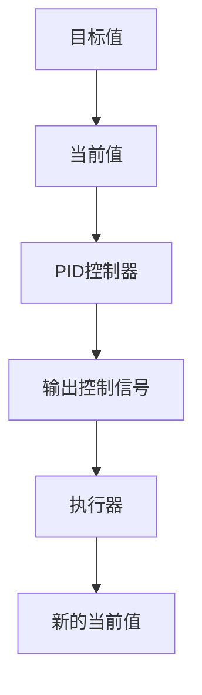
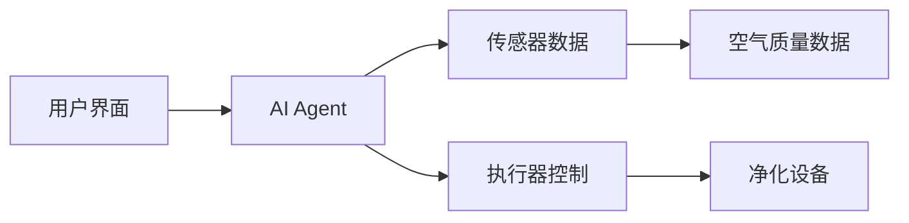
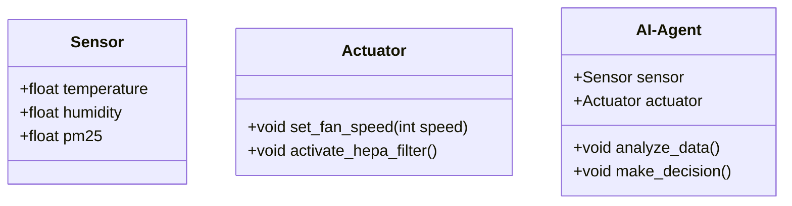
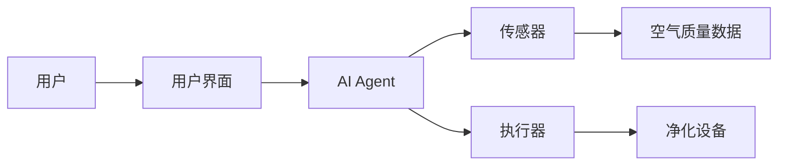
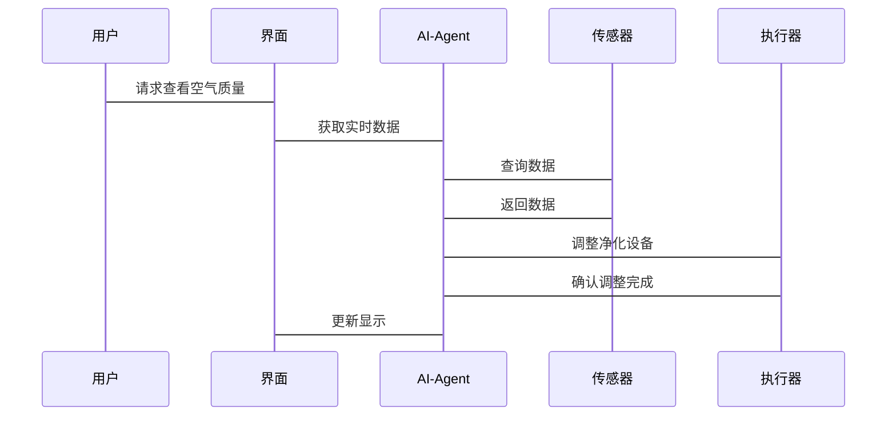

                 


# 智能窗台：AI Agent的室内空气净化控制

---

## 关键词：AI Agent, 室内空气净化, 算法原理, 系统架构, 项目实战, 最佳实践

---

## 摘要：  
本文探讨了AI Agent在室内空气净化系统中的应用，分析了其核心概念、算法原理、系统架构，并通过实际案例展示了如何利用AI技术实现智能空气净化控制。文章内容涵盖从理论到实践的全过程，旨在为读者提供一个全面的视角，理解AI Agent在提升室内空气质量方面的潜力和实现方式。

---

# 第一部分: 背景介绍

## 第1章: AI Agent与室内空气净化的背景

### 1.1 问题背景
#### 1.1.1 室内空气污染的现状与挑战
室内空气质量直接影响人们的健康，尤其是在现代建筑中，由于密闭性增强，空气污染物（如PM2.5、甲醛、细菌等）浓度较高，容易引发呼吸系统疾病。传统空气净化设备通常依赖固定模式运行，无法根据实时环境变化智能调整。

#### 1.1.2 空气净化技术的发展历程
从最初的机械过滤到静电吸附、紫外线杀菌，再到如今的多层过滤系统，空气净化技术经历了多次升级。但现有设备大多缺乏智能化，无法主动适应环境变化。

#### 1.1.3 AI技术在空气净化中的应用潜力
AI技术的引入，使得空气净化系统能够实时感知环境数据，分析污染物类型和浓度，并动态调整净化策略。AI Agent（智能代理）作为实现这一目标的核心技术，具备实时决策和自主学习的能力。

### 1.2 问题描述
#### 1.2.1 室内空气质量的定义与测量
室内空气质量（IAQ）是指空气中污染物的浓度、温度、湿度、气味等因素的综合指标。测量指标主要包括PM2.5、甲醛、CO₂等。

#### 1.2.2 空气净化系统的核心功能
- 污染物检测
- 滤净或分解污染物
- 调节温湿度
- 实时监控与反馈

#### 1.2.3 AI Agent在空气净化中的角色与目标
AI Agent作为系统的核心，负责整合传感器数据，分析环境变化，制定净化策略，并通过执行器（如风扇、滤网）进行调整。其目标是实现智能化、动态化的空气净化控制。

### 1.3 问题解决
#### 1.3.1 AI Agent在空气净化中的解决方案
通过实时数据采集、智能算法分析和自主决策控制，AI Agent能够显著提升空气净化效率和用户体验。

#### 1.3.2 系统设计的核心要素
- 数据采集（传感器）
- 数据分析（AI算法）
- 决策控制（执行器）
- 用户交互（界面）

#### 1.3.3 系统边界与外延
系统边界包括室内环境、传感器、执行器和用户界面；外延则涉及外部数据源（如天气API）和用户反馈机制。

### 1.4 概念结构与核心要素组成
#### 1.4.1 系统整体架构
AI Agent作为系统的核心，连接传感器、执行器和用户界面，实现数据流的闭环管理。

#### 1.4.2 核心功能模块
- 数据采集模块：负责采集室内环境数据
- 数据分析模块：基于AI算法进行分析和预测
- 决策控制模块：制定净化策略并执行
- 用户交互模块：提供反馈和控制界面

#### 1.4.3 系统与环境的交互
系统通过传感器感知环境变化，通过执行器主动调整环境状态，并通过用户界面与用户进行交互。

---

# 第二部分: 核心概念与联系

## 第2章: AI Agent与室内空气净化系统的核心概念

### 2.1 核心概念原理
#### 2.1.1 AI Agent的基本原理
AI Agent是一种能够感知环境、自主决策并采取行动的智能系统。它通过传感器获取数据，利用算法进行分析，并通过执行器实现目标。

#### 2.1.2 室内空气净化系统的原理
通过传感器实时监测室内空气质量，利用净化设备去除污染物，调节温湿度，并通过反馈机制优化净化效果。

#### 2.1.3 两者的结合与协同
AI Agent通过实时数据分析，优化空气净化设备的运行策略，实现智能化的空气净化控制。

### 2.2 概念属性特征对比
| 概念        | 属性特征                |
|-------------|------------------------|
| AI Agent    | 智能性、实时性、自主性  |
| 室内空气净化系统 | 多功能性、实时性、可调节性 |

### 2.3 ER实体关系图
```mermaid
er
  actor: 用户
  system: 空气净化系统
  agent: AI Agent
  sensor: 传感器
  actuator: 执行器
  environment: 环境
  relation: 关联关系
```

---

## 第3章: 空气净化系统的算法原理讲解

### 3.1 算法原理
#### 3.1.1 PID控制算法
PID（比例-积分-微分）控制是一种常用的反馈控制算法，适用于连续系统的调节。

#### 3.1.2 PID控制流程


#### 3.1.3 PID算法实现
```python
def pid_control(target, current, dt):
    # PID参数
    Kp = 1.0
    Ki = 0.1
    Kd = 0.5
    
    # 计算误差
    error = target - current
    
    # 积分项
    integral += error * dt
    
    # 微分项
    derivative = (error - prev_error) / dt
    
    # PID输出
    output = Kp * error + Ki * integral + Kd * derivative
    
    # 约束输出范围
    output = max(0, min(1, output))
    
    return output
```

#### 3.1.4 PID算法数学模型
$$
u(t) = K_p e(t) + K_i \int_0^t e(\tau) d\tau + K_d \frac{de(t)}{dt}
$$

#### 3.1.5 示例分析
假设目标温度为25°C，当前温度为22°C，系统通过PID控制调整加热器功率，逐步逼近目标温度。

---

## 第4章: 系统分析与架构设计方案

### 4.1 系统架构设计


### 4.2 系统功能设计
#### 4.2.1 领域模型类图


### 4.3 系统架构设计


### 4.4 系统接口设计
- 传感器接口：提供实时环境数据
- 执行器接口：接收控制信号
- 用户界面接口：显示状态和接收指令

### 4.5 系统交互流程


---

## 第5章: 项目实战

### 5.1 环境安装
- Python 3.8+
- 数学库（numpy, scipy）
- 可视化库（matplotlib）
- 开发环境（VS Code, PyCharm）

### 5.2 核心代码实现
```python
import numpy as np
import time

class Sensor:
    def get_data(self):
        # 返回模拟的空气质量数据
        return {
            'temperature': np.random.uniform(20, 30),
            'humidity': np.random.uniform(30, 70),
            'pm25': np.random.randint(10, 100)
        }

class Actuator:
    def set_mode(self, mode):
        # 模式：'fan_only', 'hepa', 'auto'
        print(f"Setting actuator mode to {mode}")

class AI-Agent:
    def __init__(self, sensor, actuator):
        self.sensor = sensor
        self.actuator = actuator
        self.last_error = 0
        self.integral = 0

    def analyze_data(self):
        data = self.sensor.get_data()
        return data

    def make_decision(self, target_pm25=50):
        current_pm25 = self.analyze_data()['pm25']
        error = target_pm25 - current_pm25
        dt = 1  # 时间步长
        derivative = (error - self.last_error) / dt
        self.integral += error * dt
        
        # PID控制
        output = 1 * error + 0.1 * self.integral + 0.5 * derivative
        output = max(0, min(3, output))
        
        if output > 2:
            self.actuator.set_mode('hepa')
        elif output > 1:
            self.actuator.set_mode('fan_only')
        else:
            self.actuator.set_mode('auto')
            
        self.last_error = error

# 实例化系统
sensor = Sensor()
actuator = Actuator()
agent = AI-Agent(sensor, actuator)

# 运行系统
while True:
    agent.make_decision()
    time.sleep(1)
```

### 5.3 代码解读
- `Sensor` 类：模拟环境数据采集
- `Actuator` 类：控制净化设备模式
- `AI-Agent` 类：整合数据、分析并决策
- 主循环：持续监控并调整净化策略

### 5.4 实际案例分析
假设目标PM2.5浓度为50，当前浓度为80，系统将启动HEPA过滤模式；若目标浓度为30，当前浓度为40，系统将启动风扇模式。

### 5.5 项目小结
通过实际编码实现，验证了AI Agent在室内空气净化中的可行性，展示了动态调整净化策略的优势。

---

## 第6章: 最佳实践、小结、注意事项和拓展阅读

### 6.1 最佳实践
- 定期校准传感器，确保数据准确性
- 根据环境变化优化PID参数
- 结合用户反馈不断改进系统

### 6.2 小结
本文详细介绍了AI Agent在室内空气净化中的应用，从理论到实践，展示了如何通过智能系统提升空气质量。

### 6.3 注意事项
- 确保系统数据安全
- 考虑隐私保护
- 定期维护设备

### 6.4 拓展阅读
- 探索更多智能控制算法（如模糊控制）
- 研究多目标优化在空气净化中的应用
- 结合物联网（IoT）实现更大范围的空气质量管理

---

## 作者：AI天才研究院 & 禅与计算机程序设计艺术

---

通过本文的系统阐述，读者可以全面理解AI Agent在室内空气净化中的应用潜力，并掌握其实现的关键技术。希望本文能为相关领域的研究和实践提供有价值的参考。

