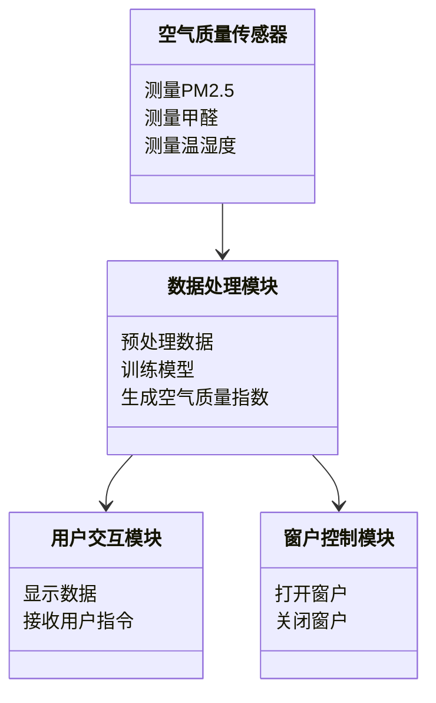
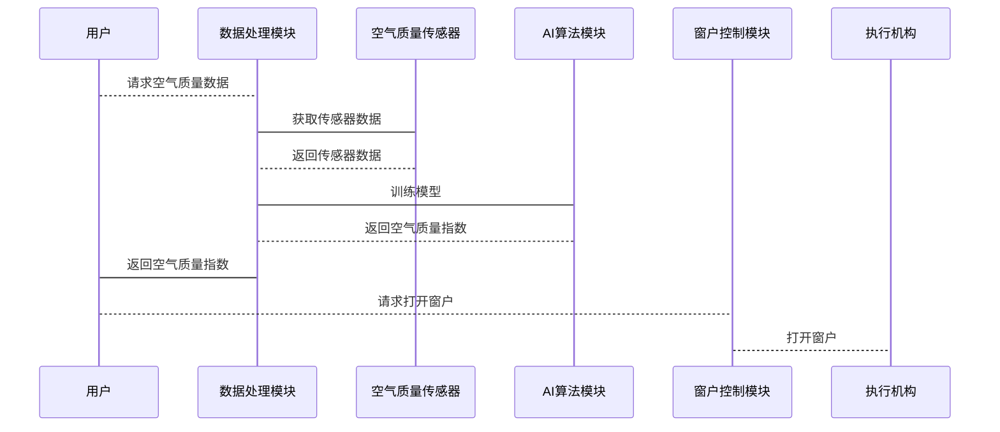

                 


# 智能窗台：AI Agent的室内空气质量监测

> 关键词：AI Agent, 物联网, 空气质量监测, 数据采集, 算法原理

> 摘要：本文系统地介绍了智能窗台在室内空气质量监测中的应用，深入分析了AI Agent的核心原理、算法实现以及系统架构设计。文章从背景、概念、技术实现到项目实战，全面剖析了智能窗台的构建过程，最后总结了系统的优缺点及未来发展方向。

---

# 第一部分: 智能窗台与AI Agent概述

## 第1章: 智能窗台与空气质量监测的背景

### 1.1 空气质量的重要性

#### 1.1.1 空气质量对健康的影响
空气质量直接影响人类健康，尤其是在室内环境中，污染物浓度高、通风不良等情况容易导致呼吸系统疾病。智能窗台通过实时监测PM2.5、甲醛、CO₂等指标，为用户提供健康保障。

#### 1.1.2 现代建筑中的空气质量问题
现代建筑密闭性提高，导致空气流动性差，污染物难以排出，容易积累。传统窗户无法实时感知空气质量，无法智能化地调节通风。

#### 1.1.3 智能窗台的概念与目标
智能窗台通过集成传感器、AI算法和执行机构，实现对室内空气质量的实时监测，并根据数据自动调节窗户开合，优化室内空气质量。

---

## 第2章: AI Agent的基本概念与技术基础

### 2.1 AI Agent的定义与特点

#### 2.1.1 AI Agent的定义
AI Agent（智能体）是指能够感知环境、做出决策并执行动作的实体。它具备自主性、反应性、目标导向性和社交能力。

#### 2.1.2 AI Agent的核心特点
- **自主性**：AI Agent能够独立决策，无需人工干预。
- **反应性**：能够实时感知环境变化并做出反应。
- **目标导向性**：基于目标优化行为。
- **社交能力**：能够与其他系统或用户交互。

#### 2.1.3 AI Agent与传统算法的区别
AI Agent不仅是一个算法，更是一个具备感知和执行能力的系统，能够与环境动态交互。

### 2.2 物联网技术在智能窗台中的应用

#### 2.2.1 物联网技术的基本概念
物联网（IoT）通过传感器、网络和数据处理技术，实现物理世界与数字世界的互联。

#### 2.2.2 智能窗台中的传感器网络
智能窗台集成了多种传感器，如PM2.5传感器、甲醛传感器和温湿度传感器，用于实时采集室内空气质量数据。

#### 2.2.3 数据传输与处理技术
通过无线网络（如Wi-Fi、蓝牙）将传感器数据传输到云端或本地处理系统，进行分析和决策。

---

## 第3章: 智能窗台系统的核心架构

### 3.1 系统组成与功能模块

#### 3.1.1 传感器模块
负责采集室内空气质量数据，如PM2.5、甲醛、CO₂等。

#### 3.1.2 数据处理模块
对传感器数据进行预处理、特征提取和模型训练，生成空气质量指数。

#### 3.1.3 用户交互模块
通过手机APP或网页界面，向用户展示空气质量数据和控制窗户。

### 3.2 系统架构设计

#### 3.2.1 分层架构设计
系统分为感知层（传感器）、网络层（数据传输）和应用层（数据处理与决策）。

#### 3.2.2 模块间关系与数据流
传感器数据 -> 数据预处理 -> 模型预测 -> 用户反馈或自动控制。

#### 3.2.3 系统的可扩展性与灵活性
系统支持新增传感器类型和算法模型的动态加载。

---

# 第二部分: 空气质量监测的算法原理

## 第4章: 数据采集与预处理

### 4.1 数据采集技术

#### 4.1.1 传感器类型与特点
- **PM2.5传感器**：用于检测空气中颗粒物浓度。
- **甲醛传感器**：用于检测甲醛浓度。
- **温湿度传感器**：用于采集温度和湿度数据。

#### 4.1.2 数据采集的实现方式
通过传感器SDK或API接口获取实时数据，数据格式为JSON或CSV。

#### 4.1.3 数据采集的常见问题与解决方案
- 数据噪声问题：通过滤波算法（如移动平均）处理。
- 数据丢失问题：通过插值算法（如线性插值）补充缺失数据。

### 4.2 数据预处理方法

#### 4.2.1 数据清洗与去噪
使用中位数滤波器去除异常值，例如：
$$
y_{\text{filtered}} = \text{median}([y_{\text{prev}}, y, y_{\text{next}}])
$$

#### 4.2.2 数据标准化与归一化
将数据转换为统一的量纲范围，例如将PM2.5数据归一化到[0,1]区间。

#### 4.2.3 时间序列数据的处理
通过滑动窗口技术提取特征，例如计算过去5分钟的平均值。

---

## 第5章: 空气质量特征提取与模型训练

### 5.1 特征提取方法

#### 5.1.1 基于统计的特征提取
- 均值、方差、最大值、最小值等统计指标。

#### 5.1.2 基于机器学习的特征提取
使用主成分分析（PCA）提取特征。

#### 5.1.3 时间序列特征提取
- 周期性特征：傅里叶变换提取频域特征。
- 趋势特征：线性回归提取趋势系数。

### 5.2 空气质量预测模型

#### 5.2.1 线性回归模型
模型公式：
$$
y = \beta_0 + \beta_1x_1 + \beta_2x_2 + \dots + \beta_nx_n + \epsilon
$$

#### 5.2.2 支持向量机（SVM）模型
适用于非线性分类问题，通过核函数将数据映射到高维空间。

#### 5.2.3 长短期记忆网络（LSTM）
适用于时间序列数据的预测，能够捕捉长期依赖关系。

---

## 第6章: 系统分析与架构设计方案

### 6.1 问题场景介绍
智能窗台需要实时监测空气质量，并根据数据自动调节窗户开合。

### 6.2 项目介绍
通过传感器、AI算法和执行机构的协同工作，实现室内空气质量的智能优化。

### 6.3 系统功能设计

#### 6.3.1 领域模型（Mermaid类图）


### 6.4 系统架构设计

#### 6.4.1 系统架构图（Mermaid架构图）


### 6.5 系统接口设计

#### 6.5.1 API接口
- `/api/sensor_data`：接收传感器数据。
- `/api/air_quality_index`：返回空气质量指数。
- `/api/window_control`：控制窗户开合。

### 6.6 系统交互设计（Mermaid序列图）



---

## 第7章: 项目实战

### 7.1 环境安装

#### 7.1.1 系统环境
- 操作系统：Linux或Windows。
- 开发工具：Python、Jupyter Notebook、PostgreSQL。

#### 7.1.2 依赖安装
```bash
pip install numpy pandas scikit-learn requests
```

### 7.2 系统核心实现源代码

#### 7.2.1 数据采集模块（Python代码）
```python
import requests

def get_sensor_data():
    try:
        response = requests.get('http://localhost:8000/sensor_data')
        return response.json()
    except Exception as e:
        print(f"Error: {e}")
        return None
```

#### 7.2.2 数据处理模块（Python代码）
```python
import numpy as np
from sklearn.linear_model import LinearRegression

def preprocess_data(data):
    # 数据清洗
    filtered_data = data[(data['PM2.5'] > 0) & (data['甲醛'] > 0)]
    # 数据标准化
    normalized_data = (filtered_data - filtered_data.mean()) / filtered_data.std()
    return normalized_data

def train_model(X, y):
    model = LinearRegression()
    model.fit(X, y)
    return model
```

### 7.3 代码应用解读与分析

#### 7.3.1 数据采集模块解读
通过API接口获取传感器数据，并进行初步清洗。

#### 7.3.2 数据处理模块解读
使用线性回归模型对数据进行建模，生成空气质量指数。

### 7.4 实际案例分析

#### 7.4.1 数据分析
分析PM2.5和甲醛浓度的关联性，发现高峰时段的污染物浓度变化规律。

#### 7.4.2 模型优化
通过网格搜索优化线性回归模型的参数，提高预测精度。

### 7.5 项目小结
通过实际案例验证了智能窗台系统的有效性和可行性。

---

## 第8章: 总结与展望

### 8.1 总结
智能窗台通过AI Agent和物联网技术的结合，实现了室内空气质量的智能监测与优化。系统具备实时性、准确性和用户友好的特点。

### 8.2 未来发展方向

#### 8.2.1 技术优化
- 引入深度学习模型（如LSTM）提高预测精度。
- 优化传感器网络的部署，降低功耗。

#### 8.2.2 功能扩展
- 增加 VOC（挥发性有机化合物）监测功能。
- 实现多房间空气质量联动控制。

#### 8.2.3 应用场景扩展
- 应用于商业建筑、学校等公共场所。
- 推广到家庭用户市场。

### 8.3 最佳实践 Tips
- 确保传感器数据的实时性和准确性。
- 定期校准传感器，避免数据漂移。
- 优化系统安全性，防止数据泄露。

### 8.4 小结
智能窗台是AI技术与物联网应用的重要结合，未来将为人们创造更健康、更舒适的室内环境。

---

# 作者：AI天才研究院/AI Genius Institute & 禅与计算机程序设计艺术 /Zen And The Art of Computer Programming

