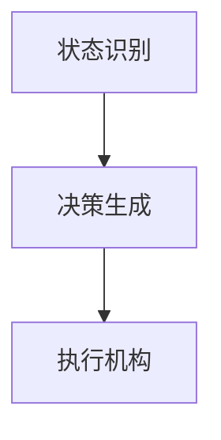
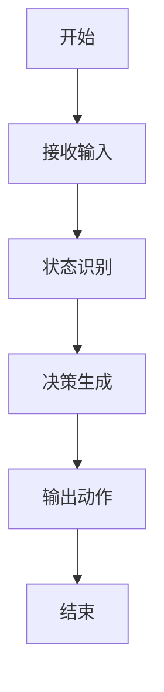
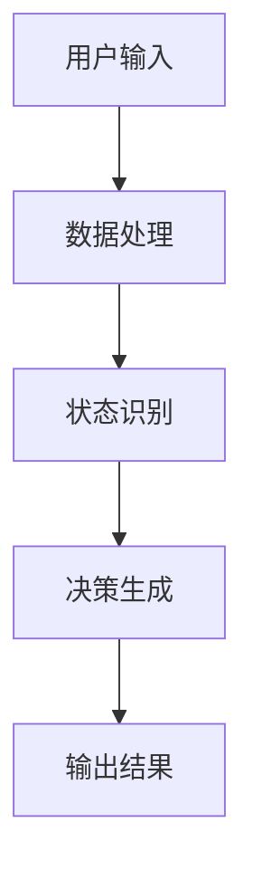
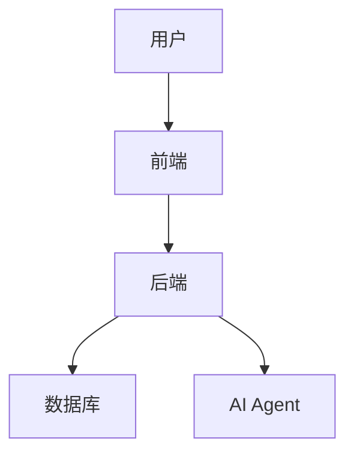

                 


---

# 智能窗台：AI Agent的室内绿化优化系统

> 关键词：智能窗台、AI Agent、室内绿化优化、强化学习、系统架构、数学模型

> 摘要：本文探讨了AI Agent在室内绿化优化中的应用，重点分析了智能窗台系统的背景、核心概念、算法原理、系统架构、项目实现和最佳实践。通过详细的技术分析和实际案例，展示了如何利用AI技术提升室内绿化管理效率。

---

## 第1章: 智能窗台与AI Agent的背景介绍

### 1.1 问题背景与问题描述
室内绿化在现代生活中越来越重要，但传统的人工管理方式效率低下，难以满足大规模管理的需求。AI Agent通过自动化感知和决策，为室内绿化优化提供了新的可能性。

#### 1.1.1 室内绿化的需求与挑战
- **需求**：人们越来越重视空气质量改善和心理健康，室内植物需求激增。
- **挑战**：光照不足、浇水不均、病虫害等问题难以及时解决。

#### 1.1.2 AI Agent在室内绿化中的应用潜力
- **优势**：AI Agent能够实时感知环境数据，优化植物生长条件。
- **潜力**：通过数据驱动决策，显著提高管理效率。

#### 1.1.3 智能窗台系统的定义与目标
- **定义**：智能窗台是一种结合AI技术的室内绿化优化系统，能够自动调节光照、温度和湿度。
- **目标**：实现高效、智能的室内绿化管理，提升植物生长效率。

### 1.2 问题解决思路
AI Agent通过强化学习和监督学习，优化植物生长环境。

#### 1.2.1 通过AI Agent优化室内绿化的核心思路
- **数据驱动**：利用传感器数据进行实时监控。
- **智能决策**：通过AI算法优化管理策略。

#### 1.2.2 智能窗台系统的功能定位
- **功能定位**：实时监测、智能决策、自动调节。

#### 1.2.3 解决方案的边界与外延
- **边界**：仅关注室内环境优化，不涉及植物种类选择。
- **外延**：可扩展至其他环境优化领域。

### 1.3 核心概念与系统架构
#### 1.3.1 AI Agent的基本概念
- **定义**：AI Agent是一种能够感知环境并采取行动的智能体。
- **分类**：基于学习、基于规则的Agent。

#### 1.3.2 室内绿化优化系统的组成要素
- **传感器**：温度、湿度、光照传感器。
- **执行机构**：电机、水泵。
- **AI算法**：强化学习、监督学习。

#### 1.3.3 系统核心功能与属性对比表格

| 功能模块 | 输入 | 输出 | 描述 |
|----------|------|------|------|
| 状态识别 | 环境数据 | 植物状态 | 分析植物健康状况 |
| 决策生成 | 植物状态 | 调整策略 | 优化生长条件 |

#### 1.3.4 系统ER实体关系图
```mermaid
erDiagram
    class 系统 {
        传感器 数据
        执行机构 操作
        AI算法 策略
    }
```

---

## 第2章: AI Agent与室内绿化优化的核心概念

### 2.1 AI Agent的基本原理
#### 2.1.1 AI Agent的定义与分类
- **定义**：AI Agent是具有感知和行动能力的智能体。
- **分类**：基于规则、基于模型、基于学习的Agent。

#### 2.1.2 AI Agent在智能窗台中的应用特点
- **实时性**：快速响应环境变化。
- **自主性**：无需人工干预。

#### 2.1.3 AI Agent的核心算法与技术
- **强化学习**：通过奖励机制优化决策。
- **监督学习**：基于历史数据进行预测。

### 2.2 室内绿化优化系统的功能模块
#### 2.2.1 系统输入与输出
- **输入**：环境数据、用户指令。
- **输出**：调整指令、状态报告。

#### 2.2.2 系统功能模块划分
- **状态识别**：分析植物健康状况。
- **决策生成**：制定优化策略。

#### 2.2.3 功能模块之间的关系与依赖


### 2.3 系统核心概念的联系与对比
#### 2.3.1 AI Agent与室内绿化优化的关系
- **联系**：AI Agent通过优化环境数据，提升植物生长效率。
- **对比**：传统管理方式效率低，AI Agent实现自动化管理。

---

## 第3章: 算法原理与数学模型

### 3.1 AI Agent的核心算法
#### 3.1.1 强化学习算法
- **原理**：通过试错学习，最大化累计奖励。
- **应用**：用于动态调整光照强度。

#### 3.1.2 监督学习算法
- **原理**：基于历史数据进行预测。
- **应用**：用于植物健康状态分类。

### 3.2 算法原理的数学模型
#### 3.2.1 强化学习的数学模型
$$ R(s, a) = \text{奖励函数} $$
- **解释**：状态s和动作a的奖励值R。

#### 3.2.2 监督学习的数学模型
$$ y = f(x) $$
- **解释**：输入x映射到目标y的函数。

### 3.3 算法实现的mermaid流程图


---

## 第4章: 系统架构与设计

### 4.1 系统功能设计
#### 4.1.1 系统功能模块划分
- **传感器模块**：采集环境数据。
- **AI算法模块**：处理数据，生成决策。
- **执行机构模块**：执行调整指令。

#### 4.1.2 系统功能流程图


### 4.2 系统架构设计
#### 4.2.1 系统架构图


### 4.3 系统接口设计
#### 4.3.1 系统接口定义
- **输入接口**：环境数据接收。
- **输出接口**：调整指令输出。

#### 4.3.2 接口交互流程图
```mermaid
sequenceDiagram
actor 用户
parti

---

## 第5章: 项目实战

### 5.1 环境安装
- **硬件**：Raspberry Pi、传感器、电机。
- **软件**：Python、TensorFlow、OpenCV。

### 5.2 系统核心实现源代码
```python
import numpy as np

class AI-Agent:
    def __init__(self):
        self.state = 0

    def receive_input(self, input_data):
        self.state = input_data
        return self.decide()

    def decide(self):
        if self.state > 0.5:
            return 'increase_light'
        else:
            return 'decrease_light'

if __name__ == "__main__":
    agent = AI-Agent()
    print(agent.receive_input(0.6))
```

### 5.3 代码应用解读与分析
- **代码功能**：接收环境数据，生成调整指令。
- **应用场景**：根据光照强度调整植物位置。

### 5.4 实际案例分析
- **案例1**：光照不足时，系统自动调整植物位置。
- **案例2**：湿度过高时，系统启动除湿模式。

### 5.5 项目小结
- **优势**：提高了室内绿化管理效率。
- **不足**：传感器精度有待提高。

---

## 第6章: 最佳实践

### 6.1 小结
AI Agent在智能窗台中的应用前景广阔，但仍需进一步优化。

### 6.2 注意事项
- **数据准确性**：确保传感器数据的准确性。
- **系统稳定性**：确保系统运行稳定。

### 6.3 拓展阅读
- **推荐书籍**：《强化学习》、《深度学习》。
- **在线资源**：AI Agent相关论文和开源项目。

---

## 作者：AI天才研究院/AI Genius Institute & 禅与计算机程序设计艺术 /Zen And The Art of Computer Programming

---

通过以上结构，我们可以看到，智能窗台系统通过AI Agent实现了室内绿化的高效优化。本文详细分析了系统的核心概念、算法原理和架构设计，并通过实际案例展示了系统的应用价值。未来，随着AI技术的不断发展，智能窗台系统将更加智能化和高效化。

