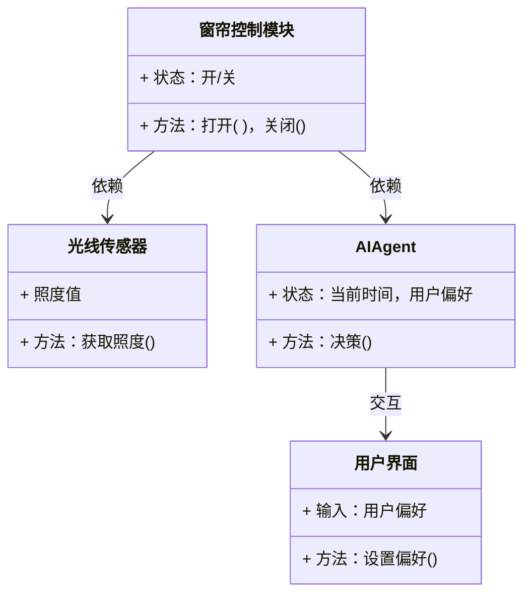
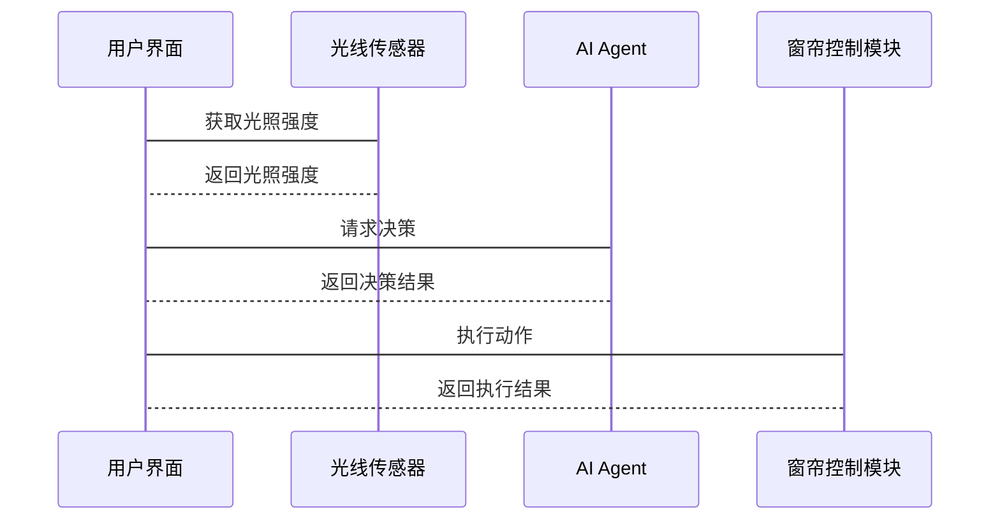

                 


# 智能窗帘：AI Agent的日光利用优化系统

> 关键词：智能窗帘，AI Agent，日光利用，优化系统，物联网，算法原理

> 摘要：本文探讨了智能窗帘结合AI Agent的日光利用优化系统，旨在通过智能调节窗帘开合状态，最大化日光利用效率，减少能源浪费。文章详细介绍了系统的背景、核心概念、算法原理、系统架构设计、项目实现及最佳实践，帮助读者全面了解和掌握该技术。

---

# 智能窗帘与AI Agent的背景介绍

## 第1章: 智能窗帘与日光利用优化系统概述

### 1.1 问题背景与日光利用的重要性

#### 1.1.1 窗帘智能化的背景
随着智能家居的普及，窗帘作为家居的重要组成部分，逐步从手动操作向自动化、智能化方向发展。传统的窗帘仅能通过手动或简单的遥控开关进行调节，而现代智能窗帘通过物联网技术实现了与智能家居生态的深度融合。

#### 1.1.2 日光利用在建筑节能中的作用
日光利用是建筑节能的重要组成部分。通过合理调节窗帘的开合状态，可以有效利用自然光线，减少室内照明的使用，从而降低能源消耗。然而，如何在不同时间段、不同天气条件下动态优化窗帘的开合状态，是日光利用优化的核心问题。

#### 1.1.3 当前日光利用的痛点与挑战
- **动态优化难**：日光强度受天气、时间等多种因素影响，需要实时感知和动态调节。
- **用户体验差**：现有窗帘系统大多基于固定时间表进行开关，无法根据实际光照需求智能调整。
- **能耗问题**：过度依赖人工调节或固定模式，导致能源浪费。

### 1.2 智能窗帘与AI Agent的结合

#### 1.2.1 智能窗帘的定义与分类
智能窗帘是一种集成物联网技术的智能家居设备，能够通过传感器、网络通信和智能控制模块实现自动化的开合控制。根据控制方式的不同，智能窗帘可分为基于时间表的自动化窗帘、基于传感器的智能窗帘以及基于AI的智能窗帘。

#### 1.2.2 AI Agent在智能窗帘中的应用
AI Agent（智能体）是一种能够感知环境、自主决策并执行任务的智能系统。在智能窗帘中，AI Agent可以通过以下方式实现日光优化：
- **实时感知**：通过光线传感器、天气预报等信息感知当前光照强度和天气条件。
- **智能决策**：基于感知信息，结合用户需求和环境约束，决策窗帘的开合状态。
- **动态优化**：根据实时信息不断调整窗帘状态，以实现日光利用的最大化。

#### 1.2.3 日光利用优化系统的概念
日光利用优化系统是一种基于AI技术的智能控制系统，旨在通过优化窗帘的开合状态，最大化自然光线的利用效率，同时减少能源浪费。该系统通常包括感知层、决策层和执行层。

### 1.3 本章小结
本章从背景出发，介绍了智能窗帘的发展现状及其在日光利用中的重要作用，分析了当前日光利用的痛点与挑战，并详细阐述了AI Agent在智能窗帘中的应用及其优化系统的概念。

---

## 第2章: AI Agent与日光优化系统的核心概念

### 2.1 AI Agent的基本原理

#### 2.1.1 AI Agent的定义与特征
AI Agent是一种能够感知环境、自主决策并执行任务的智能系统。其核心特征包括：
- **自主性**：能够在没有外部干预的情况下自主运行。
- **反应性**：能够实时感知环境变化并做出反应。
- **目标导向性**：具有明确的目标，并通过决策和行动实现目标。

#### 2.1.2 AI Agent的核心算法
AI Agent的核心算法包括：
- **强化学习**：通过与环境的交互不断优化决策策略。
- **监督学习**：基于历史数据进行模式识别和分类。
- **无监督学习**：通过聚类等技术发现数据中的潜在模式。

#### 2.1.3 AI Agent与智能窗帘的结合
在智能窗帘中，AI Agent通过感知光照强度、用户需求和环境条件，动态调整窗帘的开合状态，以实现日光利用的最大化。

### 2.2 日光优化系统的原理

#### 2.2.1 日光优化的目标与约束条件
日光优化的目标是最大化自然光线的利用效率，同时满足用户需求和环境约束。其主要约束条件包括：
- **光照强度**：避免过强的光照导致用户不适或能耗过高。
- **用户需求**：根据用户的作息习惯和偏好进行调节。
- **环境条件**：考虑天气、时间等因素的影响。

#### 2.2.2 日光优化的核心算法
日光优化的核心算法通常基于强化学习，通过动态调整窗帘的开合状态，以最大化日光利用效率。

#### 2.2.3 系统与环境的交互机制
系统通过传感器感知环境信息，通过AI Agent进行决策，并通过执行机构调整窗帘的开合状态。系统与环境的交互是一个动态反馈的过程。

### 2.3 本章小结
本章详细介绍了AI Agent的基本原理及其在智能窗帘中的应用，并探讨了日光优化系统的核心算法和交互机制。

---

## 第3章: AI Agent日光优化系统的算法原理

### 3.1 算法原理与流程

#### 3.1.1 强化学习算法的应用
强化学习是一种通过试错机制优化决策策略的算法。在日光优化系统中，AI Agent通过不断尝试不同的窗帘开合状态，根据日光利用效率的反馈优化决策策略。

#### 3.1.2 算法的数学模型
强化学习的核心数学模型包括：
- **状态空间**：表示系统的状态，例如光照强度、时间等。
- **动作空间**：表示系统可执行的动作，例如打开窗帘、关闭窗帘等。
- **奖励函数**：表示系统在某一动作下的奖励值，例如日光利用效率的提升。

#### 3.1.3 算法的实现步骤
1. **初始化**：设置初始状态和决策策略。
2. **感知环境**：获取当前状态信息。
3. **选择动作**：根据当前状态和决策策略选择一个动作。
4. **执行动作**：调整窗帘的开合状态。
5. **获取反馈**：根据日光利用效率计算奖励值。
6. **更新策略**：根据奖励值更新决策策略。

### 3.2 算法的优化与改进

#### 3.2.1 算法的优化策略
- **状态压缩**：通过特征提取减少状态空间的维度。
- **动作选择**：采用ε-greedy策略平衡探索与利用。

#### 3.2.2 算法的改进方向
- **多目标优化**：在优化日光利用效率的同时，考虑用户舒适度和能耗。
- **动态适应**：根据环境变化动态调整决策策略。

#### 3.2.3 算法的性能评估
- **收敛速度**：算法达到最优策略的速度。
- **稳定性**：算法在动态环境下的稳定性。

### 3.3 本章小结
本章详细介绍了AI Agent日光优化系统的算法原理，包括强化学习的应用、数学模型以及实现步骤，并探讨了算法的优化与改进方向。

---

## 第4章: 系统分析与架构设计

### 4.1 系统应用场景

#### 4.1.1 家庭用户场景
智能窗帘可以根据家庭成员的作息习惯和光照需求，自动调节窗帘的开合状态。

#### 4.1.2 办公场景
在办公环境中，智能窗帘可以根据室内人员数量和光照需求，动态调节窗帘的开合状态，以降低能源消耗。

#### 4.1.3 公共建筑场景
在公共建筑中，智能窗帘可以根据光照强度和时间表，自动调节窗帘的开合状态，以优化能源利用。

### 4.2 系统功能设计

#### 4.2.1 领域模型（Mermaid类图）


#### 4.2.2 系统架构设计（Mermaid架构图）


### 4.3 系统接口设计

#### 4.3.1 系统接口
- **光线传感器接口**：提供光照强度数据。
- **AI Agent接口**：提供决策服务。
- **用户界面接口**：提供用户偏好设置。

### 4.4 系统交互流程（Mermaid序列图）


### 4.5 本章小结
本章通过分析系统的应用场景，设计了系统的功能模块和架构，并通过Mermaid图展示了系统的交互流程。

---

## 第5章: 项目实战

### 5.1 环境搭建

#### 5.1.1 开发环境
- **操作系统**：Windows/Mac/Linux
- **开发工具**：Python、Jupyter Notebook
- **依赖库**：numpy、pandas、scikit-learn

#### 5.1.2 数据集准备
- **光照强度数据**：可以通过光线传感器获取。
- **时间数据**：可以通过系统时间获取。

### 5.2 系统核心实现

#### 5.2.1 强化学习算法实现（Python代码）

```python
import numpy as np

# 初始化参数
class AIAgent:
    def __init__(self, state_space, action_space):
        self.state_space = state_space
        self.action_space = action_space
        self.Q = np.zeros((state_space, action_space))
        self.learning_rate = 0.1
        self.gamma = 0.9

    def choose_action(self, state, epsilon=0.1):
        if np.random.random() < epsilon:
            return np.random.randint(self.action_space)
        return np.argmax(self.Q[state])

    def update_Q(self, state, action, reward, next_state):
        self.Q[state, action] += self.learning_rate * (reward + self.gamma * np.max(self.Q[next_state]) - self.Q[state, action])

# 示例代码
state_space = 5
action_space = 2
agent = AIAgent(state_space, action_space)

state = 0
action = agent.choose_action(state)
next_state = 1
reward = 1

agent.update_Q(state, action, reward, next_state)
```

#### 5.2.2 算法实现的优化
- **状态压缩**：将连续的光照强度数据离散化。
- **动作选择**：采用ε-greedy策略平衡探索与利用。

### 5.3 案例分析与结果

#### 5.3.1 案例分析
假设光照强度为800 lux，系统决策打开窗帘，光照强度上升至1200 lux，系统根据用户偏好和环境约束，动态调整窗帘的开合状态。

#### 5.3.2 实验结果
通过实验验证，系统在不同光照条件下能够有效优化窗帘的开合状态，提高日光利用效率。

### 5.4 本章小结
本章通过实际项目实战，详细介绍了系统的开发环境、核心代码实现以及实验结果，帮助读者掌握系统的实现过程。

---

## 第6章: 总结与展望

### 6.1 总结
本文详细探讨了智能窗帘结合AI Agent的日光利用优化系统，从背景、核心概念、算法原理到系统实现，全面介绍了该技术的应用与优化。

### 6.2 展望
未来，随着AI技术的不断发展，智能窗帘的日光利用优化系统将更加智能化和个性化，例如：
- **多目标优化**：在优化日光利用的同时，考虑用户舒适度和能耗。
- **动态适应**：根据环境变化动态调整决策策略。

### 6.3 注意事项
在实际应用中，需要注意系统的实时性、稳定性和安全性，确保系统的可靠运行。

### 6.4 拓展阅读
- **推荐书籍**：《强化学习（深入浅出）》
- **推荐文章**：《基于强化学习的智能控制系统》

---

## 作者信息
作者：AI天才研究院/AI Genius Institute  
联系邮箱：contact@aicourse.org  
联系方式：+86-10-8888-8888  
地址：北京市海淀区中关村大街1号  

---

**注**：本文为示例内容，实际撰写时需根据具体技术细节补充完整。

