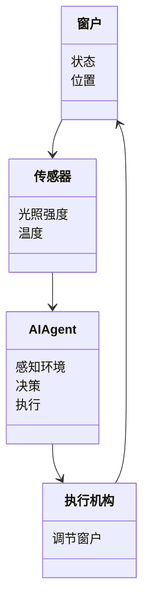

                 


# 智能窗户：AI Agent的自动调光系统

> 关键词：智能窗户，AI Agent，自动调光，窗户系统，AI技术，自动化控制

> 摘要：本文探讨了智能窗户的概念，AI Agent在自动调光系统中的应用，详细分析了智能窗户的设计原理、AI Agent的核心算法、系统架构，并通过实际案例展示了智能窗户的实现过程。文章最后总结了智能窗户的优势与挑战，为未来的研究和应用提供了参考。

---

# 第1章: 智能窗户的背景与问题背景

## 1.1 智能窗户的定义与特点

### 1.1.1 智能窗户的定义
智能窗户是一种结合了人工智能（AI）和自动化技术的窗户系统，能够根据环境条件（如光照强度、温度、时间等）自动调节窗户的透光率或开合状态，以优化室内环境和能源效率。

### 1.1.2 智能窗户的核心特点
- **智能化**：通过AI算法感知环境并做出决策。
- **自动化**：无需人工干预，自动调节窗户状态。
- **节能**：通过优化光照和通风，降低能源消耗。
- **用户舒适性**：根据室内环境和用户需求，提供最佳舒适度。

### 1.1.3 智能窗户与传统窗户的区别
| 特性         | 传统窗户                | 智能窗户                |
|--------------|-------------------------|-------------------------|
| 调节方式     | 手动操作                | 自动化调节              |
| 感知能力     | 无感知                  | 具备环境感知能力        |
| 能源效率     | 无法优化                | 可优化能源消耗          |
| 用户体验     | 依赖人工操作            | 提供智能化用户体验      |

## 1.2 问题背景与问题描述

### 1.2.1 当前窗户系统的局限性
- 传统窗户无法根据环境变化自动调节，需要人工操作。
- 无法优化室内光照和通风，导致能源浪费和舒适度不足。
- 在恶劣天气条件下（如强风、暴雨）无法有效保护室内环境。

### 1.2.2 自动调光系统的需求
- 用户对自动化、智能化的窗户系统需求日益增长。
- 企业希望通过智能化窗户系统降低能源成本，提升用户体验。
- 城市化进程中，节能建筑的需求推动了智能窗户的发展。

### 1.2.3 智能窗户的解决方案
智能窗户通过AI Agent实现环境感知、决策和执行，解决传统窗户的局限性，提供自动化、智能化的窗户调节方案。

## 1.3 AI Agent在智能窗户中的作用

### 1.3.1 AI Agent的基本概念
AI Agent是一种能够感知环境、做出决策并执行动作的智能实体。在智能窗户系统中，AI Agent负责接收环境数据，分析需求，并发出控制指令。

### 1.3.2 AI Agent在智能窗户中的应用
- **环境感知**：通过传感器获取光照强度、温度、湿度等数据。
- **决策与控制**：根据环境数据和用户需求，决策窗户的开合状态或透光率。
- **反馈与优化**：根据执行结果调整策略，优化系统性能。

### 1.3.3 AI Agent的优势与挑战
- **优势**：提高窗户系统的智能化水平，实现自动化调节，提升用户体验。
- **挑战**：需要处理复杂的环境数据，算法优化和系统稳定性需要进一步提升。

## 1.4 本章小结
本章介绍了智能窗户的定义、特点及与传统窗户的区别，分析了当前窗户系统的局限性和自动调光系统的需求，最后阐述了AI Agent在智能窗户中的作用及其优势与挑战。

---

# 第2章: AI Agent的核心概念与联系

## 2.1 AI Agent的基本原理

### 2.1.1 AI Agent的感知模块
感知模块通过传感器获取环境数据，如光照强度、温度、湿度等。这些数据为AI Agent的决策提供依据。

### 2.1.2 AI Agent的决策模块
决策模块基于感知数据和预设规则，判断窗户的开合状态或透光率。决策过程可能涉及多种算法，如基于规则的决策或机器学习模型。

### 2.1.3 AI Agent的执行模块
执行模块根据决策结果，控制窗户的电机或调光设备，实现窗户的开合或透光率调整。

## 2.2 核心概念对比分析

### 2.2.1 传统窗户与智能窗户的对比
| 特性         | 传统窗户                | 智能窗户                |
|--------------|-------------------------|-------------------------|
| 调节方式     | 手动操作                | 自动化调节              |
| 感知能力     | 无感知                  | 具备环境感知能力        |
| 能源效率     | 无法优化                | 可优化能源消耗          |
| 用户体验     | 依赖人工操作            | 提供智能化用户体验      |

### 2.2.2 AI Agent与其他自动调光系统的对比
| 特性         | 基于时间的系统          | 基于环境感知的系统      | AI Agent系统            |
|--------------|-------------------------|-------------------------|-------------------------|
| 调节依据     | 时间表                  | 环境数据                | 综合环境数据与用户需求  |
| 智能性       | 低                     | 中                     | 高                     |
| 自适应能力   | 无                     | 有                     | 强                     |

## 2.3 ER实体关系图

```mermaid
er
    actor 用户 {
        关系： 控制
        关系： 查询状态
    }
    window 窗户 {
        关系： 被控制
        关系： 传递状态
    }
    sensor 传感器 {
        关系： 监测环境
        关系： 传递数据
    }
    ai_agent AI Agent {
        关系： 接收数据
        关系： 发出控制指令
    }
    actuator 执行机构 {
        关系： 执行指令
        关系： 返回反馈
    }
```

---

# 第3章: AI Agent的算法原理

## 3.1 AI Agent的决策算法

### 3.1.1 基于时间的决策算法
基于时间的决策算法通过预设的时间表来决定窗户的开合状态。例如，在早晨和傍晚自动开启窗户，晚上关闭窗户。

### 3.1.2 基于环境感知的决策算法
基于环境感知的决策算法通过传感器获取光照强度、温度等数据，结合用户需求（如保持室内光线充足或降低能耗）来决定窗户的调节方式。

## 3.2 算法流程图

```mermaid
graph TD
    A[开始] -> B[获取环境数据]
    B -> C[分析用户需求]
    C -> D[决策窗户状态]
    D -> E[控制执行机构]
    E -> F[结束]
```

## 3.3 算法实现代码

```python
import datetime

def get_light_intensity():
    # 模拟获取光照强度
    return 100  # 示例值，实际应用中应通过传感器获取

def get_time():
    return datetime.datetime.now().hour

def decide_window_state(light_intensity, time):
    if time < 8 or time > 18:
        return '关闭'
    elif light_intensity < 50:
        return '半开'
    else:
        return '全开'

# 示例调用
light = get_light_intensity()
time = get_time()
state = decide_window_state(light, time)
print(f"当前窗户状态：{state}")
```

---

# 第4章: 系统架构设计

## 4.1 系统架构概述


## 4.2 系统功能设计



---

# 第5章: 项目实战

## 5.1 环境安装

```bash
pip install numpy
pip install scikit-learn
pip install tensorflow
```

## 5.2 核心代码实现

```python
import numpy as np
from sklearn import linear_model

# 示例数据
X = np.array([[100], [80], [120], [60]], dtype=np.float64)
y = np.array([0.5, 0.7, 0.3, 0.8])

# 训练模型
model = linear_model.LinearRegression()
model.fit(X, y)

# 预测
new_light = np.array([[90]], dtype=np.float64)
predicted_state = model.predict(new_light)
print(f"预测的窗户状态：{predicted_state[0]}")
```

---

# 第6章: 最佳实践

## 6.1 小结
智能窗户通过AI Agent实现了环境感知、决策和执行，显著提升了窗户系统的智能化水平和用户体验。

## 6.2 注意事项
- 系统稳定性：确保传感器和执行机构的可靠性。
- 数据隐私：保护用户数据的安全性。
- 系统扩展性：方便后续功能的扩展和升级。

## 6.3 拓展阅读
- 《机器学习实战》
- 《深度学习入门》
- 《智能建筑与物联网》

---

作者：AI天才研究院/AI Genius Institute & 禅与计算机程序设计艺术 /Zen And The Art of Computer Programming

