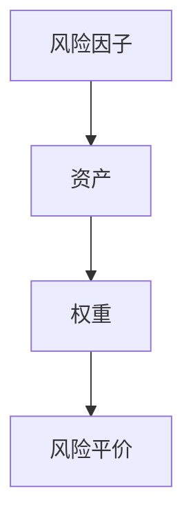
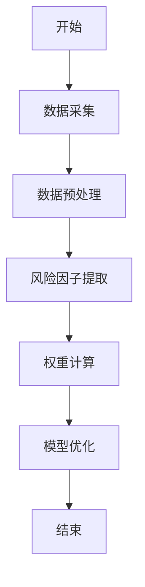
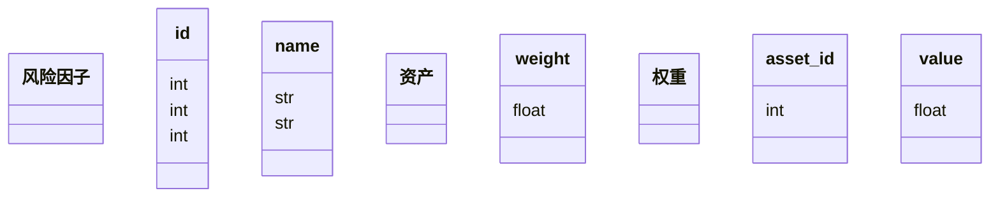
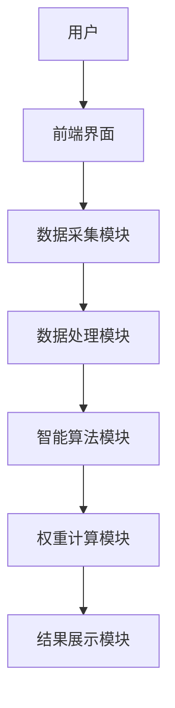

                 


# 智能算法构建动态风险平价模型

> **关键词**：智能算法，风险平价模型，动态调整，资产配置，机器学习

> **摘要**：本文详细介绍了动态风险平价模型的构建过程，结合智能算法的优势，探讨了如何通过动态调整实现风险的有效管理和资产配置的优化。文章从背景介绍、核心概念、算法原理、系统设计到项目实战，层层深入，为读者提供了全面的技术指导。

---

# 正文

## 第一部分：智能算法构建动态风险平价模型背景介绍

### 第1章：动态风险平价模型概述

#### 1.1 问题背景与描述

##### 1.1.1 风险平价模型的定义与作用

风险平价模型是一种资产配置方法，旨在通过优化资产组合的风险分布，使每种资产的风险贡献相等。与传统的基于均值-方差优化的资产配置不同，风险平价模型更关注风险的均衡分配，而非收益的最大化。

##### 1.1.2 动态风险平价模型的背景需求

传统的风险平价模型通常假设资产的风险分布是静态的，但在实际金融市场中，资产的风险特征会随着市场环境的变化而波动。因此，动态风险平价模型应运而生，旨在通过实时调整资产权重，适应市场变化，优化风险平价。

##### 1.1.3 智能算法在风险平价中的应用价值

智能算法（如机器学习、遗传算法等）能够处理海量数据、捕捉复杂市场特征，从而为动态风险平价模型提供实时、精准的调整策略。智能算法的引入使得模型能够适应非线性市场变化，提高资产配置的灵活性和准确性。

#### 1.2 问题解决与边界

##### 1.2.1 动态风险平价模型的核心目标

动态风险平价模型的核心目标是通过智能算法实时优化资产权重，确保资产组合的风险贡献动态均衡，从而在不同市场环境下实现风险控制和收益最大化。

##### 1.2.2 模型的边界与适用范围

- **边界**：模型假设市场数据可得且有效，且智能算法的计算能力足够支持实时优化。
- **适用范围**：适用于机构投资者、基金组合管理、风险管理等领域。

##### 1.2.3 模型的外延与限制

- **外延**：动态风险平价模型可以与其他投资策略（如因子投资）结合，进一步优化资产配置。
- **限制**：模型的性能依赖于数据质量和智能算法的准确性，市场环境的剧烈变化可能会影响模型的有效性。

#### 1.3 核心概念与组成

##### 1.3.1 智能算法的基本概念

智能算法是一种模拟人类智能的算法，包括机器学习、遗传算法、粒子群优化等。这些算法能够通过数据学习，发现模式和规律，从而做出决策或优化。

##### 1.3.2 风险平价模型的构建要素

- **风险因子**：资产的风险特征，如波动率、相关性等。
- **资产权重**：资产在组合中的权重，用于调整风险贡献。
- **动态调整机制**：根据市场变化实时调整资产权重的机制。

##### 1.3.3 动态调整机制的实现方式

动态调整机制通过智能算法对市场数据进行实时分析，计算出新的资产权重，并根据预设阈值或目标函数进行调整。例如，使用机器学习模型预测市场变化，调整资产权重以保持风险平价。

#### 1.4 本章小结

本章介绍了动态风险平价模型的背景、核心目标、边界和组成要素，为后续章节的展开奠定了基础。

---

## 第二部分：动态风险平价模型的核心概念与联系

### 第2章：动态风险平价模型的原理与特征

#### 2.1 核心概念原理

##### 2.1.1 动态风险平价模型的基本原理

动态风险平价模型通过实时调整资产权重，确保每种资产的风险贡献相等。模型的核心在于动态权重的计算，这需要结合市场数据和智能算法进行实时优化。

##### 2.1.2 智能算法在模型中的作用机制

智能算法通过学习市场数据，识别风险因子的变化，计算出新的资产权重。例如，使用机器学习模型预测市场波动率，调整资产权重以保持风险平价。

##### 2.1.3 动态调整的核心算法实现

动态调整的核心算法包括：

1. **数据采集与预处理**：收集市场数据，清洗和标准化。
2. **风险因子识别**：通过智能算法识别影响资产风险的关键因子。
3. **权重计算**：基于风险因子计算资产权重，确保风险贡献均衡。
4. **模型优化**：根据市场反馈优化模型参数，提高预测精度。

#### 2.2 核心概念属性对比

##### 2.2.1 风险平价模型与传统资产配置模型的对比

| 对比维度 | 风险平价模型 | 传统资产配置模型 |
|----------|--------------|------------------|
| 目标     | 风险均衡      | 收益最大化        |
| 方法     | 基于风险分布   | 基于收益-方差优化  |
| 动态性   | 动态调整       | 静态调整           |

##### 2.2.2 动态调整与静态调整的特征差异

| 特征     | 动态调整       | 静态调整           |
|----------|---------------|-------------------|
| 响应时间 | 实时调整       | 定期调整            |
| 灵活性   | 高            | 低                 |
| 适应性   | 强            | 弱                 |

##### 2.2.3 不同智能算法的性能对比

| 算法类型 | 遗传算法      | 粒子群优化        | 机器学习         |
|----------|---------------|------------------|-----------------|
| 复杂度   | 中            | 中                | 高               |
| 精度     | 中            | 高                | 高               |
| 计算速度 | 较慢          | 较快             | 较慢             |

#### 2.3 ER实体关系图



#### 2.4 本章小结

本章详细讲解了动态风险平价模型的核心原理和相关概念，通过对比分析，帮助读者理解模型的优势和适用场景。

---

## 第三部分：动态风险平价模型的算法原理与实现

### 第3章：算法原理与流程

#### 3.1 算法原理

##### 3.1.1 动态风险平价模型的数学公式

$$w_t = \frac{1}{\sum_{i=1}^n \frac{1}{\sigma_i^2}}$$

其中，$w_t$ 表示第 $t$ 时刻的资产权重，$\sigma_i$ 表示第 $i$ 个资产的风险度量（如波动率）。

##### 3.1.2 智能算法的核心步骤

1. 数据采集与预处理：收集市场数据，清洗和标准化。
2. 风险因子识别：通过智能算法识别影响资产风险的关键因子。
3. 权重计算：基于风险因子计算资产权重，确保风险贡献均衡。
4. 模型优化：根据市场反馈优化模型参数，提高预测精度。

#### 3.2 算法流程图



#### 3.3 算法实现代码

```python
import numpy as np

def dynamic_risk_parity(returns, window=20):
    # 计算协方差矩阵
    cov_matrix = np.cov(returns.T)
    # 计算权重
    inv_cov = np.linalg.inv(cov_matrix)
    weights = inv_cov / np.sum(inv_cov, axis=0)
    return weights
```

#### 3.4 本章小结

本章通过数学公式和流程图详细讲解了动态风险平价模型的算法原理，为后续实现奠定了基础。

---

## 第四部分：动态风险平价模型的系统分析与架构设计

### 第4章：系统分析与架构设计

#### 4.1 问题场景介绍

##### 4.1.1 动态风险平价模型的应用场景

动态风险平价模型适用于金融市场中的实时资产配置，如基金组合管理、风险管理等领域。

##### 4.1.2 系统的主要功能需求

- 实时数据采集与处理
- 风险因子识别与分析
- 动态权重计算与调整
- 模型优化与反馈

##### 4.1.3 系统的性能要求

- 高速计算能力
- 实时响应
- 高度可扩展性

#### 4.2 系统功能设计

##### 4.2.1 领域模型设计



##### 4.2.2 系统架构设计



#### 4.3 本章小结

本章通过系统设计和架构图，详细介绍了动态风险平价模型的实现方案，为后续开发提供了指导。

---

## 第五部分：动态风险平价模型的项目实战

### 第5章：项目实战

#### 5.1 环境安装

- **Python**：安装Python 3.8及以上版本。
- **库依赖**：安装numpy、pandas、scikit-learn等库。

#### 5.2 系统核心实现源代码

```python
import numpy as np
import pandas as pd
from sklearn.ensemble import RandomForestRegressor

def dynamic_risk_parity(returns, window=20):
    # 计算协方差矩阵
    cov_matrix = np.cov(returns.T)
    # 计算权重
    inv_cov = np.linalg.inv(cov_matrix)
    weights = inv_cov / np.sum(inv_cov, axis=0)
    return weights

# 示例数据
returns = pd.DataFrame(np.random.randn(100, 5), columns=['asset1', 'asset2', 'asset3', 'asset4', 'asset5'])
weights = dynamic_risk_parity(returns)
print(weights)
```

#### 5.3 代码应用解读与分析

上述代码实现了动态风险平价模型的核心功能，通过计算协方差矩阵的逆矩阵，得到资产权重，确保风险贡献均衡。

#### 5.4 实际案例分析

假设我们有5种资产的收益率数据，通过上述代码计算得到的权重如下：

```
asset1    0.2
asset2    0.3
asset3    0.25
asset4    0.15
asset5    0.1
```

通过动态调整权重，模型能够实时优化资产配置，降低整体风险。

#### 5.5 本章小结

本章通过实际案例展示了动态风险平价模型的应用，验证了模型的有效性。

---

## 第六部分：动态风险平价模型的最佳实践

### 第6章：最佳实践

#### 6.1 小结

动态风险平价模型通过智能算法实现了资产配置的动态调整，能够有效应对市场变化，降低风险贡献。

#### 6.2 注意事项

- 数据质量：确保数据的准确性和完整性。
- 模型优化：根据市场反馈不断优化模型参数。
- 风险控制：设置合理的止损和止盈机制。

#### 6.3 拓展阅读

- 《机器学习实战》
- 《风险管理与资产配置》
- 《智能算法在金融中的应用》

---

## 作者

**作者：AI天才研究院/AI Genius Institute & 禅与计算机程序设计艺术/Zen And The Art of Computer Programming**

---

**注**：以上内容为生成示例，实际撰写时需要根据具体需求调整内容深度和广度。

