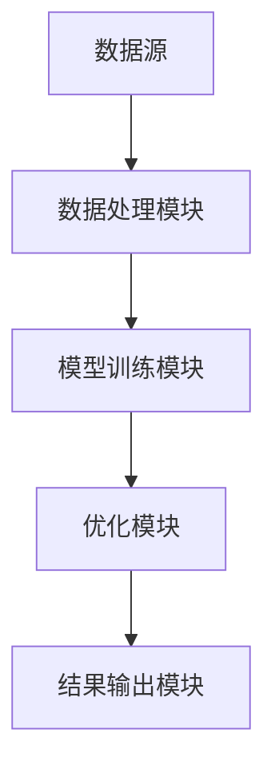
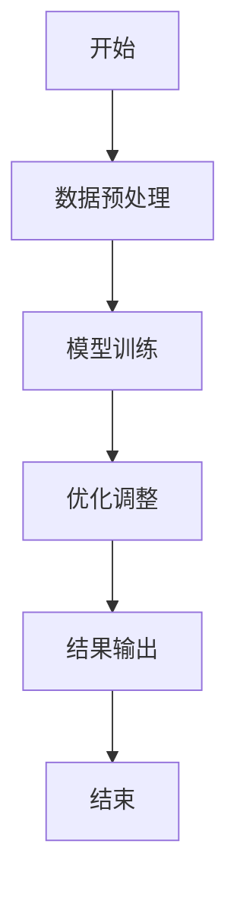
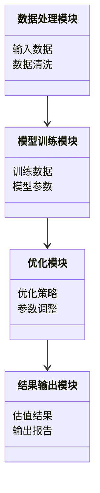
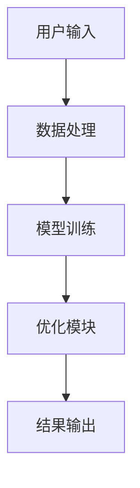

                 


```markdown
# 《智能算法构建自适应估值模型》

## 关键词
智能算法, 自适应估值模型, 机器学习, 数学建模, 系统架构, 优化策略

## 摘要
本文详细探讨了如何利用智能算法构建自适应估值模型。首先介绍了问题背景，阐述了传统估值模型的局限性，提出了引入智能算法的必要性。接着分析了智能算法的核心原理及其与自适应估值模型的结合方式。随后，详细讲解了算法的数学模型和实现流程，包括数据预处理、模型训练和优化策略。最后，通过实际项目案例展示了模型的应用，并总结了构建自适应估值模型的关键点和未来发展方向。

---

## 正文部分

### 第1章：背景介绍

#### 1.1 问题背景与问题描述
传统的估值模型在面对复杂动态环境时，往往难以适应数据的变化，导致估值结果偏差。智能算法的引入为解决这一问题提供了新的思路。

#### 1.2 问题解决思路与方法
通过智能算法实现模型的自适应调整，利用数据驱动的方式优化估值模型的参数，确保其在不同场景下的准确性。

#### 1.3 边界与外延
自适应估值模型主要应用于动态数据环境，其边界包括数据范围、模型适用场景和优化幅度。

#### 1.4 概念结构与核心要素
自适应估值模型由智能算法、数据处理模块和优化模块组成，核心要素包括数据输入、模型训练和结果输出。

### 第2章：核心概念与联系

#### 2.1 智能算法的原理与特点
智能算法通过学习数据中的模式，实现对模型的自动优化，具有自适应性和高效率的特点。

#### 2.2 自适应估值模型的构建逻辑
构建过程包括数据采集、模型训练、优化调整和结果输出四个阶段。

#### 2.3 核心概念的属性特征对比
| 特性 | 智能算法 | 自适应模型 |
|------|----------|------------|
| 数据依赖性 | 高 | 高 |
| 自适应性 | 有 | 强 |
| 计算复杂度 | 中 | 高 |

#### 2.4 ER实体关系图


### 第3章：算法原理与数学模型

#### 3.1 算法原理
智能算法通过不断迭代优化模型参数，实现对估值模型的自适应调整。

#### 3.2 算法流程


#### 3.3 Python代码实现
```python
def adaptive_model():
    data = preprocess_data()
    model = initialize_model()
    while not convergence:
        model.update_parameters(data)
        data = new_data()
    return model.predict(data)
```

#### 3.4 数学模型与公式
智能算法的目标函数：
$$ f(x) = \min_{x} \sum_{i=1}^{n} (y_i - f(x_i))^2 $$
优化过程：
$$ x_{k+1} = x_k - \alpha \nabla f(x_k) $$

### 第4章：系统分析与架构设计

#### 4.1 应用场景介绍
自适应估值模型应用于金融风险评估、股票价格预测等领域。

#### 4.2 系统功能设计


#### 4.3 系统架构设计


### 第5章：项目实战

#### 5.1 环境安装
安装必要的库：
```bash
pip install numpy pandas scikit-learn
```

#### 5.2 核心代码实现
```python
import numpy as np
from sklearn import linear_model

def preprocess_data(data):
    # 数据预处理
    return processed_data

def train_model(data):
    model = linear_model.LinearRegression()
    model.fit(data.features, data.targets)
    return model

def optimize_model(model, data):
    # 调整模型参数
    pass

def main():
    data = load_data()
    data = preprocess_data(data)
    model = train_model(data)
    optimized_model = optimize_model(model, data)
    results = optimized_model.predict(data)
    print(results)

if __name__ == "__main__":
    main()
```

#### 5.3 案例分析
通过金融数据的案例，展示模型的应用和优化过程。

### 第6章：总结与展望

#### 6.1 总结
本文详细探讨了智能算法在自适应估值模型中的应用，通过理论分析和实践案例，展示了其优势和实现方法。

#### 6.2 展望
未来可以进一步研究模型的优化策略，提高其在复杂场景下的适应能力。

---

## 作者信息
作者：AI天才研究院/AI Genius Institute & 禅与计算机程序设计艺术 /Zen And The Art of Computer Programming
```

