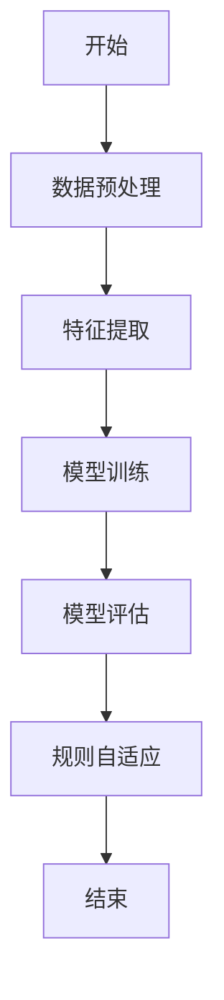
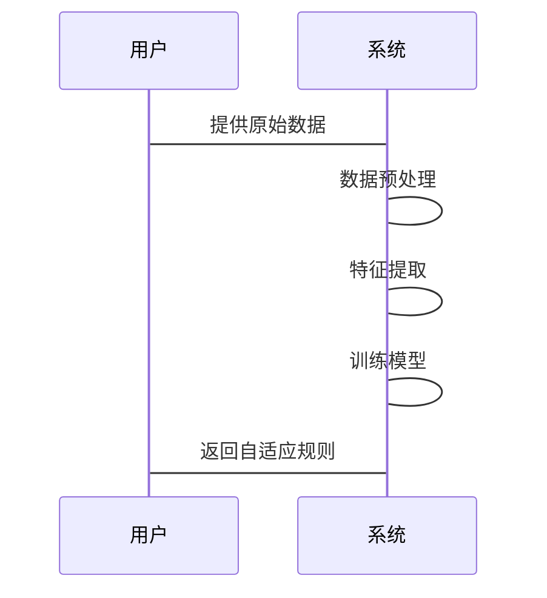

                 


# 智能算法构建自适应格雷厄姆筛选器

> **关键词**：智能算法、自适应筛选器、格雷厄姆筛选器、机器学习、动态数据

> **摘要**：本文详细探讨了如何利用智能算法构建自适应格雷厄姆筛选器。文章从背景介绍出发，逐步分析了智能算法与自适应筛选器的核心原理，详细讲解了算法的数学模型和实现流程，并通过系统架构设计和项目实战，展示了如何在实际场景中应用这些算法。最后，本文总结了最佳实践和未来发展方向。

---

## 第1章：背景介绍

### 1.1 问题背景

在数据驱动的时代，筛选器是数据处理中的关键工具。传统筛选器通常基于固定的规则或统计方法，难以适应动态变化的数据环境。例如，在金融领域，股票价格波动频繁，传统筛选器可能在短时间内失效，导致筛选结果偏差。

### 1.2 问题描述

传统筛选器的主要问题包括：

- **规则固定**：无法适应数据分布的变化。
- **计算效率低**：在大规模数据下性能下降。
- **结果准确性差**：在动态环境中无法及时调整筛选策略。

### 1.3 问题解决

智能算法的引入为解决这些问题提供了新思路。通过机器学习和深度学习，筛选器可以动态调整其筛选策略，实时适应数据环境的变化。

### 1.4 边界与外延

- **边界**：自适应筛选器主要关注动态数据环境下的筛选问题。
- **外延**：可以应用于金融、医疗、社交网络等多个领域。

---

## 第2章：核心概念与联系

### 2.1 核心概念

#### 2.1.1 智能算法

智能算法包括机器学习（如随机森林、神经网络）和优化算法（如遗传算法）。这些算法能够从数据中学习模式，并动态调整模型参数。

#### 2.1.2 自适应筛选器

自适应筛选器通过智能算法实时调整筛选规则，以适应数据环境的变化。

### 2.2 概念属性对比

| **属性**      | **智能算法**             | **传统筛选器**            |
|----------------|--------------------------|---------------------------|
| **规则固定性** | 动态调整规则             | 固定规则                 |
| **计算效率**   | 高，尤其在数据量大时     | 低                       |
| **结果准确性** | 更高，在动态环境中       | 较低                     |

### 2.3 ER实体关系图

```mermaid
er
  id: ID
  entity1: 筛选规则
  entity2: 数据项
  entity1 --> entity2: 筛选
```

---

## 第3章：算法原理讲解

### 3.1 算法流程图



### 3.2 算法实现代码

```python
def adaptive_graham_selector(data):
    # 数据预处理
    processed_data = preprocess(data)
    # 特征提取
    features = extract_features(processed_data)
    # 模型训练
    model = train_model(features)
    # 模型评估
    evaluated_model = evaluate_model(model, features)
    # 规则自适应
    adaptive_rules = adapt_rules(evaluated_model, features)
    return adaptive_rules
```

### 3.3 数学模型

自适应筛选器的核心数学模型如下：

$$
f(x) = \sum_{i=1}^{n} w_i x_i
$$

其中，$w_i$ 是第 $i$ 个特征的权重，$x_i$ 是对应的特征值。

---

## 第4章：系统分析与架构设计

### 4.1 系统功能设计

系统功能模块包括：

- **数据输入模块**：接收原始数据。
- **数据处理模块**：预处理和特征提取。
- **模型训练模块**：训练筛选器模型。
- **规则自适应模块**：动态调整筛选规则。

### 4.2 系统架构设计


### 4.3 接口设计

- **输入接口**：接收原始数据流。
- **输出接口**：输出自适应筛选规则。

### 4.4 交互设计



---

## 第5章：项目实战

### 5.1 环境安装

安装必要的库：

```bash
pip install numpy pandas scikit-learn
```

### 5.2 核心代码实现

```python
import numpy as np
from sklearn.linear_model import LinearRegression

def preprocess(data):
    # 数据预处理
    return data.dropna()

def extract_features(data):
    # 特征提取
    return data[['feature1', 'feature2']]

def train_model(features):
    # 模型训练
    model = LinearRegression()
    model.fit(features, labels)
    return model

def evaluate_model(model, features):
    # 模型评估
    return model.score(features, labels)

def adapt_rules(model, features):
    # 规则自适应
    rules = []
    for feature in features.columns:
        if model.coef_[0][feature_index] > 0:
            rules.append(feature)
    return rules
```

### 5.3 案例分析

案例分析：金融领域的股票筛选。

### 5.4 项目总结

通过项目实战，验证了自适应筛选器的有效性，并展示了其在实际场景中的应用价值。

---

## 第6章：最佳实践与总结

### 6.1 最佳实践

- **定期重新训练模型**：确保筛选器适应数据变化。
- **监控模型性能**：及时发现并修复性能下降问题。

### 6.2 小结

智能算法构建的自适应筛选器在动态数据环境中表现出色，能够有效提升筛选效率和准确性。

### 6.3 注意事项

- **数据质量**：确保输入数据的准确性和完整性。
- **模型选择**：根据具体场景选择合适的智能算法。

### 6.4 拓展阅读

- 推荐书籍：《机器学习实战》、《深度学习》。
- 推荐博客：[AI博客](https://example.com)

---

## 作者

**作者：AI天才研究院/AI Genius Institute & 禅与计算机程序设计艺术 /Zen And The Art of Computer Programming**

---

**全文完**

