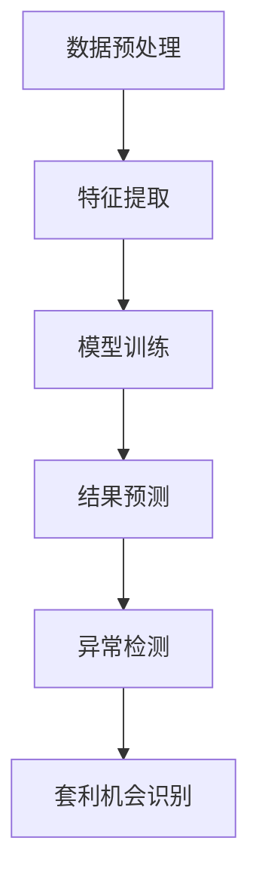
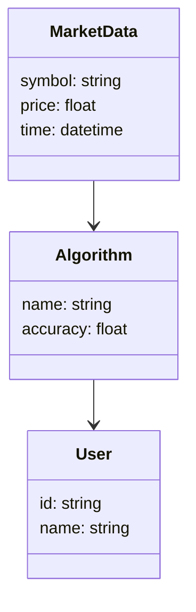
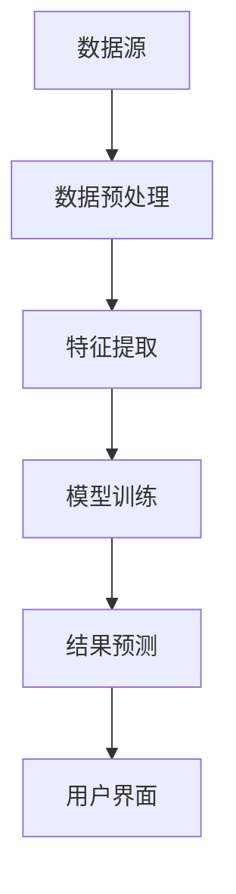

                 


# 智能算法识别市场异常与套利机会

> 关键词：智能算法、市场异常、套利机会、金融分析、机器学习、深度学习、数据驱动

> 摘要：本文系统地探讨了智能算法在识别金融市场异常交易和套利机会中的应用。从背景介绍、核心概念、算法原理到系统设计和项目实战，详细分析了如何利用智能算法解决实际问题。文章结合理论与实践，通过具体案例和代码实现，展示了智能算法在金融分析中的强大能力。

---

## 第一部分: 背景介绍

### 第1章: 问题背景

#### 1.1 市场异常与套利机会的定义
- **市场异常**：指金融市场中价格波动偏离正常规律的现象，可能是由于突发事件、市场操纵或其他非理性因素导致。
- **套利机会**：指利用价格差异在不同市场或资产间进行无风险或低风险交易以获取利润的机会。

#### 1.2 智能算法的作用
- **数据驱动**：通过分析海量数据，发现潜在的市场规律。
- **实时监测**：快速识别异常交易和套利机会。
- **预测能力**：基于历史数据预测未来市场走势。

#### 1.3 问题解决
- **异常检测**：通过统计学和机器学习方法识别异常交易。
- **套利机会识别**：利用算法分析价格差异，寻找套利空间。

---

## 第二部分: 核心概念与联系

### 第2章: 核心概念原理

#### 2.1 数据驱动的异常检测
- **统计方法**：如Z-score、均值-方差法。
- **机器学习方法**：如Isolation Forest、One-Class SVM。

#### 2.2 套利机会识别
- **跨市场套利**：利用不同市场间的价格差异。
- **跨期套利**：利用同一资产在不同时间的价格差异。

#### 2.3 智能算法的数学基础
- **线性回归**：用于预测价格走势。
- **神经网络**：用于复杂模式识别。

### 第3章: 算法流程图



---

## 第三部分: 算法原理讲解

### 第4章: 常见算法原理

#### 4.1 机器学习算法
- **支持向量机（SVM）**：用于分类问题。
- **随机森林**：用于特征重要性分析。

#### 4.2 深度学习算法
- **长短时记忆网络（LSTM）**：用于时间序列分析。
- **卷积神经网络（CNN）**：用于图像数据处理。

#### 4.3 时间序列分析
- **ARIMA模型**：用于预测未来趋势。

### 第5章: 算法实现代码

#### 5.1 数据预处理
```python
import pandas as pd
import numpy as np

# 示例数据加载
data = pd.read_csv('market_data.csv')
data.head()
```

#### 5.2 特征提取
```python
from sklearn.preprocessing import StandardScaler

# 标准化处理
scaler = StandardScaler()
data_scaled = scaler.fit_transform(data)
```

#### 5.3 模型训练
```python
from sklearn.ensemble import RandomForestClassifier

# 训练模型
model = RandomForestClassifier(n_estimators=100)
model.fit(data_scaled, labels)
```

---

## 第四部分: 系统分析与架构设计

### 第6章: 系统功能设计

#### 6.1 领域模型


#### 6.2 系统架构设计


---

## 第五部分: 项目实战

### 第7章: 实战案例分析

#### 7.1 环境安装
- **Python**：安装必要的库如Pandas、Scikit-learn、Keras。
- **数据源**：从Yahoo Finance获取股票数据。

#### 7.2 核心代码实现
```python
import yfinance as yf
from sklearn.model_selection import train_test_split

# 下载数据
data = yf.download('AAPL', start='2020-01-01', end='2023-12-31')

# 数据预处理
data['label'] = data['Close'].shift(-1)
data = data.iloc[:-1]

# 划分训练集和测试集
X = data[['Open', 'High', 'Low', 'Close']]
y = data['label']
X_train, X_test, y_train, y_test = train_test_split(X, y, test_size=0.2)
```

---

## 第六部分: 最佳实践与小结

### 第8章: 最佳实践

- **数据质量**：确保数据的完整性和准确性。
- **模型选择**：根据问题选择合适的算法。
- **实时监控**：持续优化模型，及时发现异常。

### 第9章: 小结

本文系统地介绍了智能算法在识别市场异常与套利机会中的应用，从理论到实践，详细分析了算法的实现和系统设计。通过具体案例展示了智能算法在金融分析中的强大能力。

---

**作者：AI天才研究院 & 禅与计算机程序设计艺术**

