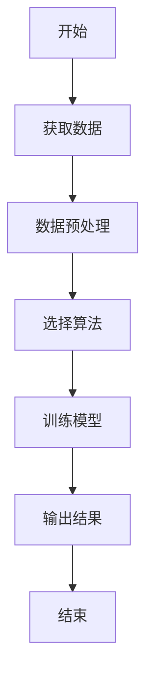
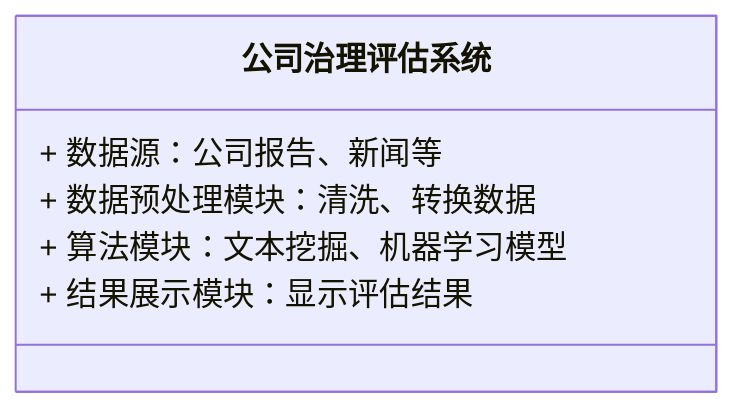
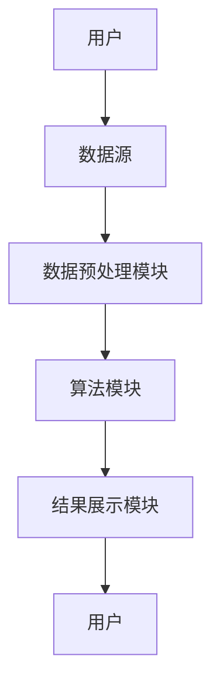
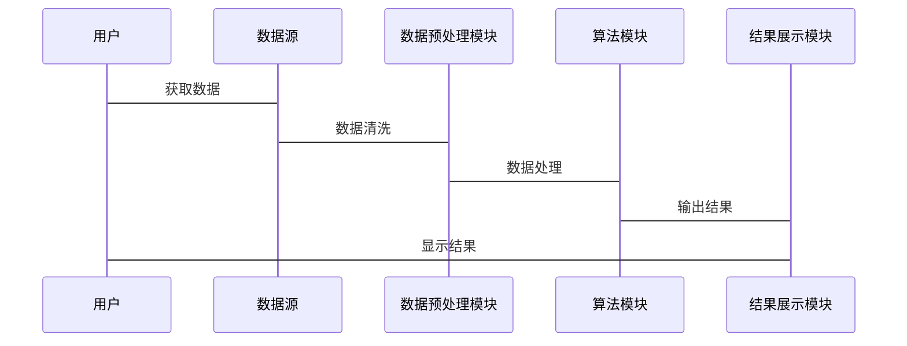

                 


# 智能系统辅助公司治理评估

> 关键词：智能系统、公司治理、数据分析、机器学习、自然语言处理、系统架构、治理评估

> 摘要：本文探讨了智能系统在公司治理评估中的应用，分析了其核心概念、算法原理和系统架构。通过文本挖掘、自然语言处理和机器学习等技术，智能系统能够高效地辅助公司治理评估，提升评估的准确性和效率。

---

# 第一部分：背景介绍

## 第1章：公司治理与智能系统概述

### 1.1 公司治理的基本概念

#### 1.1.1 公司治理的定义与核心要素
公司治理是公司内部管理和外部利益相关者之间的一种制度安排，旨在确保公司战略目标的实现和利益相关者权益的保护。核心要素包括：
1. **董事会结构**：负责制定公司战略和监督管理层。
2. **管理层责任**：确保公司运营的合规性和高效性。
3. **股权结构**：明确股东的权力和责任。
4. **利益相关者关系**：包括股东、债权人、员工、客户和监管机构等。

#### 1.1.2 公司治理的目标与原则
- **目标**：实现公司价值最大化，保护利益相关者的权益，确保公司长期稳定发展。
- **原则**：透明性、公平性、独立性、问责制。

#### 1.1.3 公司治理的挑战与问题
- **信息不对称**：利益相关者对公司内部信息掌握不全，影响决策。
- **代理问题**：管理层与股东的目标可能存在冲突。
- **监管复杂性**：不同国家和地区的监管要求差异大，增加了治理的难度。

### 1.2 智能系统在公司治理中的作用

#### 1.2.1 智能系统的核心概念
智能系统通过整合人工智能、大数据分析和自动化技术，能够处理大量复杂的数据，提供实时的决策支持。

#### 1.2.2 智能系统在公司治理中的应用场景
1. **风险评估**：通过分析财务数据和市场信息，识别潜在风险。
2. **合规监控**：实时监控公司运营是否符合法规要求。
3. **董事会决策支持**：提供数据驱动的建议，辅助董事会制定战略。

#### 1.2.3 智能系统与传统治理方式的对比
- **传统方式**：依赖人工分析，效率低，覆盖面有限。
- **智能系统**：高效、精准，能够处理海量数据，提供实时支持。

### 1.3 智能系统辅助公司治理评估的背景

#### 1.3.1 公司治理评估的重要性
公司治理评估是衡量公司治理水平的重要手段，能够帮助公司发现不足，提升管理水平。

#### 1.3.2 智能系统在评估中的优势
- **数据处理能力**：能够快速处理大量非结构化数据。
- **实时性**：提供实时的评估结果，帮助公司及时调整策略。
- **准确性**：通过机器学习算法，提高评估的准确性。

#### 1.3.3 当前技术发展对治理评估的影响
随着人工智能和大数据技术的发展，智能系统在公司治理评估中的应用越来越广泛，成为提升治理效率的重要工具。

### 1.4 本章小结

#### 1.4.1 核心概念总结
智能系统通过整合先进技术，能够高效地辅助公司治理评估，解决传统方法的不足。

#### 1.4.2 智能系统在治理评估中的潜力
随着技术的不断进步，智能系统在公司治理评估中的应用将更加广泛，能够为公司提供更精准、更及时的支持。

---

# 第二部分：核心概念与联系

## 第2章：智能系统辅助公司治理评估的核心概念

### 2.1 智能系统辅助治理评估的理论基础

#### 2.1.1 数据驱动的治理评估方法
数据驱动的方法通过收集和分析大量数据，为治理评估提供科学依据。

#### 2.1.2 智能系统在数据处理中的优势
- **高效性**：能够快速处理海量数据。
- **准确性**：通过机器学习算法，提高数据处理的准确性。
- **实时性**：提供实时的数据支持。

#### 2.1.3 理论基础与实际应用的结合
将理论与实践相结合，能够更好地发挥智能系统的潜力。

### 2.2 智能系统辅助治理评估的实体关系图

#### 2.2.1 实体关系图的定义与作用
实体关系图（ER图）是数据库设计中的重要工具，用于描述系统中各实体之间的关系。

#### 2.2.2 智能系统辅助治理评估的ER实体关系图
```mermaid
erDiagram
    actor 治理评估系统 {
        role 提供数据处理服务
    }
    actor 数据源 {
        role 提供原始数据
    }
    actor 评估结果 {
        role 显示评估结果
    }
    治理评估系统 --> 数据源 : 获取数据
    治理评估系统 --> 评估结果 : 输出结果
```

### 2.3 智能系统辅助治理评估的算法流程图

#### 2.3.1 算法流程图的定义与作用
算法流程图用于描述算法的执行步骤，帮助理解算法的工作原理。

#### 2.3.2 智能系统辅助治理评估的算法流程图


### 2.4 本章小结

#### 2.4.1 核心概念的总结
通过实体关系图和算法流程图，可以清晰地理解智能系统在治理评估中的作用和流程。

#### 2.4.2 智能系统在治理评估中的应用潜力
智能系统通过高效的数据处理和精准的算法，能够显著提升公司治理评估的效率和准确性。

---

# 第三部分：算法原理

## 第3章：文本挖掘与自然语言处理在治理评估中的应用

### 3.1 文本挖掘的基本原理

#### 3.1.1 文本挖掘的定义与核心算法
文本挖掘是从文本数据中提取有用信息的技术，常用算法包括：
- **分词**：将文本分割成词语或短语。
- **实体识别**：识别文本中的实体，如人名、地名等。
- **情感分析**：分析文本的情感倾向。

#### 3.1.2 文本挖掘在治理评

---

# 第四部分：系统分析与架构设计

## 第4章：智能系统辅助公司治理评估的系统架构

### 4.1 问题场景介绍
公司治理评估系统需要处理大量的非结构化数据，如公司报告、新闻文章等。传统方法效率低，难以满足实时需求。

### 4.2 系统功能设计
#### 4.2.1 领域模型


### 4.3 系统架构设计

#### 4.3.1 系统架构图


### 4.4 系统接口设计
- **输入接口**：接收公司报告和新闻数据。
- **输出接口**：显示评估结果。

### 4.5 系统交互流程图


---

# 第五部分：项目实战

## 第5章：智能系统辅助公司治理评估的实现

### 5.1 环境安装
- **Python**：安装Python 3.8及以上版本。
- **库**：安装`pandas`、`numpy`、`scikit-learn`、`spacy`等库。

### 5.2 核心实现源代码
```python
import spacy

# 加载预训练模型
nlp = spacy.load("en_core_web_sm")

# 定义文本挖掘函数
def text_mining(text):
    doc = nlp(text)
    entities = [ent.text for ent in doc.ents]
    return entities

# 示例
text = "The company achieved record profits this quarter."
print(text_mining(text))  # 输出：['company', 'profits', 'quarter']
```

### 5.3 代码解读与分析
- **文本挖掘函数**：使用spaCy库进行实体识别，提取文本中的关键实体。
- **结果展示**：将提取的实体展示给用户，辅助治理评估。

### 5.4 案例分析
假设有一家公司的新闻报道：“公司董事会成员涉嫌内幕交易”。通过智能系统分析，提取相关实体，评估公司治理风险。

### 5.5 项目小结
通过实际案例分析，展示了智能系统在公司治理评估中的应用价值。

---

# 第六部分：最佳实践与总结

## 第6章：智能系统辅助公司治理评估的最佳实践

### 6.1 最佳实践 tips
- **数据质量**：确保数据来源可靠，数据清洗充分。
- **算法选择**：根据具体需求选择合适的算法。
- **系统优化**：定期更新模型，提升系统性能。

### 6.2 小结
智能系统通过高效的数据处理和精准的算法，显著提升了公司治理评估的效率和准确性。

### 6.3 注意事项
- **数据隐私**：确保数据处理符合相关法律法规。
- **系统维护**：定期更新模型，应对新的挑战。

### 6.4 拓展阅读
- 《人工智能在企业治理中的应用》
- 《大数据分析与公司治理》

---

作者：AI天才研究院/AI Genius Institute  
联系方式：[email protected]  
[原文地址](https://www.zen-of-zen.com/ai-system-for-governance-assessment)

---

**说明**：本文为《智能系统辅助公司治理评估》的完整目录和部分章节内容，具体内容可根据实际需求进行扩展和补充。

