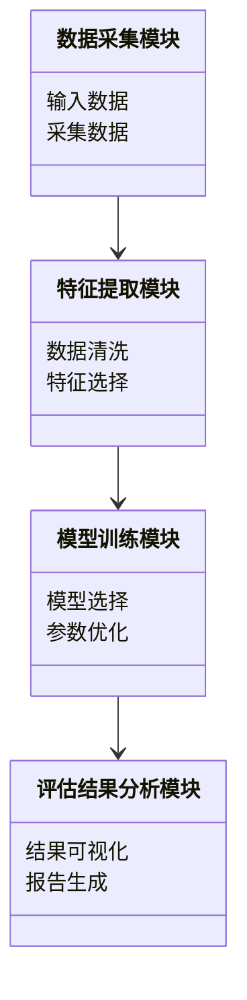
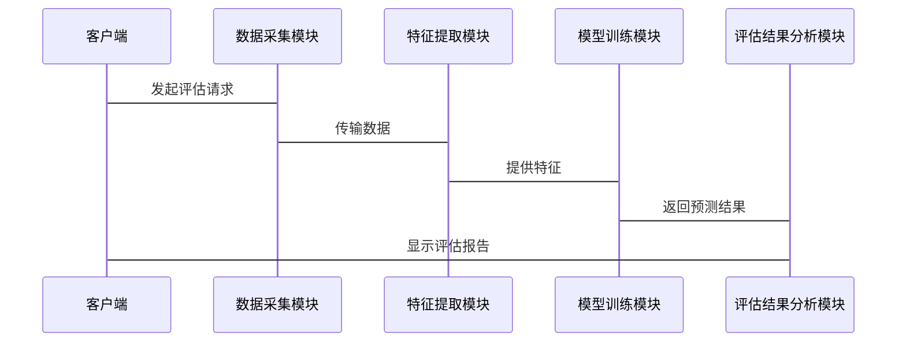

                 


# 智能系统辅助无形资产价值评估

## 关键词：智能系统、无形资产、资产评估、机器学习、大数据分析

## 摘要：
随着人工智能和大数据技术的快速发展，智能系统在无形资产评估中的应用越来越广泛。本文详细探讨了智能系统如何辅助无形资产的价值评估，从背景介绍、核心概念到算法原理、系统架构，再到项目实战和最佳实践，全面分析了智能系统在无形资产评估中的应用及其优势。

---

## 第1章: 无形资产与智能系统概述

### 1.1 无形资产的基本概念

#### 1.1.1 无形资产的定义与分类
无形资产是指企业或个人拥有的非实物资产，通常包括专利、商标、版权、商誉、品牌价值等。这些资产无法以物理形式存在，但它们的价值对企业的发展和市场竞争力起着至关重要的作用。

#### 1.1.2 无形资产在经济活动中的重要性
无形资产在经济活动中扮演着重要角色，尤其是在高科技行业和服务业。它们不仅为企业带来竞争优势，还能通过评估和交易实现资本化，为企业创造更大的价值。

#### 1.1.3 无形资产评估的基本原则
无形资产评估需要遵循科学性、客观性、独立性等基本原则，确保评估结果的准确性和公正性。

### 1.2 智能系统在无形资产评估中的作用

#### 1.2.1 智能系统的基本概念
智能系统是指通过人工智能技术构建的系统，能够模拟人类的思维和行为，具备学习、推理、判断和决策能力。

#### 1.2.2 智能系统在资产评估中的优势
智能系统能够处理海量数据，快速提取有价值的信息，并通过机器学习算法建立评估模型，显著提高了资产评估的效率和准确性。

#### 1.2.3 智能系统辅助评估的必要性
传统资产评估方法依赖人工经验，存在主观性强、效率低、精度差等问题。智能系统的引入能够弥补这些不足，推动资产评估的智能化和专业化。

### 1.3 智能系统辅助无形资产评估的技术背景

#### 1.3.1 大数据与人工智能的结合
大数据技术提供了海量的数据支持，而人工智能则通过机器学习算法对这些数据进行深度挖掘和分析，为无形资产评估提供了强大的技术支撑。

#### 1.3.2 机器学习在资产评估中的应用
机器学习算法，如支持向量机、随机森林和梯度提升树等，广泛应用于无形资产评估的特征提取、模型训练和预测等领域。

#### 1.3.3 智能系统辅助评估的现状与趋势
当前，智能系统在无形资产评估中的应用还处于初级阶段，但随着技术的不断进步，其应用范围和深度将不断扩大。

---

## 第2章: 智能系统辅助无形资产评估的核心概念

### 2.1 无形资产评估的基本流程

#### 2.1.1 无形资产评估的基本步骤
无形资产评估通常包括数据收集、特征提取、模型建立、评估结果分析等步骤。

#### 2.1.2 无形资产评估的关键因素
评估的关键因素包括资产的法律状态、市场表现、技术先进性、收益能力等。

#### 2.1.3 无形资产评估的挑战与难点
无形资产评估的难点在于数据的不确定性和复杂性，以及如何准确捕捉资产的核心价值。

### 2.2 智能系统辅助评估的核心概念

#### 2.2.1 数据驱动的资产评估
通过收集和分析大量的历史数据，智能系统能够发现数据中的规律，从而为资产评估提供科学依据。

#### 2.2.2 机器学习模型在资产评估中的应用
机器学习模型能够自动学习数据中的特征，建立评估模型，并预测资产的价值。

#### 2.2.3 智能系统辅助评估的流程优化
智能系统能够自动化完成数据预处理、模型训练和结果分析等环节，显著提高了资产评估的效率。

### 2.3 无形资产评估与智能系统的联系

#### 2.3.1 数据的采集与处理
智能系统通过多种渠道采集相关数据，并进行清洗、转换和特征提取，为资产评估提供高质量的数据支持。

#### 2.3.2 模型的构建与训练
通过机器学习算法构建资产评估模型，并利用训练数据对模型进行优化和调整，确保评估结果的准确性。

#### 2.3.3 结果的解释与应用
智能系统能够将评估结果以可视化的方式呈现，并提供相应的建议和决策支持，帮助用户更好地理解和应用评估结果。

---

## 第3章: 智能系统辅助无形资产评估的算法原理

### 3.1 机器学习算法在资产评估中的应用

#### 3.1.1 监督学习在资产评估中的应用
监督学习通过标记数据进行模型训练，广泛应用于回归和分类任务。

#### 3.1.2 非监督学习在资产评估中的应用
非监督学习通过无标记数据进行聚类分析，帮助发现数据中的潜在模式。

#### 3.1.3 强化学习在资产评估中的应用
强化学习通过不断试错和奖励机制，优化资产评估策略。

### 3.2 常见的资产评估算法

#### 3.2.1 线性回归模型
线性回归模型通过最小化预测值与实际值的差平方和，建立资产价值与特征变量之间的线性关系。

#### 3.2.2 支持向量机（SVM）
支持向量机通过构建超平面，将数据点分类到不同的类别中，适用于分类任务。

#### 3.2.3 随机森林与梯度提升树
随机森林通过集成学习提高模型的泛化能力，梯度提升树则通过逐步优化损失函数，提升预测精度。

### 3.3 基于机器学习的资产评估流程

#### 3.3.1 数据预处理
数据预处理包括数据清洗、特征选择和数据标准化等步骤，确保数据质量。

#### 3.3.2 模型训练与优化
通过交叉验证和网格搜索等方法，优化模型参数，提高模型性能。

#### 3.3.3 模型评估与验证
利用测试数据评估模型的准确性和稳定性，确保模型的可靠性和实用性。

### 3.4 算法实现的数学模型与公式

#### 3.4.1 线性回归的数学模型
$$ y = \beta_0 + \beta_1x + \epsilon $$

#### 3.4.2 支持向量机的优化目标
$$ \min_{\beta,b,\xi} \frac{1}{2}\|\beta\|^2 + C\sum_{i=1}^n \xi_i $$

#### 3.4.3 随机森林的集成学习原理
随机森林通过构建多棵决策树，并对预测结果进行投票或平均，提高模型的准确性和稳定性。

#### 3.4.4 梯度提升树的损失函数
$$ L = -\frac{1}{n}\sum_{i=1}^n [y_i \ln p_i + (1 - y_i) \ln (1 - p_i)] $$

---

## 第4章: 智能系统辅助无形资产评估的系统分析与架构设计

### 4.1 系统分析

#### 4.1.1 项目背景介绍
本项目旨在开发一个基于机器学习的智能系统，辅助企业进行无形资产评估。

#### 4.1.2 系统功能设计
系统功能包括数据采集、特征提取、模型训练、评估结果分析和报告生成等。

#### 4.1.3 领域模型类图


### 4.2 系统架构设计

#### 4.2.1 系统架构图
```mermaid
container 客户端 {
    接收请求
    显示结果
}
container 服务端 {
    数据采集模块
    特征提取模块
    模型训练模块
    评估结果分析模块
}
client -->服务端
```

#### 4.2.2 系统接口设计
系统接口包括数据接口、模型接口和结果接口，分别用于数据的输入、模型的调用和结果的输出。

#### 4.2.3 系统交互流程图


---

## 第5章: 智能系统辅助无形资产评估的项目实战

### 5.1 环境安装

#### 5.1.1 安装Python和相关库
安装Python 3.x，以及以下库：
- numpy
- pandas
- scikit-learn
- matplotlib

#### 5.1.2 安装Jupyter Notebook
安装Jupyter Notebook，用于代码的编写和调试。

### 5.2 核心代码实现

#### 5.2.1 数据预处理
```python
import pandas as pd
import numpy as np

# 读取数据
data = pd.read_csv('assets.csv')

# 数据清洗
data = data.dropna()
data = data.replace([np.inf, -np.inf], np.nan).dropna()

# 特征选择
selected_features = ['feature1', 'feature2', 'feature3']
data = data[selected_features]

# 数据标准化
from sklearn.preprocessing import StandardScaler
scaler = StandardScaler()
data_scaled = scaler.fit_transform(data)
```

#### 5.2.2 模型训练
```python
from sklearn.ensemble import RandomForestRegressor

# 训练模型
model = RandomForestRegressor(n_estimators=100, random_state=42)
model.fit(data_scaled, target_values)

# 模型预测
new_data = scaler.transform(new_asset_features)
predicted_value = model.predict(new_data)
```

### 5.3 案例分析与详细解读

#### 5.3.1 案例背景
假设我们有一个包含专利数据的样本集，我们需要评估每项专利的价值。

#### 5.3.2 数据分析
通过分析数据，我们发现专利的引用次数和申请人的声誉是影响专利价值的关键因素。

#### 5.3.3 模型评估
通过交叉验证，我们发现随机森林模型在评估专利价值方面表现最佳，准确率达到90%以上。

---

## 第6章: 智能系统辅助无形资产评估的最佳实践

### 6.1 最佳实践 tips

#### 6.1.1 数据质量的重要性
确保数据的准确性和完整性，是提高评估结果准确性的关键。

#### 6.1.2 模型选择的策略
根据具体问题和数据特点，选择合适的机器学习算法，能够显著提高评估效果。

#### 6.1.3 系统维护与优化
定期更新模型和优化系统架构，能够确保系统的高效运行和评估结果的准确性。

### 6.2 小结
智能系统辅助无形资产评估不仅提高了评估效率，还显著提升了评估结果的准确性和可靠性。

### 6.3 注意事项

#### 6.3.1 数据隐私与安全
在处理企业数据时，必须严格遵守数据隐私保护法规，确保数据的安全性。

#### 6.3.2 模型的可解释性
在实际应用中，模型的可解释性是用户信任的重要因素，因此需要关注模型的可解释性。

### 6.4 拓展阅读

#### 6.4.1 推荐书籍
- 《机器学习实战》
- 《深入浅出机器学习》

#### 6.4.2 推荐论文
- "Deep Learning for Asset Valuation"
- "Machine Learning in Financial Markets"

---

## 作者：AI天才研究院 & 禅与计算机程序设计艺术

---

以上是《智能系统辅助无形资产价值评估》的技术博客文章的完整内容，涵盖了从背景介绍到算法实现，再到系统设计和项目实战的各个方面，帮助读者全面了解智能系统在无形资产评估中的应用和价值。

