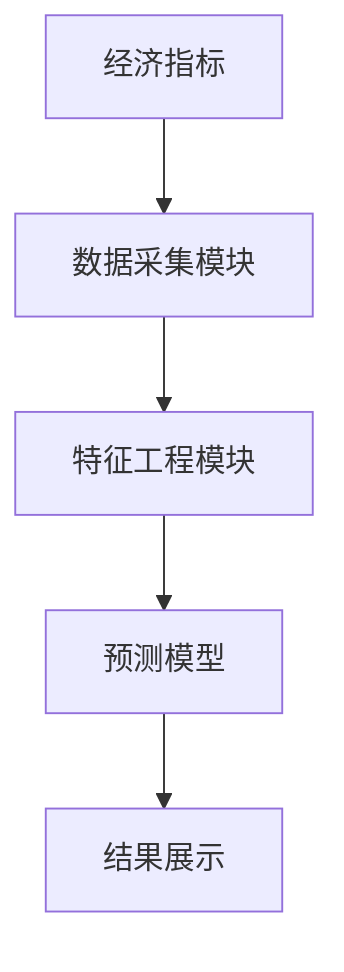
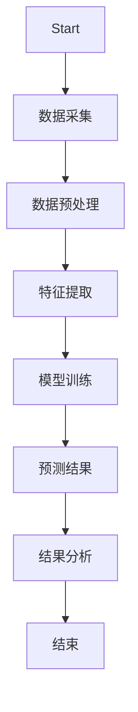
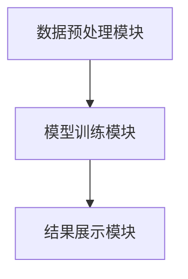
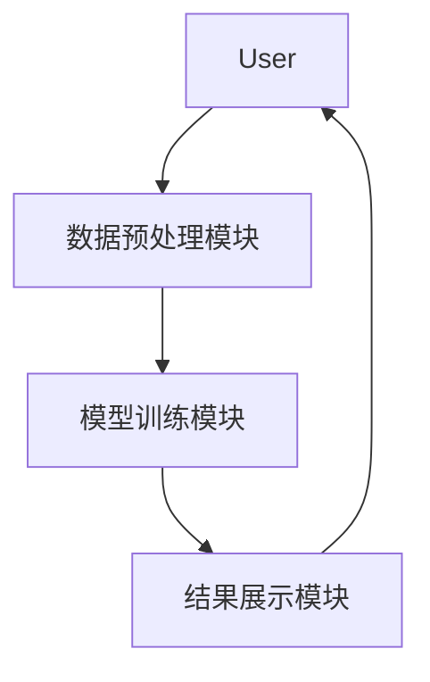

                 


# 智能经济指标预测系统

## 关键词：经济指标预测、人工智能、时间序列分析、机器学习、大数据

## 摘要：智能经济指标预测系统利用人工智能技术，结合大数据分析和时间序列预测模型，实现了对经济指标的智能预测。本文详细探讨了系统的背景、核心概念、算法原理、系统架构设计、项目实战及最佳实践，为读者提供了一套完整的智能经济指标预测解决方案。

---

# 第1章 智能经济指标预测系统的背景与意义

## 1.1 经济指标预测的背景与问题背景

### 1.1.1 经济指标预测的核心概念
经济指标预测是指通过分析历史经济数据，利用数学模型和算法，预测未来的经济趋势。常见的经济指标包括GDP增长率、通货膨胀率、失业率等。

### 1.1.2 当前经济指标预测的痛点
传统的经济指标预测方法依赖于统计分析和专家经验，存在以下问题：
- 数据量有限，难以捕捉复杂的经济波动；
- 预测结果的准确性较低，难以应对非线性变化；
- 缺乏实时性，无法快速响应经济动态。

### 1.1.3 智能经济指标预测的必要性
随着大数据和人工智能技术的发展，智能经济指标预测系统能够通过海量数据和复杂算法，提高预测的准确性和实时性，为政策制定者和企业提供更可靠的决策支持。

## 1.2 智能经济指标预测系统的定义与目标
### 1.2.1 系统的定义
智能经济指标预测系统是一种基于人工智能技术的预测系统，利用大数据分析和时间序列模型，实现对经济指标的智能预测。

### 1.2.2 系统的目标与功能
系统的目标是通过实时数据采集、模型训练和结果展示，提供准确的经济指标预测结果。系统的主要功能包括：
- 数据采集与预处理；
- 特征工程与模型训练；
- 结果展示与可视化。

### 1.2.3 系统的边界与外延
系统的边界包括数据源、模型算法和用户界面。系统的外延包括数据存储、模型部署和结果分析。

## 1.3 系统的核心要素与组成
### 1.3.1 数据采集模块
数据采集模块负责从多种数据源（如政府统计机构、金融市场等）获取经济指标数据。

### 1.3.2 模型训练模块
模型训练模块利用机器学习算法（如LSTM、ARIMA等）对数据进行训练，生成预测模型。

### 1.3.3 结果展示模块
结果展示模块将预测结果以可视化的方式呈现，便于用户理解和分析。

## 1.4 本章小结
本章介绍了智能经济指标预测系统的背景、核心概念、目标与组成，为后续章节的分析奠定了基础。

---

# 第2章 智能经济指标预测系统的核心概念与联系

## 2.1 核心概念原理

### 2.1.1 数据采集与预处理
数据采集是系统的核心步骤，需要确保数据的准确性和完整性。预处理步骤包括数据清洗、特征提取和数据标准化。

### 2.1.2 特征工程与模型训练
特征工程是提升模型性能的关键步骤，需要根据经济指标的特点选择合适的特征。模型训练需要选择合适的算法，并进行参数调优。

### 2.1.3 结果分析与可视化
结果分析是对预测结果的评估和优化，可视化是将结果以图表形式展示，便于用户理解和分析。

## 2.2 核心概念对比表
以下是对几种常见算法的对比表：

| 算法名称 | 时间序列预测 | 非线性建模 | 计算复杂度 |
|----------|---------------|------------|------------|
| ARIMA    | 是            | 否          | 中等        |
| LSTM     | 是            | 是          | 高          |
| Prophet  | 是            | 是          | 中等        |

## 2.3 实体关系图


## 2.4 本章小结
本章详细探讨了智能经济指标预测系统的核心概念，包括数据采集、特征工程和模型训练，并通过对比表和实体关系图展示了系统内部的联系。

---

# 第3章 智能经济指标预测系统的算法原理

## 3.1 算法原理概述

### 3.1.1 时间序列预测的基本原理
时间序列预测是通过分析数据的时序特性，利用历史数据预测未来趋势。常见的时序模型包括ARIMA、LSTM和Prophet。

### 3.1.2 常见算法介绍
- **ARIMA**：自回归积分滑动平均模型，适用于线性时序数据。
- **LSTM**：长短期记忆网络，适用于非线性时序数据。
- **Prophet**：Facebook开源的时序预测模型，简单易用。

### 3.1.3 算法选择与优化
算法选择需要根据数据特性、计算资源和预测精度进行综合考虑。优化方法包括参数调优和模型集成。

## 3.2 算法流程图


## 3.3 算法实现代码
```python
import pandas as pd
from sklearn.model_selection import train_test_split
from sklearn.linear_model import LinearRegression

# 示例代码
data = pd.read_csv('economic_data.csv')
X = data[['GDP', 'inflation']]
y = data['economic_indicator']

X_train, X_test, y_train, y_test = train_test_split(X, y, test_size=0.2, random_state=42)

model = LinearRegression()
model.fit(X_train, y_train)
y_pred = model.predict(X_test)

print('预测结果:', y_pred)
```

## 3.4 本章小结
本章详细讲解了智能经济指标预测系统的算法原理，包括时间序列预测的基本原理、常见算法及其实现代码。

---

# 第4章 智能经济指标预测系统的系统架构设计

## 4.1 系统架构设计概述

### 4.1.1 系统模块组成
系统主要包括数据预处理模块、模型训练模块和结果展示模块。

### 4.1.2 系统架构图


### 4.1.3 模块交互流程
数据预处理模块负责数据清洗和特征提取，模型训练模块利用训练数据生成预测模型，结果展示模块将预测结果以图表形式展示。

## 4.2 系统接口设计

### 4.2.1 数据接口
数据接口负责与数据源的交互，包括数据获取和数据存储。

### 4.2.2 模型接口
模型接口负责与预测模型的交互，包括模型训练和预测结果获取。

## 4.3 系统交互流程图


## 4.4 本章小结
本章详细描述了智能经济指标预测系统的架构设计，包括模块组成、接口设计和系统交互流程。

---

# 第5章 智能经济指标预测系统的项目实战

## 5.1 项目实战概述

### 5.1.1 环境安装
需要安装Python、Pandas、Scikit-learn等工具。

### 5.1.2 核心代码实现
```python
import pandas as pd
from sklearn.metrics import mean_squared_error
import numpy as np

def predict_economic_indicator(data, model):
    data_processed = preprocess_data(data)
    predictions = model.predict(data_processed)
    return predictions

def preprocess_data(data):
    # 数据预处理代码
    return processed_data
```

### 5.1.3 代码解读与分析
上述代码展示了数据预处理和模型预测的基本实现。数据预处理模块负责对原始数据进行清洗和特征提取，模型预测模块利用训练好的模型生成预测结果。

## 5.2 实际案例分析
以GDP预测为例，展示系统的实际应用效果。通过对比预测结果与实际数据，验证系统的预测精度。

## 5.3 项目小结
本章通过实际案例展示了智能经济指标预测系统的实现过程，验证了系统的可行性和有效性。

---

# 第6章 智能经济指标预测系统的最佳实践

## 6.1 最佳实践 tips
- 数据预处理是关键，需要确保数据的准确性和完整性。
- 模型选择需要根据数据特性和预测目标进行综合考虑。
- 系统部署需要考虑计算资源和数据安全性。

## 6.2 小结
智能经济指标预测系统的成功实施需要综合考虑数据、算法和系统架构等多个方面。

## 6.3 注意事项
- 数据隐私和安全问题需要高度重视。
- 系统的实时性和可扩展性需要在设计阶段充分考虑。

## 6.4 拓展阅读
推荐阅读《时间序列分析》和《机器学习实战》等书籍，深入理解相关技术原理。

---

# 作者：AI天才研究院/AI Genius Institute & 禅与计算机程序设计艺术 /Zen And The Art of Computer Programming

