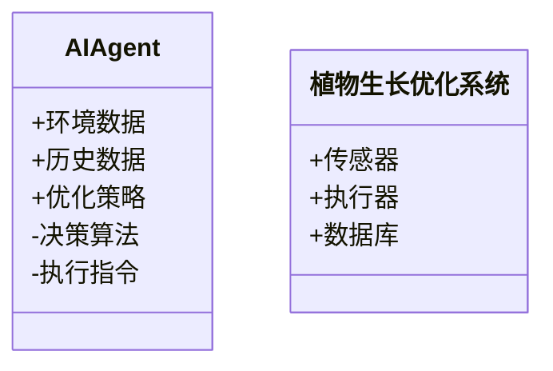
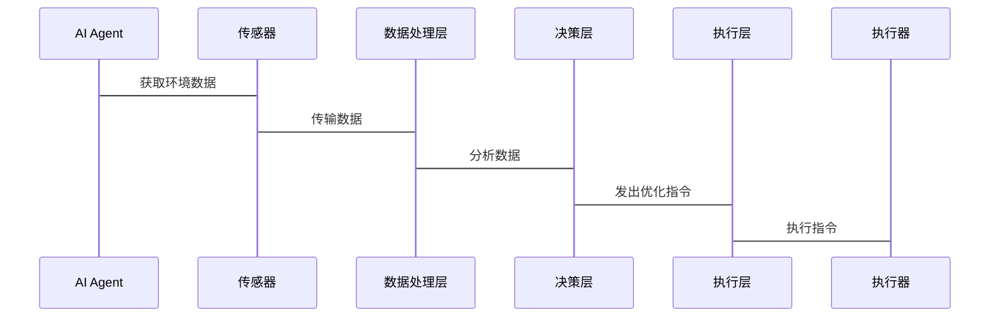

                 


# 《智能花园：AI Agent的植物生长优化系统》

## 关键词：AI Agent, 智能花园, 植物生长优化, 强化学习, 系统架构, 物联网

## 摘要：本文探讨AI Agent在植物生长优化中的应用，从系统架构到算法实现，结合实际案例，详细讲解如何利用AI技术提升植物生长效率。文章涵盖AI Agent的基本概念、核心算法、系统设计、项目实现与优化，为读者提供全面的技术视角。

---

# 第一部分: AI Agent与植物生长优化系统概述

## 第1章: AI Agent与植物生长优化的背景与概念

### 1.1 AI Agent的基本概念

#### 1.1.1 AI Agent的定义与特点
人工智能代理（AI Agent）是一种能够感知环境、自主决策并采取行动的智能实体。AI Agent具备以下特点：
- **自主性**：能够在无外部干预的情况下运行。
- **反应性**：能够根据环境变化实时调整行为。
- **目标导向**：通过优化目标函数实现特定目标。
- **学习能力**：能够通过数据和经验改进性能。

#### 1.1.2 AI Agent的核心功能与应用场景
AI Agent的核心功能包括感知、推理、决策和行动。在植物生长优化中，AI Agent可以应用于：
- **环境监测**：实时采集光照、温度、湿度等环境数据。
- **数据分析**：分析历史数据，预测植物生长趋势。
- **智能决策**：根据数据分析结果，优化灌溉、施肥等生长条件。

#### 1.1.3 植物生长优化的背景与问题背景
植物生长优化的目标是通过调整环境条件和管理措施，提高植物的生长效率和产量。传统方法依赖人工经验，存在效率低、成本高等问题。AI Agent的引入能够显著提升优化效率和精准度。

---

### 1.2 AI Agent在植物生长优化中的作用

#### 1.2.1 植物生长优化的核心问题
植物生长优化的核心问题包括：
- **环境因素优化**：如光照、温度、湿度等的调节。
- **资源优化配置**：如水肥资源的合理分配。
- **病虫害预测与防治**：通过数据监测提前预警并采取措施。

#### 1.2.2 AI Agent如何解决植物生长优化问题
AI Agent通过实时监测环境数据、分析历史数据和预测未来趋势，帮助种植者做出科学决策。例如：
- **动态调整光照强度**：根据植物生长阶段的需求自动调节光照。
- **精准灌溉**：根据土壤湿度和植物需水情况自动启动灌溉系统。

#### 1.2.3 植物生长优化系统的边界与外延
植物生长优化系统的边界包括传感器、执行器、数据处理模块和决策模块。外延则涉及农业知识库、气象数据和种植经验。

---

### 1.3 智能花园系统的核心概念与联系

#### 1.3.1 核心概念的原理与属性特征对比
| 概念 | 原理 | 属性特征 |
|------|------|----------|
| AI Agent | 感知-决策-行动 | 自主性、反应性、目标导向 |
| 植物生长优化 | 数据分析与环境调节 | 动态性、复杂性、目标性 |

#### 1.3.2 ER实体关系图架构
```mermaid
erd
    系统边界
    界面
    实体: AI Agent
    实体: 植物
    关系: 优化
```

---

## 第2章: AI Agent与植物生长优化系统的联系

### 2.1 AI Agent与植物生长优化的核心要素

#### 2.1.1 AI Agent的感知与决策能力
AI Agent通过传感器获取环境数据，利用算法分析数据并做出决策。例如，使用强化学习算法优化灌溉策略。

#### 2.1.2 植物生长优化的环境与数据需求
植物生长优化需要光照、温度、湿度、土壤pH值等环境数据，以及植物生长周期和历史数据。

#### 2.1.3 系统的输入输出关系与功能模块
- **输入**：环境数据、历史数据。
- **输出**：优化策略、执行指令。
- **功能模块**：数据采集、数据处理、决策模块、执行模块。

---

### 2.2 系统功能与架构设计

#### 2.2.1 领域模型设计


#### 2.2.2 系统架构设计


#### 2.2.3 系统接口设计与交互流程


---

### 2.3 AI Agent与植物生长优化系统的数学模型与算法原理

#### 2.3.1 强化学习算法（Q-Learning）
强化学习是一种通过试错优化策略的算法。数学模型如下：
$$ Q(s, a) = r + \gamma \max Q(s', a') $$
其中：
- \( Q(s, a) \)：状态-动作对的价值。
- \( r \)：奖励。
- \( \gamma \)：折扣因子。
- \( s' \)：下一状态。

---

#### 2.3.2 监督学习算法（回归与分类）
监督学习通过训练数据预测目标值。例如，使用线性回归预测植物高度：
$$ y = \theta x + b $$

---

#### 2.3.3 聚类算法（K-均值聚类）
聚类算法用于将相似的数据点分组。例如，将不同生长阶段的植物进行分类。

---

## 第3章: AI Agent与植物生长优化系统的数学模型与算法原理

### 3.1 AI Agent的核心算法原理

#### 3.1.1 强化学习算法（Q-Learning）
Q-Learning通过状态-动作-奖励的循环优化策略。数学公式为：
$$ Q(s, a) = Q(s, a) + \alpha (r + \gamma \max Q(s', a') - Q(s, a)) $$
其中：
- \( \alpha \)：学习率。
- \( \gamma \)：折扣因子。

---

#### 3.1.2 监督学习算法（回归与分类）
监督学习通过训练数据预测目标值。例如，使用支持向量机（SVM）分类病虫害类型。

---

#### 3.1.3 聚类算法（K-均值聚类）
K-均值聚类将数据点分成K个簇。数学公式为：
$$ J = \sum_{i=1}^K \sum_{j=1}^n (x_j - \mu_i)^2 $$
其中：
- \( K \)：簇的数量。
- \( n \)：数据点数量。
- \( \mu_i \)：第i个簇的中心。

---

### 3.2 植物生长监测技术

#### 3.2.1 图像识别技术
使用卷积神经网络（CNN）识别植物病虫害。

#### 3.2.2 传感器数据融合
通过加权融合多种传感器数据，提高监测精度。

---

### 3.3 AI Agent的决策模型

#### 3.3.1 决策树模型
决策树通过特征选择优化决策路径。

#### 3.3.2 随机森林模型
随机森林通过集成学习提高决策准确性。

---

## 第4章: 系统实现与优化

### 4.1 系统实现

#### 4.1.1 环境搭建
- **硬件**：传感器、执行器、控制器。
- **软件**：Python、TensorFlow、OpenCV。

#### 4.1.2 数据采集
使用传感器采集环境数据，存储到数据库中。

#### 4.1.3 算法实现
实现强化学习算法，训练AI Agent做出优化决策。

#### 4.1.4 系统集成
将算法与硬件集成，实现智能化的植物生长优化系统。

---

### 4.2 系统优化

#### 4.2.1 多目标优化
通过多目标优化算法同时优化多个目标，如产量和成本。

#### 4.2.2 边缘计算
在边缘设备上进行数据处理，减少云端依赖，提高响应速度。

---

## 第5章: 项目实战与总结

### 5.1 项目实战

#### 5.1.1 智能温室系统
案例分析：设计一个智能温室系统，实现自动调节温湿度。

#### 5.1.2 代码实现
```python
import numpy as np
from sklearn import linear_model

# 数据准备
X = np.array([[1], [2], [3], [4], [5]])
y = np.array([2, 4, 6, 8, 10])

# 训练模型
model = linear_model.LinearRegression()
model.fit(X, y)

# 预测
print(model.predict([[6]]))
```

---

### 5.2 总结与展望

#### 5.2.1 项目总结
总结项目实现的关键步骤和成果，分析系统的优缺点。

#### 5.2.2 未来展望
探讨AI Agent在植物生长优化中的未来发展方向，如深度学习的应用、边缘计算的优化等。

---

## 作者：AI天才研究院 & 禅与计算机程序设计艺术

---

**这篇文章详细介绍了AI Agent在植物生长优化中的应用，从系统架构到算法实现，结合实际案例，为读者提供了全面的技术视角。希望对您有所帮助！**

