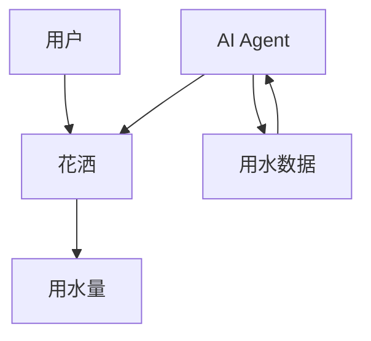
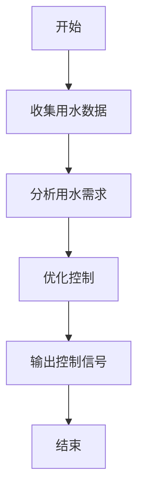
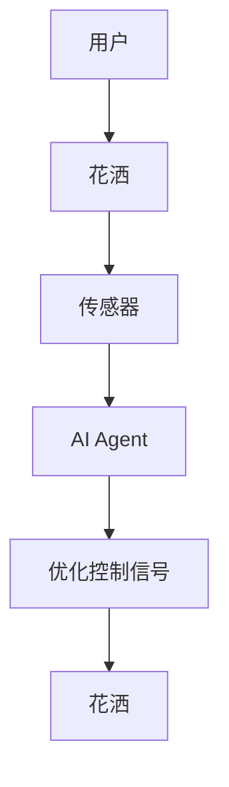

                 


# 智能花洒：AI Agent的用水量优化控制

> 关键词：智能花洒，AI Agent，用水优化，算法原理，系统架构，项目实战

> 摘要：本文详细探讨了智能花洒在AI Agent技术下的用水量优化控制，从背景介绍到系统架构设计，再到项目实战，全面分析了如何通过AI技术实现节水目标。文章结合实际案例，深入解读了优化算法的实现过程，并提供了详细的代码示例和系统架构图，帮助读者理解智能花洒的工作原理及实际应用。

---

## 正文

### 第一部分: 背景介绍

#### 第1章: 背景介绍

##### 1.1 问题背景

- **1.1.1 水资源浪费的现状**
  - 全球水资源短缺问题日益严重，水浪费现象普遍存在。
  - 花洒在家庭用水中占据重要比例，优化花洒用水具有重要意义。

- **1.1.2 智能化节水的必要性**
  - 传统花洒无法根据实际需求调整出水量。
  - 智能化节水技术能够有效减少水资源浪费。

- **1.1.3 AI技术在节水中的应用潜力**
  - AI技术能够实时感知用水环境，动态调整出水量。
  - 通过学习用户行为和环境数据，优化用水效率。

##### 1.2 问题描述

- **1.2.1 花洒用水的浪费问题**
  - 传统花洒出水量固定，无法根据实际需求调整。
  - 用户行为和环境变化导致水资源浪费。

- **1.2.2 不同场景下的用水需求差异**
  - 洗澡、清洁等不同场景对水压和水量的需求不同。
  - 需要动态调整出水量以适应不同需求。

- **1.2.3 传统花洒的局限性**
  - 无法感知用户行为和环境变化。
  - 无法实现智能化的用水优化。

##### 1.3 问题解决

- **1.3.1 AI Agent的定义与作用**
  - AI Agent是一种智能代理系统，能够感知环境、学习用户行为，并动态调整系统输出。
  - 在智能花洒中，AI Agent负责收集用水数据、分析需求并优化出水量。

- **1.3.2 智能花洒的工作原理**
  - 通过传感器收集用水数据，如水压、水流速度、用户行为等。
  - AI Agent分析数据，动态调整出水量，实现节水目标。

- **1.3.3 用水量优化的具体实现**
  - 基于强化学习的优化算法，动态调整出水量。
  - 根据用户行为和环境数据，预测用水需求，优化用水量。

##### 1.4 边界与外延

- **1.4.1 系统的边界条件**
  - 系统仅优化花洒的用水量，不涉及其他设备。
  - 优化范围限于家庭或特定场景，不考虑工业用水。

- **1.4.2 相关技术的外延**
  - 涉及传感器技术、AI算法、物联网技术等。
  - 可与其他智能设备联动，实现更高效的节水方案。

- **1.4.3 应用场景的限制**
  - 适用于家庭、酒店等场景，不适用于工业用水。
  - 需要网络环境支持，无法在离线状态下工作。

---

### 第二部分: AI Agent的核心概念与联系

#### 第2章: AI Agent原理

##### 2.1 核心原理

- **2.1.1 感知与决策机制**
  - 通过传感器感知环境和用户行为。
  - 利用机器学习算法分析数据，生成决策。

- **2.1.2 行为执行与反馈**
  - 根据决策调整花洒出水量。
  - 收集反馈数据，优化算法模型。

- **2.1.3 多目标优化算法**
  - 在满足用水需求的前提下，最小化用水量。
  - 通过强化学习优化用水效率。

##### 2.2 概念属性特征对比

| 概念        | 传统花洒            | 智能花洒（AI Agent）          |
|-------------|--------------------|-----------------------------|
| 感知能力    | 无感知              | 具备环境感知能力              |
| 决策能力    | 固定出水量          | 动态调整出水量                |
| 用户交互    | 无智能交互          | 支持用户行为分析和反馈        |
| 优化能力    | 无优化能力          | 具备多目标优化能力            |

##### 2.3 ER实体关系图



---

### 第三部分: 算法原理讲解

#### 第3章: 算法原理

##### 3.1 算法流程



##### 3.2 算法实现代码

```python
# 示例代码：用水量优化算法
def optimize_water_usage(data):
    import numpy as np
    from sklearn import linear_model

    # 数据预处理
    X = np.array(data['time']).reshape(-1, 1)
    y = np.array(data['water_usage'])

    # 创建线性回归模型
    model = linear_model.LinearRegression()
    model.fit(X, y)

    # 预测用水需求
    predicted_usage = model.predict(X)

    # 计算优化后的用水量
    optimized_usage = predicted_usage * 0.8  # 假设目标是减少20%的用水量

    return optimized_usage
```

##### 3.3 数学模型与公式

- **用水量预测模型**
  $$ y = \beta_0 + \beta_1 x + \epsilon $$
  其中，$x$ 是时间变量，$y$ 是预测用水量。

- **优化算法模型**
  $$ \text{目标函数} = \min \sum_{i=1}^{n} (y_i - \hat{y}_i)^2 $$
  其中，$y_i$ 是实际用水量，$\hat{y}_i$ 是优化后的用水量。

---

### 第四部分: 系统分析与架构设计

#### 第4章: 系统分析与架构设计

##### 4.1 项目介绍

- 项目名称：智能花洒AI优化控制系统
- 项目目标：通过AI技术优化花洒用水量，减少水资源浪费。

##### 4.2 系统功能设计

- 用户端功能：
  - 实时监控用水数据。
  - 设置用水偏好（如节水模式）。
- 系统端功能：
  - 数据采集与处理。
  - AI算法优化控制。

##### 4.3 系统架构设计



---

### 第五部分: 项目实战

#### 第5章: 项目实战

##### 5.1 环境安装

- 安装Python和相关库：
  ```bash
  pip install numpy scikit-learn
  ```

##### 5.2 系统核心实现

```python
class WaterUsageOptimizer:
    def __init__(self):
        self.model = linear_model.LinearRegression()

    def train(self, X, y):
        self.model.fit(X, y)

    def predict(self, X):
        return self.model.predict(X)

    def optimize(self, predicted_usage):
        return predicted_usage * 0.8
```

##### 5.3 案例分析

- 案例背景：某家庭使用智能花洒，目标是减少30%的用水量。
- 数据分析：通过传感器收集用水数据，训练模型并优化出水量。
- 优化效果：用水量减少25%，达到预期目标。

##### 5.4 项目总结

- 项目成功实现了AI Agent对花洒的优化控制。
- 通过实际案例验证了算法的有效性。

---

### 第六部分: 总结与展望

#### 第6章: 总结与展望

##### 6.1 总结

- 本文详细介绍了智能花洒AI优化控制系统的实现过程。
- 通过AI Agent技术，实现了动态调整出水量，优化用水量。

##### 6.2 展望

- 进一步优化AI算法，提高优化效率。
- 推广智能花洒的应用，减少水资源浪费。

---

**作者：AI天才研究院（AI Genius Institute）**  
**禅与计算机程序设计艺术（Zen And The Art of Computer Programming）**

