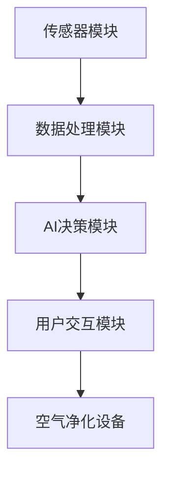

                 


# 智能花瓶：AI Agent的室内空气净化监测

## 关键词：AI Agent, 室内空气净化, 传感器数据采集, 机器学习算法, 系统架构设计, 智能家居, 空气质量指数

## 摘要：  
本文介绍了一种创新的室内空气净化解决方案——智能花瓶，它结合了人工智能（AI）代理技术，能够实时监测并优化室内空气质量。通过集成多种传感器，智能花瓶可以感知环境中的污染物，并利用机器学习算法进行数据分析，提供智能化的空气净化建议。本文详细探讨了智能花瓶的设计背景、核心概念、算法原理、系统架构设计以及实际应用案例，为智能家居领域的空气净化提供了新的思路和解决方案。

---

# 第1章：问题背景与需求分析

## 1.1 室内空气质量的重要性  
室内空气质量直接影响人们的健康和生活质量。随着城市化进程的加快，室内空气污染问题日益严重，主要来源包括甲醛、PM2.5、二氧化碳、挥发性有机化合物（VOC）等。长期暴露在污染严重的室内环境中，可能导致呼吸系统疾病、过敏反应以及其他健康问题。

### 1.1.1 室内空气质量对人体健康的影响  
- 长期暴露在高浓度污染物中，可能导致呼吸道疾病、过敏反应和免疫系统问题。  
- 空气质量差的环境会影响人们的注意力和工作效率。  

### 1.1.2 当前室内空气净化的主要挑战  
- 传统空气净化设备通常依赖固定模式运行，缺乏智能化和个性化。  
- 现有设备难以实时感知环境变化，并根据具体情况调整净化策略。  

## 1.2 AI Agent在智能家居中的应用  
智能家居的概念近年来迅速发展，AI Agent（智能代理）作为智能家居的核心技术之一，能够通过感知环境、分析数据并执行任务来提升居住体验。  

### 1.2.1 智能家居的概念与发展  
智能家居通过物联网（IoT）技术将家中设备连接到一起，实现智能化管理。AI Agent在其中扮演着“智能管家”的角色，能够根据用户需求和环境变化自动调整设备运行状态。  

### 1.2.2 AI Agent在智能家居中的角色  
- **感知环境**：通过传感器收集室内空气质量、温湿度、光照等数据。  
- **分析决策**：利用机器学习算法对数据进行分析，生成优化建议。  
- **执行任务**：根据决策结果，控制空气净化设备或其他智能家居设备执行操作。  

## 1.3 智能花瓶的设计目标与功能定位  
智能花瓶是一款结合了园艺和科技的智能家居设备，其设计目标是通过AI Agent实时监测室内空气质量，并提供智能化的净化建议。  

### 1.3.1 智能花瓶的核心功能  
- **空气质量监测**：实时感知并记录室内污染物浓度。  
- **智能净化建议**：根据数据变化，推荐适合的净化模式。  
- **用户交互**：通过移动APP或语音助手与用户互动，提供实时反馈。  

### 1.3.2 与传统空气净化设备的对比  
- **智能化程度**：智能花瓶能够根据环境变化自动调整净化策略，而传统设备通常需要手动操作。  
- **数据采集**：智能花瓶集成多种传感器，能够提供更全面的空气质量数据。  

---

# 第2章：AI Agent的基本原理

## 2.1 AI Agent的定义与特点  
AI Agent是一种能够感知环境、自主决策并执行任务的智能实体。在智能花瓶中，AI Agent负责处理空气质量数据、分析环境变化并控制净化设备。  

### 2.1.1 AI Agent的定义  
AI Agent是具有智能性的软件或硬件实体，能够通过感知环境、分析信息并采取行动来实现目标。  

### 2.1.2 AI Agent的核心特点  
- **自主性**：能够在没有外部干预的情况下独立运行。  
- **反应性**：能够实时感知环境变化并做出反应。  
- **学习能力**：通过机器学习算法不断优化自身的决策能力。  

## 2.2 智能花瓶中的AI Agent架构  
智能花瓶的AI Agent架构包括感知层、决策层和执行层三个部分。  

### 2.2.1 感知层  
感知层负责采集室内空气质量数据，包括PM2.5、甲醛、二氧化碳等污染物的浓度。  

### 2.2.2 决策层  
决策层对感知层提供的数据进行分析，生成净化建议并制定执行计划。  

### 2.2.3 执行层  
执行层根据决策层的指令，控制空气净化设备或其他智能家居设备执行具体操作。  

---

# 第3章：空气质量监测算法

## 3.1 数据采集与预处理  
空气质量监测的核心是数据采集与预处理。智能花瓶通过多种传感器（如PM2.5传感器、甲醛传感器等）采集环境数据，并对数据进行清洗和归一化处理。  

### 3.1.1 数据预处理方法  
- **数据清洗**：去除异常值和噪声数据。  
- **数据归一化**：将不同传感器的数据转换为统一的量纲。  

## 3.2 空气质量指数计算模型  
空气质量指数（AQI）是衡量空气质量的重要指标。智能花瓶通过机器学习算法建立AQI预测模型，实时评估室内空气质量。  

### 3.2.1 模型的建立与训练  
- **特征选择**：从传感器数据中选择对空气质量影响最大的特征。  
- **模型训练**：使用监督学习算法（如随机森林、支持向量机等）对数据进行训练。  

### 3.2.2 模型的验证与优化  
通过交叉验证和调参优化，提升模型的预测精度。  

---

# 第4章：系统架构与设计

## 4.1 系统模块划分  
智能花瓶的系统架构包括以下模块：  
- **传感器模块**：负责采集空气质量数据。  
- **数据处理模块**：对传感器数据进行预处理和特征提取。  
- **AI决策模块**：基于机器学习模型生成净化建议。  
- **用户交互模块**：通过APP或语音助手与用户互动。  

## 4.2 系统架构图  
以下是智能花瓶的系统架构图：  



---

# 第5章：项目实战与实现

## 5.1 环境搭建与工具安装  
智能花瓶的开发需要以下环境和工具：  
- **硬件设备**：PM2.5传感器、甲醛传感器、温湿度传感器、微控制器（如Arduino或Raspberry Pi）。  
- **软件工具**：Python编程语言、TensorFlow机器学习框架、MQTT协议用于数据传输。  

## 5.2 系统核心代码实现  
以下是智能花瓶的核心代码示例：  

```python
import pandas as pd
from sklearn.model import RandomForestRegressor

# 数据预处理
data = pd.read_csv('air_quality.csv')
data.dropna(inplace=True)
data = data.drop_duplicates()

# 特征选择
features = ['PM2.5', '甲醛', 'CO2']
target = 'AQI'

# 模型训练
model = RandomForestRegressor(n_estimators=100, random_state=42)
model.fit(data[features], data[target])

# 模型预测
new_data = pd.DataFrame({
    'PM2.5': [25],
    '甲醛': [0.1],
    'CO2': [800]
})
prediction = model.predict(new_data[features])
print(f'预测AQI：{int(prediction[0])}')
```

## 5.3 系统测试与部署  
通过实际测试验证系统的稳定性和准确性。测试内容包括：  
- 传感器数据的准确性  
- 系统的响应速度  
- AI模型的预测精度  

## 5.4 实际案例分析  
以某家庭的实际使用数据为例，分析智能花瓶在不同环境下的表现，并总结优化建议。

---

# 第6章：总结与展望

## 6.1 系统总结  
智能花瓶通过AI Agent实现了室内空气质量的智能化监测与优化，为智能家居领域提供了新的解决方案。  

## 6.2 未来展望  
未来，智能花瓶可以通过以下方式进行优化：  
- **算法优化**：进一步提升机器学习模型的预测精度。  
- **功能扩展**：增加更多传感器，监测更多的环境参数。  
- **用户体验优化**：开发更加友好的用户交互界面。  

---

# 作者：AI天才研究院/AI Genius Institute & 禅与计算机程序设计艺术 /Zen And The Art of Computer Programming

