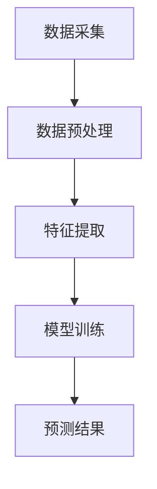
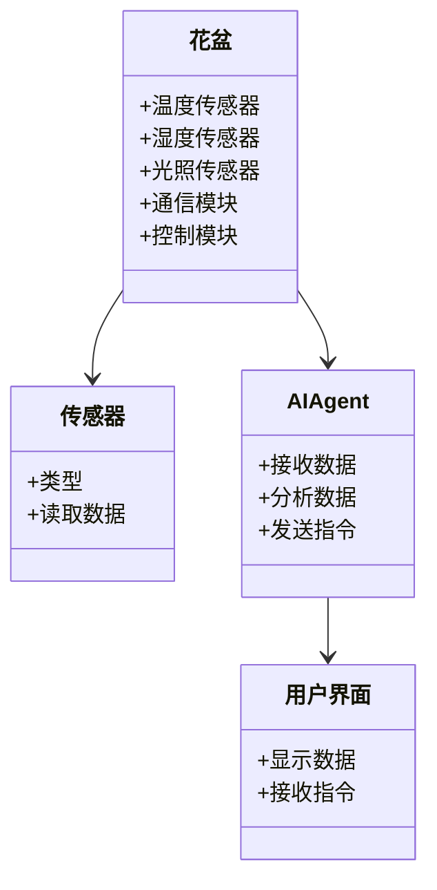

                 


# 智能花盆：AI Agent的植物生长监测

> 关键词：智能花盆，AI Agent，植物生长监测，物联网，传感器技术

> 摘要：本文详细探讨了智能花盆的设计与实现，结合AI Agent和物联网技术，介绍其在植物生长监测中的应用，涵盖背景、原理、系统设计、项目实战等内容。

---

## 第一部分：背景介绍

### 第1章：智能花盆的概念与背景

#### 1.1 问题背景

- **1.1.1 植物生长监测的重要性**
  - 植物生长监测是农业、园艺和生态学中的关键环节，帮助优化生长条件，提高产量和质量。
  - 随着城市化进程加快，室内种植越来越普及，精确监测植物生长状态的需求日益增加。

- **1.1.2 智能花盆的定义与目标**
  - 智能花盆是一种结合AI技术和物联网的设备，用于实时监测和优化植物生长环境。
  - 目标是通过自动化监测和反馈，实现植物生长的智能化管理。

#### 1.2 问题描述

- **1.2.1 现有植物监测的局限性**
  - 传统监测手段依赖人工操作，效率低且易出错。
  - 数据采集不全面，缺乏智能化分析。

- **1.2.2 智能花盆的应用场景**
  - 家庭园艺：帮助用户更好地养护植物。
  - 农业生产：优化作物生长条件，提高产量。
  - 科研用途：提供精确的生长数据支持研究。

#### 1.3 问题解决

- **1.3.1 AI Agent在植物监测中的作用**
  - AI Agent能够实时分析环境数据，提供生长建议。
  - 通过机器学习模型预测生长趋势，优化环境参数。

- **1.3.2 物联网技术的应用**
  - 利用物联网技术实现设备间的互联互通，实时采集和传输数据。
  - 通过云平台进行数据存储和分析，支持远程监控。

#### 1.4 边界与外延

- **1.4.1 智能花盆的功能边界**
  - 主要关注植物生长相关的环境数据，如温度、湿度、光照等。
  - 不涉及植物病虫害诊断，除非集成相应的传感器和模型。

- **1.4.2 相关领域的扩展**
  - 可扩展至智能农业、智能家居等领域，形成更广泛的生态系统。

#### 1.5 概念结构与核心要素

- **1.5.1 核心要素组成**
  - 硬件设备：传感器、通信模块、控制模块。
  - 软件系统：AI Agent、数据处理算法、用户界面。
  - 用户交互：通过手机APP或网页进行操作。

- **1.5.2 要素之间的关系**
  - 硬件采集数据，软件分析并反馈，用户通过界面进行操作。

---

## 第二部分：核心概念与联系

### 第2章：AI Agent的基本原理

#### 2.1 核心概念原理

- **2.1.1 AI Agent的定义**
  - AI Agent是一种智能代理，能够感知环境并采取行动以实现目标。
  - 在智能花盆中，AI Agent负责数据处理、决策和反馈。

- **2.1.2 AI Agent的核心功能**
  - 数据采集与处理：从传感器获取环境数据，如温度、湿度、光照。
  - 数据分析与学习：利用机器学习模型预测生长状态。
  - 自动控制：根据分析结果调整环境参数，如调节光照强度、浇水时间。

#### 2.2 概念属性特征对比

| 特性         | AI Agent                | 传统传感器          |
|--------------|-------------------------|---------------------|
| 功能         | 自动分析和决策         | 数据采集           |
| 智能性       | 高                     | 无                 |
| 连接性       | 支持物联网             | 仅采集数据         |
| 可扩展性     | 支持多种应用场景       | 仅限特定用途       |

#### 2.3 ER实体关系图

```mermaid
erd
    title 实体关系图
    章节
    entity 花盆 {
        id
        名称
    }
    entity 传感器 {
        id
        类型
    }
    entity 用户 {
        id
        名称
    }
    花盆 -[拥有]-> 传感器
    花盆 -[属于]-> 用户
```

---

## 第三部分：算法原理讲解

### 第3章：AI Agent的算法流程

#### 3.1 数据采集与处理



#### 3.2 特征提取与模型训练

- **特征提取**
  - 从原始数据中提取有意义的特征，如温度、湿度、光照强度等。
  - 使用PCA（主成分分析）降低数据维度，提高模型效率。

- **模型训练**
  - 使用监督学习算法，如随机森林或神经网络。
  - 训练模型识别植物的健康状态，预测生长趋势。

#### 3.3 算法实现

- **代码示例**
  ```python
  import numpy as np
  from sklearn.ensemble import RandomForestClassifier

  # 数据预处理
  data = np.array([[22, 60, 500], [23, 55, 450], [20, 70, 550]])
  labels = np.array([0, 1, 2])

  # 训练模型
  model = RandomForestClassifier(n_estimators=100)
  model.fit(data, labels)

  # 预测
  prediction = model.predict([[22, 65, 520]])
  print(prediction)
  ```

- **数学模型**
  - 使用随机森林分类器进行多分类任务，预测植物的健康状态。
  - 模型通过训练数据学习特征的重要性，实现准确分类。

---

## 第四部分：系统分析与架构设计

### 第4章：系统架构设计

#### 4.1 项目背景

- 智能花盆项目旨在通过AI技术和物联网实现植物生长的智能化监测和管理。

#### 4.2 系统功能设计



#### 4.3 系统架构设计


#### 4.4 系统接口设计

- **接口定义**
  - 花盆与传感器的接口：定义数据格式和通信协议。
  - 用户界面与AI Agent的接口：定义命令和反馈机制。

---

## 第五部分：项目实战

### 第5章：环境搭建与实现

#### 5.1 环境安装

- 安装必要的库：
  ```bash
  pip install numpy scikit-learn mermaid4jupyter
  ```

#### 5.2 系统核心实现

- **传感器数据采集**
  ```python
  import time
  import serial

  ser = serial.Serial('COM3', 9600)
  while True:
      data = ser.readline().decode().strip()
      print(data)
      time.sleep(1)
  ```

- **AI Agent实现**
  ```python
  from sklearn import linear_model

  # 训练模型
  model = linear_model.LinearRegression()
  model.fit(X, y)

  # 预测
  new_X = [[22, 65, 520]]
  prediction = model.predict(new_X)
  ```

#### 5.3 项目小结

- 通过项目实战，验证了智能花盆的设计可行性。
- 强调了系统各部分的协同工作的重要性。

---

## 第六部分：总结与展望

### 6.1 最佳实践 Tips

- **数据采集**：选择合适的传感器，确保数据的准确性和实时性。
- **算法优化**：根据实际需求选择合适的模型，定期更新模型参数。
- **用户体验**：设计直观的用户界面，提升用户体验。

### 6.2 小结

- 本文详细介绍了智能花盆的设计与实现，结合AI Agent和物联网技术，为植物生长监测提供了新的思路。

### 6.3 注意事项

- 确保数据安全，避免用户信息泄露。
- 定期维护系统，确保硬件和软件的正常运行。

### 6.4 拓展阅读

- 推荐阅读《机器学习实战》和《物联网开发指南》。

---

## 作者

作者：AI天才研究院/AI Genius Institute & 禅与计算机程序设计艺术/Zen And The Art of Computer Programming

