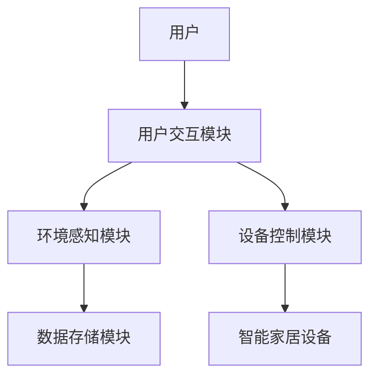

                 


# 智能茶几：AI Agent的客厅使用模式分析

> 关键词：智能茶几、AI Agent、智能家居、多模态交互、机器学习、物联网

> 摘要：本文深入探讨了AI Agent在智能茶几中的应用，分析了其在客厅环境中的使用模式。通过背景介绍、核心原理、系统架构设计、算法实现和项目实战，全面解析了智能茶几如何通过AI技术提升用户体验。文章结合实际案例和详细的技术分析，为读者提供了全面的视角。

---

# 第一部分: 智能茶几与AI Agent的背景与概述

## 第1章: 智能茶几的背景与现状

### 1.1 智能家居的发展历程
智能家居的概念最早可以追溯到20世纪90年代，随着物联网技术的成熟，智能家居逐步从概念走向实际应用。当前，智能家居已经涵盖了家庭安防、照明控制、环境监测等多个方面，而茶几作为客厅中的重要家具，其智能化改造潜力巨大。

### 1.2 茶几在智能家居中的角色
茶几不仅是客厅中的装饰品，更是家庭互动的核心区域。智能茶几可以通过集成传感器、显示屏和语音交互模块，实现与用户的互动，同时与其他智能家居设备联动，提供更加智能化的服务。

### 1.3 AI Agent在智能家居中的应用前景
AI Agent（智能体）是一种能够感知环境、自主决策并执行任务的计算机系统。在智能家居场景中，AI Agent可以作为连接用户与设备的桥梁，通过分析用户行为和环境数据，提供个性化的服务。

---

## 第2章: AI Agent的核心概念与原理

### 2.1 AI Agent的基本定义
AI Agent是指具有感知、推理、规划和执行能力的智能系统。它能够根据环境信息做出决策，并通过执行动作来实现目标。

### 2.2 AI Agent的核心特征
- **自主性**：能够在没有外部干预的情况下自主运行。
- **反应性**：能够实时感知环境变化并做出反应。
- **学习能力**：通过数据和经验不断优化自身的决策能力。
- **协作性**：能够与其他智能体或系统协同工作。

### 2.3 AI Agent在智能茶几中的应用
在智能茶几中，AI Agent主要负责处理用户的输入、分析环境数据，并通过与智能家居设备的联动，提供个性化的服务。例如，当用户发出语音指令时，AI Agent会解析指令内容，调用相应的设备执行任务。

---

## 第3章: 智能茶几的功能与应用场景

### 3.1 智能茶几的基本功能
- **语音交互**：支持用户通过语音指令控制茶几及其关联设备。
- **环境感知**：通过传感器感知茶几周围的环境数据，如温度、光线等。
- **信息显示**：在茶几的显示屏上呈现相关信息，如天气、时间、智能家居设备状态等。
- **智能家居控制**：通过AI Agent与家庭中的其他智能设备联动，实现智能家居的统一控制。

### 3.2 茶几在客厅中的应用场景
- **家庭娱乐**：支持视频播放、音乐播放等功能，提供家庭娱乐解决方案。
- **智能助手**：通过语音交互，帮助用户完成日常任务，如查询天气、设定提醒等。
- **访客接待**：当有访客到来时，智能茶几可以通过显示屏和语音交互提供欢迎信息，甚至自动调整环境设置。

### 3.3 AI Agent如何提升茶几的智能化水平
AI Agent通过分析用户的交互行为和环境数据，不断优化自身的决策算法。例如，当用户经常在早晨7点播放特定的音乐时，AI Agent可以记住这个习惯，在下次早晨7点自动执行该操作。

---

# 第二部分: AI Agent的核心原理与客厅场景分析

## 第4章: AI Agent的核心算法

### 4.1 基于规则的推理算法
基于规则的推理是一种简单但有效的AI算法，适用于规则明确的场景。例如，当用户说“打开客厅灯”，AI Agent会根据预设的规则调用智能灯泡的API完成任务。

### 4.2 机器学习模型
机器学习模型能够通过大量数据训练，学习用户的习惯和偏好。例如，使用神经网络模型分析用户的语音指令，识别用户的意图并执行相应的操作。

### 4.3 多智能体协作算法
在智能茶几的场景中，可能涉及到多个智能体的协作。例如，当用户发出指令时，主智能体负责解析指令，其他辅助智能体负责调用相应的设备API，实现任务的协同完成。

---

## 第5章: AI Agent的多模态交互能力

### 5.1 多模态交互的定义
多模态交互是指通过多种感官通道（如视觉、听觉、触觉）进行信息交换。在智能茶几中，用户可以通过语音、触控或手势等多种方式与茶几交互。

### 5.2 茶几与用户的多模态交互方式
- **语音交互**：用户通过语音指令控制茶几。
- **触控交互**：用户通过茶几的触摸屏进行操作。
- **手势交互**：用户通过手势动作实现与茶几的互动。

### 5.3 AI Agent如何处理不同类型的输入
AI Agent需要能够识别并处理多种输入类型。例如，当用户通过语音说出“播放音乐”，AI Agent会调用音乐播放器；当用户通过触控选择特定功能时，AI Agent会执行对应的操作。

---

# 第三部分: 智能茶几的系统设计与实现

## 第6章: 智能茶几的系统架构设计

### 6.1 系统功能设计
- **用户交互模块**：负责与用户的多模态交互。
- **环境感知模块**：通过传感器感知茶几周围的环境数据。
- **设备控制模块**：通过API调用智能家居设备。
- **数据存储模块**：存储用户的交互记录和环境数据。

### 6.2 系统架构图


### 6.3 接口与交互流程
- **用户发起指令**：用户通过语音或触控方式发起指令。
- **解析指令**：AI Agent解析指令内容，确定需要执行的任务。
- **执行任务**：AI Agent调用相应的设备API，执行任务。
- **反馈结果**：设备执行结果反馈给用户。

---

## 第7章: 项目实战

### 7.1 环境安装
- **Python环境**：安装Python 3.8以上版本。
- **AI框架**：安装TensorFlow或PyTorch框架。
- **语音交互库**：安装百度的语音识别SDK。

### 7.2 核心代码实现

```python
# 示例代码：AI Agent的语音交互模块
import speech_recognition as sr

def recognize_voice():
    # 初始化语音识别器
    r = sr.Recognizer()
    with sr.Microphone() as source:
        print("请开始说话：")
        audio = r.listen(source)
    try:
        # 识别语音内容
        text = r.recognize_google(audio)
        print("识别结果：{}".format(text))
        return text
    except sr.UnknownValueError:
        print("无法识别语音内容")
        return None

# 示例代码：环境感知模块
import requests

def get_environment_data():
    # 假设环境数据由第三方服务提供
    response = requests.get("http://api.example.com/environment")
    if response.status_code == 200:
        return response.json()
    return None
```

### 7.3 代码功能解读
- **语音识别模块**：通过语音识别SDK将用户的语音指令转化为文本。
- **环境数据获取**：通过API获取茶几周围的环境数据，如温度、湿度等。
- **设备控制模块**：根据用户的指令和环境数据，调用智能家居设备的API执行任务。

---

## 第8章: 总结与展望

### 8.1 本章总结
本文深入分析了AI Agent在智能茶几中的应用，探讨了其核心原理和系统设计。通过实际案例和代码实现，展示了AI Agent如何提升茶几的智能化水平。

### 8.2 未来展望
随着AI技术的不断进步，智能茶几的功能将更加丰富。未来的智能茶几可能会具备更强大的学习能力和多模态交互能力，为用户提供更加智能化的服务。

---

# 作者：AI天才研究院/AI Genius Institute & 禅与计算机程序设计艺术 /Zen And The Art of Computer Programming

