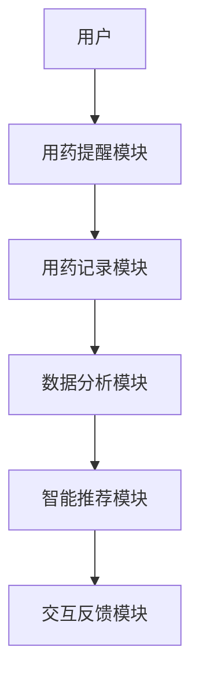
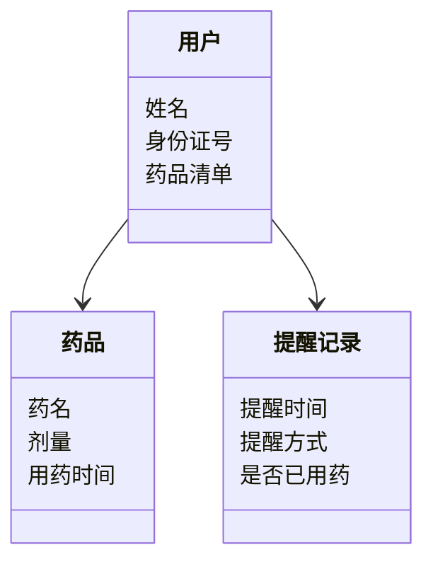
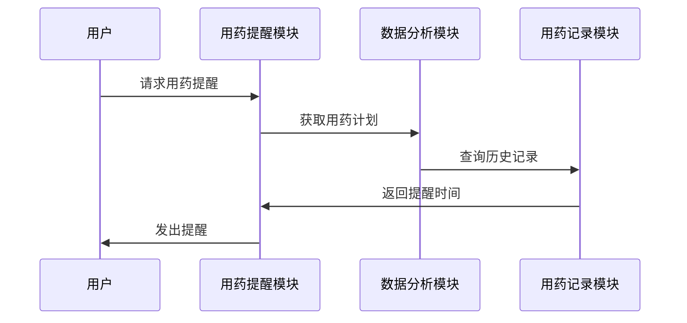

                 


# 智能药盒：AI Agent的用药提醒与管理系统

## 关键词
智能药盒, AI Agent, 用药提醒, 管理系统, 人工智能, 健康管理, 智能提醒

## 摘要
智能药盒是一种结合AI Agent技术的智能设备，用于帮助用户管理用药提醒和记录。本文将详细介绍智能药盒的背景需求、AI Agent的核心原理、算法实现、系统架构设计以及项目实战。通过系统化的分析和实践，展示如何利用AI技术提升用药管理的效率和准确性。

---

# 第一部分: 智能药盒的背景与需求

## 第1章: 用药管理问题背景与需求分析

### 1.1 用药管理问题背景
#### 1.1.1 传统用药管理的痛点
传统用药管理方式存在以下问题：
- **忘记服药**：患者容易忘记按时服药，导致治疗效果不佳。
- **用药混乱**：多种药物混杂，容易混淆药名和剂量。
- **记录困难**：手动记录用药情况容易出错，难以追踪和分析。

#### 1.1.2 老年人用药管理的特殊性
老年人群体存在以下特点：
- 记忆力减退，容易忘记用药。
- 多种慢性病需要长期服药，管理复杂。
- 对智能设备的接受度较高，但操作需要简单易用。

#### 1.1.3 医疗健康领域的智能化趋势
随着人工智能和物联网技术的发展，医疗健康领域逐渐向智能化方向转型，智能药盒作为其中之一，能够有效解决传统用药管理的痛点。

### 1.2 智能药盒的核心需求
#### 1.2.1 用药提醒功能的核心需求
- **精准提醒**：根据患者的具体用药时间，准时发出提醒。
- **多样化提醒方式**：支持声音、震动、手机通知等多种提醒方式。
- **灵活设置**：用户可以根据自身需求调整提醒频率和方式。

#### 1.2.2 用药记录与数据分析的需求
- **记录用药信息**：自动记录每剂量的服药时间、药名、剂量等信息。
- **数据分析**：通过数据分析，生成用药报告，帮助医生和患者了解用药情况。
- **异常检测**：检测用药异常情况，如漏服、错服等。

#### 1.2.3 用户交互体验的需求
- **简洁界面**：用户界面设计简洁直观，便于操作。
- **语音交互**：支持语音输入和交互，方便老年人使用。
- **个性化设置**：提供个性化服务，如用药提醒的定制化。

### 1.3 智能药盒的边界与外延
#### 1.3.1 系统功能的边界
- **核心功能**：用药提醒、用药记录、数据分析。
- **非核心功能**：设备管理、用户管理、数据同步等。

#### 1.3.2 与其他系统的交互边界
- **智能设备**：与智能音箱、手机APP等设备联动。
- **医疗系统**：与医院信息系统对接，提供用药数据支持。
- **云平台**：与云端数据平台对接，支持数据存储和分析。

#### 1.3.3 智能药盒的扩展功能
- **健康监测**：结合可穿戴设备，监测患者健康状况。
- **远程医疗**：支持医生远程查看用药数据，提供医疗建议。
- **社交功能**：用户之间可以分享用药经验，形成社区。

### 1.4 本章小结
本章分析了传统用药管理的痛点，提出了智能药盒的核心需求，包括用药提醒、记录与数据分析，以及用户体验优化。同时，明确了智能药盒的边界和扩展功能，为后续章节的展开奠定了基础。

---

# 第二部分: AI Agent的核心概念与原理

## 第2章: AI Agent的基本概念与原理

### 2.1 AI Agent的定义与分类
#### 2.1.1 AI Agent的定义
AI Agent（智能体）是指在环境中能够感知并自主行动以实现目标的实体。它可以是一个软件程序或硬件设备，能够与用户或环境进行交互。

#### 2.1.2 AI Agent的分类与特点
AI Agent可以根据智能水平分为以下几类：
- **反应式AI Agent**：基于当前感知做出反应，不依赖历史数据。
- **认知式AI Agent**：具有复杂推理和决策能力，能够处理复杂任务。
- **混合式AI Agent**：结合反应式和认知式的特点，适用于复杂场景。

#### 2.1.3 AI Agent与传统软件的区别
- **自主性**：AI Agent能够自主决策，而传统软件依赖于用户指令。
- **学习能力**：AI Agent能够通过数据学习和优化，而传统软件无法自主改进。
- **适应性**：AI Agent能够根据环境变化调整行为，传统软件则不具备这种能力。

### 2.2 AI Agent的核心原理
#### 2.2.1 感知层原理
感知层负责接收和处理环境中的信息，包括用户输入、传感器数据等。通过自然语言处理、图像识别等技术，AI Agent能够理解用户的意图和环境状态。

#### 2.2.2 决策层原理
决策层基于感知到的信息，结合预设的规则和机器学习模型，进行推理和决策。决策过程可能涉及概率计算、逻辑推理和模式识别。

#### 2.2.3 执行层原理
执行层负责将决策结果转化为具体行动，如发出提醒、调整用药计划等。执行层需要与硬件设备或外部系统进行交互，确保决策的落地。

### 2.3 AI Agent的核心要素对比表
| **要素**       | **传统软件**                          | **AI Agent**                          |
|-----------------|---------------------------------------|---------------------------------------|
| **自主性**       | 依赖用户指令                          | 自主决策                              |
| **学习能力**     | 无法学习                              | 能够通过数据学习                      |
| **适应性**       | 固定功能，无法适应环境变化            | 能够根据环境变化调整行为              |
| **复杂任务处理** | 无法处理复杂任务                      | 能够处理复杂任务                      |

### 2.4 AI Agent的实体关系图


### 2.5 本章小结
本章详细介绍了AI Agent的基本概念、分类和核心原理，强调了AI Agent在智能药盒中的重要性。通过对比传统软件和AI Agent的特点，明确了AI Agent的优势和适用场景。

---

# 第三部分: AI Agent的算法原理与实现

## 第3章: AI Agent的算法原理与实现

### 3.1 AI Agent的核心算法
#### 3.1.1 基于规则的推理算法
基于规则的推理算法通过预设的规则库进行推理和决策。例如，在用药提醒中，可以根据患者的用药时间表设置提醒规则。

#### 3.1.2 基于机器学习的推理算法
基于机器学习的推理算法能够通过历史数据训练模型，预测患者的用药行为和需求。例如，使用随机森林或神经网络模型进行预测。

### 3.2 用药提醒算法的实现
#### 3.2.1 算法流程
1. **数据输入**：接收患者的用药计划和时间表。
2. **时间计算**：根据当前时间，判断是否需要发出用药提醒。
3. **提醒决策**：基于优先级和用户偏好，选择提醒方式。
4. **执行提醒**：通过声音、震动等方式通知用户。

#### 3.2.2 算法实现代码
```python
def用药提醒算法(用药计划):
    当前时间 = 获取当前时间()
    for 药品 in 用药计划:
        提醒时间 = 药品.用药时间
        如果 当前时间 >= 提醒时间:
            选择提醒方式 = 确定优先级最高的方式()
            发出提醒(选择提醒方式)
    返回 所有药品的提醒状态
```

#### 3.2.3 算法优化
- **优先级排序**：根据用户的偏好和用药紧急程度，优化提醒方式的选择。
- **动态调整**：根据用户的反馈，动态调整提醒策略。

### 3.3 数据分析算法的实现
#### 3.3.1 数据预处理
- **清洗数据**：去除无效数据，填补缺失值。
- **特征提取**：提取用药时间、用药频率等特征。

#### 3.3.2 数据分析模型
- **聚类分析**：分析患者的用药习惯，识别异常情况。
- **回归分析**：预测患者的用药依从性。

### 3.4 算法实现的数学模型
用药依从性预测模型：
$$ P(按时用药) = \beta_0 + \beta_1 \times 提醒频率 + \beta_2 \times 用户年龄 + \epsilon $$

其中，$\beta_0$、$\beta_1$、$\beta_2$为回归系数，$\epsilon$为误差项。

### 3.5 本章小结
本章详细讲解了AI Agent的核心算法，包括基于规则的推理和机器学习的推理。通过具体的用药提醒算法实现，展示了如何利用AI技术优化用药管理。

---

# 第四部分: 系统分析与架构设计

## 第4章: 系统分析与架构设计

### 4.1 问题场景介绍
智能药盒需要解决以下问题：
- 如何准确提醒患者用药。
- 如何记录和分析用药数据。
- 如何与外部系统进行交互。

### 4.2 项目介绍
本项目旨在开发一款基于AI Agent的智能药盒，实现用药提醒、记录与管理、数据分析等功能。

### 4.3 系统功能设计
#### 4.3.1 领域模型类图


#### 4.3.2 系统架构图


#### 4.3.3 系统接口设计
- **用户接口**：提供图形化界面和语音交互。
- **外部接口**：与手机APP、云端数据库对接。

#### 4.3.4 系统交互图


### 4.4 本章小结
本章通过系统分析和架构设计，明确了智能药盒的功能模块和交互流程，为后续的开发奠定了基础。

---

# 第五部分: 项目实战

## 第5章: 项目实战

### 5.1 环境安装
- **硬件环境**：智能药盒设备、传感器、云端服务器。
- **软件环境**：Python 3.8+, 数据库（MySQL或MongoDB）、AI框架（TensorFlow或Scikit-learn）。

### 5.2 核心代码实现
#### 5.2.1 用药提醒模块
```python
import datetime

def 发出提醒(提醒方式):
    if 提醒方式 == '声音':
        print("发出声音提醒")
    elif 提醒方式 == '震动':
        print("发出震动提醒")
    elif 提醒方式 == '通知':
        print("发送手机通知")

def 主程序():
    当前时间 = datetime.datetime.now().time()
    提醒计划 = [
        {'药名': '降压药', '时间': datetime.time(8, 0)},
        {'药名': '降糖药', '时间': datetime.time(12, 0)}
    ]
    for 药品 in 提醒计划:
        if 当前时间 >= 药品['时间']:
            发出提醒(选择提醒方式())

主程序()
```

#### 5.2.2 数据分析模块
```python
import pandas as pd

def 数据分析(记录文件):
    df = pd.read_csv(记录文件)
    依从率 = df['是否已用药'].mean()
    print(f"用药依从率为：{依从率}")
```

### 5.3 案例分析
#### 5.3.1 用药提醒案例
患者设置每天早上8点和中午12点服药，系统根据当前时间发出提醒。

#### 5.3.2 数据分析案例
通过分析患者的用药记录，发现患者在过去一周中有两天漏服降压药，系统生成报告并提供改进建议。

### 5.4 本章小结
本章通过项目实战，展示了智能药盒的实现过程，包括环境搭建、核心代码编写和案例分析，帮助读者更好地理解和应用相关技术。

---

# 第六部分: 总结与展望

## 第6章: 总结与展望

### 6.1 本章小结
智能药盒结合AI Agent技术，能够有效解决传统用药管理的痛点。通过精准的用药提醒、智能的用药记录和数据分析，帮助患者和医生更好地管理用药过程。

### 6.2 未来展望
- **技术优化**：进一步提升AI Agent的智能水平，实现更复杂的用药管理。
- **功能扩展**：结合更多智能设备，提供更全面的健康监测和管理。
- **推广应用**：推动智能药盒在医疗健康领域的广泛应用，造福更多患者。

---

# 作者

作者：AI天才研究院/AI Genius Institute & 禅与计算机程序设计艺术 /Zen And The Art of Computer Programming

---

版权归原作者所有，未经授权不得转载。

