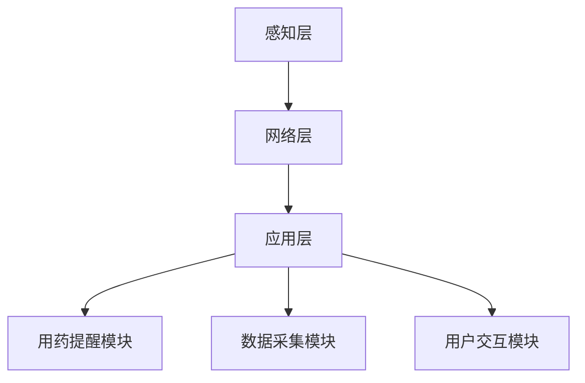

                 


# 智能药盒：AI Agent的用药提醒系统

## 关键词：AI Agent, 智能药盒, 用药提醒, 物联网, 健康管理, 智能助手

## 摘要：
智能药盒是一种结合了AI Agent和物联网技术的智能设备，用于实时提醒用户按时用药并监控用药情况。本文详细介绍了智能药盒的设计原理、技术实现和实际应用，探讨了AI Agent在智能药盒中的核心作用，并通过具体案例展示了系统的实现过程。文章最后总结了智能药盒的优势和未来发展方向。

---

# 第1章：智能药盒的背景与问题背景

## 1.1 智能药盒的定义与应用场景

### 1.1.1 智能药盒的定义
智能药盒是一种结合AI Agent和物联网技术的智能设备，能够根据用户的用药计划自动提醒用户按时服药，并通过传感器监测药品的剩余情况和用户的用药行为。

### 1.1.2 智能药盒的主要应用场景
- **慢性病患者**：需要长期服药的慢性病患者，如糖尿病、高血压患者。
- **老年人**：记忆力减退的老年人，容易忘记服药。
- **需要长期用药的人群**：如服用抗抑郁药物的患者。

### 1.1.3 智能药盒的目标用户群体
- 慢性病患者
- 老年人
- 需要长期服药的患者

## 1.2 用药提醒系统的发展历程

### 1.2.1 传统用药提醒工具的局限性
传统用药提醒工具主要依赖手动设置闹钟或药盒上的标记，容易被遗忘或误操作，且无法实时监测用药情况。

### 1.2.2 智能化用药提醒系统的出现
随着AI技术和物联网技术的发展，智能化用药提醒系统应运而生，能够通过AI Agent自动学习用户的用药习惯，并通过物联网设备实时监测用药情况。

### 1.2.3 智能药盒在医疗健康领域的地位
智能药盒作为智能化用药提醒系统的代表，已经成为医疗健康领域的重要工具，能够有效提高患者的用药依从性。

## 1.3 AI Agent的核心概念与技术特点

### 1.3.1 AI Agent的基本定义
AI Agent是一种智能体，能够感知环境、自主决策并执行任务。在智能药盒中，AI Agent主要用于学习用户的用药习惯，并根据实时数据提供用药提醒。

### 1.3.2 AI Agent的核心技术特点
- **自主性**：AI Agent能够自主决策，无需人工干预。
- **反应性**：能够实时感知环境并做出反应。
- **学习能力**：能够通过机器学习技术不断优化自身的提醒策略。

### 1.3.3 AI Agent在智能药盒中的应用优势
- 提高用药提醒的准确性
- 实现个性化用药提醒
- 提供用药数据的记录与分析

---

# 第2章：智能药盒的核心概念与技术框架

## 2.1 AI Agent的基本原理

### 2.1.1 AI Agent的定义与分类
AI Agent可以分为基于规则的AI Agent和基于机器学习的AI Agent。基于规则的AI Agent通过预定义的规则进行决策，而基于机器学习的AI Agent能够通过数据学习得到决策策略。

### 2.1.2 AI Agent的核心技术框架
- **感知层**：通过传感器获取环境数据。
- **决策层**：通过算法对数据进行分析并做出决策。
- **执行层**：根据决策结果执行相应的动作，如发出提醒。

### 2.1.3 AI Agent与传统软件的区别
AI Agent具有自主性和学习能力，而传统软件仅能执行预定义的程序。

## 2.2 物联网技术在智能药盒中的应用

### 2.2.1 物联网的基本概念与技术架构
物联网由感知层、网络层和应用层组成，通过传感器、通信网络和应用系统实现物物相连。

### 2.2.2 物联网在智能药盒中的具体应用
- **数据采集**：通过传感器监测药品的剩余情况和用户的用药行为。
- **数据传输**：通过Wi-Fi或蓝牙将数据传输到云端或用户手机。
- **远程监控**：医生或家人可以通过云端数据了解患者的用药情况。

### 2.2.3 物联网技术对智能药盒功能的提升
- 实现药品的实时监测
- 提供远程用药提醒和监控
- 支持医生进行远程诊断

## 2.3 智能药盒的系统架构与功能模块

### 2.3.1 智能药盒的系统架构
智能药盒的系统架构包括感知层、网络层和应用层。

### 2.3.2 智能药盒的功能模块划分
- **用药提醒模块**：根据用户的用药计划发出提醒。
- **数据采集模块**：通过传感器监测药品的剩余情况和用户的用药行为。
- **用户交互模块**：通过手机APP或语音助手与用户进行交互。

### 2.3.3 功能模块之间的关系与协作
- 数据采集模块向用药提醒模块提供数据，用药提醒模块根据数据发出提醒。
- 用户通过用户交互模块设置用药计划或查询用药记录。

---

# 第3章：AI Agent的算法原理与实现

## 3.1 AI Agent的核心算法

### 3.1.1 基于规则的AI Agent算法
基于规则的AI Agent通过预定义的规则进行决策，适用于规则明确的场景。

### 3.1.2 基于机器学习的AI Agent算法
基于机器学习的AI Agent能够通过数据学习得到决策策略，适用于复杂场景。

### 3.1.3 基于深度学习的AI Agent算法
基于深度学习的AI Agent能够通过深度神经网络进行更复杂的决策，适用于需要处理大量非结构化数据的场景。

## 3.2 算法实现的关键步骤

### 3.2.1 数据采集与预处理
- 采集用户的用药数据，包括用药时间、药品种类、用药剂量等。
- 对数据进行清洗和特征提取。

### 3.2.2 模型训练与优化
- 使用机器学习或深度学习模型对数据进行训练。
- 通过交叉验证和调参优化模型性能。

### 3.2.3 模型部署与应用
- 将训练好的模型部署到智能药盒中，实现实时提醒和监控。

## 3.3 AI Agent算法的数学模型与公式

### 3.3.1 基于规则的AI Agent数学模型
$$P(A|B) = \frac{P(B|A)P(A)}{P(B)}$$

### 3.3.2 基于机器学习的AI Agent数学模型
$$y = \sigma(wx + b)$$
其中，σ表示sigmoid函数，w和b是模型的参数。

### 3.3.3 基于深度学习的AI Agent数学模型
$$L = -\frac{1}{m}\sum_{i=1}^{m} y_i \log(\hat{y}_i) + (1 - y_i)\log(1 - \hat{y}_i)$$
其中，L表示损失函数，y_i表示真实标签，$\hat{y}_i$表示预测概率。

---

# 第4章：智能药盒的系统架构与功能实现

## 4.1 系统架构设计

### 4.1.1 系统架构图


## 4.2 功能模块划分与协作

### 4.2.1 功能模块划分
- 感知层：包括传感器和通信模块。
- 网络层：包括数据传输和云端存储。
- 应用层：包括用药提醒、数据展示和用户交互。

### 4.2.2 功能模块协作
- 传感器采集数据，通过通信模块传输到云端。
- 云端处理数据后，触发用药提醒模块发出提醒。
- 用户通过手机APP查询用药记录和设置用药计划。

---

# 第5章：项目实战：智能药盒的开发与实现

## 5.1 开发环境搭建

### 5.1.1 安装必要的开发工具
- 安装Python和相关的机器学习库（如TensorFlow、Scikit-learn）。
- 安装物联网开发工具（如Arduino IDE、Raspberry Pi）。

### 5.1.2 配置物联网设备
- 连接传感器和通信模块（如温湿度传感器、Wi-Fi模块）。

## 5.2 系统核心功能的实现

### 5.2.1 数据采集与处理
```python
import pandas as pd
import numpy as np

# 读取数据
data = pd.read_csv('medication_data.csv')

# 数据预处理
data['time'] = pd.to_datetime(data['time'])
data.set_index('time', inplace=True)
```

### 5.2.2 模型训练与优化
```python
from sklearn.model_selection import train_test_split
from sklearn.linear_model import LogisticRegression

# 划分训练集和测试集
X_train, X_test, y_train, y_test = train_test_split(data.drop('label', axis=1), data['label'], test_size=0.2)

# 训练模型
model = LogisticRegression()
model.fit(X_train, y_train)

# 评估模型
print("准确率：", model.score(X_test, y_test))
```

### 5.2.3 模型部署与应用
```python
import joblib

# 保存模型
joblib.dump(model, 'medication_model.pkl')

# 加载模型并进行预测
model = joblib.load('medication_model.pkl')
prediction = model.predict(X_test)
```

## 5.3 代码应用解读与分析
- 数据采集与预处理：读取数据并进行时间格式化，设置索引。
- 模型训练：使用逻辑回归模型对数据进行训练。
- 模型评估：计算模型的准确率。
- 模型部署：将训练好的模型保存并进行预测。

## 5.4 实际案例分析与详细讲解
通过一个实际案例，展示智能药盒在慢性病患者中的应用。例如，糖尿病患者每天需要服用多种药物，智能药盒能够根据患者的用药计划发出提醒，并通过传感器监测患者的用药情况。

---

# 第6章：智能药盒的最佳实践与未来展望

## 6.1 最佳实践
- 在开发过程中，注重模块化设计和代码复用。
- 定期进行代码审查和测试，确保系统的稳定性和可靠性。
- 关注数据隐私保护，确保用户数据的安全。

## 6.2 小结
智能药盒作为一种智能化的用药提醒系统，通过AI Agent和物联网技术的结合，能够有效提高患者的用药依从性。未来，随着AI和物联网技术的不断发展，智能药盒的功能将更加智能化和个性化。

## 6.3 注意事项
在开发智能药盒时，需要注意系统的安全性、可靠性和易用性。同时，应遵守相关法律法规，保护用户的隐私和数据安全。

## 6.4 拓展阅读
- 《机器学习实战》
- 《物联网技术与应用》
- 《AI Agent的理论与实践》

---

# 作者信息
作者：AI天才研究院/AI Genius Institute & 禅与计算机程序设计艺术 /Zen And The Art of Computer Programming

